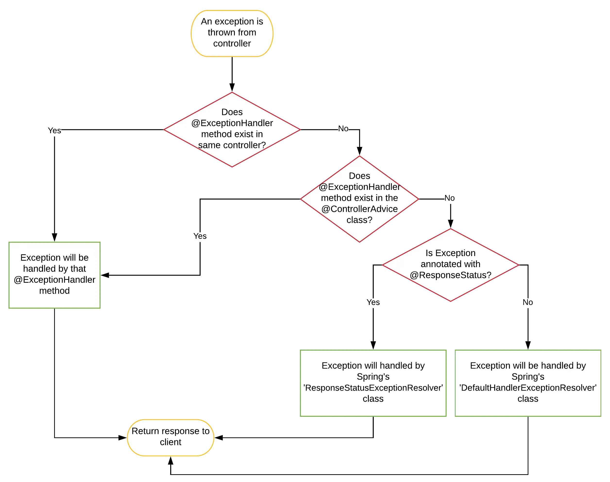

处理异常是构建健壮应用程序的重要部分。 Spring Boot 提供了不止一种方法。

本文将探讨这些方法，并提供一些关于何时某种给定方法可能优于另一种方法的指导。

## 示例代码

本文附有 GitHub 上的工作[代码示例](https://github.com/thombergs/code-examples/tree/master/spring-boot/exception-handling)。

## 介绍

Spring Boot 为我们提供了处理异常的工具，而不仅仅是简单的“try-catch”块。为了使用这些工具，我们应用了一些注释，使我们能够将异常处理视为横切关注点：

- [`@ResponseStatus`](https://reflectoring.io/spring-boot-exception-handling/#responsestatus)
- [`@ExceptionHandler`](https://reflectoring.io/spring-boot-exception-handling/#exceptionhandler)
- [`@ControllerAdvice`](https://reflectoring.io/spring-boot-exception-handling/#controlleradvice)

在深入了解这些注释之前，我们将首先了解 Spring 如何处理 Web 控制器抛出的异常——这是捕获异常的最后一道防线。

我们还将查看 Spring Boot 提供的一些配置来修改默认行为。

我们将确定这样做时面临的挑战，然后我们将尝试使用这些注释来克服这些挑战。

## Spring Boot 默认的异常处理机制

假设我们有一个名为 `ProductController` 的控制器，当未找到具有给定 id 的 `Product` 时，其 `getProduct(...)` 方法会抛出 `NoSuchElementFoundException` 运行时异常：

```java
@RestController
@RequestMapping("/product")
public class ProductController {
  private final ProductService productService;
  /constructor omitted for brevity...

  @GetMapping("/{id}")
  public Response getProduct(@PathVariable String id){
    / this method throws a "NoSuchElementFoundException" exception
    return productService.getProduct(id);
  }

}
```

如果我们使用无效的 `id` 调用 `/product` API，服务将抛出 `NoSuchElementFoundException` 运行时异常，我们将得到以下响应：

```json
{
  "timestamp": "2020-11-28T13:24:02.239+00:00",
  "status": 500,
  "error": "Internal Server Error",
  "message": "",
  "path": "/product/1"
}
```

我们可以看到，除了格式良好的错误响应之外，有效负载没有为我们提供任何有用的信息。甚至 `message` 字段也是空的，我们可能希望包含“未找到 id 1 的项目”之类的内容。

让我们从修复错误消息问题开始。

Spring Boot 提供了一些属性，我们可以使用它们添加异常消息、异常类，甚至堆栈跟踪作为响应负载的一部分：

```yaml
server:
  error:
    include-message: always
    include-binding-errors: always
    include-stacktrace: on_trace_param
    include-exception: false
```

在 `application.yml` 中使用这些 [Spring Boot 服务器属性](https://docs.spring.io/spring-boot/docs/current/reference/html/appendix-application-properties.html#server-properties)，我们可以在某种程度上改变错误响应。

现在，如果我们使用无效的 `id` 再次调用 `/product` API，我们将得到以下响应：

```json
{
  "timestamp": "2020-11-29T09:42:12.287+00:00",
  "status": 500,
  "error": "Internal Server Error",
  "message": "Item with id 1 not found",
  "path": "/product/1"
}
```

请注意，我们已将属性 `include-stacktrace` 设置为 `on_trace_param` ，这意味着仅当我们在 URL ( `?trace=true` ) 中包含 `trace` 参数时，我们才会在响应负载中获得堆栈跟踪：

```json
{
  "timestamp": "2020-11-29T09:42:12.287+00:00",
  "status": 500,
  "error": "Internal Server Error",
  "message": "Item with id 1 not found",
  "trace": "io.reflectoring.exception.exception.NoSuchElementFoundException: Item with id 1 not found...",
  "path": "/product/1"
}
```

我们可能希望将 `include-stacktrace` 标志的值保留为 `never` ，至少在生产中，因为它可能会揭示我们应用程序的内部工作原理。

继续！状态和错误消息 - `500` - 表明我们的服务器代码有问题，但实际上这是客户端错误，因为客户端提供了无效的 ID。

我们当前的状态代码没有正确反映这一点。不幸的是，这就是我们可以使用 `server.error` 配置属性的范围，因此我们必须查看 Spring Boot 提供的注释。

## `@ResponseStatus`

顾名思义， `@ResponseStatus` 允许我们修改响应的 HTTP 状态。它可以应用在以下地方：

- 关于异常类本身
- 以及方法上的 `@ExceptionHandler` 注释
- 以及类上的 `@ControllerAdvice` 注释

在本节中，我们将仅讨论第一种情况。

让我们回到当前的问题，即我们的错误响应总是给我们 HTTP 状态 500，而不是更具描述性的状态代码。

为了解决这个问题，我们可以用 `@ResponseStatus` 注释我们的 Exception 类，并在其 `value` 属性中传入所需的 HTTP 响应状态：

```java
@ResponseStatus(value = HttpStatus.NOT_FOUND)
public class NoSuchElementFoundException extends RuntimeException {
  ...
}
```

如果我们使用无效 ID 调用控制器，此更改将带来更好的响应：

```json
{
  "timestamp": "2020-11-29T09:42:12.287+00:00",
  "status": 404,
  "error": "Not Found",
  "message": "Item with id 1 not found",
  "path": "/product/1"
}
```

实现相同目的的另一种方法是扩展 `ResponseStatusException` 类：

```java
public class NoSuchElementFoundException extends ResponseStatusException {

  public NoSuchElementFoundException(String message){
    super(HttpStatus.NOT_FOUND, message);
  }

  @Override
  public HttpHeaders getResponseHeaders() {
      / return response headers
  }
}
```

当我们想要操作响应头时，这种方法会派上用场，因为我们可以重写 `getResponseHeaders()` 方法。

`@ResponseStatus` 与 `server.error` 配置属性相结合，使我们能够操作 Spring 定义的错误响应负载中的几乎所有字段。

但是如果还想操纵响应负载的结构怎么办？

让我们在下一节中看看如何实现这一目标。

## `@ExceptionHandler`

`@ExceptionHandler` 注释在处理异常方面为我们提供了很大的灵活性。对于初学者来说，要使用它，我们只需在控制器本身或 `@ControllerAdvice` 类中创建一个方法，并用 `@ExceptionHandler` 注释它：

```java
@RestController
@RequestMapping("/product")
public class ProductController {

  private final ProductService productService;

  /constructor omitted for brevity...

  @GetMapping("/{id}")
  public Response getProduct(@PathVariable String id) {
    return productService.getProduct(id);
  }

  @ExceptionHandler(NoSuchElementFoundException.class)
  @ResponseStatus(HttpStatus.NOT_FOUND)
  public ResponseEntity<String> handleNoSuchElementFoundException(
      NoSuchElementFoundException exception
  ) {
    return ResponseEntity
        .status(HttpStatus.NOT_FOUND)
        .body(exception.getMessage());
  }

}
```

异常处理程序方法接受一个异常或异常列表作为我们要在定义的方法中处理的参数。我们用 `@ExceptionHandler` 和 `@ResponseStatus` 注释该方法来定义我们想要处理的异常和我们想要返回的状态代码。

如果我们不想使用这些注释，那么只需将异常定义为方法的参数也可以：

```java
@ExceptionHandler
public ResponseEntity<String> handleNoSuchElementFoundException(
    NoSuchElementFoundException exception)
```

尽管我们已经在方法签名中提到了它，但在注释中提及异常类是个好主意。它提供了更好的可读性。

此外，处理程序方法上的注释 `@ResponseStatus(HttpStatus.NOT_FOUND)` 不是必需的，因为传递到 `ResponseEnity` 的 HTTP 状态将优先，但出于相同的可读性原因，我们仍然保留它。

除了异常参数之外，我们还可以使用 `HttpServletRequest` 、 `WebRequest` 或 `HttpSession` 类型作为参数。

同样，处理程序方法支持各种返回类型，例如 `ResponseEntity` 、 `String` 甚至 `void` 。

在 `@ExceptionHandler` [java 文档](https://docs.spring.io/spring-framework/docs/current/javadoc-api/org/springframework/web/bind/annotation/ExceptionHandler.html)中查找更多输入和返回类型。

在异常处理函数中，我们可以通过输入参数和返回类型的形式使用许多不同的选项，因此我们可以完全控制错误响应。

现在，让我们最终确定 API 的错误响应负载。如果出现任何错误，客户通常会期望两件事：

- 错误代码告诉客户端它是什么类型的错误。客户端可以在其代码中使用错误代码来驱动基于它的某些业务逻辑。通常，错误代码是标准的 HTTP 状态代码，但我也看到 API 返回自定义错误代码，例如 `E001` 。

- 一条附加的人类可读消息，提供有关错误的更多信息，甚至提供有关如何修复错误的一些提示或 API 文档的链接。

我们还将添加一个可选的 `stackTrace` 字段，这将帮助我们在开发环境中进行调试。

最后，我们还想处理响应中的验证错误。您可以在这篇有关使用 Spring Boot 处理验证的文章中找到有关 bean 验证的更多信息。

记住这些点，我们将为错误响应使用以下有效负载：

```java
@Getter
@Setter
@RequiredArgsConstructor
@JsonInclude(JsonInclude.Include.NON_NULL)
public class ErrorResponse {
  private final int status;
  private final String message;
  private String stackTrace;
  private List<ValidationError> errors;

  @Getter
  @Setter
  @RequiredArgsConstructor
  private static class ValidationError {
    private final String field;
    private final String message;
  }

  public void addValidationError(String field, String message){
    if(Objects.isNull(errors)){
      errors = new ArrayList<>();
    }
    errors.add(new ValidationError(field, message));
  }
}
```

现在，让我们将所有这些应用到 `NoSuchElementFoundException` 处理程序方法中。

```java
@RestController
@RequestMapping("/product")
@AllArgsConstructor
public class ProductController {
  public static final String TRACE = "trace";

  @Value("${reflectoring.trace:false}")
  private boolean printStackTrace;

  private final ProductService productService;

  @GetMapping("/{id}")
  public Product getProduct(@PathVariable String id){
    return productService.getProduct(id);
  }

  @PostMapping
  public Product addProduct(@RequestBody @Valid ProductInput input){
    return productService.addProduct(input);
  }

  @ExceptionHandler(NoSuchElementFoundException.class)
  @ResponseStatus(HttpStatus.NOT_FOUND)
  public ResponseEntity<ErrorResponse> handleItemNotFoundException(
      NoSuchElementFoundException exception,
      WebRequest request
  ){
    log.error("Failed to find the requested element", exception);
    return buildErrorResponse(exception, HttpStatus.NOT_FOUND, request);
  }

  @ExceptionHandler(MethodArgumentNotValidException.class)
  @ResponseStatus(HttpStatus.UNPROCESSABLE_ENTITY)
  public ResponseEntity<ErrorResponse> handleMethodArgumentNotValid(
      MethodArgumentNotValidException ex,
      WebRequest request
  ) {
    ErrorResponse errorResponse = new ErrorResponse(
        HttpStatus.UNPROCESSABLE_ENTITY.value(),
        "Validation error. Check 'errors' field for details."
    );

    for (FieldError fieldError : ex.getBindingResult().getFieldErrors()) {
      errorResponse.addValidationError(fieldError.getField(),
          fieldError.getDefaultMessage());
    }
    return ResponseEntity.unprocessableEntity().body(errorResponse);
  }

  @ExceptionHandler(Exception.class)
  @ResponseStatus(HttpStatus.INTERNAL_SERVER_ERROR)
  public ResponseEntity<ErrorResponse> handleAllUncaughtException(
      Exception exception,
      WebRequest request){
    log.error("Unknown error occurred", exception);
    return buildErrorResponse(
        exception,
        "Unknown error occurred",
        HttpStatus.INTERNAL_SERVER_ERROR,
        request
    );
  }

  private ResponseEntity<ErrorResponse> buildErrorResponse(
      Exception exception,
      HttpStatus httpStatus,
      WebRequest request
  ) {
    return buildErrorResponse(
        exception,
        exception.getMessage(),
        httpStatus,
        request);
  }

  private ResponseEntity<ErrorResponse> buildErrorResponse(
      Exception exception,
      String message,
      HttpStatus httpStatus,
      WebRequest request
  ) {
    ErrorResponse errorResponse = new ErrorResponse(
        httpStatus.value(),
        exception.getMessage()
    );

    if(printStackTrace && isTraceOn(request)){
      errorResponse.setStackTrace(ExceptionUtils.getStackTrace(exception));
    }
    return ResponseEntity.status(httpStatus).body(errorResponse);
  }

  private boolean isTraceOn(WebRequest request) {
    String [] value = request.getParameterValues(TRACE);
    return Objects.nonNull(value)
        && value.length > 0
        && value[0].contentEquals("true");
  }
}
```

这里需要注意几点：

### 提供堆栈跟踪

在错误响应中提供堆栈跟踪可以使我们的开发人员和 QA 工程师免去爬行日志文件的麻烦。

正如我们在 [Spring Boot 的默认异常处理机制](https://reflectoring.io/spring-boot-exception-handling/#spring-boots-default-exception-handling-mechanism)中看到的，Spring 已经为我们提供了这个功能。但现在，由于我们自己处理错误响应，因此这也需要我们自己处理。

为了实现这一点，我们首先引入了一个名为 `reflectoring.trace` 的服务器端配置属性，如果将其设置为 `true` ，为了实现此目的，我们首先引入了一个名为 `reflectoring.trace` 的服务器端配置属性，如果将其设置为 `true` ，将启用响应中的 `stackTrace` 字段。要实际在 API 响应中获取 `stackTrace` ，我们的客户端还必须传递带有值 `true` 的 `trace` 参数：

```bash
curl --location --request GET 'http://localhost:8080/product/1?trace=true'
```

现在，由于 `stackTrace` 的行为由属性文件中的功能标志控制，因此当我们在生产环境中部署时，我们可以将其删除或将其设置为 `false` 。

### 捕获所有异常处理程序

_需要把他们全都抓到：_

```java
try{
  performSomeOperation();
} catch(OperationSpecificException ex){
  /...
} catch(Exception catchAllExcetion){
  /...
}
```

作为一项谨慎措施，我们经常用一个包罗万象的 try-catch 异常处理程序块包围顶级方法的主体，以避免任何不需要的副作用或行为。我们控制器中的 `handleAllUncaughtException()` 方法的行为类似。它将捕获我们没有特定处理程序的所有异常。

我想在这里指出的一件事是，即使我们没有这个包罗万象的异常处理程序，Spring 也会处理它。但我们希望响应采用我们的格式而不是 Spring 的格式，因此我们必须自己处理异常。

包罗万象的处理程序方法也是记录异常的好地方，因为它们可以深入了解可能的错误。我们可以跳过记录字段验证异常，例如 `MethodArgumentNotValidException` ，因为它们是由于语法上无效的输入而引发的，但我们应该始终在捕获所有处理程序中记录未知异常。

### 异常处理程序的顺序

提及处理程序方法的顺序并不重要。 Spring 将首先寻找最具体的异常处理方法。

如果找不到它，那么它将查找父异常的处理程序，在我们的例子中是 `RuntimeException` ，如果没有找到，则 `handleAllUncaughtException()` 方法将最终处理该异常。

这应该可以帮助我们处理这个特定控制器中的异常，但是如果其他控制器也抛出这些相同的异常怎么办？我们如何处理这些？我们是否在所有控制器中创建相同的处理程序，或者创建具有公共处理程序的基类并在所有控制器中扩展它？

幸运的是，我们不必这样做。 Spring 以“控制器建议”的形式为这个问题提供了一个非常优雅的解决方案。

让我们研究一下它们。

## `@ControllerAdvice`

> **为什么称为“控制器建议”？**
>
> “建议”一词来自面向方面编程 (AOP)，它允许我们围绕现有方法注入横切代码（称为“建议”）。控制器建议允许我们拦截和修改控制器方法的返回值，在我们的例子中是为了处理异常。

控制器建议类允许我们将异常处理程序应用于应用程序中的多个或所有控制器：

```java
@ControllerAdvice
public class GlobalExceptionHandler extends ResponseEntityExceptionHandler {

  public static final String TRACE = "trace";

  @Value("${reflectoring.trace:false}")
  private boolean printStackTrace;

  @Override
  @ResponseStatus(HttpStatus.UNPROCESSABLE_ENTITY)
  protected ResponseEntity<Object> handleMethodArgumentNotValid(
      MethodArgumentNotValidException ex,
      HttpHeaders headers,
      HttpStatus status,
      WebRequest request
  ) {
      /Body omitted as it's similar to the method of same name
      / in ProductController example...
      /.....
  }

  @ExceptionHandler(ItemNotFoundException.class)
  @ResponseStatus(HttpStatus.NOT_FOUND)
  public ResponseEntity<Object> handleItemNotFoundException(
      ItemNotFoundException itemNotFoundException,
      WebRequest request
  ){
      /Body omitted as it's similar to the method of same name
      / in ProductController example...
      /.....
  }

  @ExceptionHandler(RuntimeException.class)
  @ResponseStatus(HttpStatus.INTERNAL_SERVER_ERROR)
  public ResponseEntity<Object> handleAllUncaughtException(
      RuntimeException exception,
      WebRequest request
  ){
      /Body omitted as it's similar to the method of same name
      / in ProductController example...
      /.....
  }

  /....

  @Override
  public ResponseEntity<Object> handleExceptionInternal(
      Exception ex,
      Object body,
      HttpHeaders headers,
      HttpStatus status,
      WebRequest request) {

    return buildErrorResponse(ex,status,request);
  }

}
```

处理函数的主体和其他支持代码被省略，因为它们与我们在 @ExceptionHandler 部分看到的代码几乎相同。请在 Github Repo 的 [GlobalExceptionHandler](https://github.com/thombergs/code-examples/blob/master/spring-boot/exception-handling/src/main/java/io/reflectoring/exception/exception/GlobalExceptionHandler.java) 类中找到完整的代码。

有几件事是新的，我们稍后会讨论。这里的一个主要区别是这些处理程序将处理应用程序中所有控制器抛出的异常，而不仅仅是 `ProductController` 。

如果我们想有选择地将控制器建议的范围应用或限制到特定控制器或包，我们可以使用注释提供的属性：

- `@ControllerAdvice("com.reflectoring.controller")` ：我们可以在注释的 `value` 或 `basePackages` 参数中传递包名称或包名称列表。这样，控制器建议将仅处理该包控制器的异常。
- `@ControllerAdvice(annotations = Advised.class)` ：只有标有 `@Advised` 注释的控制器才会由控制器建议处理。

在 `@ControllerAdvice` [注释文档](https://www.javadoc.io/doc/org.springframework/spring-web/4.3.8.RELEASE/org/springframework/web/bind/annotation/ControllerAdvice.html)中查找其他参数。

### `ResponseEntityExceptionHandler`

`ResponseEntityExceptionHandler` 是控制器建议类的便捷基类。它为内部 Spring 异常提供异常处理程序。如果我们不扩展它，那么所有异常将被重定向到 `DefaultHandlerExceptionResolver` ，它返回一个 `ModelAndView` 对象。因为我们的使命是塑造我们自己的错误响应，所以我们不希望这样。

正如您所看到的，我们重写了两个 `ResponseEntityExceptionHandler` 方法：

- `handleMethodArgumentNotValid()` ：在 @ExceptionHandler 部分，我们自己实现了一个处理程序。在这里我们只是覆盖了它的行为。
- `handleExceptionInternal()` ： `ResponseEntityExceptionHandler` 中的所有处理程序都使用此函数来构建类似于 `buildErrorResponse()` 的 `ResponseEntity` 。如果我们不重写此方法，那么客户端将仅收到响应标头中的 HTTP 状态，但由于我们也希望在响应正文中包含 HTTP 状态，因此我们重写了该方法。

> #### 处理 `NoHandlerFoundException` 需要一些额外的步骤
>
> 当您尝试调用系统中不存在的 API 时，会出现此异常。尽管我们通过 `ResponseEntityExceptionHandler` 类实现其处理程序，但异常仍被重定向到 `DefaultHandlerExceptionResolver` 。
>
> 要将异常重定向到我们的建议，我们需要在属性文件中设置几个属性： `spring.mvc.throw-exception-if-no-handler-found=true` 和 `spring.web.resources.add-mappings=false`

### 使用 `@ControllerAdvice` 时要记住的一些要点

- 为了简单起见，项目中始终只有一个控制器建议类。最好有一个应用程序中所有异常的单一存储库。如果您创建多个控制器建议，请尝试使用 `basePackages` 或 `annotations` 属性来明确它将建议哪些控制器。

- Spring 可以按任何顺序处理控制器建议类，除非我们使用 `@Order` 注释对其进行注释。因此，如果您有多个控制器建议，那么在编写一个包罗万象的处理程序时要小心。特别是当您没有在注释中指定 `basePackages` 或 `annotations` 时。

## Spring 如何处理异常？

现在我们已经介绍了 Spring 中处理异常的可用机制，让我们简要了解 Spring 如何处理它以及何时一种机制优先于另一种机制。

如果我们还没有构建自己的异常处理程序，请看下面的流程图，它跟踪了 Spring 异常处理的过程：



## 结论

当异常跨越控制器的边界时，它注定会以 JSON 响应或 HTML 网页的形式到达客户端。

在本文中，我们了解了 Spring Boot 如何将这些异常转换为客户友好的输出，以及配置和注释，使我们能够将它们进一步塑造成我们想要的形状。

感谢您的阅读！您可以在 GitHub 上找到工作代码。

原文链接：[https://reflectoring.io/spring-boot-exception-handling/](https://reflectoring.io/spring-boot-exception-handling/)
