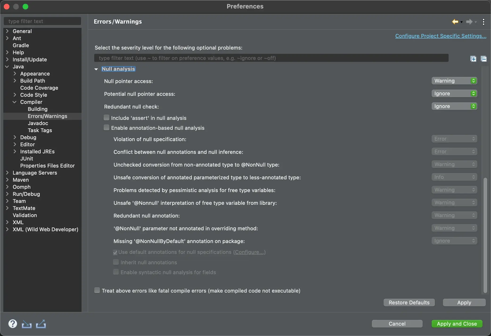

`NullPointerExceptions` （通常缩写为“NPE”）对于每个 Java 程序员来说都是一场噩梦。

我们可以在互联网上找到大量解释如何编写空安全代码的文章。空安全确保我们在代码中添加了适当的检查，以保证对象引用不能为空，或者毕竟在对象为空时采取可能的安全措施。

由于 `NullPointerException` 是一个运行时异常，因此在代码编译过程中很难找出这种情况。 Java 的类型系统没有办法快速消除危险的空对象引用。

幸运的是，Spring 框架提供了一些注释来解决这个问题。在本文中，我们将学习如何使用这些注释通过 [Spring Boot](https://reflectoring.io/categories/spring-boot/) 编写空安全代码。

## 示例代码

本文附有 GitHub 上的工作[代码示例](https://github.com/thombergs/code-examples/tree/master/spring-boot/spring-boot-null-safe-annotations)。

## Spring 中的空安全注解

在 Spring 核心包 `org.springframework.lang` 下，有 4 个这样的注解：

- `@NonNull`, `@NonNull` ，
- `@NonNullFields`, `@NonNullFields` ，
- `@Nullable`,
- `@NonNullApi`.

Eclipse 和 IntelliJ IDEA 等流行的 IDE 可以理解这些注释。它们可以在编译期间警告开发人员潜在的问题。

我们将在本教程中使用 IntelliJ IDEA。让我们通过一些代码示例来了解更多信息。

要创建基础项目，我们可以使用 Spring Initializr。 Spring Boot 启动器就是我们所需要的，不需要添加任何额外的依赖项。

## IDE 配置

**请注意，并非所有开发工具都可以显示这些编译警告。如果您没有看到相关警告，请检查 IDE 中的编译器设置。**

### IntelliJ

对于 IntelliJ，我们可以在“Build, Execution, Deployment -> Compiler”下激活注释检查：


### Eclipse

对于 Eclipse，我们可以在“Java -> Compiler -> Errors/Warnings”下找到设置：



## 示例代码

让我们使用一个简单的 `Employee` 类来理解注释：

```java
package io.reflectoring.nullsafety;

/ imports

class Employee {
  String id;
  String name;
  LocalDate joiningDate;
  String pastEmployment;

  / standard constructor, getters, setters
}
```

## `@NonNull`

大多数情况下， `id` 字段（在 `Employee` 类中）将是一个不可为 null 的值。因此，为了避免任何潜在的 `NullPointerException` 我们可以将此字段标记为 `@NonNull` ：

```java
class Employee {

  @NonNull
  String id;

  /...
}
```

现在，如果我们不小心尝试在代码中的任何位置将 `id` 的值设置为 null，IDE 将显示编译警告：


`@NonNull` 注释可以在方法、参数或字段级别使用。\*\*

此时，您可能会想“如果一个类有多个非空字段怎么办？”。如果我们必须在每一个之前添加 `@NonNull` 注释，是不是太罗嗦了？

我们可以通过使用 `@NonNullFields` 注释来解决这个问题。

以下是 `@NonNull` 的快速摘要：

| 带注释的元素 | 影响                       |
| ------------ | -------------------------- |
| field        | 当字段为空时显示警告       |
| parameter    | 当参数为空时显示警告       |
| method       | 当方法返回 null 时显示警告 |
| package      | 不适用                     |

## `@NonNullFields`

让我们创建一个 `package-info.java` 文件以在包级别应用非空字段检查。该文件将包含带有 `@NonNullFields` 注释的根包名称：

```java
@NonNullFields
package io.reflectoring.nullsafety;

import org.springframework.lang.NonNullFields;
```

现在，我们不再需要使用 `@NonNull` 注释来注释字段。因为默认情况下，该包中类的所有字段现在都被视为非空。而且，我们仍然会看到与以前相同的警告：


这里要注意的另一点是，如果有任何未初始化的字段，那么我们将看到初始化这些字段的警告：


以下是 `@NonNullFields` 的快速摘要：

| 带注释的元素 | 影响                                     |
| ------------ | ---------------------------------------- |
| field        | 不适用                                   |
| parameter    | 不适用                                   |
| method       | 不适用                                   |
| package      | 如果所应用的包的任何字段为空，则显示警告 |

## `@NonNullApi`

到目前为止，您可能已经发现了另一个要求，即对方法参数或返回值进行类似的检查。 `@NonNullApi` 将会来拯救我们。

与 `@NonNullFields` 类似，我们可以使用 `package-info.java` 文件并为目标包添加 `@NonNullApi` 注释：

```java
@NonNullApi
package io.reflectoring.nullsafety;

import org.springframework.lang.NonNullApi;
```

现在，如果我们编写方法返回 null 的代码：

```java
package io.reflectoring.nullsafety;

/ imports

class Employee {

  String getPastEmployment() {
    return null;
  }

  /...
}
```

我们可以看到 IDE 现在警告我们有关不可为 null 的返回值：


以下是 `@NonNullApi` 的快速摘要：

| 带注释的元素 | 影响                                             |
| ------------ | ------------------------------------------------ |
| field        | 不适用                                           |
| parameter    | 不适用                                           |
| method       | 不适用                                           |
| package      | 如果所应用的包的任何参数或返回值为空，则显示警告 |

## `@Nullable`

但这里有一个问题。在某些情况下，特定字段可能为空（无论我们多么想避免它）。

例如， `pastEmployment` 字段在 `Employee` 类中可以为空（对于以前没有工作过的人）。但根据我们的安全检查，IDE 认为不可能。

我们可以使用字段上的 `@Nullable` 注释来表达我们的意图。这将告诉 IDE 该字段在某些情况下可以为空，因此无需触发警报。正如 [JavaDoc](https://docs.spring.io/spring-framework/docs/current/javadoc-api/org/springframework/lang/Nullable.html) 所建议的：

> 可以与 `@NonNullApi` 或 `@NonNullFields` 结合使用，将默认的不可为空语义覆盖为可为空。

与 `NonNull` 类似， `Nullable` 注释可以应用于方法、参数或字段级别。

我们现在可以将 `pastEmployment` 字段标记为可为空：

```java
package io.reflectoring.nullsafety;

/ imports

class Employee {

  @Nullable
  String pastEmployment;

  @Nullable String getPastEmployment() {
    return pastEmployment;
  }

  /...
}
```

以下是 `@Nullable` 的快速摘要：

| 带注释的元素 | 影响                    |
| ------------ | ----------------------- |
| field        | 表示该字段可以为空      |
| parameter    | 表示参数可以为空        |
| method       | 表示该方法可以返回 null |
| package      | 不适用                  |

## 自动构建检查

到目前为止，我们正在讨论现代 IDE 如何使编写空安全代码变得更容易。然而，如果我们想在构建管道中进行一些自动代码检查，这在某种程度上也是可行的。

[SpotBugs](https://spotbugs.github.io/)（著名但已废弃的 [FindBugs](http://findbugs.sourceforge.net/) 项目的转世）提供了一个 Maven/Gradle 插件，可以检测由于可空性而导致的代码异味。让我们看看如何使用它。

对于 Maven 项目，我们需要更新 `pom.xml` 以添加 [SpotBugs Maven](https://spotbugs.readthedocs.io/en/latest/maven.html) 插件：

```xml
<plugin>
  <groupId>com.github.spotbugs</groupId>
  <artifactId>spotbugs-maven-plugin</artifactId>
  <version>4.5.2.0</version>
  <dependencies>
    <!-- overwrite dependency on spotbugs if you want to specify the version of spotbugs -->
    <dependency>
      <groupId>com.github.spotbugs</groupId>
      <artifactId>spotbugs</artifactId>
      <version>4.5.3</version>
    </dependency>
  </dependencies>
</plugin>
```

构建项目后，我们可以使用该插件的以下目标：

- `spotbugs` 目标分析目标项目。

- `check` 目标运行 `spotbugs` 目标，如果发现任何错误，则使构建失败。

如果您使用 Gradle 而不是 Maven，则可以在 `build.gradle` 文件中配置 SpotBugs Gradle 插件：

```groovy
dependencies {
  spotbugsPlugins 'com.h3xstream.findsecbugs:findsecbugs-plugin:1.11.0'
}

spotbugs {
  toolVersion = '4.5.3'
}
```

项目更新后，我们可以使用 `gradle check` 命令运行检查。

SpotBugs 提供了一些规则，通过在 Maven 构建期间处理 `@NonNull` 注释来标记潜在问题。您可以查看[错误描述的详细列表](https://spotbugs.readthedocs.io/en/latest/bugDescriptions.html)。

例如，如果任何用 `@NonNull` 注释的方法意外返回 null，则 SpotBugs 检查将失败，并显示类似以下内容的错误：

```text
[ERROR] High: io.reflectoring.nullsafety.Employee.getJoiningDate() may return null, but is declared @Nonnull [io.reflectoring.nullsafety.Employee] At Employee.java:[line 36] NP_NONNULL_RETURN_VIOLATION
```

## 结论

这些注解对于 Java 程序员来说确实是一个福音，可以减少运行时出现 `NullPointerException` 的可能性。但是请记住，这并不能保证完全的空安全。

Kotlin 使用这些注释来推断 Spring API 的可为空性。

我希望您现在已经准备好在 Spring Boot 中编写 null 安全代码！

原文链接：[https://reflectoring.io/spring-boot-null-safety-annotations/](https://reflectoring.io/spring-boot-null-safety-annotations/)
