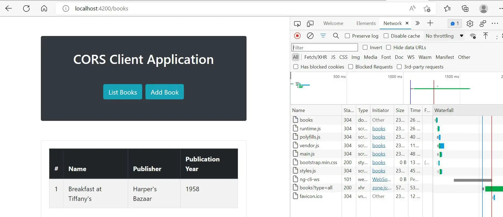
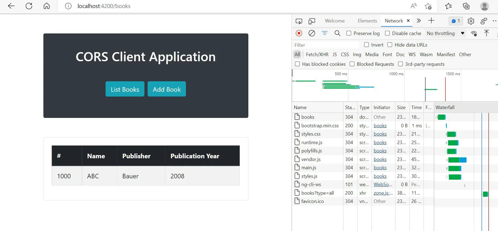

跨源资源共享 (CORS) 是一种基于 HTTP 标头的机制，允许服务器显式将某些源列入白名单，并帮助绕过同源策略。

这是必需的，因为浏览器默认应用同源策略以确保安全。通过在 Web 应用程序中实施 CORS，网页可以请求额外的资源并从其他域加载到浏览器中。

本文将重点介绍在基于 Spring 的应用程序中实现 CORS 的各种方式。要详细了解 CORS 的工作原理，请参阅这篇优秀的[介绍性文章](https://reflectoring.io/complete-guide-to-cors/)。

## 示例代码

本文附有 GitHub 上的工作[代码示例](https://github.com/thombergs/code-examples/tree/master/spring-boot/cors/configuring-cors-with-spring)。

## CORS 特定 HTTP 响应标头概述

CORS 规范定义了服务器返回的一组响应标头，这将是后续部分的重点。

| 响应头                             | 描述                                                                                         |
| ---------------------------------- | -------------------------------------------------------------------------------------------- |
| `Access-Control-Allow-Origin`      | 以逗号分隔的白名单来源列表或“\*”。                                                           |
| `Access-Control-Allow-Methods`     | Web 服务器允许跨源请求的 HTTP 方法的逗号分隔列表。                                           |
| `Access-Control-Allow-Headers`     | Web 服务器允许跨源请求的 HTTP 标头的逗号分隔列表。                                           |
| `Access-Control-Expose-Headers`    | 客户端脚本认为可以安全显示的以逗号分隔的 HTTP 标头列表。                                     |
| `Access-Control-Allow-Credentials` | 如果浏览器通过传递凭据（以 cookie 或授权标头的形式）向服务器发出请求，则其值设置为 `true` 。 |
| `Access-Control-Max-Age`           | 指示预检请求的结果可以缓存多长时间。                                                         |

## 设置示例客户端应用程序

我们将使用一个简单的角度应用程序来调用 REST 端点，我们可以使用浏览器开发人员工具检查这些端点。您可以在 GitHub 上查看[源代码](https://github.com/thombergs/code-examples/tree/master/spring-boot/cors/configuring-cors-with-spring/cors-app)。

```bash
    ng serve --open
```

我们应该能够成功启动客户端应用程序。


## 设置示例服务器应用程序

我们将使用一个基于 Spring 的示例应用程序，其中包含客户端应用程序可以调用的 `GET` 和 `POST` 请求。请注意，您会发现两个独立的应用程序：一个使用 Spring MVC (REST)，另一个使用 Spring Reactive 堆栈。

为简单起见，两个应用程序之间的 CORS 配置相同，并且定义了相同的端点。两台服务器都从不同的端口 8091 和 8092 启动。

与应用程序捆绑在一起的 Maven Wrapper 将用于启动服务。您可以查看 [Spring REST 源代码](https://github.com/thombergs/code-examples/tree/master/spring-boot/cors/configuring-cors-with-spring/SimpleLibraryApplication)和 [Spring Reactive 源代码](https://github.com/thombergs/code-examples/tree/master/spring-boot/cors/configuring-cors-with-spring/LibraryWebfluxApplication)。

```bash
mvnw clean verify spring-boot:run (for Windows)
./mvnw clean verify spring-boot:run (for Linux)
```

一旦 Spring 应用程序成功启动，客户端应用程序应该能够成功从服务器加载数据。

调用 Spring REST 服务器：


调用 Spring Reactive 服务器：



## 了解 `@CrossOrigin` 属性

在 Spring Boot 应用程序中，我们使用 `@CrossOrigin` 注解来启用跨域调用。我们先了解一下 `@CrossOrigin` 支持的属性。

| 属性               | Description 描述                                                                                                                                                                                                                                                              |
| ------------------ | ----------------------------------------------------------------------------------------------------------------------------------------------------------------------------------------------------------------------------------------------------------------------------- |
| `origins`          | 允许您指定允许的来源列表。默认情况下，它允许所有来源。 该属性值将在预检响应和实际响应的 `Access-Control-Allow-Origin` 标头中设置。 用法示例： `@CrossOrigin(origins = "http://localhost:8080")` `@CrossOrigin(origins = {"http://localhost:8080", "http://testserver:8087"})` |
| `allowedHeaders`   | 允许您指定浏览器发出请求时将接受的标头列表。默认情况下，任何标头都将被允许。此属性中指定的值用于预检响应中的 `Access-Control-Allow-Headers` 中。 **用法示例：** `@CrossOrigin(allowedHeaders = {"Authorization", "Origin"})`                                                  |
| `exposedHeaders`   | 在实际响应标头中设置的标头列表。如果未指定，则只有安全列表中的标头才会被认为可以安全地由客户端脚本公开。 **用法示例：** `@CrossOrigin(exposedHeaders = {"Access-Control-Allow-Origin","Access-Control-Allow-Credentials"})`                                                   |
| `allowCredentials` | 当需要凭据来调用 API 时，请将 `Access-Control-Allow-Credentials` 标头值设置为 true。如果不需要凭据，请省略标头。 **用法示例：** `@CrossOrigin(allowCredentials = true)`                                                                                                       |
| `maxAge`           | 默认 `maxAge` 设置为 1800 秒（30 分钟）。指示预检响应可以缓存多长时间。 **用法示例：** `@CrossOrigin(maxAge = 300)`                                                                                                                                                           |

## 如果不配置 CORS 怎么办？

考虑我们的 Spring Boot 应用程序尚未配置为 CORS 支持。如果我们尝试访问在端口 4200 上运行的 Angular 应用程序，我们会在开发人员控制台上看到以下错误：

```
Access to XMLHttpRequest at http://localhost:8091
from origin http://localhost:4200 has been blocked by CORS policy:
No 'Access-Control-Allow-Origin` header is present on the requested
resource
```


这是因为，即使两个应用程序均由 `localhost` 提供服务，但[由于端口不同](https://reflectoring.io/complete-guide-to-cors/#same-origin-vs-cross-origin)，它们不会被视为同一来源。

## 在 Spring Web MVC 应用程序中配置 CORS

使用 Spring Initializr 创建的初始设置包含所有必需的 CORS 依赖项。无需添加外部依赖项。请参阅此[示例 Spring Web 应用程序项目](https://github.com/thombergs/code-examples/tree/master/spring-boot/cors/configuring-cors-with-spring/SpringWebApplication)。

### 在类级别定义 `@CrossOrigin`

```java
@CrossOrigin(maxAge = 3600)
@RestController
@RequestMapping("cors-library/managed/books")
public class LibraryController {}
```

由于我们已经定义了 `@CrossOrigin` ：

- 控制器中的所有 `@RequestMapping` 方法（以及使用速记注释 `@GetMapping` 、 `@PostMapping` 等的方法）都将接受跨域请求。
- 自 `maxAge = 3600` 起，所有飞行前响应将被缓存 60 分钟。

### 在方法级别定义 `@CrossOrigin`

```java
@CrossOrigin(origins = "http://localhost:4200", allowedHeaders = "Requestor-Type", exposedHeaders = "X-Get-Header")
@GetMapping
public ResponseEntity<List<BookDto>> getBooks(@RequestParam String type) {
    HttpHeaders headers = new HttpHeaders();
    headers.set("X-Get-Header", "ExampleHeader");
    return ResponseEntity.ok().headers(headers).body(libraryService.getAllBooks(type));
}
```

这将产生以下效果：

- 仅接受来自来源 `http://localhost:4200` 的请求。
- 如果我们希望只接受某些标头，则可以在 `allowedHeaders` 属性中指定这些标头。如果浏览器未发送 `Requestor-Type` 标头，则不会处理该请求。

- 如果我们设置某些响应标头，为了让客户端应用程序能够使用它们，我们需要使用 `exposedHeaders` 属性显式设置要公开的响应标头列表。

### 类和方法级别的 `@CrossOrigin` 组合

```java
@CrossOrigin(maxAge = 3600)
@RestController
@RequestMapping("cors-library/managed/books")
public class LibraryController {

    private static final Logger log = LoggerFactory.getLogger(LibraryController.class);

    private final LibraryService libraryService;

    public LibraryController(LibraryService libraryService) {
        this.libraryService = libraryService;
    }

    @CrossOrigin(origins = "http://localhost:4200", allowedHeaders = "Requestor-Type")
    @GetMapping
    public ResponseEntity<List<BookDto>> getBooks(@RequestParam String type) {
        HttpHeaders headers = new HttpHeaders();
        headers.set("X-Get-Header", "ExampleHeader");
        return ResponseEntity.ok().headers(headers).body(libraryService.getAllBooks(type));
    }
}
```

- 通过在类和方法级别定义注释，其组合属性将应用于方法，即（ `origins` 、 `allowedHeaders` 、``）

- 在上述所有情况下，我们可以使用 `@CrossOrigin` 定义全局 CORS cmaxAgeonconfiguration 和本地配置。对于接受多个值的属性，将应用全局值和本地值的组合（即它们被合并）。对于仅接受单个值的属性，本地值将优先于全局值。

### 全局启用 CORS

我们可以定义一个适用于定义的所有资源的通用 CORS 配置，而不是分别向每个资源添加 CORS。

在这里，我们将使用 `WebMvcConfigurer` ，它是 Spring Web MVC 库的一部分

通过重写 `addCorsMapping()` 方法，我们将为 Spring Web MVC 处理的所有 URL 配置 CORS。

为了全局定义相同的配置（如前几节所述），我们将使用 `application.yml` 中定义的配置参数来创建一个 bean，如下定义。

`application.yml` 中定义的属性（ `allowed-origins` 、 `allowed-methods` 、 `max-age` 、 `allowed-headers` 、 `exposed-headers` ) 是通过 `@ConfigurationProperties(prefix = "web")` 映射到自定义类 Cors 的自定义属性

```yaml
web:
  cors:
    allowed-origins: "http://localhost:4200"
    allowed-methods: GET, POST, PATCH, PUT, DELETE, OPTIONS, HEAD
    max-age: 3600
    allowed-headers: "Requestor-Type"
    exposed-headers: "X-Get-Header"
```

```java
@Bean
public WebMvcConfigurer corsMappingConfigurer() {
   return new WebMvcConfigurer() {
       @Override
       public void addCorsMappings(CorsRegistry registry) {
           WebConfigProperties.Cors cors = webConfigProperties.getCors();
           registry.addMapping("/**")
             .allowedOrigins(cors.getAllowedOrigins())
             .allowedMethods(cors.getAllowedMethods())
             .maxAge(cors.getMaxAge())
             .allowedHeaders(cors.getAllowedHeaders())
             .exposedHeaders(cors.getExposedHeaders());
       }
   };
}
```

> #### `CorsConfiguration` 默认值
>
> 如果未显式定义一个或多个方法（ `allowedOrigins` 、 `allowedMethods` 、 `maxAge` 、 `allowedHeaders` 、 `exposedHeaders` ），则 `addMapping()` 返回一个 `CorsRegistration` 对象，该对象应用默认的 `CorsConfiguration` 。请参阅 Spring 库方法 [CorsConfiguration.applyPermitDefaultValues()](https://docs.spring.io/spring-framework/docs/current/javadoc-api/org/springframework/web/cors/CorsConfiguration.html#applyPermitDefaultValues--) 以了解应用的默认值。

## 在 Spring Webflux 应用程序中配置 CORS

初始设置是使用 Spring Initializr 创建的，并使用 Spring Webflux、Spring Data R2DBC 和 H2 数据库。无需添加外部依赖项。请参阅[此示例 Spring Webflux 项目](https://github.com/thombergs/code-examples/tree/master/spring-boot/cors/configuring-cors-with-spring/SpringWebfluxApplication)。

### 使用 `@CrossOrigin` 进行 Spring Webflux 的 CORS 配置

与 Spring MVC 类似，在 Spring Webflux 中我们可以在类级别或方法级别定义 `@CrossOrigin` 。前面几节中描述的相同 `@CrossOrigin` 属性将适用。此外，当在类和方法中都定义了注释时，其组合属性将应用于方法。

```java
@CrossOrigin(origins = "http://localhost:4200", allowedHeaders = "Requestor-Type", exposedHeaders = "X-Get-Header")
@GetMapping
public ResponseEntity<Mono<List<BookDto>>> getBooks(@RequestParam String type) {
    HttpHeaders headers = new HttpHeaders();
    headers.set("X-Get-Header", "ExampleHeader");
    return ResponseEntity.ok().headers(headers).body(libraryService.getAllBooks(type));
}
```

### 在 Spring Webflux 中全局启用 CORS 配置

要在 Spring Webflux 应用程序中全局定义 CORS，我们使用 `WebfluxConfigurer` 并覆盖 `addCorsMappings()` 。与 Spring MVC 类似，它使用带有默认值的 `CorsConfiguration` ，可以根据需要覆盖默认值。

```java
@Bean
public WebFluxConfigurer corsMappingConfigurer() {
    return new WebFluxConfigurer() {
        @Override
        public void addCorsMappings(CorsRegistry registry) {
            WebConfigProperties.Cors cors = webConfigProperties.getCors();
            registry.addMapping("/**")
              .allowedOrigins(cors.getAllowedOrigins())
              .allowedMethods(cors.getAllowedMethods())
              .maxAge(cors.getMaxAge())
              .allowedHeaders(cors.getAllowedHeaders())
              .exposedHeaders(cors.getExposedHeaders());
        }
    };
}
```

### 使用 `WebFilter` 启用 CORS

Webflux 框架允许通过 `CorsWebFilter` 全局设置 CORS 配置。我们可以使用 `CorsConfiguration` 对象来设置所需的配置并注册要与过滤器一起使用的 `CorsConfigurationSource` 。

但是，默认情况下，过滤器中的 `CorsConfiguration` 不会将默认配置分配给端点！只能应用指定的配置。

另一种选择是显式调用 `CorsConfiguration.applyPermitDefaultValues()` 。

```java
@Bean
public CorsWebFilter corsWebFilter() {
    CorsConfiguration corsConfig = new CorsConfiguration();
    corsConfig.setAllowedOrigins(Arrays.asList("http://localhost:4200"));
    corsConfig.setMaxAge(3600L);
    corsConfig.addAllowedMethod("*");
    corsConfig.addAllowedHeader("Requestor-Type");
    corsConfig.addExposedHeader("X-Get-Header");

    UrlBasedCorsConfigurationSource source =
        new UrlBasedCorsConfigurationSource();
    source.registerCorsConfiguration("/**", corsConfig);

    return new CorsWebFilter(source);
}
```

## 使用 Spring Security 启用 CORS

如果 Spring Security 应用于 Spring 应用程序，则必须在 Spring Security 生效之前处理 CORS，因为预检请求不会包含 cookie，并且 Spring Security 将拒绝该请求，因为它将确定用户未经过身份验证。这里显示的示例将演示基本身份验证。

为了应用 Spring 安全性，我们将添加以下依赖 Maven：

```xml
<dependency>
  <groupId>org.springframework.boot</groupId>
  <artifactId>spring-boot-starter-security</artifactId>
</dependency>
```

Gradle:

```groovy
  implementation 'org.springframework.boot:spring-boot-starter-security'
```

### Spring Security 应用于 Spring Web MVC

Spring security 默认保护每个端点。但是，这会导致 CORS 错误，因为浏览器的 `OPTIONS` 预检请求将被阻止。要使 Spring Security 绕过预检请求，我们需要将 `http.cors()` 添加到 `HTTPSecurity` 对象，如下所示：

```java
@Configuration
@EnableConfigurationProperties(BasicAuthConfigProperties.class)
@EnableWebSecurity
public class SecurityConfiguration extends WebSecurityConfigurerAdapter {

    private final BasicAuthConfigProperties basicAuth;

    public SecurityConfiguration(BasicAuthConfigProperties basicAuth) {
        this.basicAuth = basicAuth;
    }

    protected void configure(HttpSecurity http) throws Exception {
        http.cors();
    }
}
```

要在绕过预检请求后使用 Spring Security 设置额外的 CORS 配置，我们可以使用 `@CrossOrigin` 注释来配置 CORS：

```java
@CrossOrigin(maxAge = 3600, allowCredentials = "true")
@RestController
@RequestMapping("cors-library/managed/books")
public class LibraryController {

    private static final Logger log = LoggerFactory.getLogger(LibraryController.class);

    private final LibraryService libraryService;

    public LibraryController(LibraryService libraryService) {
        this.libraryService = libraryService;
    }

    @CrossOrigin(origins = "http://localhost:4200", allowedHeaders = {"Requestor-Type", "Authorization"}, exposedHeaders = "X-Get-Header")
    @GetMapping
    public ResponseEntity<List<BookDto>> getBooks(@RequestParam String type) {
        HttpHeaders headers = new HttpHeaders();
        headers.set("X-Get-Header", "ExampleHeader");
        return ResponseEntity.ok().headers(headers).body(libraryService.getAllBooks(type));
    }
}
```

或者，我们可以创建一个 `CorsConfigurationSource` bean：

```java
@Bean
CorsConfigurationSource corsConfigurationSource() {
  CorsConfiguration configuration = new CorsConfiguration();
  configuration.setAllowedOrigins(Arrays.asList("http://localhost:4200"));
  configuration.setAllowedMethods(Arrays.asList("GET","POST","PATCH", "PUT", "DELETE", "OPTIONS", "HEAD"));
  configuration.setAllowCredentials(true);
  configuration.setAllowedHeaders(Arrays.asList("Authorization", "Requestor-Type"));
  configuration.setExposedHeaders(Arrays.asList("X-Get-Header"));
  configuration.setMaxAge(3600L);
  UrlBasedCorsConfigurationSource source = new UrlBasedCorsConfigurationSource();
  source.registerCorsConfiguration("/**", configuration);
  return source;
}
```

### Spring Security 应用于 Spring Webflux

对于 Webflux，尽管使用 Spring Security，将 CORS 配置应用于传入请求的最首选方法是使用 `CorsWebFilter` 。我们可以禁用 CORS 与 Spring security 的集成，而是通过提供 `CorsConfigurationSource` 与 `CorsWebFilter` 集成：

```java
@Configuration
@EnableWebFluxSecurity
@EnableConfigurationProperties(BasicAuthConfigProperties.class)
public class SecurityConfiguration {

    private final BasicAuthConfigProperties basicAuth;

    public SecurityConfiguration(BasicAuthConfigProperties basicAuth) {
        this.basicAuth = basicAuth;
    }

    @Bean
    public SecurityWebFilterChain securityWebFilterChain(ServerHttpSecurity http) {
        http.cors(cors -> cors.disable())
                .securityMatcher(new PathPatternParserServerWebExchangeMatcher("/**"))
                .authorizeExchange()
                .anyExchange().authenticated().and()
                .httpBasic();
        return http.build();
    }

    @Bean
    public MapReactiveUserDetailsService userDetailsService() {
        UserDetails user = User.withDefaultPasswordEncoder()
                .username(basicAuth.getUsername())
                .password(basicAuth.getPassword())
                .roles("USER")
                .build();
        return new MapReactiveUserDetailsService(user);
    }

    @Bean
    public CorsConfigurationSource corsConfiguration() {
        CorsConfiguration corsConfig = new CorsConfiguration();
        corsConfig.applyPermitDefaultValues();
        corsConfig.setAllowCredentials(true);
        corsConfig.addAllowedMethod("GET");
        corsConfig.addAllowedMethod("PATCH");
        corsConfig.addAllowedMethod("POST");
        corsConfig.addAllowedMethod("OPTIONS");
        corsConfig.setAllowedOrigins(Arrays.asList("http://localhost:4200"));
        corsConfig.setAllowedHeaders(Arrays.asList("Authorization", "Requestor-Type"));
        corsConfig.setExposedHeaders(Arrays.asList("X-Get-Header"));
        UrlBasedCorsConfigurationSource source =
                new UrlBasedCorsConfigurationSource();
        source.registerCorsConfiguration("/**", corsConfig);
        return source;
    }

    @Bean
    public CorsWebFilter corsWebFilter() {
        return new CorsWebFilter(corsConfiguration());
    }
}
```

## 结论

简而言之，CORS 配置取决于多个因素：

- Spring Web / Spring Webflux
- 本地/全局 CORS 配置
- 是否使用 Spring Security

根据框架，我们可以决定哪种方法效果最好并且最容易实现，这样我们就可以避免 CORS 错误。您可以使用 [GitHub 上的示例应用程序](https://github.com/thombergs/code-examples/tree/master/spring-boot/cors/configuring-cors-with-spring)。

原文链接：[https://reflectoring.io/spring-cors/](https://reflectoring.io/spring-cors/)
