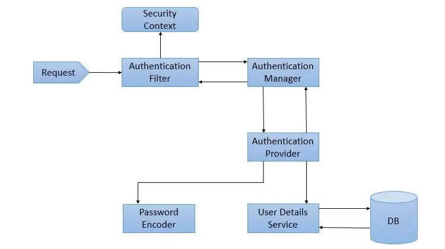
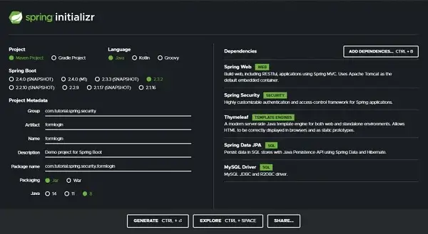
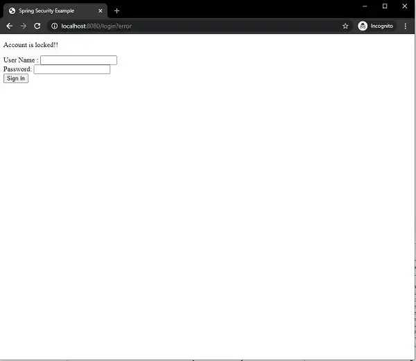
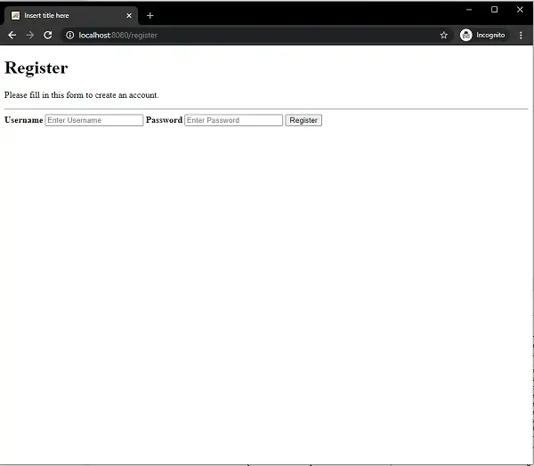

## 内容

- 简介和概述
- Spring Security 的基本组件
  - AuthenticationFilter 认证过滤器
  - AuthenticationManager 认证管理器
  - AuthenticationProvider 认证提供者
  - UserDetailsService 用户详情服务
  - PasswordEncoder 密码编码器
  - Spring 安全上下文
  - 表单登录
  - 使用数据库登录
  - 登录尝试限制
- 入门（实用指南）

## 简介和概述

除了提供各种内置的身份验证和授权选项之外，Spring Security 还允许我们根据需要自定义身份验证过程。从自定义登录页面到我们自己的自定义身份验证提供程序和身份验证过滤器，我们几乎可以自定义身份验证过程的各个方面。

我们可以定义自己的身份验证过程，范围可以从使用用户名和密码的基本身份验证到复杂的身份验证，例如使用令牌和 OTP 的双因素身份验证。此外，我们可以使用各种数据库 - 关系数据库和非关系数据库，使用各种密码编码器，将恶意用户锁定在其帐户之外，等等。

今天，我们将讨论三种此类自定义，即自定义表单登录、数据库提供的身份验证以及限制登录尝试。尽管这些都是非常基本的用例，但它们仍然可以让我们更仔细地了解 Spring Security 的身份验证和授权过程。我们还将建立一个注册页面，用户可以通过该页面在我们的应用程序中进行注册。

首先我们看一下 Spring Security 的架构。它从 servlet 过滤器开始。这些过滤器拦截请求，对其执行操作，然后将请求传递到过滤器链中的下一个过滤器或请求处理程序，或者在不满足某些条件时阻止它们。正是在这个过程中，Spring Security 可以对请求进行身份验证并对请求执行各种身份验证检查。

它还可以通过不允许未经身份验证或恶意请求访问我们受保护的资源来阻止它们通过。因此我们的应用程序和资源受到保护。

## Spring Security 架构的组件



正如我们在上图中看到的那样，Spring Security 的基本组件如下所示。我们将在讨论过程中简要讨论它们。我们还将讨论它们在身份验证和授权过程中的角色。

### AuthenticationFilter 认证过滤器

这是拦截请求并尝试对其进行身份验证的过滤器。在 Spring Security 中，它将请求转换为身份验证对象并将身份验证委托给 AuthenticationManager。

### AuthenticationManager 认证管理器

它是身份验证的主要策略接口。它使用单独的方法 authenticate()来验证请求。 authenticate() 方法执行身份验证，并在身份验证成功时返回 Authentication 对象，或者在身份验证失败时抛出 AuthenticationException。如果该方法无法决定，它将返回 null。这个过程中的认证过程委托给了我们接下来要讨论的 AuthenticationProvider。

### AuthenticationProvider 认证提供者

AuthenticationManager 由 ProviderManager 实现，后者将流程委托给一个或多个 AuthenticationProvider 实例。任何实现 AuthenticationProvider 接口的类都必须实现两个方法——authenticate() 和 supports()。首先，我们来谈谈 supports()方法。它用于检查我们的 AuthenticationProvider 实现类是否支持特定的身份验证类型。如果支持则返回 true，否则返回 false。

接下来是 authenticate() 方法。这是身份验证发生的地方。如果支持该认证类型，则启动认证过程。这里这个类可以使用 UserDetailsS​​ervice 实现的 loadUserByUsername() 方法。如果未找到用户，则会抛出 UsernameNotFoundException。

另一方面，如果找到用户，则使用该用户的身份验证详细信息来验证该用户。例如，在基本认证场景中，可以将用户提供的密码与数据库中的密码进行核对。如果发现它们彼此匹配，则说明成功。然后我们可以从此方法返回一个 Authentication 对象，该对象将存储在安全上下文中，我们将在稍后讨论。

### UserDetailsService 用户详情服务

它是 Spring Security 的核心接口之一。任何请求的身份验证主要取决于 UserDetailsS​​ervice 接口的实现。它最常用于数据库支持的身份验证中以检索用户数据。通过单独的 loadUserByUsername() 方法的实现来检索数据，我们可以在其中提供逻辑来获取用户的用户详细信息。如果未找到用户，该方法将抛出 UsernameNotFoundException。

### 密码编码器

在 Spring Security 4 之前，PasswordEncoder 的使用是可选的。用户可以使用内存中身份验证来存储纯文本密码。但 Spring Security 5 强制使用 PasswordEncoder 来存储密码。这使用其多种实现之一对用户的密码进行编码。最常见的实现是 BCryptPasswordEncoder。此外，我们还可以使用 NoOpPasswordEncoder 的实例来进行开发。它将允许密码以纯文本形式存储。

但它不应该用于生产或现实世界的应用程序。

### Spring 安全上下文

这是在成功验证后存储当前已验证用户的详细信息的位置。然后，身份验证对象在会话的整个应用程序中可用。因此，如果我们需要用户名或任何其他用户详细信息，我们需要首先获取 SecurityContext。这是通过 SecurityContextHolder（一个帮助程序类）完成的，它提供对安全上下文的访问。

我们可以使用 setAuthentication() 和 getAuthentication() 方法分别存储和检索用户详细信息。

继续，现在让我们讨论我们将在应用程序中使用的三个自定义实现。

### 表单登录

当我们将 Spring Security 添加到现有 Spring 应用程序时，它会添加一个登录表单并设置一个虚拟用户。这是自动配置模式下的 Spring Security。在此模式下，它还设置默认过滤器、身份验证管理器、身份验证提供程序等。此设置是内存中身份验证设置。我们可以覆盖此自动配置来设置我们自己的用户和身份验证过程。我们还可以设置自定义登录方法，例如自定义登录表单。

Spring Security 只需要了解登录表单的详细信息，例如登录表单的 URI、登录处理 URL 等。然后它将为应用程序呈现我们的登录表单并执行身份验证过程其他提供的配置或 Spring 自己的实现。

此自定义表单设置只需遵守某些规则即可与 Spring Security 集成。我们需要有一个用户名参数和一个密码参数，参数名称应该是“用户名”和“密码”，因为这些是默认名称。如果我们在自定义中对这些字段使用我们自己的参数名称，我们必须使用 usernameParameter() 和 passwordParameter() 方法通知 Spring Security 这些更改。

同样，对于我们对登录表单或表单登录方法所做的每一次更改，我们都必须使用适当的方法通知 Spring Security 这些更改，以便它可以将它们与身份验证过程集成。

### 使用数据库登录

正如我们所讨论的，Spring Security 默认情况下自动提供内存中身份验证实现。我们可以通过验证其详细信息存储在数据库中的用户来覆盖这一点。在这种情况下，在对用户进行身份验证时，我们可以根据数据库中的凭据验证用户提供的凭据以进行身份 ​​ 验证。我们还可以让新用户在我们的应用程序中注册并将他们的凭据存储在同一数据库中。

此外，我们还可以提供更改或更新其密码、角色或其他数据的方法。因此，这为我们提供了可以使用更长时间的持久用户数据。

### 登录尝试限制

为了限制应用程序中的登录尝试，我们可以使用 Spring Security 的 isAccountNonLocked 属性。 Spring Security 的 UserDetails 为我们提供了该属性。我们可以设置一种身份验证方法，如果任何用户或其他人提供不正确的凭据超过一定次数，我们可以锁定他们的帐户。即使用户提供了正确的凭据，Spring Security 也会禁用锁定用户的身份验证。这是 Spring Security 提供的内置功能。

我们可以将错误登录尝试的次数存储在数据库中。然后，针对每次错误的身份验证尝试，我们可以更新并检查数据库表。当此类尝试的次数超过给定数量时，我们可以将用户锁定在其帐户之外。因此，在帐户解锁之前，用户将无法再次登录。

## 入门（实用指南）

现在让我们开始我们的应用程序。下面列出了此应用程序所需的工具 -

- **A Java IDE** − 最好是 STS 4，但 Eclipse、IntelliJ Idea 或任何其他 IDE 都可以。
- MySql Server Community Edition - 我们需要在我们的系统中下载并安装 MySql Community Server。我们可以点击这里进入官方网站。
- [MySql Workbench](https://dev.mysql.com/downloads/workbench/) − 它是一个 GUI 工具，我们可以用来与 MySql 数据库交互。

### 数据库设置

我们先设置数据库。我们将为此应用程序使用 MySql 数据库实例。 MySql Server 社区版可供免费下载和使用。我们将使用 MySql Workbench 与 MySql 服务器连接，并创建一个名为“spring”的数据库以与我们的应用程序一起使用。

然后我们将创建两个表 - 用户和尝试 - 来保存我们的用户和登录尝试。如前所述，注册我们的应用程序的用户的详细信息将存储在 users 表中。任何用户的登录尝试次数将根据其用户名存储在 attempts 表中。这样我们就可以跟踪尝试并采取必要的行动。

让我们看一下设置用户表和尝试表的 SQL。

```sql
CREATE TABLE users (
   username VARCHAR(45) NOT NULL , password VARCHAR(45) NOT NULL ,
   account_non_locked TINYINT NOT NULL DEFAULT 1 ,
   PRIMARY KEY (username)
);
CREATE TABLE attempts (
   id int(45) NOT NULL AUTO_INCREMENT,
   username varchar(45) NOT NULL, attempts varchar(45) NOT NULL, PRIMARY KEY (id)
);
```

我们现在可以向我们的应用程序添加一个虚拟用户。

```sql
INSERT INTO users(username,password,account_non_locked)
VALUES ('user','12345', true);
```

### 项目设置

像往常一样，我们将使用 Spring 初始化程序来设置我们的项目。我们将使用 Spring Boot 版本 2.3.2 创建一个 Maven 项目。让我们将项目命名为 formlogin（我们可以选择任何我们想要的名称）和组 id 为 com.tutorial.spring.security。此外，我们将在该项目中使用 Java 版本 8。



### 依赖关系

现在，谈到依赖项，我们将在此演示中使应用程序尽可能简单。我们将继续关注今天要探索的功能。因此，我们将选择最少数量的依赖项，这将有助于我们设置应用程序并快速启动和运行。让我们看一下依赖关系 -

- **Spring Web** − 它捆绑了与 Web 开发相关的所有依赖项，包括 Spring MVC、REST 和嵌入式 Tomcat 服务器。
- **Spring Security** − 用于实现 Spring Security 提供的安全功能。
- **Thymeleaf** − 用于 HTML5/XHTML/XML 的服务器端 Java 模板引擎。
- **Spring Data JPA** − 除了使用 JPA 规范定义的所有功能之外，Spring Data JPA 还添加了自己的功能，例如存储库模式的无代码实现以及从方法名称创建数据库查询。
- **Mysql Driver** − 用于 MySQL 数据库驱动程序。

有了这五个依赖项，我们现在就可以设置我们的项目了。让我们点击生成按钮。这会将我们的项目下载为 zip 文件。我们可以将其解压到我们选择的文件夹中。然后我们在 IDE 中打开该项目。为此，我们将使用 Spring Tool Suite 4。例子。

让我们将项目加载到 STS 中。我们的 IDE 需要一些时间来下载依赖项并验证它们。让我们看一下 pom.xml 文件。

pom.xml

```xml
<?xml version="1.0" encoding="ISO-8859-1"?>
<project xsi:schemaLocation="http://maven.apache.org/POM/4.0.0
   https://maven.apache.org/xsd/maven-4.0.0.xsd"
   xmlns:xsi="http://www.w3.org/2001/XMLSchema-instance"
   xmlns="http://maven.apache.org/POM/4.0.0">
   <modelVersion>4.0.0</modelVersion>
   <parent>
      <groupId>org.springframework.boot</groupId>
      <artifactId>spring-boot-starter-parent</artifactId>
      <version>2.3.1.RELEASE</version>
      <relativePath/>
      <!-- lookup parent from repository -->
   </parent>
   <groupId>com.tutorial.spring.security</groupId>
   <artifactId>formlogin</artifactId>
   <version>0.0.1-SNAPSHOT</version>
   <name>formlogin</name>
   <description>Demo project for Spring Boot</description>
   <properties> <java.version>1.8</java.version>
   </properties>
   <dependencies>
      <dependency>
         <groupId>org.springframework.boot</groupId>
         <artifactId>spring-boot-starter-data-jpa</artifactId>
      </dependency>
      <dependency>
         <groupId>org.springframework.boot</groupId>
         <artifactId>spring-boot-starter-security</artifactId>
      </dependency>
      <dependency>
         <groupId>org.springframework.boot</groupId>
         <artifactId>spring-boot-starter-thymeleaf</artifactId>
      </dependency>
      <dependency>
         <groupId>org.springframework.boot</groupId>
         <artifactId>spring-boot-starter-web</artifactId>
      </dependency>
      <dependency>
         <groupId>org.springframework.boot</groupId>
         <artifactId>spring-boot-devtools</artifactId>
         <scope>runtime<scope> <optional>true</optional>
      </dependency>
      <dependency>
      <groupId>mysql</groupId>
      <artifactId>mysql-connector-java</artifactId>
      <scope>runtime</scope> </dependency>
      <dependency>
         <groupId>org.springframework.boot</groupId>
         <artifactId>spring-boot-starter-test</artifactId>
         <scope>test</scope>
         <exclusions>
         <exclusion>
         <groupId>org.junit.vintage</groupId>
         <artifactId>junit-vintage-engine</artifactId>
         </exclusion>
         </exclusions>
      </dependency>
      <dependency>
         <groupId>org.springframework.security</groupId>
         <artifactId>spring-security-test<artifactId>
         <scope>test</scope>
      </dependency>
   </dependencies>
   <build>
      <plugins>
         <plugin>
            <groupId>org.springframework.boot</groupId>
            <artifactId>spring-boot-maven-plugin</artifactId>
         </plugin>
      </plugins>
   </build>
</project>
```

We can see that our project details along with our dependencies are enlisted here.
我们可以看到我们的项目详细信息以及我们的依赖项都列在这里。

### 数据源

我们将在 application.properties 文件中配置数据源。由于我们将使用本地 MySQL 数据库作为数据源，因此我们在此处提供本地数据库实例的 URL、用户名和密码。我们将我们的数据库命名为“spring”。

```properties
spring.datasource.url=jdbc:mysql://localhost:3306/spring
spring.datasource.username=root
spring.datasource.password=root
```

### 实体

现在让我们创建我们的实体。我们从 User 实体开始，它包含三个字段 - 用户名、密码和 accountNonLocked。该 User 类还实现了 Spring Security 的 UserDetails 接口。此类提供核心用户信息。它用于存储用户数据，稍后可以将其封装到 Authentication 对象中。不建议直接实现接口。

但对于我们的例子，由于这是一个简单的应用程序来演示数据库登录，因此我们直接在这里实现了这个接口以保持简单。我们可以通过在 User 实体周围使用包装类来实现此接口。

**User.java**

```java
package com.tutorial.spring.security.formlogin.model;

import java.util.Collection;
import java.util.List;
import javax.persistence.Column;
import javax.persistence.Entity;
import javax.persistence.Id;
import javax.persistence.Table;
import org.springframework.security.core.GrantedAuthority;
import org.springframework.security.core.userdetails.UserDetails;

@Entity
@Table(name = "users")
public class User implements UserDetails {

   /**
   *
   */
   private static final long serialVersionUID = 1L;

   @Id
   private String username;
   private String password; @Column(name = "account_non_locked")
   private boolean accountNonLocked;

   public User() {
   }
   public User(String username, String password, boolean accountNonLocked) {
      this.username = username;
      this.password = password;
      this.accountNonLocked = accountNonLocked;
   }
   @Override
   public Collection< extends GrantedAuthority> getAuthorities() {
      return List.of(() -> "read");
   }
   @Override
   public String getPassword() {
      return password;
   }
   public void setPassword(String password) {
      this.password = password;
   }
   @Override
   public String getUsername() {
      return username;
   }
   public void setUsername(String username) {
      this.username = username;
   }
   @Override
   public boolean isAccountNonExpired() {
      return true;
   }
   @Override
   public boolean isAccountNonLocked() {
      return accountNonLocked;
   }
   @Override public boolean isCredentialsNonExpired() {
      return true;
   }
   @Override public boolean isEnabled() {
   return true;
   }

   public void setAccountNonLocked(Boolean accountNonLocked) {
      this.accountNonLocked = accountNonLocked;
   }
   public boolean getAccountNonLocked() {
      return accountNonLocked;
   }
}
```

这里要注意 accountNonLocked 字段。 Spring Security 中的每个用户的帐户默认都是解锁的。为了覆盖该属性并在用户超过允许的尝试次数后将用户锁定在其帐户之外，我们将使用该属性。如果用户超过允许的无效尝试次数，我们将使用此属性将他锁定在帐户之外。
Also, during every authentication attempt, we shall be checking this property with the isAccountNonLocked() method along with the credentials to authenticate the user. Any user with a locked account will not be allowed to authenticate into the application.
此外，在每次身份验证尝试期间，我们将使用 isAccountNonLocked() 方法检查此属性以及凭据以对用户进行身份验证。任何帐户被锁定的用户都将不允许通过身份验证进入应用程序。

对于 UserDetails 接口的其他方法，我们现在可以简单地提供一个返回 true 的实现，因为我们不会为此应用程序探索这些属性。

对于该用户的权限列表，我们现在为他分配一个虚拟角色。我们也不会将此属性用于此应用程序。

**Attempts.java**

继续，让我们创建尝试实体来保存无效尝试计数。在数据库中创建时，我们将在此处包含三个字段 - 用户名、一个名为 attempts 的整数（用于记录尝试次数）和一个标识符。

```java
package com.tutorial.spring.security.formlogin.model;

import javax.persistence.Entity;
import javax.persistence.GeneratedValue;
import javax.persistence.GenerationType;
import javax.persistence.Id;

@Entity
public class Attempts {
   @Id
   @GeneratedValue(strategy = GenerationType.IDENTITY)
   private int id;
   private String username;
   private int attempts;

   /**
   * @return the id
   */
   public int getId() {
      return id;
   }
   /**
   * @param id the id to set
   */
   public void setId(int id) {
      this.id = id;
   }
   /**
   * @return the username
   */
   public String getUsername() {
      return username;
   }
   /**
   * @param username the username to set
   */
   public void setUsername(String username) {
      this.username = username;
   }
   /**
   * @return the attempts
   */
   public int getAttempts() {
      return attempts;
   }
   /**
   * @param attempts the attempts to set
   */
   public void setAttempts(int attempts) {
      this.attempts = attempts;
   }
}
```

### 存储库

我们已经创建了实体，让我们创建存储库来存储和检索数据。我们将有两个存储库，每个实体类一个。对于这两个存储库接口，我们将扩展 JpaRepository，它为我们提供了内置实现，用于保存和检索 application.properties 文件中配置的数据库中的数据。除了提供的方法或查询之外，我们还可以在此处添加我们的方法或查询。

**UserRepository.java**

```java
package com.tutorial.spring.security.formlogin.repository;

import java.util.Optional;
import org.springframework.data.jpa.repository.JpaRepository;
import org.springframework.stereotype.Repository;
import com.tutorial.spring.security.formlogin.model.User;

@Repository public interface UserRepository extends JpaRepository<User, String> {
   Optional<User> findUserByUsername(String username);
}
```

正如所讨论的，我们在此处添加了通过用户名检索用户的方法。这将返回我们的用户详细信息，包括用户名、密码和帐户锁定状态。

**AttemptsRepository.java**

```java
package com.tutorial.spring.security.formlogin.repository;

import java.util.Optional;
import org.springframework.data.jpa.repository.JpaRepository;
import org.springframework.stereotype.Repository;
import com.tutorial.spring.security.formlogin.model.Attempts;

@Repository
public interface AttemptsRepository extends JpaRepository<Attempts, Integer> {
   Optional<Attempts> findAttemptsByUsername(String username);
}
```

类似地，对于 Attempts，在 AttemptsRepository 中，我们添加了一个自定义方法 findAttemptsByUsername(String username) 来获取有关使用用户名的用户尝试的数据。这将返回一个 Attempts 对象，其中包含用户名和用户尝试身份验证失败的次数。

### 配置

由于我们将使用自定义登录表单，因此我们必须覆盖 Spring Security 的默认配置。为此，我们创建配置类，该类扩展了 Spring Security 的 WebSecurityConfigurerAdapter 类。

```java
package com.tutorial.spring.security.formlogin.config;

import org.springframework.context.annotation.Bean;
import org.springframework.context.annotation.Configuration;
import org.springframework.security.config.annotation.web.builders.HttpSecurity;
import org.springframework.security.config.annotation.web.configuration.WebSecurityConfigurerAdapter;
import org.springframework.security.crypto.bcrypt.BCryptPasswordEncoder;
import org.springframework.security.crypto.password.PasswordEncoder;
@Configuration
public class ApplicationConfig extends WebSecurityConfigurerAdapter {
   @Bean
   public PasswordEncoder passwordEncoder() {
      return new BCryptPasswordEncoder();
   }
   @Override
   protected void configure(HttpSecurity http) throws Exception {
      http
      .csrf().disable()
      .authorizeRequests().antMatchers("/register**")
      .permitAll() .anyRequest().authenticated()
      .and()
      .formLogin() .loginPage("/login")
      .permitAll()
      .and()
      .logout() .invalidateHttpSession(true)
      .clearAuthentication(true) .permitAll();
   }
}
```

在这里我们做了两件事 -

- 首先，我们指定了将要使用的 PasswordEncoder 接口的实现。我们使用 BCryptPasswordEncoder 的实例来对本示例的密码进行编码。 PasswordEncoder 接口有很多实现，我们可以使用其中任何一个。我们在这里选择 BCryptPasswordEncoder 作为最常用的实现。它使用非常强大的 BCrypt 哈希算法对密码进行编码。

  它通过加入盐来防止彩虹表攻击来实现这一点。除此之外，bcrypt 是一个自适应函数：随着时间的推移，迭代次数可以增加以使其变慢，因此即使计算能力不断增加，它仍然可以抵抗暴力搜索攻击。

- 其次，我们重写了 configure()方法来提供登录方法的实现。

- - 每当我们使用自定义表单代替 Spring Security 提供的表单进行身份验证时，我们都必须使用 formLogin() 方法通知 Spring Security。
  - 然后我们还指定登录 URL – /login。稍后我们会将 URL 映射到控制器中的自定义登录页面。
  - 我们还指定以 /register、/login 开头的端点和注销页面不需要受到保护。我们使用 PermitAll() 方法来做到这一点。这允许每个人访问这些端点。除了这些端点之外，所有端点都需要进行身份验证()。也就是说，用户必须登录才能访问所有其他端点。
  - 注销时，我们指定会话失效，并清除存储在应用程序 SecurityContext 中的身份验证。

### 安全设置

现在，我们将设置身份验证过程。我们将使用数据库设置身份验证并锁定用户帐户。

让我们首先创建 UserDetailsS​​ervice 的实现。正如我们之前讨论的，我们需要提供使用数据库进行身份验证的自定义实现。这是因为，正如我们所知，Spring Security 默认情况下仅提供内存中的身份验证实现。因此，我们需要使用基于数据库的流程来覆盖该实现。为此，我们需要重写 UserDetailsS​​ervice 的 loadUserByUsername() 方法。

### 用户详情服务

```java
package com.tutorial.spring.security.formlogin.security;

import java.util.Optional;
import org.springframework.beans.factory.annotation.Autowired;
import org.springframework.security.core.userdetails.UserDetails;
import org.springframework.security.core.userdetails.UserDetailsService;
import org.springframework.security.core.userdetails.UsernameNotFoundException;
import org.springframework.security.provisioning.UserDetailsManager;
import org.springframework.stereotype.Service;
import com.tutorial.spring.security.formlogin.model.User;
import com.tutorial.spring.security.formlogin.repository.UserRepository;

@Service
public class SecurityUserDetailsService implements UserDetailsService {
   @Autowired
   private UserRepository userRepository;

   @Override
   public UserDetails loadUserByUsername(String username)
   throws UsernameNotFoundException {
      User user = userRepository.findUserByUsername(username)
         .orElseThrow(() -< new UsernameNotFoundException("User not present"));
         return user;
   }
   public void createUser(UserDetails user) {
      userRepository.save((User) user);
   }
}
```

正如我们在这里看到的，我们在这里实现了 loadUserByUsername() 方法。在这里，我们使用 UserRepository 接口从数据库中获取用户。如果未找到用户，则会抛出 UsernameNotFoundException。

我们还有一个 createUser() 方法。我们将使用此方法将已使用 UserRepository 在我们的应用程序中注册的用户添加到我们的数据库中。

### 认证提供者

我们现在将实现我们的自定义身份验证提供程序。它将实现 AuthenticationProvider 接口。我们这里有两个必须重写和实现的方法。

```java
package com.tutorial.spring.security.formlogin.security;

import java.util.Optional;
import org.springframework.beans.factory.annotation.Autowired;
import org.springframework.security.authentication.AuthenticationProvider;
import org.springframework.security.authentication.BadCredentialsException;
import org.springframework.security.authentication.LockedException;
import org.springframework.security.authentication.UsernamePasswordAuthenticationToken;
import org.springframework.security.core.Authentication;
import org.springframework.security.core.AuthenticationException;
import org.springframework.security.crypto.password.PasswordEncoder;
import org.springframework.stereotype.Component;

import com.tutorial.spring.security.formlogin.model.Attempts;
import com.tutorial.spring.security.formlogin.model.User;
import com.tutorial.spring.security.formlogin.repository.AttemptsRepository;
import com.tutorial.spring.security.formlogin.repository.UserRepository;

@Component public class AuthProvider implements AuthenticationProvider {
   private static final int ATTEMPTS_LIMIT = 3;

   @Autowired
   private SecurityUserDetailsService userDetailsService;
   @Autowired private PasswordEncoder passwordEncoder;
   @Autowired private AttemptsRepository attemptsRepository;
   @Autowired private UserRepository userRepository;
   @Override
   public Authentication authenticate(Authentication authentication)
   throws AuthenticationException {
      String username = authentication.getName();

import com.tutorial.spring.security.formlogin.repository.UserRepository;

@Component public class AuthProvider implements AuthenticationProvider {
   private static final int ATTEMPTS_LIMIT = 3;
   @Autowired private SecurityUserDetailsService userDetailsService;
   @Autowired private PasswordEncoder passwordEncoder;
   @Autowired private AttemptsRepository attemptsRepository;
   @Autowired private UserRepository userRepository;
   @Override
   public Authentication authenticate(Authentication authentication)
   throws AuthenticationException {
      String username = authentication.getName();
      Optional<Attempts>
      userAttempts = attemptsRepository.findAttemptsByUsername(username);
      if (userAttempts.isPresent()) {
         Attempts attempts = userAttempts.get();
         attempts.setAttempts(0); attemptsRepository.save(attempts);
      }
   }
   private void processFailedAttempts(String username, User user) {
      Optional<Attempts>
      userAttempts = attemptsRepository.findAttemptsByUsername(username);
      if (userAttempts.isEmpty()) {
         Attempts attempts = new Attempts();
         attempts.setUsername(username);
         attempts.setAttempts(1);
         attemptsRepository.save(attempts);
      } else {
         Attempts attempts = userAttempts.get();
         attempts.setAttempts(attempts.getAttempts() + 1);
         attemptsRepository.save(attempts);

         if (attempts.getAttempts() + 1 >
         ATTEMPTS_LIMIT) {
            user.setAccountNonLocked(false);
            userRepository.save(user);
            throw new LockedException("Too many invalid attempts. Account is locked!!");
         }
      }
   }
   @Override public boolean supports(Class<?> authentication) {
      return true;
   }
}
```

- authenticate() - 此方法返回一个经过完全身份验证的对象，包括成功身份验证时的凭据。然后将该对象存储在 SecurityContext 中。为了执行身份验证，我们将使用应用程序的 SecurityUserDetailsS​​ervice 类的 loaduserByUsername() 方法。在这里我们执行多项操作 -

- - 首先，我们从身份验证请求对象中提取用户凭据，该对象作为参数传递给我们的函数。该身份验证对象由 AuthenticationFilter 类准备，并通过 AuthenticationManager 向下传递到 AuthenticationProvider。

  - 我们还使用 loadUserByUsername() 方法从数据库中获取用户详细信息。

  - 现在，首先，我们检查用户帐户是否由于之前失败的身份验证尝试而被锁定。如果我们发现账户被锁定，我们会抛出 LockedException，用户将无法进行身份验证，除非账户再次解锁。

  - 如果帐户未锁定，我们会将提供的密码与数据库中针对该用户存储的密码进行匹配。这是使用 PasswordEncoder 接口的 matches() 方法完成的。

  - 如果密码匹配，并且帐户尚未被锁定，我们将返回一个经过完全身份验证的对象。这里我们使用了一个实例 UsernamePasswordAuthenticationToken 类（因为它是用户名密码身份验证）来实现身份验证。同时，我们还将尝试计数器重置为 0。

  - 另一方面，如果密码不匹配，我们会检查一些条件 -

  - - 如果这是用户第一次尝试，那么他的名字可能不会出现在数据库中。我们使用 AttemptsRepository 中的 findAttemptsByUsername() 方法来检查这一点。
    - 如果未找到，我们会在数据库中为该用户创建一个条目，并将尝试次数设置为 1。
    - 如果找到用户，那么我们将尝试次数增加 1。
    - 然后，我们使用之前定义的常量值检查允许的最大失败尝试次数。
    - 如果该次数超过允许的尝试次数，则用户将被锁定应用程序并引发 LockedException。

- supports() - 我们还有 supports 方法来检查我们的 AuthenticationProvider 实现类是否支持我们的身份验证类型。如果匹配、不匹配或无法决定，则分别返回 true、false 或 null。目前我们已将其硬编码为 true。

### 控制器

现在让我们创建控制器包。它将包含我们的 HelloController 类。使用这个控制器类，我们将把视图映射到端点，并在命中相应的端点时提供这些视图。我们还将自动装配该组件中的 PasswordEncoder 和 UserDetailsS​​ervice 类。这些注入的依赖项将用于创建我们的用户。现在让我们创建端点。

```java
package com.tutorial.spring.security.formlogin.controller;

import java.util.Map;
import javax.servlet.http.HttpServletRequest;
import javax.servlet.http.HttpSession;
import org.springframework.beans.factory.annotation.Autowired;
import org.springframework.http.MediaType;
import org.springframework.security.authentication.BadCredentialsException;
import org.springframework.security.authentication.LockedException;
import org.springframework.security.crypto.password.PasswordEncoder;
import org.springframework.stereotype.Controller;
import org.springframework.web.bind.annotation.GetMapping;
import org.springframework.web.bind.annotation.PostMapping;
import org.springframework.web.bind.annotation.RequestParam;
import com.tutorial.spring.security.formlogin.model.User;
import com.tutorial.spring.security.formlogin.security.SecurityUserDetailsService;
@Controller
public class HelloController {
   @Autowired private SecurityUserDetailsService userDetailsManager;
   @Autowired
   private PasswordEncoder passwordEncoder;

   @GetMapping("/")
   public String index() {
      return "index";
   }
   @GetMapping("/login")
   public String login(HttpServletRequest request, HttpSession session) {
      session.setAttribute(
         "error", getErrorMessage(request, "SPRING_SECURITY_LAST_EXCEPTION")
      );
      return "login";
   }
   @GetMapping("/register")
   public String register() {
      return "register";
   }
   @PostMapping(
      value = "/register",
      consumes = MediaType.APPLICATION_FORM_URLENCODED_VALUE, produces = {
      MediaType.APPLICATION_ATOM_XML_VALUE, MediaType.APPLICATION_JSON_VALUE }
   )
   public void addUser(@RequestParam Map<String, String> body) {
      User user = new User(); user.setUsername(body.get("username"));
      user.setPassword(passwordEncoder.encode(body.get("password")));
      user.setAccountNonLocked(true); userDetailsManager.createUser(user);
   }
   private String getErrorMessage(HttpServletRequest request, String key) {
      Exception exception = (Exception) request.getSession().getAttribute(key);
      String error = "";
      if (exception instanceof BadCredentialsException) {
         error = "Invalid username and password!";
      } else if (exception instanceof LockedException) {
         error = exception.getMessage();
      } else {
         error = "Invalid username and password!";
      }
      return error;
   }
}
```

- index ("/") – 该端点将为我们的应用程序的索引页面提供服务。正如我们之前配置的那样，我们将保护此页面并仅允许经过身份验证的用户能够访问此页面。
- login ("/login") – 如前所述，这将用于服务我们的自定义登录页面。任何未经身份验证的用户都将被重定向到此端点进行身份验证。
- register("/register") (GET) – 我们的应用程序将有两个“注册”端点。其中之一是提供注册页面。另一项任务是处理注册过程。因此，前者将使用 Http GET，后者将使用 POST 端点。
- register("/register") (POST) – 我们将使用此端点来处理用户注册过程。我们将从参数中获取用户名和密码。然后我们将使用@Autowired 到该组件中的 passwordEncoder 对密码进行编码。此时我们还将用户帐户设置为解锁。然后，我们将使用 createUser() 方法将此用户数据保存在用户表中。

除了上面的方法之外，我们还有 getErrorMessage() 方法。它用于确定最后抛出的异常以在我们的登录模板中添加消息。这样，我们就可以意识到身份验证错误并显示正确的消息。

### 资源

我们已经创建了端点，唯一剩下的就是创建视图。

首先，我们将创建索引页面。只有成功验证后，用户才能访问此页面。该页面可以访问 Servlet 请求对象，使用该对象我们可以显示登录用户的用户名。

```html
<!DOCTYPE html>
<html
  xmlns="http://www.w3.org/1999/xhtml"
  xmlns:th="https://www.thymeleaf.org"
  xmlns:sec="https://www.thymeleaf.org/thymeleaf-extras-springsecurity3"
>
  <head>
    <title>Hello World!</title>
  </head>
  <body>
    <h1 th:inline="text">Hello [[${#httpServletRequest.remoteUser}]]!</h1>
    <form th:action="@{/logout}" method="post">
      <input type="submit" value="Sign Out" />
    </form>
  </body>
  <html></html>
</html>
```

接下来，我们创建登录视图。这将显示我们的自定义登录表单，其中包含用户名和密码字段。在注销或身份验证失败的情况下也会呈现此视图，并将针对每种情况显示适当的消息。

```html
<!DOCTYPE html>
<html xmlns="http://www.w3.org/1999/xhtml"      xmlns:th="https://www.thymeleaf.org" xmlns:sec="https://www.thymeleaf.org/thymeleaf-extras-springsecurity3">
   <head>
      <title>Spring Security Example</title>
   </head>
   <body>
   <div th:if="${param.error}">
      <p th:text="${session.error}" th:unless="${session == null}">[...]</p>
   </div>
   <div th:if="${param.logout}">You have been logged out.</div>
   <form th:action="@{/login}" method="post>
   <div>
      <label> User Name : <input type="text" name="username" /> </label>
   </div>
   <div>
   <label> Password: <input type="password" name="password" /> </label>
   </div>
   <div>
      <input type="submit" value="Sign In" /> </div>
      </form>
   </body>
</html>
```

接下来，我们创建所需的视图，即寄存器视图。该视图将允许用户在应用程序中注册自己。该用户数据将存储在数据库中，然后用于身份验证。

```html
<!DOCTYPE html>
<html>
  <head>
    <meta charset="ISO-8859-1" />
    <title>Insert title here</title>
  </head>
  <body>
    <form action="/register" method="post">
      <div class="container">
        <h1>Register</h1>
        <p>Please fill in this form to create an account.</p>
        <hr />

        <label for="username">
          <b>Username</b>
        </label>
        <input
          type="text"
          placeholder="Enter Username"
          name="username"
          id="username"
          required
        />

        <label for="password"><b>Password</b></label>
        <input
          type="password"
          placeholder="Enter Password"
          name="password"
          id="password"
          required
        />

        <button type="submit" class="registerbtn">Register</button>
      </div>
    </form>
  </body>
</html>
```

### 最终项目结构

我们最终的项目结构应该与此类似。


**运行应用程序**

然后我们可以将应用程序作为 SpringBootApp 运行。当我们在浏览器上访问 localhost:8080 时，它会将我们重定向回登录页面。


身份验证成功后，它将带我们进入带有问候语的索引视图。


因为，在帐户被锁定之前，我们只允许三次失败的尝试，因此在第三次失败的身份验证中，用户将被锁定，并且该消息会显示在屏幕上。



在点击 /register 端点时，我们还可以注册一个新用户。



## **结论**

从今天的文章中，我们学习了如何使用基于注释的配置使用数据库来使用自定义表单进行登录。我们还学习了如何防止多次登录尝试失败。在这样做的过程中，我们已经看到了如何实现我们自己的 AuthenticationProvider 和 UserDetailsS​​ervice 来使用我们的自定义身份验证流程对用户进行身份验证。

原文链接：[https://www.tutorialspoint.com/spring_security/spring_security_form_login_with_database.htm](https://www.tutorialspoint.com/spring_security/spring_security_form_login_with_database.htm)
