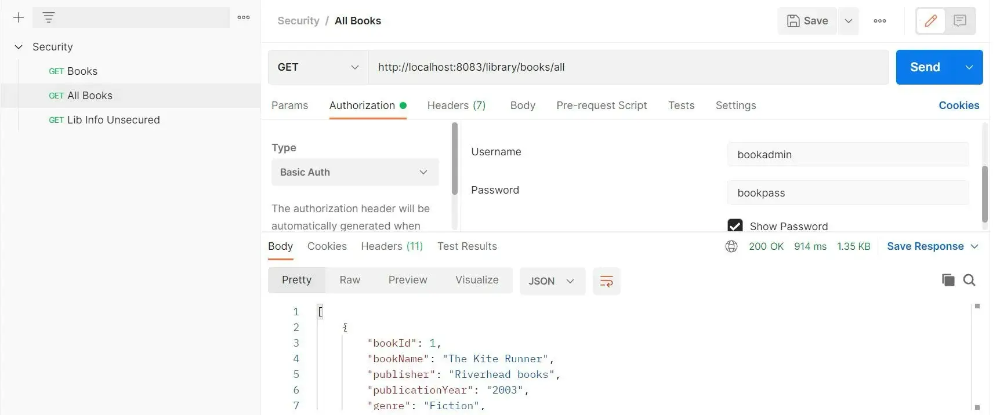
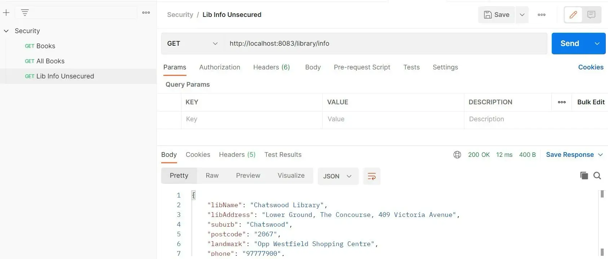

[Spring Security](https://docs.spring.io/spring-security/reference/index.html) 是一个有助于保护企业应用程序安全的框架。通过与 Spring MVC、Spring Webflux 或 Spring Boot 集成，我们可以创建一个强大且高度可定制的身份验证和访问控制框架。在本文中，我们将解释核心概念并仔细研究 Spring Security 提供的默认配置及其工作原理。我们将进一步尝试自定义它们并分析它们对示例 Spring Boot 应用程序的影响。

## 示例代码

本文附有 [GitHub](https://github.com/thombergs/code-examples/tree/master/spring-security/getting-started) 上的工作代码示例。

## 创建示例应用程序

让我们从头开始构建一个 Spring Boot 应用程序，看看 spring 如何配置和提供安全性。让我们从 spring starter 创建一个应用程序并添加所需的最少依赖项。


生成项目后，我们将其导入到 IDE 中并将其配置为在端口 8083 上运行。

```bash
mvnw clean verify spring-boot:run (for Windows)
./mvnw clean verify spring-boot:run (for Linux)
```

在应用程序启动时，我们应该看到一个登录页面。


控制台日志打印作为默认安全配置的一部分随机生成的默认密码：


使用默认用户名 `user` 和默认密码（来自日志），我们应该能够登录该应用程序。我们可以在 `application.yml` 中覆盖这些默认值：

```yaml
spring:
  security:
    user:
      name: admin
      password: passw@rd
```

现在，我们应该能够使用用户 `admin` 和密码 `passw@rd` 登录。

#### 依赖版本

在这里，我们使用了 Spring Boot 2.7.5 版本。基于此版本，Spring Boot 内部将 Spring Security 版本解析为 5.7.4。但是，如果需要，我们可以在 `pom.xml` 中覆盖这些版本，如下所示：

```xml
<properties>
    <spring-security.version>5.2.5.RELEASE</spring-security.version>
</properties>
```

## 了解安全组件

要了解默认配置的工作原理，我们首先需要了解以下内容：

- **Servlet Filters 过滤器**
- **Authentication 认证**
- **Authorization 授权**

### Servlet Filters

让我们仔细看看应用程序启动时的控制台日志。我们看到 `DefaultSecurityFilterChain` 在请求到达 `DispatcherServlet` 之前触发一系列过滤器。 `DispatcherServlet` 是 Web 框架中的关键组件，用于处理传入的 Web 请求并将它们分派到适当的处理程序进行处理。

```bash
o.s.s.web.DefaultSecurityFilterChain     : Will secure any request with
[org.springframework.security.web.session.DisableEncodeUrlFilter@2fd954f,
org.springframework.security.web.context.request.async.
  WebAsyncManagerIntegrationFilter@5731d3a,
org.springframework.security.web.context.SecurityContextPersistenceFilter@5626d18c,
org.springframework.security.web.header.HeaderWriterFilter@52b3bf03,
org.springframework.security.web.csrf.CsrfFilter@30c4e352,
org.springframework.security.web.authentication.logout.LogoutFilter@37ad042b,
org.springframework.security.web.authentication.
UsernamePasswordAuthenticationFilter@1e60b459,
org.springframework.security.web.authentication.ui.
  DefaultLoginPageGeneratingFilter@29b40b3,
org.springframework.security.web.authentication.ui.
  DefaultLogoutPageGeneratingFilter@6a0f2853,
org.springframework.security.web.authentication.www.
  BasicAuthenticationFilter@254449bb,
org.springframework.security.web.savedrequest.RequestCacheAwareFilter@3dc95b8b,
org.springframework.security.web.servletapi.
  SecurityContextHolderAwareRequestFilter@2d55e826,
org.springframework.security.web.authentication.
  AnonymousAuthenticationFilter@1eff3cfb,
org.springframework.security.web.session.SessionManagementFilter@462abec3,
org.springframework.security.web.access.ExceptionTranslationFilter@6f8aba08,
org.springframework.security.web.access.intercept.
  FilterSecurityInterceptor@7ce85af2]
```

要了解 `FilterChain` 的工作原理，让我们看一下 [Spring Security 文档](https://docs.spring.io/spring-security/reference/servlet/architecture.html#servlet-securityfilterchain)中的流程图


现在，让我们看看参与过滤器链的核心组件：

1. [DelegatingFilterProxy](https://docs.spring.io/spring-security/reference/servlet/architecture.html#servlet-delegatingfilterproxy) Spring 提供的一个 servlet 过滤器，充当 Servlet 容器和 Spring Application Context 之间的桥梁。 `DelegatingFilterProxy` 类负责将任何实现 `javax.servlet.Filter` 的类连接到过滤器链中。
2. [FilterChainProxy](https://docs.spring.io/spring-security/site/docs/current/api/org/springframework/security/web/FilterChainProxy.html) Spring 安全性在内部创建一个名为 `springSecurityFilterChain` 的 `FilterChainProxy` bean，包装在 `DelegatingFilterProxy` 中。 `FilterChainProxy` 是一个过滤器，它根据安全配置链接多个过滤器。因此， `DelegatingFilterProxy` 将请求委托给 `FilterChainProxy` ，后者确定要调用的过滤器。
3. [SecurityFilterChain](https://docs.spring.io/spring-security/site/docs/current/api/org/springframework/security/web/SecurityFilterChain.html): `SecurityFilterChain` 中的安全过滤器是用 `FilterChainProxy` 注册的 bean。一个应用程序可以有多个 `SecurityFilterChain` 。 `FilterChainProxy` 使用 `HttpServletRequest` 上的 `RequestMatcher` 接口来确定需要调用哪个 `SecurityFilterChain` 。

#### Spring Security Chain 补充说明

- Spring Boot 应用程序中的默认后备过滤器链有一个请求匹配器 `/**` ，这意味着它将应用于所有请求。
- 默认过滤器链具有预定义的 `@Order` SecurityProperties.BASIC_AUTH_ORDER。
- 我们可以通过设置 security.basic.enabled=false 来排除这个完整的过滤器链。
- 我们可以定义多个过滤器链的顺序。例如，要在默认过滤器链之前调用自定义过滤器链，我们需要设置较低的 `@Order` 。示例 `@Order(SecurityProperties.BASIC_AUTH_ORDER - 10)` 。
- 我们可以使用 `FilterRegistrationBean` 或扩展 `OncePerRequestFilter` 在现有过滤器链中插入自定义过滤器（随时调用或针对特定 URL 模式调用）。
- 对于定义的自定义过滤器，如果未指定@Order，则它是安全链中的最后一个。 （具有默认顺序 `LOWEST_PRECEDENCE` 。）
- 我们还可以使用方法 `addFilterAfter()` 、 `addFilterAt()` 和 `addFilterBefore()` 来更好地控制我们定义的自定义过滤器的顺序。

我们将在后面的部分中定义自定义过滤器和过滤器链。

现在我们知道 Spring Security 为我们提供了一个默认的过滤器链，它调用一组预定义且有序的过滤器，让我们尝试简要了解链中几个重要过滤器的角色。

1. **[org.springframework.security.web.csrf.CsrfFilter](https://docs.spring.io/spring-security/site/docs/4.0.x/apidocs/org/springframework/security/web/csrf/CsrfFilter.html)** : 此过滤器默认将 CSRF 保护应用于所有 REST 端点。要详细了解 Spring Boot 和 Spring Security 中的 CSRF 功能，请参考这篇文章。
2. **[org.springframework.security.web.authentication.logout.LogoutFilter](https://docs.spring.io/spring-security/site/docs/4.0.x/apidocs/org/springframework/security/web/authentication/logout/LogoutFilter.html)** : 当用户注销应用程序时调用此过滤器。调用默认注册的 `LogoutHandler` 实例，负责使会话无效并清除 `SecurityContext` 。接下来， `LogoutSuccessHandler` 的默认实现将用户重定向到新页面 ( `/login?logout` )。
3. **[org.springframework.security.web.authentication.UsernamePasswordAuthenticationFilter](https://docs.spring.io/spring-security/site/docs/current/api/org/springframework/security/web/authentication/UsernamePasswordAuthenticationFilter.html)** : 使用启动时提供的默认凭据验证 URL ( `/login` ) 的用户名和密码。
4. **[org.springframework.security.web.authentication.ui.DefaultLoginPageGeneratingFilter](https://docs.spring.io/spring-security/site/docs/current/api/org/springframework/security/web/authentication/ui/DefaultLoginPageGeneratingFilter.html)** : 在 `/login` 处生成默认登录页面 html
5. **[org.springframework.security.web.authentication.ui.DefaultLogoutPageGeneratingFilter](https://docs.spring.io/spring-security/site/docs/current/api/org/springframework/security/web/authentication/ui/DefaultLogoutPageGeneratingFilter.html)** : 在 `/login?logout` 处生成默认注销页面 html
6. **[org.springframework.security.web.authentication.www.BasicAuthenticationFilter](https://docs.spring.io/spring-security/site/docs/current/api/org/springframework/security/web/authentication/www/BasicAuthenticationFilter.html)** : 此过滤器负责处理任何具有授权、基本身份验证方案、Base64 编码的用户名密码的 HTTP 请求标头的请求。身份验证成功后， `Authentication` 对象将被放置在 `SecurityContextHolder` 中。
7. **[org.springframework.security.web.authentication.AnonymousAuthenticationFilter](https://docs.spring.io/spring-security/site/docs/4.0.x/apidocs/org/springframework/security/web/authentication/AnonymousAuthenticationFilter.html)** : 如果在 `SecurityContext` 中找不到 `Authentication` 对象，它会创建一个具有主体 `anonymousUser` 和角色。
8. **[org.springframework.security.web.access.ExceptionTranslationFilter](https://docs.spring.io/spring-security/site/docs/current/api/org/springframework/security/web/access/ExceptionTranslationFilter.html)** :处理过滤器链中抛出的 `AccessDeniedException` 和 `AuthenticationException` 。对于 `AuthenticationException` ，需要 `AuthenticationEntryPoint` 实例来处理响应。对于 `AccessDeniedException` ，此过滤器将委托给 `AccessDeniedHandler` ，其默认实现为 `AccessDeniedHandlerImpl` 。
9. **[org.springframework.security.web.access.intercept.FilterSecurityInterceptor](https://docs.spring.io/spring-security/site/docs/6.0.0/api/org/springframework/security/web/access/intercept/FilterSecurityInterceptor.html)** : 此过滤器负责在请求到达控制器之前对通过过滤器链的每个请求进行授权。

### Authentication

身份验证是验证用户凭据并确保其有效性的过程。让我们了解一下 spring 框架如何验证创建的默认凭据：

步骤 1：当启用 FormLogin 时，即向 URL `/login` 发出请求时， `UsernamePasswordAuthenticationFilter` 被调用作为安全过滤器链的一部分。该类是基类 `AbstractAuthenticationProcessingFilter` 的具体实现。当尝试进行身份验证时，过滤器会将请求转发到 `AuthenticationManager` 。

步骤 2： `UsernamePasswordAuthenticationToken` 是 `Authentication` 接口的实现。此类指定身份验证机制必须通过用户名-密码进行。

步骤 3：获得身份验证详细信息后， `AuthenticationManager` 尝试在 `AuthenticationProvider` 的适当实现和经过完全身份验证的 `Authentication` 对象的帮助下对请求进行身份验证被返回。默认实现是 `DaoAuthenticationProvider` ，它从 `UserDetailsService` 检索用户详细信息。如果身份验证失败，则抛出 `AuthenticationException` 。

步骤 4： `UserDetailsService` 的 `loadUserByUsername(username)` 方法返回包含用户数据的 `UserDetails` 对象。如果没有找到具有给定用户名的用户，则抛出 `UsernameNotFoundException` 。

步骤 5：身份验证成功后， `SecurityContext` 将更新为当前经过身份验证的用户。

为了理解上面概述的步骤，让我们看一下 Spring Security 文档中定义的身份验证架构。


`ProviderManager` 是 `AuthenticationManager` 最常见的实现。如图所示， `ProviderManager` 将请求委托给已配置的 `AuthenticationProvider` 列表，每个列表都会被查询以查看是否可以执行身份验证。如果认证失败，返回 `ProviderNotFoundException` ，这是 `AuthenticationException` 的特殊类型，说明 `ProviderManager` 不支持 `Authentication`

`AuthenticationEntryPoint` 是一个充当身份验证入口点的接口，用于确定客户端在请求资源时是否包含有效的凭据。如果没有，则使用该接口的适当实现来向客户端请求凭证。

现在，让我们了解 `Authentication` 对象如何绑定整个身份验证过程。 `Authentication` 接口有以下用途：

1. 向 `AuthenticationManager` 提供用户凭据。
2. 代表 `SecurityContext` 中当前经过身份验证的用户。 `Authentication` 的每个实例都必须包含

- **`principal`** - 这是标识用户的 `UserDetails` 实例。
- **`credentials`** - 凭证
- **`authorities`** - `GrantedAuthority` `GrantedAuthority` 的实例在授权过程中发挥着重要作用。

#### 关于 Spring 身份验证的附加说明

- 在某些情况下，我们可能需要在单独授权的情况下使用 Spring Security，因为在访问我们的应用程序之前它已经由外部系统进行了可靠的身份验证。请参阅预认证文档了解如何配置和处理此类场景。
- Spring 允许通过多种方式来[定制身份验证机制](https://docs.spring.io/spring-security/reference/servlet/authentication/passwords/storage.html)，我们将在后面的部分中介绍其中的几种。

### Authorization 授权

授权是确保访问资源的用户或系统具有有效权限的过程。

在 Spring security 过滤器链中， `FilterSecurityInterceptor` 触发授权检查。从过滤器的执行顺序可以看出，认证先于授权运行。该过滤器在用户成功通过身份验证后检查有效权限。如果授权失败，则会抛出 `AccessDeniedException` 。

#### 授予权限

如上一节所示，每个用户实例都包含一个 `GrantedAuthority` 对象列表。 GrantedAuthority 是一个具有单一方法的接口：

```java
public interface GrantedAuthority extends Serializable {
    String getAuthority();
}
```

Spring security 默认情况下调用具体的 `GrantedAuthority` 实现 `SimpleGrantedAuthority` 。 `SimpleGrantedAuthority` 允许我们将角色指定为字符串，自动将它们映射到 `GrantedAuthority` 实例中。 `AuthenticationManager` 负责将 `GrantedAuthority` 对象列表插入到 `Authentication` 对象中。然后 `AccessDecisionManager` 使用 `getAuthority()` 来决定授权是否成功。

#### 授予的权限与角色

Spring Security 分别使用 `hasAuthority()` 和 `hasRole()` 方法通过授予的权限和角色提供授权支持。这些方法用于基于表达式的安全性，并且是接口 `SecurityExpressionOperations` 的一部分。对于大多数情况，这两种方法可以互换使用，最显着的区别是 `hasRole()` 不需要指定 ROLE 前缀，而 `hasAuthority()` 需要显式指定完整的字符串。例如， `hasAuthority("ROLE_ADMIN")` 和 `hasRole("ADMIN")` 执行相同的任务。

#### Spring 授权的补充说明

- Spring 允许我们使用 `@PreAuthorize` 和 `@PostAuthorize` 注释来配置方法级安全性。正如名称所示，它们允许我们在方法执行之前和之后对用户进行授权。授权检查的条件可以在 Spring 表达式语言 (SpEL) 中指定。我们将在后面的部分中查看一些示例。
- 我们可以通过公开 `GrantedAuthorityDefaults` bean 将授权规则配置为使用不同的前缀（ `ROLE_` 除外）。

## 常见漏洞保护

默认的 spring security 配置带有默认启用的针对各种攻击的保护功能。我们不会在本文中介绍这些细节。您可以参考 Spring 文档以获取详细指南。但是，要了解 CORS 和 CSRF 上的深入 Spring Security 配置，请参阅以下文章：

- [CORS in Spring Security](https://reflectoring.io/spring-cors/)
- [CSRF in Spring Security](https://reflectoring.io/spring-csrf/)

## 实现安全配置

现在我们已经熟悉了 Spring Security 工作原理的细节，接下来让我们了解应用程序中的配置设置，以处理我们在前面几节中简要提到的各种场景。

### 默认配置

`org.springframework.boot.autoconfigure.security.servlet` 包中的 `SpringBootWebSecurityConfiguration` 类为 Spring Boot 应用程序提供了一组默认的 Spring 安全配置。该类的反编译版本如下所示：

```java
class SpringBootWebSecurityConfiguration {
    @ConditionalOnDefaultWebSecurity
    static class SecurityFilterChainConfiguration {
        SecurityFilterChainConfiguration() {
        }

        @Bean
        @Order(2147483642)
        SecurityFilterChain defaultSecurityFilterChain(HttpSecurity http)
                throws Exception {
            ((AuthorizedUrl) http.authorizeRequests().anyRequest()).authenticated();
            http.formLogin();
            http.httpBasic();
            return (SecurityFilterChain) http.build();
        }
    }
}
```

Spring 使用上述配置来创建默认的 `SecurityFilterChainBean` ：

1. `authorizeRequests()` 基于 `RequestMatcher` 实现限制访问。这里 `authorizeRequests().anyRequest()` 将允许所有请求。为了更好地控制限制访问，我们可以通过 `antMatchers()` 指定 URL 模式。
2. `authenticated()` 要求所有调用的端点在进入过滤器链之前都经过身份验证。
3. `formLogin()` 调用默认的 `FormLoginConfigurer` 类，该类加载登录页面以通过用户名密码进行身份验证，并相应地重定向到相应的失败或成功处理程序。有关表单登录工作原理的图示，请参阅 Spring 文档中的详细说明。
4. `httpBasic()` 调用设置默认值的 `HttpBasicConfigurer` 以帮助进行基本身份验证。详细理解可以参考 Spring 文档。

#### Spring Security 与 `SecurityFilterChain`

- 从 Spring Security 5.7.0-M2 开始， `WebSecurityConfigurerAdapter` 已被弃用并替换为 `SecurityFilterChain` ，从而进入基于组件的安全配置。
- 要了解差异，请参阅这篇 [Spring 博客文章](https://spring.io/blog/2022/02/21/spring-security-without-the-websecurityconfigureradapter)。
- 本文中的所有示例都将使用使用 `SecurityFilterChain` 的较新配置。

### 常见用例

现在我们了解了 Spring Security 默认值的工作原理，让我们看一些场景并相应地自定义配置。

#### 1. 自定义默认配置

```java
@Configuration
@EnableWebSecurity
public class SecurityConfiguration {

    public static final String[] ENDPOINTS_WHITELIST = {
            "/css/**",
            "/",
            "/login",
            "/home"
    };
    public static final String LOGIN_URL = "/login";
    public static final String LOGOUT_URL = "/logout";
    public static final String LOGIN_FAIL_URL = LOGIN_URL + "?error";
    public static final String DEFAULT_SUCCESS_URL = "/home";
    public static final String USERNAME = "username";
    public static final String PASSWORD = "password";

    @Bean
    public SecurityFilterChain filterChain(HttpSecurity http) throws Exception {
        http.authorizeRequests(request ->
                request.antMatchers(ENDPOINTS_WHITELIST).permitAll()
                        .anyRequest().authenticated())
                .csrf().disable()
                .formLogin(form -> form
                        .loginPage(LOGIN_URL)
                        .loginProcessingUrl(LOGIN_URL)
                        .failureUrl(LOGIN_FAIL_URL)
                        .usernameParameter(USERNAME)
                        .passwordParameter(PASSWORD)
                        .defaultSuccessUrl(DEFAULT_SUCCESS_URL));
        return http.build();
    }
}
```

我们可以自定义登录的各个方面，而不是使用 spring security 登录默认设置：

- `loginPage` - 自定义默认登录页面。在这里，我们创建了一个自定义 `login.html` 及其相应的 `LoginController` 类。
- `loginProcessingUrl` - 验证用户名和密码的 URL。
- `failureUrl` - 登录失败时定向到的 URL。
- `defaultSuccessUrl` - 成功登录后定向到的 URL。在这里，我们创建了一个自定义 `homePage.html` 及其相应的 `HomeController` 类。
- `antMatchers()` - 过滤掉将成为登录过程一部分的 URL。

同样，我们也可以自定义注销过程。

```java
    @Bean
    public SecurityFilterChain filterChain(HttpSecurity http) throws Exception {
        http.authorizeRequests(request ->
                request.antMatchers(ENDPOINTS_WHITELIST).permitAll()
                        .anyRequest().authenticated())
                .csrf().disable()
                .formLogin(form -> form
                        .loginPage(LOGIN_URL)
                        .loginProcessingUrl(LOGIN_URL)
                        .failureUrl(LOGIN_FAIL_URL)
                        .usernameParameter(USERNAME)
                        .passwordParameter(PASSWORD)
                        .defaultSuccessUrl(DEFAULT_SUCCESS_URL))
                .logout(logout -> logout
                        .logoutUrl("/logout")
                        .invalidateHttpSession(true)
                        .deleteCookies("JSESSIONID")
                        .logoutSuccessUrl(LOGIN_URL + "?logout"));
        return http.build();
    }
```

在这里，当用户注销时，http 会话将失效，但会话 cookie 不会被清除。使用 `deleteCookies("JSESSIONID")` 有助于避免基于会话的冲突。

此外，我们可以通过 Spring Security 管理和配置会话。

```java
    @Bean
    public SecurityFilterChain filterChain(HttpSecurity http) throws Exception {
        http.authorizeRequests(request ->
                request.antMatchers(ENDPOINTS_WHITELIST).permitAll()
                        .anyRequest().authenticated())
                .csrf().disable()
                .formLogin(form -> form
                        .loginPage(LOGIN_URL)
                        .loginProcessingUrl(LOGIN_URL)
                        .failureUrl(LOGIN_FAIL_URL)
                        .usernameParameter(USERNAME)
                        .passwordParameter(PASSWORD)
                        .defaultSuccessUrl(DEFAULT_SUCCESS_URL))
                .logout(logout -> logout
                        .logoutUrl("/logout")
                        .invalidateHttpSession(true)
                        .deleteCookies("JSESSIONID")
                        .logoutSuccessUrl(LOGIN_URL + "?logout"))
                .sessionManagement(session -> session
                        .sessionCreationPolicy(SessionCreationPolicy.ALWAYS)
                        .invalidSessionUrl("/invalidSession.htm")
                        .maximumSessions(1)
                        .maxSessionsPreventsLogin(true));


        return http.build();
    }
```

它为我们提供了以下会话属性 `sessionCreationPolicy` 值：

1. `SessionCreationPolicy.STATELESS` - 不会创建或使用任何会话。
2. `SessionCreationPolicy.ALWAYS` - 如果会话不存在，则始终会创建该会话。
3. `SessionCreationPolicy.NEVER` - 永远不会创建会话。但如果会话存在，就会使用它。
4. `SessionCreationPolicy.IF_REQUIRED` - 如果需要，将创建会话。 （默认配置）

Other options include: 其他选项包括：

- `invalidSessionUrl` - 检测到无效会话时重定向到的 URL。
- `maximumSessions` - 限制单个用户可以同时拥有的活动会话数。
- `maxSessionsPreventsLogin` - 默认值为 `false` ，表示在现有用户的会话过期时允许经过身份验证的用户访问。 `true` 表示到达 `SessionManagementConfigurer.maximumSessions(int)` 时不会对用户进行身份验证。在这种情况下，当检测到多次登录时，它将重定向到 `/invalidSession` 。

#### 2. 配置多个过滤器链

Spring Security 允许我们拥有多个共存的安全配置，使我们能够更好地控制应用程序。为了演示这一点，让我们为图书馆应用程序创建 REST 端点，该应用程序使用 H2 数据库根据体裁存储书籍。我们的 `BookController` 类将有一个端点定义如下：

```java
@GetMapping("/library/books")
    public ResponseEntity<List<BookDto>> getBooks(@RequestParam String genre) {
        return ResponseEntity.ok().body(bookService.getBook(genre));
    }
```

为了保护此端点，让我们在 `SecurityConfiguration` 类中使用基本身份验证并配置详细信息：

```java
@Configuration
@EnableWebSecurity
@EnableConfigurationProperties(BasicAuthProperties.class)
public class SecurityConfiguration {

    private final BasicAuthProperties props;

    public SecurityConfiguration(BasicAuthProperties props) {
        this.props = props;
    }

    @Bean
    @Order(1)
    public SecurityFilterChain bookFilterChain(HttpSecurity http) throws Exception {
        http
                .csrf().disable()
                .sessionManagement(session -> session
                        .sessionCreationPolicy(SessionCreationPolicy.STATELESS))
                .antMatcher("/library/**")
                .authorizeRequests()
                .antMatchers(HttpMethod.GET, "/library/**").hasRole("USER")
                .anyRequest().authenticated()
                .and()
                .httpBasic()
                .and()
                .exceptionHandling(exception -> exception
                        .authenticationEntryPoint(userAuthenticationErrorHandler())
                        .accessDeniedHandler(new UserForbiddenErrorHandler()));

        return http.build();
    }

    @Bean
    public UserDetailsService userDetailsService() {
        return new InMemoryUserDetailsManager(props.getUserDetails());
    }

    @Bean
    public AuthenticationEntryPoint userAuthenticationErrorHandler() {
        UserAuthenticationErrorHandler userAuthenticationErrorHandler =
                new UserAuthenticationErrorHandler();
        userAuthenticationErrorHandler.setRealmName("Basic Authentication");
        return userAuthenticationErrorHandler;
    }

    public static final String[] ENDPOINTS_WHITELIST = {
            "/css/**",
            "/login",
            "/home"
    };
    public static final String LOGIN_URL = "/login";
    public static final String LOGIN_FAIL_URL = LOGIN_URL + "?error";
    public static final String DEFAULT_SUCCESS_URL = "/home";
    public static final String USERNAME = "username";
    public static final String PASSWORD = "password";

    @Bean
    @Order(2)
    public SecurityFilterChain filterChain(HttpSecurity http) throws Exception {
        http.authorizeRequests(request ->
                request.antMatchers(ENDPOINTS_WHITELIST).permitAll()
                        .anyRequest().authenticated())
                .csrf().disable()
                .antMatcher("/login")
                .formLogin(form -> form
                        .loginPage(LOGIN_URL)
                        .loginProcessingUrl(LOGIN_URL)
                        .failureUrl(LOGIN_FAIL_URL)
                        .usernameParameter(USERNAME)
                        .passwordParameter(PASSWORD)
                        .defaultSuccessUrl(DEFAULT_SUCCESS_URL))
                .logout(logout -> logout
                        .logoutUrl("/logout")
                        .invalidateHttpSession(true)
                        .deleteCookies("JSESSIONID")
                        .logoutSuccessUrl(LOGIN_URL + "?logout"))
                .sessionManagement(session -> session
                        .sessionCreationPolicy(SessionCreationPolicy.ALWAYS)
                        .invalidSessionUrl("/invalidSession")
                        .maximumSessions(1)
                        .maxSessionsPreventsLogin(true));

        return http.build();
    }
}
```

让我们仔细看看代码：

1.  我们有两个 SecurityFilterChain 方法 `bookFilterChain()` 和 `filterChain()` 方法以及 `@Order(1)` 和 `@Order(2)` 。它们都将按上述顺序执行。
2.  由于两个过滤器链都满足不同的端点，因此 `application.yml` 中存在不同的凭据

```yaml
auth:
  users:
    loginadmin:
      role: admin
      password: loginpass
    bookadmin:
      role: user
      password: bookpass
```

为了让 Spring Security 使用这些凭据，我们将 `UserDetailsService` 自定义为：

```java
@Bean
    public UserDetailsService userDetailsService() {
        return new InMemoryUserDetailsManager(props.getUserDetails());
    }
```

1. 为了满足 `AuthenticationException` 和 `AccessDeniedException` ，我们定制了 `exceptionHandling()` 并配置了自定义类 `UserAuthenticationErrorHandler` 和 `UserForbiddenErrorHandler` 。

使用此配置，REST 端点的邮递员响应如下所示：

成功的回应:


未经授权的回应：


禁止的回应：


#### 3. 默认情况下保护的其他端点

一旦为请求匹配器配置了 Spring Security，默认情况下添加的其他端点就会受到保护。例如，让我们向 `BookController` 类添加一个端点

```java
		@GetMapping("/library/books/all")
    public ResponseEntity<List<BookDto>> getAllBooks() {
        return ResponseEntity.ok().body(bookService.getAllBooks());
    }
```

为了成功调用此端点，我们需要提供基本的身份验证凭据。

没有通过凭据时的错误响应：


成功的回应：



#### 4. 不安全的特定端点

我们可以指定需要从安全配置中排除的端点列表。为此，我们首先向 `BookController` 类添加另一个端点，并添加以下配置：

```java
		@GetMapping("/library/info")
    public ResponseEntity<LibraryInfo> getInfo() {
        return ResponseEntity.ok().body(bookService.getLibraryInfo());
    }

		@Bean
    public WebSecurityCustomizer webSecurityCustomizer() {
        return (web) -> web.ignoring().antMatchers("/library/info");
    }
```

现在，我们应该能够在不传递凭据的情况下从邮递员到达端点：



#### 5. 添加自定义过滤器

Spring 通过执行链中的一系列过滤器来提供安全性。如果我们需要在请求到达控制器之前对其添加额外的检查，Spring Security 为我们提供了以下方法，帮助我们在链中所需的位置添加自定义过滤器。

- addFilterBefore(Filter filter, Class beforeFilter)：此方法允许我们在链中指定过滤器之前添加自定义过滤器。
- addFilterAfter(Filter filter, Class afterFilter)：此方法允许我们在链中指定过滤器之后添加自定义过滤器。
- addFilterAt(Filter filter, Class atFilter)：此方法允许我们以相同的优先级在链中的指定过滤器处添加自定义过滤器。添加自定义过滤器后，这两个过滤器都将在过滤器链中被调用（无特定顺序）。

让我们看一下示例配置：

```java
@Configuration
@EnableWebSecurity
@EnableConfigurationProperties(BasicAuthProperties.class)
public class SecurityConfiguration {

    private final BasicAuthProperties props;

    public SecurityConfiguration(BasicAuthProperties props) {
        this.props = props;
    }

    @Bean
    @Order(1)
    public SecurityFilterChain bookFilterChain(HttpSecurity http) throws Exception {
        http
                .csrf().disable()
                .sessionManagement(session -> session
                        .sessionCreationPolicy(SessionCreationPolicy.STATELESS))
                .antMatcher("/library/**")
                .authorizeRequests()
                .antMatchers(HttpMethod.GET, "/library/**").hasRole("USER")
                .anyRequest().authenticated()
                .and()
                .httpBasic()
                .and()
                .exceptionHandling(exception -> exception
                        .authenticationEntryPoint(userAuthenticationErrorHandler())
                        .accessDeniedHandler(new UserForbiddenErrorHandler()));

        http.addFilterBefore(customHeaderValidatorFilter(),
                BasicAuthenticationFilter.class);

        return http.build();
    }

    @Bean
    public CustomHeaderValidatorFilter customHeaderValidatorFilter() {
        return new CustomHeaderValidatorFilter();
    }
}
```

为了编写自定义过滤器，我们创建一个类 `CustomHeaderValidatorFilter` ，它扩展了为此目的而创建的特殊过滤器 `OncePerRequestFilter` 。这确保我们的过滤器对于每个请求仅被调用一次。

```java
public class CustomHeaderValidatorFilter extends OncePerRequestFilter {

    private static final Logger log = LoggerFactory.getLogger
            (CustomHeaderValidatorFilter.class);
    @Override
    protected void doFilterInternal(HttpServletRequest request,
                                    HttpServletResponse response,
                                    FilterChain filterChain)
            throws ServletException, IOException {
        log.info("Custom filter called...");
        if (StringUtils.isEmpty(request.getHeader("X-Application-Name"))) {
            response.setStatus(HttpServletResponse.SC_FORBIDDEN);
            response.setContentType("application/json");
            response.getOutputStream().println(new ObjectMapper().
                    writeValueAsString(CommonException.headerError()));
        } else {
            filterChain.doFilter(request, response);
        }
    }
}
```

在这里，我们重写了 `doFilterInternal()` 并添加了我们的逻辑。在这种情况下，仅当请求中传递了所需的标头 `X-Application-Name` 时，请求才会在过滤器链中继续进行。此外，我们还可以验证该过滤器是否已从日志连接到我们的 `SecurityConfiguration` 类。

```text
Will secure Ant [pattern='/library/**'] with
[org.springframework.security.web.session.DisableEncodeUrlFilter@669469c9,
 org.springframework.security.web.context.request.async.
   WebAsyncManagerIntegrationFilter@7f39ad3f,
 org.springframework.security.web.context.SecurityContextPersistenceFilter@1b901f7b,
 org.springframework.security.web.header.HeaderWriterFilter@64f49b3,
 org.springframework.security.web.authentication.logout.LogoutFilter@628aea61,
 com.reflectoring.security.CustomHeaderValidatorFilter@3d40a3b4,
 org.springframework.security.web.authentication.www.
   BasicAuthenticationFilter@8d23cd8,
 org.springframework.security.web.savedrequest.RequestCacheAwareFilter@1a1e38ab,
 org.springframework.security.web.servletapi.
   SecurityContextHolderAwareRequestFilter@5bfdabf3,
 org.springframework.security.web.authentication.
   AnonymousAuthenticationFilter@7524125c,
 org.springframework.security.web.session.SessionManagementFilter@3dc14f80,
 org.springframework.security.web.access.ExceptionTranslationFilter@58c16efd,
 org.springframework.security.web.access.intercept.FilterSecurityInterceptor@5ab06829]
```

这里为所有端点 `/library/**` 调用过滤器。为了进一步限制它以满足特定的端点，我们可以将 Filter 类修改为：

```java
		@Override
    protected boolean shouldNotFilter(HttpServletRequest request)
            throws ServletException {
        String path = request.getRequestURI();
        return path.startsWith("/library/books/all");
    }
```

通过此更改，对于端点 `/library/books/all` ，将不会执行 `doFilterInternal()` 方法。相同的概念适用于使用 `addFilterAt()` 和 `addFilterAfter()` 方法添加的过滤器。

#### 6. 基于角色的授权

在 Spring Security 的上下文中，授权是在用户通过身份验证后发生的。在前面的部分中，我们查看了处理 `AccessDeniedException` 的示例。当用户授权失败时抛出该异常。在我们的示例中，我们在 `application.yml` 中为用户 `bookadmin` 和 `loginadmin` 定义了角色：

```yaml
auth:
  users:
    loginadmin:
      role: admin
      password: loginpass
    bookadmin:
      role: user
      password: bookpass
```

为了确保授权，我们将 Spring Security 配置为：

```java
public class SecurityConfiguration {
    @Bean
    @Order(1)
    public SecurityFilterChain filterChain(HttpSecurity http) throws Exception {
        http.authorizeRequests(request ->
             request.antMatchers(ENDPOINTS_WHITELIST).hasRole("ADMIN")
                .anyRequest().authenticated());
        /* Code continued.. */
        return http.build();
    }
}
```

以及

```java
public class SecurityConfiguration {
    @Bean
    @Order(2)
    public SecurityFilterChain bookFilterChain(HttpSecurity http) throws Exception {
        http
                .csrf().disable()
                .sessionManagement(session -> session
                        .sessionCreationPolicy(SessionCreationPolicy.STATELESS))
                .antMatcher("/library/**")
                .authorizeRequests()
                .antMatchers(HttpMethod.GET, "/library/**").hasRole("USER")
                .anyRequest().authenticated();
        /* Code continued.. */
        return http.build();
    }
}
```

让我们看一下可用于授权端点的方法。

- **`hasRole(String role)`** : 如果当前主体具有指定角色，则返回 `true` 。例如。 `hasRole("ADMIN")`
- **`hasAnyRole(String... roles)`** :可以指定多个角色。如果任何角色匹配，则返回 `true` 。例如。 `hasAnyRole("ADMIN", "USER")` 注意：在上述两种情况下， `ROLE_` 前缀默认添加到提供的角色字符串中。
- **`hasAuthority(String authority)`** :如果当前主体具有指定的权限，则返回 `true` 。例如。 `hasAuthority(ROLE_ADMIN)`
- **`hasAnyAuthority(String... authorities)`** : 可以指定多个权限。如果任何权限匹配，则返回 `true` 。例如。 `hasAnyAuthority("ROLE_ADMIN", "ROLE_USER")`

#### Spring Security 访问控制的附加说明

- 上面讨论的所有方法都使用 spEL 来支持更复杂的访问控制。这允许我们使用特定的类来实现 Web 和方法安全性来访问当前主体等值。要了解如何利用 spEL，请参阅此 Spring 文档
- 另外，如果我们不需要设置授权，我们可以使用方法 `permitAll()` 和 `denyAll()` 分别允许或拒绝所有角色和权限。

让我们看一下一个示例配置，该配置在同一方法中为不同端点使用不同的角色。

```java
public class SecurityConfiguration {
    @Bean
    public SecurityFilterChain bookFilterChain(HttpSecurity http) throws Exception {
        http
                .authorizeRequests()
                .antMatchers(HttpMethod.GET, "/library/info").permitAll()
                .antMatchers(HttpMethod.GET, "/library/books").hasRole("USER")
                .antMatchers(HttpMethod.GET, "/library/books/all").hasRole("ADMIN");

        return http.build();
    }
}
```

#### 7.@PreAuthorize 和@PostAuthorize

Spring Security 允许我们通过 `@PreAuthorize` 和 `@PostAuthorize` 注解将安全机制扩展到方法。这些注释使用 spEL 根据传递的参数进行评估和授权。

- **`@PreAuthorize`**: 在执行方法之前授权条件。
- **`@PostAuthorize`**: 授权方法执行后的条件。为了使这些注释起作用，我们需要将 `@EnableGlobalMethodSecurity(prePostEnabled = true)` 添加到我们的配置类中，如下所示：

```java
@Configuration
@EnableWebSecurity
@EnableGlobalMethodSecurity(prePostEnabled = true)
@EnableConfigurationProperties(BasicAuthProperties.class)
public class SecurityConfiguration {
    /* ... */
}
```

接下来我们看看如何使用这些注解。这里我们在 Controller 类中使用了 `@PreAuthorize` 。

```java
@Controller
public class BookController {

    private static final Logger log = LoggerFactory.getLogger(BookController.class);

    private final BookService bookService;

    public BookController(BookService bookService) {
        this.bookService = bookService;
    }

    @GetMapping("/library/books")
    @PreAuthorize("#user == authentication.principal.username")
    public ResponseEntity<List<BookDto>> getBooks(@RequestParam String genre,
                                                  @RequestParam String user) {
        return ResponseEntity.ok().body(bookService.getBook(genre));
    }

    @GetMapping("/library/books/all")
    @PreAuthorize("hasRole('ROLE_USER')")
    public ResponseEntity<List<BookDto>> getAllBooks() {
        return ResponseEntity.ok().body(bookService.getAllBooks());
    }
}
```

在这里，我们演示了使用 `@PreAuthorize` 注释的两种方法。

1. 登录的用户名作为请求参数传递，并使用当前主体进行验证。对于成功的匹配，邮递员会返回有效的响应。


如果出现错误，我们会得到：


1. `@PreAuthorize("hasRole('ROLE_USER')")` : 仅当当前主体具有 USER 角色时，我们才会收到成功响应。

接下来，让我们在 Repository 类中使 ​​ 用 `@PostAuthorize` 。

```java
@Repository
public interface BookRepository extends JpaRepository<Book, Long> {
    List<Book> findByGenre(String genre);

    @PostAuthorize("returnObject.size() > 0")
    List<Book> findAll();
}
```

这里， `returnObject` 表示 `List<Book>` 。因此，当 `size()` 返回 0 时，我们将得到一个错误响应。

#### 自定义授权

- 要自定义表达式的处理方式，我们需要将 `MethodSecurityExpressionHandler` 公开为 bean。
- Spring 方法安全性是使用 Spring AOP 构建的。有关更多示例，请参阅[方法安全文档](https://docs.spring.io/spring-security/reference/servlet/authorization/method-security.html)。

#### 8. 基于数据库的认证和授权

在之前的所有示例中，我们都使用 `InMemoryUserDetailsManager` 配置用户、密码、角色。 Spring Security 允许我们自定义身份验证和授权过程。我们还可以在数据库中配置这些详细信息，并让 Spring Security 相应地访问它们。

有关工作示例，请参阅[本文](https://reflectoring.io/spring-security-password-handling/)。它还解释了为了提高安全性而应采用的不同方式处理密码。

让我们概述一下使此配置正常工作所需的步骤。

**Step.1** : 通过重写 `loadUserByUsername()` 自定义 `UserDetailsService` 以从数据库加载用户凭据。

**Step.2** : 根据使用的编码机制创建 `PasswordEncoder` bean。

**Step.3** : 由于 `AuthenticationProvider` 负责验证凭据，因此自定义并覆盖 `authenticate()` 以使用数据库凭据进行验证。

#### 有关密码编码器的附加信息

- 在 Spring Security 5.0 之前，默认的 `PasswordEncoder` 是 `NoOpPasswordEncoder` ，它需要纯文本密码。
- 从 Spring Security 5.0 开始，我们使用 `DelegatingPasswordEncoder` 确保使用当前密码存储建议对密码进行编码。
- 有关 `DelegatingPasswordEncoder` 的更多信息，请参阅[此文档](https://docs.spring.io/spring-security/reference/features/authentication/password-storage.html)

## 使用 Spring Security 进行测试

现在我们已经了解了各种安全配置的工作原理，让我们看看它们的单元测试。 Spring security 为我们提供了以下依赖：

```xml
    <dependency>
			<groupId>org.springframework.security</groupId>
			<artifactId>spring-security-test</artifactId>
			<scope>test</scope>
		</dependency>
```

此外，我们还添加了 Hamcrest 依赖项。 Hamcrest 是一个框架，允许我们在断言中使用 Matcher 对象来进行更具表现力的响应匹配。请参阅 Hamcrest 文档以深入了解其功能。

```xml
    <dependency>
			<groupId>org.hamcrest</groupId>
			<artifactId>hamcrest-library</artifactId>
			<version>2.2</version>
			<scope>test</scope>
		</dependency>
```

首先，让我们设置 `ApplicationContext` 来测试 `BookController` 类。这里我们使用 `@Sql` 定义了一个示例测试数据

```java
@SpringBootTest
@AutoConfigureMockMvc
@SqlGroup({
        @Sql(value = "classpath:init/first.sql", executionPhase = BEFORE_TEST_METHOD),
        @Sql(value = "classpath:init/second.sql", executionPhase = BEFORE_TEST_METHOD)
})
public class BookControllerTest {
}
```

现在，让我们看看可用于测试基本身份验证安全端点的各种选项。

### @WithMockUser

顾名思义，我们将此注释与默认用户名 `user` 、密码 `password` 和角色 `ROLE_USER` 一起使用。由于我们正在模拟用户，因此用户不需要实际存在。只要我们的端点是安全的， `@WithMockUser` 就会成功。

```java
public class BookControllerTest {

    @Autowired
    private MockMvc mockMvc;

    @Test
    @DisplayName("TestCase1 Check if spring security applies to the endpoint")
    @WithMockUser(username = "bookadmin", roles = {"USER"})
    void successIfSecurityApplies() throws Exception {
        mockMvc.perform(get("/library/books")
                        .param("genre", "Fiction")
                        .param("user", "bookadmin")
                        .header("X-Application-Name", "Library"))
                .andDo(print())
                .andExpect(status().isOk())
                .andExpect(authenticated().withUsername("bookadmin"))
                .andExpect(authenticated().withRoles("USER"))
                .andExpect(jsonPath("$", hasSize(3)))
        ;
    }

    @Test
    @DisplayName("TestCase2 Fails when wrong roles are provided")
    @WithMockUser(username = "bookadmin", roles = {"ADMIN"})
    void failsForWrongAuthorization() throws Exception {
        mockMvc.perform(get("/library/books")
                        .param("genre", "Fiction")
                        .param("user", "bookadmin")
                        .header("X-Application-Name", "Library"))
                .andDo(print())
                .andExpect(status().isForbidden())
        ;
    }

    @Test
    @DisplayName("TestCase3 Fails when we run the test with no security")
    void failsIfSecurityApplies() throws Exception {
        mockMvc.perform(get("/library/books")
                        .param("genre", "Fiction")
                        .param("user", "bookadmin")
                        .header("X-Application-Name", "Library"))
                .andDo(print())
                .andExpect(status().isUnauthorized())
        ;
    }
}
```

- **`@WithMockUser(username = "bookadmin", roles = {"USER"})`** :这里我们使用用户名 `bookadmin` 和角色 `USER` 运行测试。此测试仅用于验证端点是否安全。此外，我们还使用方法 `authenticated()` 来验证身份验证详细信息，并使用 hamcrest 匹配器 `hasSize()` 来验证响应对象。
- **`@WithMockUser(username = "bookadmin", roles = {"ADMIN"})`** : 在这里，我们收到 Forbidden 响应，因为角色不匹配。尽管用户被嘲笑，但角色需要匹配才能获得成功响应。
- 当没有指定用户细节时，端点没有得到保护，因此我们收到了未授权的响应。

### @WithUserDetails

我们还可以使用在 `SecurityConfiguration` 类中创建的 `UserDetailsService` bean，而不是模拟用户。

```java
public class BookControllerTest {

    @Autowired
    private MockMvc mockMvc;

    @Test
    @DisplayName("TestCase4 Run the test with configured UserDetailsService")
    @WithUserDetails(value = "bookadmin",
            userDetailsServiceBeanName = "userDetailsService")
    void testBookWithConfiguredUserDetails() throws Exception {
        mockMvc.perform(get("/library/books")
                        .param("genre", "Fantasy")
                        .param("user", "bookadmin")
                        .header("X-Application-Name", "Library"))
                .andDo(print())
                .andExpect(status().isOk())
                .andExpect(jsonPath("$", hasSize(1)))
        ;
    }

    @Test
    @DisplayName("TestCase5 Fails when execution of CustomHeaderValidatorFilter " +
            "does not meet the criteria")
    @WithUserDetails(value = "bookadmin",
            userDetailsServiceBeanName = "userDetailsService")
    void failsIfMandatoryHeaderIsMissing() throws Exception {
        mockMvc.perform(get("/library/books")
                        .param("genre", "Fantasy")
                        .param("user", "bookadmin"))
                .andDo(print())
                .andExpect(status().isForbidden())
        ;
    }

    @Test
    @DisplayName("TestCase6 Fails when preauthorization " +
            "of current principal fails")
    @WithUserDetails(value = "bookadmin",
            userDetailsServiceBeanName = "userDetailsService")
    void failsIfPreAuthorizeConditionFails() throws Exception {
        mockMvc.perform(get("/library/books")
                        .param("genre", "Fantasy")
                        .param("user", "bookuser")
                        .header("X-Application-Name", "Library"))
                .andDo(print())
                .andExpect(status().isForbidden())
        ;
    }

    @Test
    @DisplayName("TestCase7 Fails when wrong basic auth credentials are applied")
    void testBookWithWrongCredentialsUserDetails() throws Exception {
        mockMvc.perform(get("/library/books")
                        .param("genre", "Fantasy")
                        .param("user", "bookadmin")
                        .header("X-Application-Name", "Library")
                        .with(httpBasic("bookadmin", "password")))
                .andDo(print())
                .andExpect(status().isUnauthorized());
    }
}
```

通过此配置，端点将使用 `userDetailsService` bean 进行身份验证。我们可以使用 `httpBasic()` 来确保拒绝错误的凭据。此外，上述测试验证了预授权和自定义过滤器检查。

## 结论

在本文中，我们研究了适用于 Spring Security 的基本概念。此外，我们还解释了 spring 提供的默认配置以及如何覆盖它们。此外，我们还研究了一些常见的用例，并通过单元测试对其进行了验证。正如我们所看到的，Spring 提供了很大的灵活性，允许我们为复杂的应用程序定制安全性。我们可以扩展 [GitHub](https://github.com/thombergs/code-examples/tree/master/spring-security/getting-started) 上应用程序中应用的示例配置以满足我们的需求。


原文链接：[https://reflectoring.io/spring-security/](https://reflectoring.io/spring-security/)
