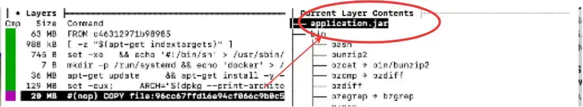
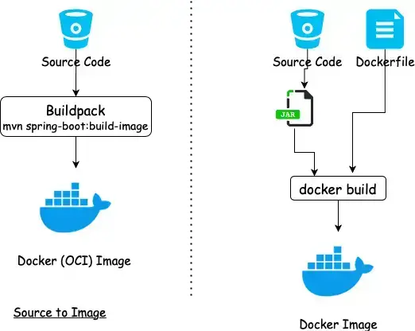
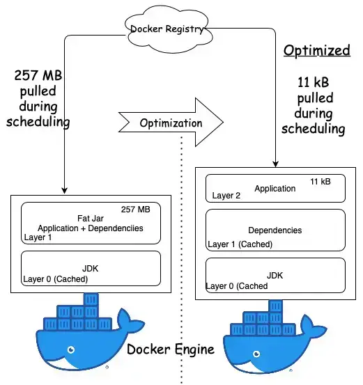
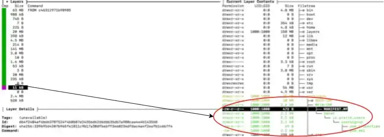

容器已成为打包具有所有软件和操作系统依赖项的应用程序，然后将其传送到不同环境的首选方式。

本文着眼于容器化 Spring Boot 应用程序的不同方法：

- 使用 Docker 文件构建 Docker 镜像，
- 使用 Cloud-Native Buildpack 从源代码构建 OCI 映像，
- 通过使用分层工具将 JAR 的各个部分拆分为不同的层，在运行时优化映像。

## 示例代码

本文附有 [GitHub](https://github.com/thombergs/code-examples/tree/master/spring-boot/spring-boot-docker) 上的工作代码示例。

## 容器术语

我们将从整篇文章中使用的容器术语开始：

- **Container image**: 具有特定格式的文件。我们通过运行构建工具将应用程序转换为容器映像。
- **Container**: 容器镜像的运行时实例。
- **Container engine**: t 负责运行 Container 的守护进程。
- **Container host**: 容器引擎运行的主机。
- **Container registry**: 用于发布和分发容器映像的共享位置。
- **OCI Standard**: 开放容器倡议 (OCI) 是在 Linux 基金会下形成的一个轻量级、开放的治理结构。 OCI 镜像规范定义了容器镜像格式和运行时的行业标准，以确保所有容器引擎都可以运行任何构建工具生成的容器镜像。

为了容器化应用程序，我们将应用程序封装在容器映像中，并将该映像发布到共享注册表。容器运行时从注册表中提取该映像，解压该映像，然后在其中运行应用程序。

Spring Boot 2.3 版本提供了用于构建 OCI 映像的插件。

Docker 恰好是最常用的容器实现，并且我们在示例中使用 Docker，因此本文中所有后续对容器的引用都将指 Docker。

## 以传统方式构建容器镜像

通过向 Docker 文件添加一些指令，可以非常轻松地创建 Spring Boot 应用程序的 Docker 镜像。

我们首先构建一个可执行 JAR，并作为 Docker 文件指令的一部分，在应用必要的自定义后将可执行 JAR 复制到基本 JRE 映像上。

让我们从 Spring Initializr 创建带有 `web` 、 `lombok` 和 `actuator` 依赖项的 Spring Boot 应用程序。我们还添加了一个休息控制器来使用 `GET` 方法公开 API。

### 创建 Docker 文件

接下来，我们通过添加 `Dockerfile` 来容器化该应用程序：

```dockerfile
FROM adoptopenjdk:11-jre-hotspot
ARG JAR_FILE=target/*.jar
COPY ${JAR_FILE} application.jar
EXPOSE 8080
ENTRYPOINT ["java","-jar","/application.jar"]
```

我们的 Docker 文件包含来自 `adoptopenjdk` 的基本映像，我们在该映像上复制 JAR 文件，然后公开将侦听请求的端口 `8080` 。

### 构建应用程序

我们首先使用 Maven 或 Gradle 构建应用程序。我们在这里使用 Maven：

```bash
mvn clean package
```

这将创建应用程序的可执行 JAR。我们需要将这个可执行 JAR 转换为 Docker 映像，以便在 Docker 引擎中运行。

### 构建容器镜像

接下来，我们通过从包含之前创建的 Docker 文件的根项目目录运行 `docker build` 命令，将此可执行 JAR 放入 Docker 映像中：

```bash
docker build  -t usersignup:v1 .
```

我们可以看到使用以下命令列出的图像：

```text
docker images
```

上述命令的输出包括我们的映像 `usersignup` 以及 Docker 文件中指定的基础映像 `adoptopenjdk` 。

```shell
REPOSITORY          TAG                 SIZE
usersignup          v1                  249MB
adoptopenjdk        11-jre-hotspot      229MB
```

### 查看容器镜像内的层

让我们看看图像内的图层堆栈。我们将使用 [dive tool](https://github.com/wagoodman/dive) 来查看这些图层：

```text
dive usersignup:v1
```

以下是运行 Dive 命令的部分输出：



正如我们所看到的，应用层构成了图像大小的重要组成部分。作为优化的一部分，我们的目标是在以下部分中减小该层的大小。

## 使用 Buildpack 构建容器镜像

Buildpacks 是各种平台即服务 (PAAS) 产品使用的通用术语，用于从源代码构建容器映像。它由 Heroku 于 2011 年发起，此后已被 Cloud Foundry、Google App Engine、Gitlab、Knative 等采用。



### 云原生 Buildpack 的优势

使用 Buildpack 构建映像的一个主要优点是，可以在集中位置（构建器）管理对映像配置的更改，并将其传播到使用该构建器的所有应用程序。

Buildpack 与平台紧密耦合。云原生 Buildpack 通过支持 OCI 映像格式实现跨平台标准化，确保映像可以由 Docker 引擎运行。

### 使用 Spring Boot 插件

Spring Boot 插件使用 Buildpack 从源代码创建 OCI 映像。映像是使用 `bootBuildImage` 任务 (Gradle) 或 `spring-boot:build-image` 目标 (Maven) 和本地 Docker 安装构建的。

我们可以通过在 `image tag` 中指定名称来自定义推送到 Docker 注册表所需的镜像名称：

```xml
<plugin>
  <groupId>org.springframework.boot</groupId>
  <artifactId>spring-boot-maven-plugin</artifactId>
  <configuration>
    <image>
      <name>docker.io/pratikdas/${project.artifactId}:v1</name>
    </image>
  </configuration>
</plugin>
```

让我们使用 Maven 运行 `build-image` 目标来构建应用程序并创建容器映像。我们现在没有使用任何 Docker 文件。

```shell
mvn spring-boot:build-image
```

运行此命令将产生类似于以下内容的输出：

```shell
[INFO] --- spring-boot-maven-plugin:2.3.3.RELEASE:build-image (default-cli) @ usersignup ---
[INFO] Building image 'docker.io/pratikdas/usersignup:v1'
[INFO]
[INFO]  > Pulling builder image 'gcr.io/paketo-buildpacks/builder:base-platform-api-0.3' 0%
.
.
.. [creator]     Adding label 'org.springframework.boot.version'
.. [creator]     *** Images (c311fe74ec73):
.. [creator]           docker.io/pratikdas/usersignup:v1
[INFO]
[INFO] Successfully built image 'docker.io/pratikdas/usersignup:v1'
```

从输出中，我们可以看到 `paketo Cloud-Native buildpack` 被用来构建可运行的 OCI 映像。正如我们之前所做的那样，我们可以通过运行以下命令来查看列为 Docker 映像的映像：

```shell
docker images
```

输出：

```shell
REPOSITORY                             SIZE
paketobuildpacks/run                  84.3MB
gcr.io/paketo-buildpacks/builder      652MB
pratikdas/usersignup                  257MB
```

## 使用 Jib 构建容器镜像

Jib 是 Google 的一个镜像构建器插件，提供了一种从源代码构建容器镜像的替代方法。

我们在 pom.xml 中配置 `jib-maven-plugin` ：

```xml
      <plugin>
        <groupId>com.google.cloud.tools</groupId>
        <artifactId>jib-maven-plugin</artifactId>
        <version>2.5.2</version>
      </plugin>
```

接下来，我们使用 Maven 命令触发 Jib 插件来构建应用程序并创建容器映像。和以前一样，我们在这里没有使用任何 Docker 文件：

```shell
mvn compile jib:build -Dimage=<docker registry name>/usersignup:v1
```

运行上述 Maven 命令后，我们得到以下输出：

```shell
[INFO] Containerizing application to pratikdas/usersignup:v1...
.
.
[INFO] Container entrypoint set to [java, -cp, /app/resources://app/classes://app/libs/*, io.pratik.users.UsersignupApplication]
[INFO]
[INFO] Built and pushed image as pratikdas/usersignup:v1
[INFO] Executing tasks:
[INFO] [==============================] 100.0% complete
```

输出显示容器映像已构建并推送到注册表。

## 构建优化镜像的动机和技术

我们优化的主要动机有两个：

- 性能：在容器编排系统中，容器镜像从镜像仓库拉取到运行容器引擎的主机上。这个过程称为调度。从注册表中提取大型映像会导致容器编排系统中的调度时间较长以及 CI 管道中的构建时间较长。
- 安全性：大尺寸图像也有更大的漏洞表面积。

Docker 镜像由一堆层组成，每个层代表 Dockerfile 中的一条指令。每一层都是底层变化的增量。当我们从注册中心拉取 Docker 镜像时，它是被分层拉取并缓存在主机中的。

Spring Boot 使用“fat JAR”作为其默认打包格式。当我们检查 fat JAR 时，我们可以看到该应用程序只占整个 JAR 的很小一部分。这是变化最频繁的部分。其余部分由 Spring 框架依赖项组成。

优化公式的核心是将应用程序与 Spring 框架依赖项隔离到一个单独的层中。

构成 fat JAR 大部分的依赖项层仅下载一次并缓存在主机系统中。

在应用程序更新和容器调度期间，仅拉取应用程序的薄层，如下图所示：



让我们在接下来的部分中了解如何为 Spring Boot 应用程序构建这些优化的映像。

## 使用 Buildpack 为 Spring Boot 应用程序构建优化的容器映像

Spring Boot 2.3 通过将 fat JAR 的各个部分提取到单独的层中来支持分层。分层功能默认关闭，需要使用 Spring Boot Maven 插件显式启用：

```xml
<plugin>
  <groupId>org.springframework.boot</groupId>
  <artifactId>spring-boot-maven-plugin</artifactId>
  <configuration>
    <layers>
      <enabled>true</enabled>
    </layers>
  </configuration>
</plugin>
```

我们将使用此配置首先使用 Buildpack 生成容器映像，然后在以下部分中使用 Docker 生成容器映像。

让我们运行 Maven `build-image` 目标来创建容器映像：

```shell
mvn spring-boot:build-image
```

如果我们运行 Dive 来查看生成图像中的各层，我们可以看到应用程序层（以红色圈出）在千字节范围内比我们使用 fat JAR 格式获得的要小得多：



## 使用 Docker 为 Spring Boot 应用程序构建优化的容器映像

我们还可以使用 Docker 文件创建分层的 JAR Docker 镜像，而不是使用 Maven 或 Gradle 插件。

当我们使用 Docker 时，我们需要执行两个额外的步骤来提取层并将其复制到最终映像中。

使用 Maven 构建并启用分层功能后，生成的 JAR 内容将如下所示：

```text
META-INF/
.
BOOT-INF/lib/
.
BOOT-INF/lib/spring-boot-jarmode-layertools-2.3.3.RELEASE.jar
BOOT-INF/classpath.idx
BOOT-INF/layers.idx
```

输出显示一个名为 `spring-boot-jarmode-layertools` 的附加 JAR 和一个 `layersfle.idx` 文件。分层功能由这个附加 JAR 提供，如下一节所述。

### 取不同层中的依赖关系

要查看并从分层 JAR 中提取层，我们使用系统属性 `-Djarmode=layertools` 来启动 `spring-boot-jarmode-layertools` JAR 而不是应用程序：

```shell
java -Djarmode=layertools -jar target/usersignup-0.0.1-SNAPSHOT.jar
```

运行此命令会生成包含可用命令选项的输出：

```shell
Usage:
  java -Djarmode=layertools -jar usersignup-0.0.1-SNAPSHOT.jar

Available commands:
  list     List layers from the jar that can be extracted
  extract  Extracts layers from the jar for image creation
  help     Help about any command
```

输出显示命令 `list` 、 `extract` 和 `help` ，其中 `help` 是默认命令。让我们使用 `list` 选项运行命令：

```shell
java -Djarmode=layertools -jar target/usersignup-0.0.1-SNAPSHOT.jar list
dependencies
spring-boot-loader
snapshot-dependencies
application
```

我们可以看到可以作为层添加的依赖项列表。

默认层是：

| 图层名称                | 内容                             |
| :---------------------- | :------------------------------- |
| `dependencies`          | 版本不包含 SNAPSHOT 的任何依赖项 |
| `spring-boot-loader`    | JAR 加载器类                     |
| `snapshot-dependencies` | 版本包含 SNAPSHOT 的任何依赖项   |
| `application`           | 应用程序类和资源                 |

这些层按照应添加到 Docker 映像的顺序在 `layers.idx` 文件中定义。这些层在第一次拉取后会缓存在主机中，因为它们不会更改。仅将更新的应用程序层下载到主机，由于大小减小，速度更快。

### 使用在单独层中提取的依赖项构建图像

我们将使用称为多阶段构建的方法分两个阶段构建最终图像。在第一阶段，我们将提取依赖项，在第二阶段，我们将提取的依赖项复制到最终映像。

让我们修改 Docker 文件以进行多阶段构建：

```dockerfile
# the first stage of our build will extract the layers
FROM adoptopenjdk:14-jre-hotspot as builder
WORKDIR application
ARG JAR_FILE=target/*.jar
COPY ${JAR_FILE} application.jar
RUN java -Djarmode=layertools -jar application.jar extract

# the second stage of our build will copy the extracted layers
FROM adoptopenjdk:14-jre-hotspot
WORKDIR application
COPY --from=builder application/dependencies/ ./
COPY --from=builder application/spring-boot-loader/ ./
COPY --from=builder application/snapshot-dependencies/ ./
COPY --from=builder application/application/ ./
ENTRYPOINT ["java", "org.springframework.boot.loader.JarLauncher"]
```

我们将此配置保存在单独的文件中 - `Dockerfile2` 。

我们使用以下命令构建 Docker 镜像：

```text
docker build -f Dockerfile2 -t usersignup:v1 .
```

运行此命令后，我们得到以下输出：

```shell
Sending build context to Docker daemon  20.41MB
Step 1/12 : FROM adoptopenjdk:14-jre-hotspot as builder
14-jre-hotspot: Pulling from library/adoptopenjdk
.
.
Successfully built a9ebf6970841
Successfully tagged userssignup:v1
```

我们可以看到 Docker 镜像是使用镜像 ID 创建的，然后被标记的。

最后，我们像以前一样运行 Dive 命令来检查生成的 Docker 镜像内的层。我们可以指定图像 ID 或标签作为 Dive 命令的输入：

```shell
dive userssignup:v1
```

正如我们在输出中看到的，包含应用程序的层现在只有 11 kB，依赖项缓存在单独的层中。


### 提取不同层中的内部依赖关系

我们可以通过在单独的层中提取任何自定义依赖项来进一步减小应用程序层的大小，而不是通过在名为 `layers.idx` 的 `yml` 类似文件中声明它们来将它们与应用程序一起打包：

```layers.idx
- "dependencies":
  - "BOOT-INF/lib/"
- "spring-boot-loader":
  - "org/"
- "snapshot-dependencies":
- "custom-dependencies":
  - "io/myorg/"
- "application":
  - "BOOT-INF/classes/"
  - "BOOT-INF/classpath.idx"
  - "BOOT-INF/layers.idx"
  - "META-INF/"
```

在此文件中 - `layers.idx` 我们添加了一个名为 `io.myorg` 的自定义依赖项，其中包含从共享存储库中提取的组织依赖项。

## 结论

在本文中，我们研究了使用云原生 Buildpack 直接从源代码创建容器映像。这是使用 Docker 构建容器映像的传统方式的替代方案，首先构建 fat 可执行 JAR，然后通过在 Dockerfile 中指定指令将其打包到容器映像中。

我们还考虑通过启用分层功能来优化我们的容器，该功能提取缓存在主机中的单独层中的依赖项，并在容器运行时引擎的调度期间下载应用程序的薄层。

文章中使用的所有源码可以参考[Github](https://github.com/thombergs/code-examples/tree/master/spring-boot/spring-boot-docker)上的。

## 命令参考

以下是我们在本文中使用的命令摘要，以供快速参考。

清洁我们的环境：

```text
docker system prune -a
```

使用 Docker 文件构建容器镜像：

```text
docker build -f <Docker file name> -t <tag> .
```

从源代码构建容器镜像（没有 Dockerfile）：

```text
mvn spring-boot:build-image
```

查看依赖关系层。在构建应用程序 JAR 之前，确保在 spring-boot-maven-plugin 中启用分层功能：

```text
java -Djarmode=layertools -jar application.jar list
```

提取依赖层。在构建应用程序 JAR 之前，确保在 spring-boot-maven-plugin 中启用分层功能：

```
 java -Djarmode=layertools -jar application.jar extract
```

查看容器镜像列表

```text
docker images
```

查看容器镜像内的层（确保已安装 dive tool 工具）：

```text
dive <image ID or image tag>
```

原文链接：[https://reflectoring.io/spring-boot-docker/](https://reflectoring.io/spring-boot-docker/)
