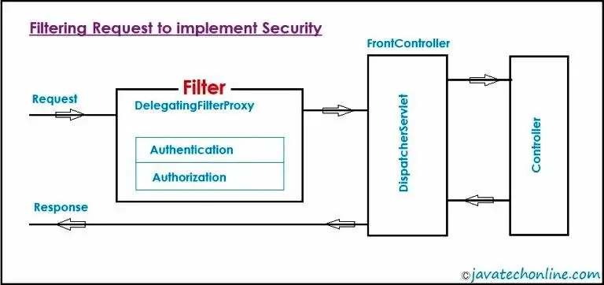
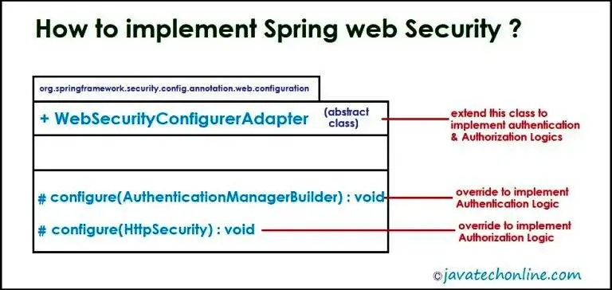
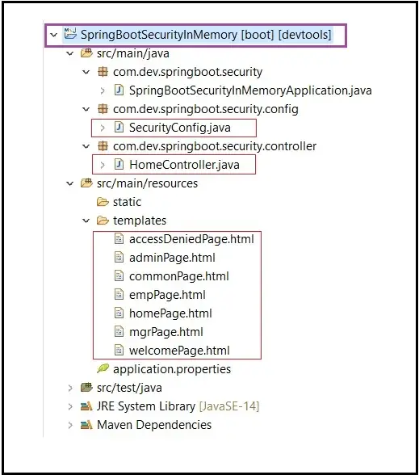

如今，几乎每个客户都要求在实时应用程序中实现强大的安全功能。安全功能对于保持机密性、完整性和可用性的需求是非常有效的。现实世界中有很多类型的安全性，但我们作为开发人员将重点关注应用程序/软件安全性。

此外，在应用程序安全方面，我们的工作基本上是确保两件事。首先，只有有效的用户才能访问该应用程序。其次，如果用户有效，他/她只能访问该应用程序中允许的数据/信息。我认为，没有什么可以解释它们，因为您必须已经了解这两个术语，即身份验证和授权。

您可能已经猜到我们将在当前主题“如何在 Spring Boot 项目中实现安全性？”中讨论什么内容。

在本文中，我们将从基本原理开始学习。接下来，我们将逐步结束它，直到我们有信心在 Spring Boot 应用程序中实现安全功能。因此，让我们开始逐步讨论“如何在 Spring Boot 项目中实现安全性？”。 Spring Boot 教程页面上有一系列有关 [Spring Boot Security 的教程](https://javatechonline.com/spring-boot-tutorial/#Spring_Boot_Security)。

我们在本文中介绍了两个版本的“如何在 Spring Boot 项目中实现安全性？”的示例：使用 WebSecurityConfigurerAdapter 和不使用 WebSecurityConfigurerAdapter。此外，还涵盖了使用 Spring Boot 3.0 及更高版本的“如何在 Spring Boot 项目中实现安全性？”的示例。

## 您将从本文中学到什么？

1. 为什么我们需要在 Spring Boot 应用程序中实现安全性？

2. Security 在 Spring Boot 应用程序内部如何工作？

3. javax.servlet.Filter 在 Spring Boot 应用程序中实现安全性方面的作用是什么？

4. Spring Boot 项目中使用了多少种授权类型？

5. Spring Boot 项目中有多少种实现安全性的方法？

6. 在 Spring Boot 项目中实现 WebSecurity 的步骤是什么？

7. 另外，如何在 Spring Boot 项目中使用@EnableWebSecurity、@Configuration、@Bean？

8. 如何实现内存中身份验证安全示例
9. 如何实现 JDBC 认证安全示例

10. 如何在 Spring Boot 项目中使用 Thymeleaf ？

11. 如何测试启用安全的功能？
12. 相反，如何禁用应用程序的安全功能？
13. 最后但并非最不重要的一点是，您将学习“如何在 Spring Boot 项目中实现安全性？”使用 WebSecurityConfigurerAdapter 和不使用 WebSecurityConfigurerAdapter。

## 为什么我们需要应用程序中的安全性？

现在，随着恶意攻击将重点从操作系统和网络转移到应用程序/软件和移动设备/设备，一天的数据面临最大的风险。此外，从业务/客户的角度来看，应用程序安全在维护信任、建立品牌形象和降低风险方面发挥着重要作用。事实上，没有其中任何一项，都无法想象一家成功的企业。

总之，无论您是为了内部使用、销售目的还是购买目的而创建应用程序，安全性都是每个应用程序最重要的功能。

根据最新的 2020 年 Verizon 数据泄露调查报告，所有数据泄露中有 43% 是针对 Web 应用程序的攻击。这一数字比 2019 年增加了一倍。此外，86% 的违规行为都是出于经济动机。

## Spring Boot 应用程序内部安全性如何工作？

从根本上来说，Spring Security 的工作原理是 JAAS（Java 身份验证和授权服务）。简而言之，它适用于 Filter (javax.servlet.Filter) 概念。我们都知道，如果我们想在 servlet 请求之前应用一些预处理逻辑，可以使用过滤器。同样的概念也被应用于在 Spring boot 项目中实现安全功能。

DelegatingFilterProxy 是 Spring Security 模块提供的 org.springframework.web.filter 包下的预定义类，在这里充当过滤器。

如下图所示，当用户向应用程序发送请求时，请求会先经过安全过滤器，然后再发送给 DispatcherServlet。如果用户验证此过滤器的安全性，则只有请求才会发送到 DispatcherServlet 来满足用户的目的。



## Spring Boot 应用程序使用了多少种授权类型？

有四种最常用的授权实现类型。他们是 ：

### 1) permitAll 

PermitAll 表示无需任何授权即可访问当前页面。

示例 URL：/login、/home、/contactUs、/aboutUs ..等。

### 2) authenticated

它表示需要登录（用户名/密码）并且不需要授权（基于角色的访问）。

示例 URL：/updateUserDetails、/inbox、/settings 等。

### 3) hasAuthority

hasAuthority 表示用户应该具有身份验证和基于角色的授权访问权限。

示例 URL+role：/approveRequest + MANAGER、/blockUser + ADMIN、/addUser + ADMIN …等。

### 4) hasAnyAuthority

它表示用户应该具有身份验证和基于多个角色的授权访问。就像经理和人力资源这两个角色都可以访问特定页面。
示例 URLs+role: /approveRequest + (MANAGER & HR)

## 在 Spring Boot Web 应用程序中实现安全性有哪些不同的方法？

简而言之，在 Spring Boot Web 应用程序中实现安全性有三种最常见的方法。他们是

### In-Memory Security

在这种类型的实现中，我们将数据存储在 RAM（内存中）中，并在有请求时验证数据。我们在测试或开发环境中使用这种方法。在生产应用中不建议使用此方法。

### 使用数据库

在这种类型的实现中，我们将数据存储在数据库中，并在请求到来时验证数据/登录。但它是基于程序员提供的 SQL 查询来工作的。

### 使用用户详细信息服务

我们将数据存储在数据库中，并在请求到来时验证数据。但 UserDetailsS​​ervice 是基于 ORM（Spring Data JPA）工作的。简而言之，UserDetailsS​​ervice 是 Spring Security 模块提供的一个接口。在登录表单中输入用户名后，当我们单击登录按钮时，将调用该服务。随后，它根据提供的用户名找到用户。它包含一个方法 loadUserByUsername(String username) 返回 UserDetails 对象。此外，UserDetails 对象为我们提供了用户名。

## 在 Spring Boot 应用程序中实现 Web 安全的步骤是什么？

以下是步骤：



1. 编写一个类“SecurityConfig.java”，它扩展了预定义的抽象类 WebSecurityConfigurerAdapter.java
2. 在“SecurityConfig.java”之上相应地应用注释@Configuration 和@EnableWebSecurity。不用说，注释@EnableWebSecurity 是为了在 Web 应用程序中启用安全功能。

3. 覆盖下面两种方法同时实现身份验证和授权逻辑。

- configure(AuthenticationManagerBuilder auth)
- configure(HttpSecurity http)

4. 此外，通过使用@Autowired（如 DataSource、BCryptPasswordEncoder 等）注入其他对象依赖项（如果有），并在需要的地方使用它们。

5. 同样重要的是，根据需要编写控制器类和视图页面。

6. 最后，如果您不实施内存中身份验证，请更新 application.properties 文件中的数据库属性。

注意：从 Spring Security 5.7.0-M2 开始，WebSecurityConfigurerAdapter 已被弃用。为了了解实现自定义配置类的新方法，请访问有关[不使用 WebSecurityConfigurerAdapter 的 Spring Security](https://javatechonline.com/spring-security-without-websecurityconfigureradapter/) 的单独文章。

## 如何实现内存中身份验证安全性的示例

例如，让我们考虑一个小型组织的应用程序，其中我们有三个角色：员工、经理和管理员。此外，我们将对某些特定页面进行基于角色的限制访问。一方面，某些页面可供多个角色访问，另一方面，某些页面没有限制（所有角色均可访问）。此外，我们将使用 thymeleaf 来创建页面。此外，我们将有一个控制器类来满足用户的请求。

### Software/Technologies Used 使用的软件/技术

- STS (Spring Tool Suite) : Version-> 4.7.1.RELEASE
- JDK14 (JDK8 or later versions are sufficient)

### 步骤#1：在 STS(Spring Tool Suite)中创建一个 Spring Boot Starter 项目

创建入门项目时，选择“Spring Security”、“Thymeleaf”、“Spring Web”和“Spring Boot DevTools”作为入门项目依赖项。要了解“如何创建 Spring Boot Starter 项目？”，请访问[内部链接](https://javatechonline.com/saving-data-into-database-using-spring-boot-data-jpa-step-by-step-tutorial/#Step_1_Creating_Starter_Project_using_STS)。

### 步骤#2：编写控制器类

请检查以下代码作为控制器类。

HomeController.java

```java
package com.dev.springboot.security.controller;

import org.springframework.stereotype.Controller;
import org.springframework.web.bind.annotation.GetMapping;

@Controller
public class HomeController {

	@GetMapping("/home")
	public String getHomePage() {
		return "homePage";
	}

	@GetMapping("/welcome")
	public String getWelcomePage() {
		return "welcomePage";
	}

	@GetMapping("/admin")
	public String getAdminPage() {
		return "adminPage";
	}

	@GetMapping("/emp")
	public String getEmployeePage() {
		return "empPage";
	}

	@GetMapping("/mgr")
	public String getManagerPage() {
		return "mgrPage";
	}

	@GetMapping("/common")
	public String getCommonPage() {
		return "commonPage";
	}

	@GetMapping("/accessDenied")
	public String getAccessDeniedPage() {
		return "accessDeniedPage";
	}
}
```

### 步骤#3：编写 UI 页面 (Thymeleaf)

以下文件是 UI 页面。因此，仅将它们放在“src/main/resources/templates”文件夹中。

homepage.html

```html
<!DOCTYPE html>
<html xmlns:th="http://www.thymeleaf.org">
  <head>
    <meta charset="ISO-8859-1" />
    <title>Insert title here</title>
  </head>
  <body>
    <h3>welcome to Home Page</h3>
    This page is accessible to ALL.
  </body>
</html>
```

welcomePage.html

```html
<!DOCTYPE html>
<html xmlns:th="http://www.thymeleaf.org">
  <head>
    <meta charset="ISO-8859-1" />
    <title>Insert title here</title>
  </head>
  <body>
    <h3>Welcome Page after successful Login</h3>
    <a th:href="@{/logout}">LOGOUT</a>
  </body>
</html>
```

adminPage.html

```html
<!DOCTYPE html>
<html xmlns:th="http://www.thymeleaf.org">
  <head>
    <meta charset="ISO-8859-1" />
    <title>Insert title here</title>
  </head>
  <body>
    <h3>Admin Page</h3>
    Only Admins are allowed to access this page.!!!
    <a th:href="@{/logout}">LOGOUT</a>
  </body>
</html>
```

empPage.html

```html
<!DOCTYPE html>
<html xmlns:th="http://www.thymeleaf.org">
  <head>
    <meta charset="ISO-8859-1" />
    <title>Insert title here</title>
  </head>
  <body>
    <h3>Employee Page</h3>
    <a th:href="@{/logout}">LOGOUT</a>
  </body>
</html>
```

mgrPage.html

```html
<!DOCTYPE html>
<html xmlns:th="http://www.thymeleaf.org">
  <head>
    <meta charset="ISO-8859-1" />
    <title>Insert title here</title>
  </head>
  <body>
    <h3>Manager Page</h3>
    <a th:href="@{/logout}">LOGOUT</a>
  </body>
</html>
```

commonPage.html

```html
<!DOCTYPE html>
<html xmlns:th="http://www.thymeleaf.org">
  <head>
    <meta charset="ISO-8859-1" />
    <title>Insert title here</title>
  </head>
  <body>
    <h3>COMMON Page</h3>
    Both Manager & Employee are allowed to access this page. !
    <a th:href="@{/logout}">LOGOUT</a>
  </body>
</html>
```

accessDeniedPage.html

```html
<!DOCTYPE html>
<html xmlns:th="http://www.thymeleaf.org">
  <head>
    <meta charset="ISO-8859-1" />
    <title>Insert title here</title>
  </head>
  <body>
    <h3>You are not allowed to access this page. Please go to Welcome Page</h3>
    <a th:href="@{/welcome}">Welcome</a>
    <a th:href="@{/logout}">LOGOUT</a>
  </body>
</html>
```

### 步骤#4：编写 SecurityConfig 类

此类对于实现包含所有安全相关逻辑的安全功能而言是最重要的。如下面的代码示例所示，如果我们不想对密码进行编码，我们可以在密码值之前使用“{noop}”。

#### 步骤#4A：Spring Security 5.7.0 以下版本的代码

SecurityConfig.java

```java
package com.dev.springboot.security;

import org.springframework.context.annotation.Configuration;
import org.springframework.security.config.annotation.authentication.builders.AuthenticationManagerBuilder;
import org.springframework.security.config.annotation.web.builders.HttpSecurity;
import org.springframework.security.config.annotation.web.configuration.EnableWebSecurity;
import org.springframework.security.config.annotation.web.configuration.WebSecurityConfigurerAdapter;
import org.springframework.security.web.util.matcher.AntPathRequestMatcher;

@Configuration
@EnableWebSecurity
public class SecurityConfig extends WebSecurityConfigurerAdapter {

	@Override
	protected void configure(AuthenticationManagerBuilder auth) throws Exception {

		/ {noop} => No operation for password encoder	(no password encoding needed)
		auth.inMemoryAuthentication().withUser("devs").password("{noop}devs").authorities("ADMIN");
		auth.inMemoryAuthentication().withUser("ns").password("{noop}ns").authorities("EMPLOYEE");
		auth.inMemoryAuthentication().withUser("vs").password("{noop}vs").authorities("MANAGER");
	}

	@Override
	protected void configure(HttpSecurity http) throws Exception {

		/declares which Page(URL) will have What access type
		http.authorizeRequests()
		.antMatchers("/home").permitAll()
		.antMatchers("/welcome").authenticated()
		.antMatchers("/admin").hasAuthority("ADMIN")
		.antMatchers("/emp").hasAuthority("EMPLOYEE")
		.antMatchers("/mgr").hasAuthority("MANAGER")
		.antMatchers("/common").hasAnyAuthority("EMPLOYEE","MANAGER")

		/ Any other URLs which are not configured in above antMatchers
		/ generally declared aunthenticated() in real time
		.anyRequest().authenticated()

		/Login Form Details
		.and()
		.formLogin()
		.defaultSuccessUrl("/welcome", true)

		/Logout Form Details
		.and()
		.logout()
		.logoutRequestMatcher(new AntPathRequestMatcher("/logout"))

		/Exception Details
		.and()
		.exceptionHandling()
		.accessDeniedPage("/accessDenied")
		;
	}
}
```

#### 步骤#4B：Spring Security 5.7 以上版本和 Spring Security 6.0 以下版本的代码

由于[根据 Spring 官网发布的公告](https://javatechonline.com/spring-security-without-websecurityconfigureradapter/)，WebSecurityConfigurerAdapter 已从 Spring Security 5.7.0-M2 中弃用，因此，2022 年 2 月 21 日，我们将不使用 WebSecurityConfigurerAdapter 来编写 SecurityConfig 类，如下所示：

SecurityConfig.java

```java
package com.dev.springboot.security;

import java.util.ArrayList;
import java.util.List;

import org.springframework.context.annotation.Bean;
import org.springframework.context.annotation.Configuration;
import org.springframework.security.config.annotation.authentication.builders.AuthenticationManagerBuilder;
import org.springframework.security.config.annotation.web.builders.HttpSecurity;
import org.springframework.security.config.annotation.web.configuration.EnableWebSecurity;
import org.springframework.security.core.GrantedAuthority;
import org.springframework.security.core.authority.SimpleGrantedAuthority;
import org.springframework.security.core.userdetails.User;
import org.springframework.security.core.userdetails.UserDetails;
import org.springframework.security.provisioning.InMemoryUserDetailsManager;
import org.springframework.security.web.SecurityFilterChain;
import org.springframework.security.web.util.matcher.AntPathRequestMatcher;

@Configuration
@EnableWebSecurity
public class SecurityConfig {

	@Bean
	protected InMemoryUserDetailsManager configAuthentication() {

		List<UserDetails> users = new ArrayList<>();
		List<GrantedAuthority> adminAuthority = new ArrayList<>();
		adminAuthority.add(new SimpleGrantedAuthority("ADMIN"));
		UserDetails admin= new User("devs", "{noop}devs", adminAuthority);
		users.add(admin);

		List<GrantedAuthority> employeeAuthority = new ArrayList<>();
		adminAuthority.add(new SimpleGrantedAuthority("EMPLOYEE"));
		UserDetails employee= new User("ns", "{noop}ns", employeeAuthority);
		users.add(employee);

		List<GrantedAuthority> managerAuthority = new ArrayList<>();
		adminAuthority.add(new SimpleGrantedAuthority("MANAGER"));
		UserDetails manager= new User("vs", "{noop}vs", managerAuthority);
		users.add(manager);

		return new InMemoryUserDetailsManager(users);
	}

	@Bean
	protected SecurityFilterChain filterChain(HttpSecurity http) throws Exception {

		/declares which Page(URL) will have What access type
		http.authorizeRequests()
		.antMatchers("/home").permitAll()
		.antMatchers("/welcome").authenticated()
		.antMatchers("/admin").hasAuthority("ADMIN")
		.antMatchers("/emp").hasAuthority("EMPLOYEE")
		.antMatchers("/mgr").hasAuthority("MANAGER")
		.antMatchers("/common").hasAnyAuthority("EMPLOYEE","MANAGER")

		/ Any other URLs which are not configured in above antMatchers
		/ generally declared aunthenticated() in real time
		.anyRequest().authenticated()

		/Login Form Details
		.and()
		.formLogin()
		.defaultSuccessUrl("/welcome", true)

		/Logout Form Details
		.and()
		.logout()
		.logoutRequestMatcher(new AntPathRequestMatcher("/logout"))

		/Exception Details
		.and()
		.exceptionHandling()
		.accessDeniedPage("/accessDenied")
		;

		return http.build();
	}
}
```

#### 步骤#4C：Spring Security 6.0.0 及更高版本的代码（Spring Boot 3.0+）

从 Spring Security 6.0（2022 年 11 月发布）开始，WebSecurityConfigurerAdapter 已从 Spring Security API 中完全删除。它还影响了 2022 年 11 月[新发布的 Spring Boot 3.0](https://javatechonline.com/new-features-in-spring-boot-3-and-spring-6/)。因此，如果您使用 Spring Framework 6.0+ 或 Spring Boot 3.0+，无论哪种情况，SecurityConfig.java 的实现应如下所示。此外，您还可以检查[Spring Framework 6.0 中与 Spring Security 相关的更改](https://javatechonline.com/how-to-migrate-spring-boot-2-to-spring-boot-3/#Review_Specific_to_Spring_Security_Dependency)。

SecurityConfig.java

```java
package com.dev.springboot.security;

import java.util.ArrayList;
import java.util.List;

import org.springframework.context.annotation.Bean;
import org.springframework.context.annotation.Configuration;
import org.springframework.security.config.annotation.authentication.builders.AuthenticationManagerBuilder;
import org.springframework.security.config.annotation.web.builders.HttpSecurity;
import org.springframework.security.config.annotation.web.configuration.EnableWebSecurity;
import org.springframework.security.core.GrantedAuthority;
import org.springframework.security.core.authority.SimpleGrantedAuthority;
import org.springframework.security.core.userdetails.User;
import org.springframework.security.core.userdetails.UserDetails;
import org.springframework.security.provisioning.InMemoryUserDetailsManager;
import org.springframework.security.web.SecurityFilterChain;
import org.springframework.security.web.util.matcher.AntPathRequestMatcher;

@Configuration
@EnableWebSecurity
public class SecurityConfig {

	@Bean
	protected InMemoryUserDetailsManager configAuthentication() {

		List<UserDetails> users = new ArrayList<>();
		List<GrantedAuthority> adminAuthority = new ArrayList<>();
		adminAuthority.add(new SimpleGrantedAuthority("ADMIN"));
		UserDetails admin= new User("devs", "{noop}devs", adminAuthority);
		users.add(admin);

		List<GrantedAuthority> employeeAuthority = new ArrayList<>();
		adminAuthority.add(new SimpleGrantedAuthority("EMPLOYEE"));
		UserDetails employee= new User("ns", "{noop}ns", employeeAuthority);
		users.add(employee);

		List<GrantedAuthority> managerAuthority = new ArrayList<>();
		adminAuthority.add(new SimpleGrantedAuthority("MANAGER"));
		UserDetails manager= new User("vs", "{noop}vs", managerAuthority);
		users.add(manager);

		return new InMemoryUserDetailsManager(users);
	}

	@Bean
	protected SecurityFilterChain filterChain(HttpSecurity http) throws Exception {

		/declares which Page(URL) will have What access type
		http.authorizeHttpRequests()
		.requestMatchers("/home").permitAll()
		.requestMatchers("/welcome").authenticated()
		.requestMatchers("/admin").hasAuthority("ADMIN")
		.requestMatchers("/emp").hasAuthority("EMPLOYEE")
		.requestMatchers("/mgr").hasAuthority("MANAGER")
		.requestMatchers("/common").hasAnyAuthority("EMPLOYEE","MANAGER")

		/ Any other URLs which are not configured in above antMatchers
		/ generally declared aunthenticated() in real time
		.anyRequest().authenticated()

		/Login Form Details
		.and()
		.formLogin()
		.defaultSuccessUrl("/welcome", true)

		/Logout Form Details
		.and()
		.logout()
		.logoutRequestMatcher(new AntPathRequestMatcher("/logout"))

		/Exception Details
		.and()
		.exceptionHandling()
		.accessDeniedPage("/accessDenied")
		;

		return http.build();
	}
}
```

注意：在上面的代码中，观察 Spring Security 6.0 中的 API 变化：antMatchers()被 requestMatchers()替换，authorizeRequests()被 authorizeHttpRequests()替换。

您的项目结构将如下图所示。



## 如何实现 JDBC 身份验证安全性示例

在这种身份验证方法中，我们根据数据库中的现有值验证凭据和角色。此外，在此示例中，我们还将研究密码加密逻辑。首先，我们将在数据库中插入一些虚拟数据，然后相应地测试安全功能。归根结底，如果我们比较前面示例的功能，我们将把用户凭据和角色保存到数据库而不是 RAM 中。

此外，在此示例中，我们将提供用于实现密码加密逻辑的附加代码。因此，上一个示例中的所有文件在此示例中也将有效。

此外，我们将有一个配置类来创建 BCryptPasswordEncoder 对象来对密码进行编码，并在 application.properties 中创建数据库属性条目以连接数据库。不用说，SecurityConfig 类的实现这次会有所不同。

### 使用的软件/技术

- STS (Spring Tool Suite) : Version-> 4.7.1.RELEASE
- MySQL Database : Version ->8.0.19 MySQL Community Server
- JDK14 (JDK8 or later versions are sufficient)

### 步骤#1：在数据库中插入一些虚拟记录

请注意，此步骤仅用于测试目的。如果您最近已经使用用户凭据和角色映射创建了数据库，请忽略此步骤。在步骤#1A 中，我们将创建一些密码编码值，然后在步骤#1B 中将它们插入到数据库中。

#### 步骤#1A：使用 BCryptPasswordEncoder 创建编码密码值

我们将使用 BCryptPasswordEncoder 生成一些编码密码值，如下所示

BCryptPasswordEncoderTest.java

```java
package com.dev.springboot.security.util;

import org.springframework.security.crypto.bcrypt.BCryptPasswordEncoder;

public class BCryptPasswordEncoderTest {

	public static void main(String[] args) {
		BCryptPasswordEncoder bpe = new BCryptPasswordEncoder();
		String encodedPWD = bpe.encode("devs@A!5003");
		System.out.println(encodedPWD);
	}
}
```

输出

```
$2a$10$qnOB2PH1CqRvw8f5epvHzOlrounRkVGi.Y5ho6ENdmj/C1DmPdAsy
```

#### 步骤#1B：创建数据库并插入虚拟记录

执行 MySQL DB 命令如下：

```
To create the database as 'testbootsecurity'
♦ create database testbootsecurity;
To take 'testbootsecurity' in use:
♦ use testbootsecurity;
To create the user table:
♦ create table user (user_id int, user_name varchar(30), user_pwd varchar(100), user_role varchar(20), user_enabled int);
To check the description of user table:
♦ desc user;
INSERT INTO user values(501,'devs','$2a$10$qnOB2PH1CqRvw8f5epvHzOlrounRkVGi.Y5ho6ENdmj/C1DmPdAsy','ADMIN',1);
INSERT INTO user values(502,'ns','$2a$10$mmUMC5ZwoVnEQYV7/R6m.uWWtj7EiIo3lKasBObkOCc12huVUWpMC','EMPLOYEE',1);
INSERT INTO user values(503,'vs','$2a$10$kqEC/fhQ7SNDhnncOQ9pb.yXXxJ/c7a1SQx2QPNZ.47fUmvF3Wb.i','MANAGER',1);
♦ select * from user;  (To check if values are inserted into DB)
```

此外，在实现 SecurityConfig.java 类的 configure(AuthenticationManagerBuilder auth) 方法时，我们将需要以下两个查询。

```
Query#1 : Retrieve username,password,enabled using username ;

♦ select user_name,user_pwd,user_enabled from user where user_name=?;

Query#2 : Retrieve username,role using username;

♦ select user_name,user_role from user where user_name=?;
```

### 步骤#2：在 STS中创建一个 Spring Boot Starter 项目

创建入门项目时，选择“Spring Security”、“Thymeleaf”、“Spring Web”、“JDBC API”、“MySQL Driver”和“Spring Boot DevTools”作为入门项目依赖项。

### 步骤#3：从上一个示例复制控制器类和 UI 页面

复制 HomeController.java 以及前面示例中的所有 thymeleaf 页面。

### 步骤#4：创建 AppConfig.java 以创建 BCryptPasswordEncoder 对象

如下创建 AppConfig.java。在实现 SecurityConfig.java 类时，我们将需要 BCryptPasswordEncoder 对象。

AppConfig.java

```java
package com.dev.springboot.security.jdbc.config;

import org.springframework.context.annotation.Bean;
import org.springframework.context.annotation.Configuration;
import org.springframework.security.crypto.bcrypt.BCryptPasswordEncoder;

@Configuration
public class AppConfig {

	@Bean
	public BCryptPasswordEncoder encode() {
		return new BCryptPasswordEncoder();
	}
}
```

### 步骤#5：更新 application.properties 文件中的数据库属性

更新 application.properties 以连接到 MySQL DB，如下所示。请注意，我们可以省略 driver-class-name，因为 Spring Boot 会自动从数据库 URL 中找到它。

```
#application.properties
-------------------------------------------------------------------
spring.datasource.driver-class-name=com.mysql.cj.jdbc.Driver
spring.datasource.url=jdbc:mysql://localhost:3306/testBootSecurity
spring.datasource.username=root
spring.datasource.password=devs
```

### 步骤#6：更新 SecurityConfig.java

从前面的示例中复制 SecurityConfig.java 并更新 configure( AuthenticationManagerBuilder auth) 方法，如下所示。

#### 步骤#6A：Spring Security 5.7.0 以下版本的代码

SecurityConfig.java

```java
package com.dev.springboot.security.jdbc.config;

import javax.sql.DataSource;

import org.springframework.beans.factory.annotation.Autowired;
import org.springframework.context.annotation.Configuration;
import org.springframework.security.config.annotation.authentication.builders.AuthenticationManagerBuilder;
import org.springframework.security.config.annotation.web.builders.HttpSecurity;
import org.springframework.security.config.annotation.web.configuration.EnableWebSecurity;
import org.springframework.security.config.annotation.web.configuration.WebSecurityConfigurerAdapter;
import org.springframework.security.crypto.bcrypt.BCryptPasswordEncoder;
import org.springframework.security.web.util.matcher.AntPathRequestMatcher;

@Configuration
@EnableWebSecurity
public class SecurityConfig extends WebSecurityConfigurerAdapter {

	@Autowired
	private DataSource dataSource;

	@Autowired
	private BCryptPasswordEncoder passwordEncoder;

	@Override
	protected void configure(AuthenticationManagerBuilder auth) throws Exception {

		auth.jdbcAuthentication()
		.dataSource(dataSource)     /creates database connection
		.usersByUsernameQuery("select user_name,user_pwd,user_enabled from user where user_name=?")
		.authoritiesByUsernameQuery("select user_name,user_role from user where user_name=?")
		.passwordEncoder(passwordEncoder);
	}

	@Override
	public void configure(HttpSecurity http) throws Exception {

		http.authorizeRequests()
		.antMatchers("/home").permitAll()
		.antMatchers("/welcome").authenticated()
		.antMatchers("/admin").hasAuthority("ADMIN")
		.antMatchers("/emp").hasAuthority("EMPLOYEE")
		.antMatchers("/mgr").hasAuthority("MANAGER")
		.anyRequest().authenticated()

		.and()
		.formLogin()
		.defaultSuccessUrl("/welcome",true)

		.and()
		.logout()
		.logoutRequestMatcher(new AntPathRequestMatcher("/logout"))

		.and()
		.exceptionHandling()
		.accessDeniedPage("/accessDenied")
		;

	}
}
```

#### 步骤#6B：Spring Security 5.7.0 以上版本和 Spring Security 6.0.0 以下版本的代码

由于根据 Spring 官网发布的公告，[WebSecurityConfigurerAdapter 已从 Spring Security 5.7.0-M2 中弃用](https://javatechonline.com/spring-security-without-websecurityconfigureradapter/)，因此，2022 年 2 月 21 日，我们将不使用 WebSecurityConfigurerAdapter 来编写 SecurityConfig 类，如下所示：

SecurityConfig.java

```java
package com.dev.springboot.security.jdbc.config;

import javax.sql.DataSource;

import org.springframework.beans.factory.annotation.Autowired;
import org.springframework.context.annotation.Bean;
import org.springframework.context.annotation.Configuration;
import org.springframework.security.config.annotation.authentication.builders.AuthenticationManagerBuilder;
import org.springframework.security.config.annotation.web.builders.HttpSecurity;
import org.springframework.security.config.annotation.web.configuration.EnableWebSecurity;
import org.springframework.security.core.userdetails.User;
import org.springframework.security.core.userdetails.UserDetails;
import org.springframework.security.crypto.bcrypt.BCryptPasswordEncoder;
import org.springframework.security.crypto.factory.PasswordEncoderFactories;
import org.springframework.security.provisioning.JdbcUserDetailsManager;
import org.springframework.security.provisioning.UserDetailsManager;
import org.springframework.security.web.SecurityFilterChain;
import org.springframework.security.web.util.matcher.AntPathRequestMatcher;

@Configuration
@EnableWebSecurity
public class SecurityConfig {

	@Autowired
	private DataSource dataSource;

	@Autowired
	private BCryptPasswordEncoder passwordEncoder;

	@Bean
    public UserDetailsManager authenticateUsers() {

		UserDetails user = User.withUsername("devs").
				password(PasswordEncoderFactories.createDelegatingPasswordEncoder().encode("password")).build();
		JdbcUserDetailsManager users = new JdbcUserDetailsManager(dataSource);
		users.setAuthoritiesByUsernameQuery("select user_name,user_pwd,user_enabled from user where user_name=?");
		users.setUsersByUsernameQuery("select user_name,user_role from user where user_name=?");
		users.createUser(user);
		return users;
	}

	@Bean
	protected SecurityFilterChain filterChain(HttpSecurity http) throws Exception {

		http.authorizeRequests()
		.antMatchers("/home").permitAll()
		.antMatchers("/welcome").authenticated()
		.antMatchers("/admin").hasAuthority("ADMIN")
		.antMatchers("/emp").hasAuthority("EMPLOYEE")
		.antMatchers("/mgr").hasAuthority("MANAGER")
		.anyRequest().authenticated()

		.and()
		.formLogin()
		.defaultSuccessUrl("/welcome",true)

		.and()
		.logout()
		.logoutRequestMatcher(new AntPathRequestMatcher("/logout"))

		.and()
		.exceptionHandling()
		.accessDeniedPage("/accessDenied")
		;
		return http.build();
	}
}
```

#### 步骤#6C：Spring Security 6.0.0 及更高版本的代码（Spring Boot 3.0+）

从 Spring Security 6.0（2022 年 11 月发布）开始，WebSecurityConfigurerAdapter 已从 Spring Security API 中完全删除。它还影响了 2022 年 11 月新发布的 Spring Boot 3.0。因此，如果您使用 Spring Framework 6.0+ 或 Spring Boot 3.0+，无论哪种情况，SecurityConfig.java 的实现应如下所示。此外，您还可以检查 Spring Framework 6.0 中与 Spring Security 相关的更改。

SecurityConfig.java

```java
package com.dev.springboot.security.jdbc.config;

import javax.sql.DataSource;

import org.springframework.beans.factory.annotation.Autowired;
import org.springframework.context.annotation.Bean;
import org.springframework.context.annotation.Configuration;
import org.springframework.security.config.annotation.authentication.builders.AuthenticationManagerBuilder;
import org.springframework.security.config.annotation.web.builders.HttpSecurity;
import org.springframework.security.config.annotation.web.configuration.EnableWebSecurity;
import org.springframework.security.core.userdetails.User;
import org.springframework.security.core.userdetails.UserDetails;
import org.springframework.security.crypto.bcrypt.BCryptPasswordEncoder;
import org.springframework.security.crypto.factory.PasswordEncoderFactories;
import org.springframework.security.provisioning.JdbcUserDetailsManager;
import org.springframework.security.provisioning.UserDetailsManager;
import org.springframework.security.web.SecurityFilterChain;
import org.springframework.security.web.util.matcher.AntPathRequestMatcher;

@Configuration
@EnableWebSecurity
public class SecurityConfig {

	@Autowired
	private DataSource dataSource;

	@Autowired
	private BCryptPasswordEncoder passwordEncoder;

	@Bean
    public UserDetailsManager authenticateUsers() {

		UserDetails user = User.withUsername("devs").
				password(PasswordEncoderFactories.createDelegatingPasswordEncoder().encode("password")).build();
		JdbcUserDetailsManager users = new JdbcUserDetailsManager(dataSource);
		users.setAuthoritiesByUsernameQuery("select user_name,user_pwd,user_enabled from user where user_name=?");
		users.setUsersByUsernameQuery("select user_name,user_role from user where user_name=?");
		users.createUser(user);
		return users;
	}

	@Bean
	protected SecurityFilterChain filterChain(HttpSecurity http) throws Exception {

		http.authorizeHttpRequests()
		.requestMatchers("/home").permitAll()
		.requestMatchers("/welcome").authenticated()
		.requestMatchers("/admin").hasAuthority("ADMIN")
		.requestMatchers("/emp").hasAuthority("EMPLOYEE")
		.requestMatchers("/mgr").hasAuthority("MANAGER")
		.anyRequest().authenticated()

		.and()
		.formLogin()
		.defaultSuccessUrl("/welcome",true)

		.and()
		.logout()
		.logoutRequestMatcher(new AntPathRequestMatcher("/logout"))

		.and()
		.exceptionHandling()
		.accessDeniedPage("/accessDenied")
		;
		return http.build();
	}
}
```

注意：在上面的代码中，观察 Spring Security 6.0 中的 API 变化：antMatchers()被 requestMatchers()替换，authorizeRequests()被 authorizeHttpRequests()替换。

## 如何测试启用安全的应用程序？

同时完成大量理论和编码步骤之后，是时候测试“如何在 Spring Boot 项目中实现安全性？”了。请按照以下步骤操作。

1. 启动应用程序，然后右键单击该项目，然后选择“Run As”>>“Spring Boot App”。

2. 输入首页网址 http://localhost:8080/home，检查是否存在每个人都可以访问，甚至无需登录应用程序。

3. 输入管理页面 URL http://localhost:8080/admin，然后它应该被重定向到内置登录页面（由 Spring Security 提供）

4. 使用提供的管理员凭据登录，您将被重定向到欢迎页面。
5. 输入 URL http://localhost:8080/admin，然后您就可以看到管理页面了。
6. 当您使用管理员凭据登录时，您还可以通过点击其他页面 URL 来查看所有页面。

随后对其他角色也重复上述步骤并检查用户是否可以根据授予的角色访问该页面。

## Spring Boot 项目如何实现安全性？ ：Spring Boot 3.0 及以上

Spring Boot 3.0 在 Spring Security 模块中进行了重大 API 级别更改。因此，如果您使用 Spring Boot 3.0 或更高版本，则需要遵循以下指南以及使用 JDK 17。

1. 在 SecurityConfig.java 中：

- 使用 authorizeHttpRequests()代替 authorizeRequests()

- 使用 requestMatchers() 代替 antMatchers()

- 使用 RegexRequestMatchers() 代替 regexMatchers()

2. 在实体类中：

- 在 import 语句中，使用“jakarta”代替“javax”。例如：使用“jakarta.persistence.Entity;”代替“javax.persistence.Entity;”。

## FAQ

### 如何禁用应用程序的安全功能？

同样重要的是，有时我们需要禁用安全功能，特别是在开发和测试环境中，以避免再次输入凭据。为此，我们可以相应地在 pom.xml 文件中注释以下两个依赖项。

```xml
<!--
<dependency>
    <groupId>org.springframework.boot</groupId>
    <artifactId>spring-boot-starter-security</artifactId>
</dependency>
<dependency>
    <groupId>org.springframework.boot</groupId>
    <artifactId>spring-boot-starter-thymeleaf</artifactId>
</dependency>
-->
```

## 概括

随后，通过“如何在 Spring Boot 项目中实现安全性？”的所有理论和示例部分，最后，我们能够在 Spring Boot 项目中实现 Web 安全性。当然，在本文中我们介绍了两种实现安全功能的方法。此外，我们可以在[另一篇文章](https://javatechonline.com/how-to-implement-security-in-spring-boot-using-userdetailsservice/)中了解 UserDetailsS​​ervice（实现安全性的第三种方式）。此外，有关 Spring Boot Security 的完整教程请访问[此处](https://javatechonline.com/spring-boot/#Spring_Boot_Security)。后续如有更新，我们也会及时更新。也请随时在下面的评论部分提供您的意见。

原文链接：[https://javatechonline.com/how-to-implement-security-in-spring-boot-project/](https://javatechonline.com/how-to-implement-security-in-spring-boot-project/)
