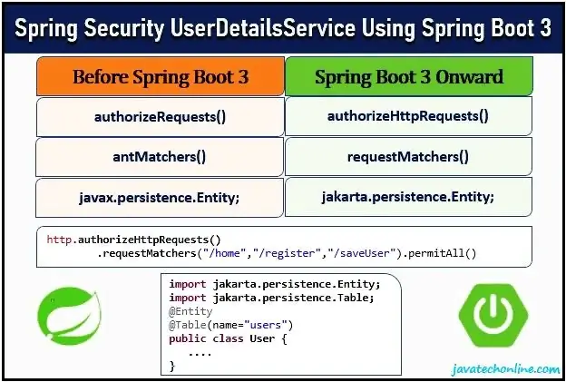

作为有关 Spring Security 的系列文章的继续，在本文中我们将学习“如何在 Spring Boot 3 中使用 UserDetailsService 实现 Spring Boot 中的安全性？”。经过前面的文章，我希望我们都非常熟悉安全性的基础知识，甚至 Spring Boot 应用程序中的安全性基础知识。 Spring Boot 3 发布后，我们将在这里实现“使用 Spring Boot 3 的 Spring Security UserDetailsService”。

在本文中，我们将创建一个用户注册表单并将用户及其角色保存在数据库中。然后，根据用户角色，我们将借助预定义的 UserDetailsS​​ervice 检查身份验证和授权功能。

## 您对整篇文章有何期望？

1. Spring Security 上下文中的 UserDetailsS​​ervice 概念是什么？
2. 实施 UserDetailsService 有什么好处？

3. 如何使用 Spring Boot 3 实现 Spring Security UserDetailsService？

4. 如何在基于 Spring 的应用程序中实现基于角色的安全性？
5. 此外，如何以及在哪里使用注释：@EnableWebSecurity，@Configuration，@Bean，@GetMapping，@Autowired，@Data，@Entity，@Table，@Id，@GenerateValue，@Column，@ElementCollection，@CollectionTable， @JoinColumn，@Service

6. 如何使用 Spring MVC 和 Thymeleaf 开发用户注册应用程序？

7. 如何测试启用安全的应用程序？

8. 如何在没有 WebSecurityConfigurerAdapter 的情况下使用 UserDetailsService 在 Spring Boot 中实现安全性？

## 示例中使用的软件/技术

有时某些版本与其他版本冲突。因此，列出经过测试可以相互协作的组合。下面是经过测试的软件组合，用于使用 Spring Boot 3 开发 Spring Security UserDetailsS​​ervice。它也使实现完美无缺。

1. [Spring Boot 3.0.0](https://javatechonline.com/new-features-in-spring-boot-3-and-spring-6/)
2. JDK 17 or later

3. Maven 3.8.1 
4. IDE – STS 4.7.1

### Jars Used

下面是这些示例中 maven 使用 pom.xml 自动下载的主要 jar 的列表。如果您在执行中遇到任何问题，它们可能有助于交叉验证。

1. spring-boot-3.0.0.jar

2. spring-boot-starter-3.0.0.jar

3. spring-boot-starter-security-3.0.0.jar

4. spring-core-6.0.2.jar

5. spring-security-core-6.0.0.jar

6. thymeleaf-spring6-3.1.0.RELEASE.jar

## UserDetailsService 是做什么的？使用它有什么好处？

UserDetailsS​​ervice 是 Spring 框架在 org.springframework.security.core.userdetails 包下提供的预定义接口。为了使用 UserDetailsS​​ervice，我们的实现类实现了这个接口并重写了它的 loadUserByUsername(String username) 方法。该方法的返回类型是 UserDetails，它又是一个接口。预定义的 User 类（org.springframework.security.core.userdetails.User）是 UserDetails 接口的实现。此外，我们在 loadUserByUsername(String username) 方法中传递用户名，它返回我们预定义的 User 对象（org.springframework.security.core.userdetails.User）。

事实上，我们只向 UserDetailsS​​ervice 提供用户名和一些小配置。因此，我们将所有基于角色的内置安全功能作为框架的一部分实现。因此，当我们使用 UserDetailsS​​ervice 接口时，我们在实现安全性方面节省了很多精力。

## 如何将 UserDetailsService 安全性合并到我们的应用程序中？

首先，您必须有一个 Spring Boot Web 应用程序，其中您将有一个表单，即一种用户注册表单。作为 Spring MVC 结构的一部分，您将拥有一个 UserService 实现类。假设它是 UserServiceImpl.java。要记住的第二件事是，您必须将 User 对象转换为预定义的 Spring User 对象。此外，请按照以下步骤在您的应用程序中实现 UserDetailsS​​ervice。

**1)** 你的用户服务类‘UserServiceImpl.java’应该实现接口 UserDetailsS​​ervice.java（由 Spring 提供）

**2)** 同样重要的是，重写 UserServiceImpl 类中 UserDetailsS​​ervice 接口的 loadUserByUsername(String username) 方法。

**3)** 作为实施的一部分，

**(A)** 借助 UserRepository 中的用户名/电子邮件获取您的用户对象。
**(B)** 将你的 User 对象相应地转换为 Spring 预定义的 User 对象(org.springframework.security.core.userdetails.User)。
**(C)** 返回 Spring 定义的 User 对象，它是 UserDetails的实现。

下面的代码代表了 UserDetailsS​​ervice 的实现。但是，您将在下面的部分中看到完整的代码。

UserServiceImpl.java

```java
import java.util.Optional;
import java.util.stream.Collectors;

import org.springframework.beans.factory.annotation.Autowired;
import org.springframework.security.core.authority.SimpleGrantedAuthority;
import org.springframework.security.core.userdetails.UserDetails;
import org.springframework.security.core.userdetails.UserDetailsService;
import org.springframework.security.core.userdetails.UsernameNotFoundException;
import org.springframework.security.crypto.bcrypt.BCryptPasswordEncoder;
import org.springframework.stereotype.Service;

import com.dev.springboot.security.UserDetailsService.model.User;
import com.dev.springboot.security.UserDetailsService.repo.UserRepository;
import com.dev.springboot.security.UserDetailsService.service.IUserService;

@Service
public class UserServiceImpl implements IUserService, UserDetailsService{

	@Autowired
	private UserRepository userRepo;

	@Autowired
	private BCryptPasswordEncoder passwordEncoder;

	@Override
	public Integer saveUser(User user) {
		String passwd= user.getPassword();
		String encodedPasswod = passwordEncoder.encode(passwd);
		user.setPassword(encodedPasswod);
		user = userRepo.save(user);
		return user.getId();
	}

	@Override
	public UserDetails loadUserByUsername(String email)
			throws UsernameNotFoundException {

		Optional<User> opt = userRepo.findUserByEmail(email);

		if(opt.isEmpty()){
				throw new UsernameNotFoundException("User with email: " +
                 email +" not found !");
		} else {
			User user = opt.get();
			return new org.springframework.security.core.userdetails.User(
					user.getEmail(),
					user.getPassword(),
					user.getRoles()
					.stream()
					.map(role-> new SimpleGrantedAuthority(role))
					.collect(Collectors.toSet())
		    );
		}

	}

}
```

## 我们如何在基于 Spring 的应用程序中实现基于角色的安全性？

通常，在基于 Spring 的应用程序中，我们通过创建一个 java 类并在其上应用 @EnableWebSecurity 和 @Configuration 来实现基于角色的访问。 @EnableWebSecurity 在应用程序中启用 Spring Security 功能，而 @Configuration 表示该类是一个配置类。例如，下面的代码演示了基于角色的安全性的实现。

SecurityConfig.java

```java
package com.dev.springboot.security.UserDetailsService.config;

import org.springframework.beans.factory.annotation.Autowired;
import org.springframework.context.annotation.Bean;
import org.springframework.context.annotation.Configuration;
import org.springframework.security.authentication.AuthenticationProvider;
import org.springframework.security.authentication.dao.DaoAuthenticationProvider;
import org.springframework.security.config.annotation.web.builders.HttpSecurity;
import org.springframework.security.config.annotation.web.configuration.EnableWebSecurity;
import org.springframework.security.core.userdetails.UserDetailsService;
import org.springframework.security.crypto.bcrypt.BCryptPasswordEncoder;
import org.springframework.security.web.SecurityFilterChain;
import org.springframework.security.web.util.matcher.AntPathRequestMatcher;

@EnableWebSecurity
@Configuration
public class SecurityConfig {

	@Autowired
	private UserDetailsService uds;

	@Autowired
	private BCryptPasswordEncoder encoder;

	@Bean
	public SecurityFilterChain filterChain(HttpSecurity http) throws Exception {

		http.authorizeRequests()
		.antMatchers("/home","/register","/saveUser").permitAll()
		.antMatchers("/welcome").authenticated()
		.antMatchers("/admin").hasAuthority("Admin")
		.antMatchers("/mgr").hasAuthority("Manager")
		.antMatchers("/emp").hasAuthority("Employee")
		.antMatchers("/hr").hasAuthority("HR")
		.antMatchers("/common").hasAnyAuthority("Employeee,Manager,Admin")
		.anyRequest().authenticated()

		.and()
		.formLogin()
		.defaultSuccessUrl("/welcome",true)

		.and()
		.logout()
		.logoutRequestMatcher(new AntPathRequestMatcher("/logout"))

		.and()
		.exceptionHandling()
		.accessDeniedPage("/accessDenied")

		.and()
		.authenticationProvider(authenticationProvider());

		return http.build();

	}

	@Bean
	public AuthenticationProvider authenticationProvider() {
		DaoAuthenticationProvider authenticationProvider = new DaoAuthenticationProvider();
		authenticationProvider.setUserDetailsService(uds);
		authenticationProvider.setPasswordEncoder(encoder);
		return authenticationProvider;
	}
}
```

## 使用 Spring Boot 3 的 Spring Security UserDetailsService 示例

为了简化使用 Spring Boot 3 的 Spring Security UserDetailsS​​ervice 的实现，让我们考虑一个用例。

### Use case Details 用例详细信息

让我们假设一个小型组织的内部门户。在组织中，我们的员工扮演着各种角色，例如管理员、人力资源、经理，当然还有员工。此外，门户还具有基于角色的页面访问权限。此外，某些页面应该可供所有角色访问，例如注册和公共信息页面，而其他页面则应仅限于各自的角色。

不用说，该组织将有一个用户注册页面，即使没有登录，所有用户也必须可以访问该页面。现在让我们创建一个标准用户注册流程，如下所示。


### 步骤#1：在 STS中创建一个 Spring Boot Starter 项目

创建入门项目时，选择“Spring Security”、“Thymeleaf”、“Spring Web”、“Spring Data JPA”、“MySQL Driver”、“Lombok”和“Spring Boot DevTools”作为入门项目依赖项。即使您不知道如何创建 Spring Boot 入门项目，也请访问“如何在 Spring boot 中创建入门项目？”的内部链接。另外，如果您想了解有关 Lombok 的更多信息，请访问 Lombok 上的内部链接。

### 步骤#2：更新 application.properties 文件中的数据库属性

更新 application.properties 以连接到 MySQL 数据库。请注意，我们还可以省略 driver-class-name，因为 Spring Boot 会自动从数据库 URL 中找到它，如下所示。不过，建议保留。

```properties
#application.properties

#-------------------- server properties ---------------
server.port=8080

#--------------------- DB Connection ------------------
#AutoLoading of driver class since JDBC 4
#spring.datasource.driver-class-name=com.mysql.cj.jdbc.Driver
spring.datasource.url=jdbc:mysql://localhost:3306/testBootSecurity
spring.datasource.username=root
spring.datasource.password=devs

#--------------------JPA-ORM Properties-----------------
spring.jpa.show-sql=true
spring.jpa.hibernate.ddl-auto=update
#spring.jpa.database-platform=org.hibernet.dialect.MySQL8Dialect
```

### 步骤#3：创建用户实体和存储库类

现在创建 User.java 和 UserRepositoty.java 如下。请注意，从 Spring Boot 3.0.0 和 Spring Security 6.0 开始，所有以“javax”开头的导入语句都将替换为“jakarta”，如下面的代码所示。例如：“javax.persistence.Entity;”应替换为“jakarta.persistence.Entity;”。

同样重要的是，User.java 有一个 List 类型的变量“roles”。它将在数据库中创建一个单独的表，其中包含两列 user_id 和 user_role。此外，@ElementCollection(fetch= FetchType.EAGER)表示在获取 User 对象的同时，也同时获取角色。另一方面，UserRepository 扩展了“JpaRepository”以利用内置数据库操作。

User.java

```java
package com.dev.springboot.security.UserDetailsService.model;

import java.util.List;

import jakarta.persistence.CollectionTable;
import jakarta.persistence.Column;
import jakarta.persistence.ElementCollection;
import jakarta.persistence.Entity;
import jakarta.persistence.FetchType;
import jakarta.persistence.GeneratedValue;
import jakarta.persistence.Id;
import jakarta.persistence.JoinColumn;
import jakarta.persistence.Table;

import lombok.Data;

@Data
@Entity
@Table(name="users")
public class User {

	@Id
	@GeneratedValue
	@Column(name="user_id")
	private Integer id;

	@Column(name="user_name")
	private String name;

	@Column(name="user_passwd")
	private String password;

	@Column(name="user_email")
	private String email;

	@ElementCollection(fetch= FetchType.EAGER)
	@CollectionTable(
			name="roles",
			joinColumns = @JoinColumn(name="user_id")
			)
	@Column(name="user_role")
	private List<String> roles;

}
```

UserRepository.java

```java
package com.dev.springboot.security.UserDetailsService.repo;

import java.util.Optional;

import org.springframework.data.jpa.repository.JpaRepository;

import com.dev.springboot.security.UserDetailsService.model.User;

public interface UserRepository extends JpaRepository<User, Integer> {

	Optional<User> findUserByEmail(String email);
}
```

### 步骤#4：创建 AppConfig 类来实例化 BCryptPasswordEncoder

由于 BCryptPasswordEncoder 是一个预定义的类，因此我们需要在 AppConfig.java 中提供它的实例化代码作为配置类。此外，需要 BCryptPasswordEncoder 在其他类中对我们的密码值进行编码。

AppConfig.java

```java
package com.dev.springboot.security.UserDetailsService.config;

import org.springframework.context.annotation.Bean;
import org.springframework.context.annotation.Configuration;
import org.springframework.security.crypto.bcrypt.BCryptPasswordEncoder;

@Configuration
public class AppConfig {

	@Bean
	public BCryptPasswordEncoder passwordEncoder() {
		return new BCryptPasswordEncoder();
	}
}
```

### 步骤#5：创建服务接口和服务实现类

相应地创建服务接口和服务 Impl 类作为 IUserService.java 和 UserServiceImpl.java，如下所示。事实上，UserServiceImpl.java 中 loadUserByUsername(String email) 方法的实现是整个 UserDetailsS​​ervice 中最重要的部分。

IUserService.java

```java
package com.dev.springboot.security.UserDetailsService.service;

import com.dev.springboot.security.UserDetailsService.model.User;

public interface IUserService {

	public Integer saveUser(User user);
}
```

UserServiceImpl.java

```java
package com.dev.springboot.security.UserDetailsService.service.impl;

import java.util.Optional;
import java.util.stream.Collectors;

import org.springframework.beans.factory.annotation.Autowired;
import org.springframework.security.core.authority.SimpleGrantedAuthority;
import org.springframework.security.core.userdetails.UserDetails;
import org.springframework.security.core.userdetails.UserDetailsService;
import org.springframework.security.core.userdetails.UsernameNotFoundException;
import org.springframework.security.crypto.bcrypt.BCryptPasswordEncoder;
import org.springframework.stereotype.Service;

import com.dev.springboot.security.UserDetailsService.model.User;
import com.dev.springboot.security.UserDetailsService.repo.UserRepository;
import com.dev.springboot.security.UserDetailsService.service.IUserService;

@Service
public class UserServiceImpl implements IUserService, UserDetailsService{

	@Autowired
	private UserRepository userRepo;

	@Autowired
	private BCryptPasswordEncoder passwordEncoder;

	@Override
	public Integer saveUser(User user) {
		String passwd= user.getPassword();
		String encodedPasswod = passwordEncoder.encode(passwd);
		user.setPassword(encodedPasswod);
		user = userRepo.save(user);
		return user.getId();
	}

	@Override
	public UserDetails loadUserByUsername(String email)
			throws UsernameNotFoundException {

		Optional<User> opt = userRepo.findUserByEmail(email);

		if(opt.isEmpty())
				throw new UsernameNotFoundException("User with email: " +email +" not found !");
		else {
			User user = opt.get();
			return new org.springframework.security.core.userdetails.User(
					user.getEmail(),
					user.getPassword(),
					user.getRoles()
					.stream()
					.map(role-> new SimpleGrantedAuthority(role))
					.collect(Collectors.toSet())
		    );
		}

	}
}
```

### 步骤#6：创建一个 UserController 类

随后，为用户编写一个控制器类“UserController.java”，它将控制用户注册页面。

UserController.java

```java
package com.dev.springboot.security.UserDetailsService.controller;

import org.springframework.beans.factory.annotation.Autowired;
import org.springframework.stereotype.Controller;
import org.springframework.ui.Model;
import org.springframework.web.bind.annotation.GetMapping;
import org.springframework.web.bind.annotation.ModelAttribute;
import org.springframework.web.bind.annotation.PostMapping;

import com.dev.springboot.security.UserDetailsService.model.User;
import com.dev.springboot.security.UserDetailsService.service.IUserService;

@Controller
public class UserController {

	@Autowired
	private IUserService userService;

	// Go to Registration Page
	@GetMapping("/register")
	public String register() {
		return "registerUser";
	}

	// Read Form data to save into DB
	@PostMapping("/saveUser")
	public String saveUser(
			@ModelAttribute User user,
			Model model
			)
	{
		Integer id = userService.saveUser(user);
		String message = "User '"+id+"' saved successfully !";
		model.addAttribute("msg", message);
		return "registerUser";
	}
}
```

### 步骤#7：编写一个控制器类来浏览页面

除了 UserController，再编写一个控制器类并将其命名为“HomeController.java”。该类将负责浏览不同的页面。

HomeController.java

```java
package com.dev.springboot.security.UserDetailsService.controller;

import org.springframework.stereotype.Controller;
import org.springframework.web.bind.annotation.GetMapping;

@Controller
public class HomeController {

	@GetMapping("/home")
	public String getHomePage() {
		return "homePage";
	}

	@GetMapping("/welcome")
	public String getWelcomePage() {
		return "welcomePage";
	}

	@GetMapping("/admin")
	public String getAdminPage() {
		return "adminPage";
	}

	@GetMapping("/emp")
	public String getEmployeePage() {
		return "empPage";
	}

	@GetMapping("/mgr")
	public String getManagerPage() {
		return "mgrPage";
	}

	@GetMapping("/hr")
	public String getHrPage() {
		return "hrPage";
	}

	@GetMapping("/common")
	public String getCommonPage() {
		return "commonPage";
	}

	@GetMapping("/accessDenied")
	public String getAccessDeniedPage() {
		return "accessDeniedPage";
	}
}
```

### 步骤#8：编写 UI 页面(Thymeleaf)

以下是 UI 页面的 .html 文件。将这些页面相应地放入“src/main/resources/templates”文件夹中。

registerUser.html

```html
<!DOCTYPE html>
<html xmlns:th="http://www.thymeleaf.org">
  <head>
    <meta charset="ISO-8859-1" />
    <title>User Registration</title>
  </head>
  <body>
    <h3>User Registration</h3>
    <form action="saveUser" method="post">
      <pre>
Name :    <input type="text" name="name"/>

Email:    <input type="text" name="email"/>

Password: <input type="password" name="password"/>

Role(s): <input type="checkbox" name="roles" value="Admin"/>Admin
         <input type="checkbox" name="roles" value="Manager"/>Manager
 	 <input type="checkbox" name="roles" value="HR"/>HR
	 <input type="checkbox" name="roles" value="Employee"/>Employee
<input type="hidden" th:name="${_csrf.parameterName}" th:value="${_csrf.token}"/>
    <input type="submit" value="Register"/>

</pre>
    </form>
    <div th:text="${msg}"></div>
  </body>
</html>
```

homePage.html

```html
<!DOCTYPE html>
<html xmlns:th="http://www.thymeleaf.org">
  <head>
    <meta charset="ISO-8859-1" />
    <title>Insert title here</title>
  </head>
  <body>
    <h3>welcome to the Home Page</h3>
    This page is accessible to ALL.
  </body>
</html>
```

welcomePage.html

```html
<!DOCTYPE html>
<html xmlns:th="http://www.thymeleaf.org">
  <head>
    <meta charset="ISO-8859-1" />
    <title>Insert title here</title>
  </head>
  <body>
    <h3>Welcome Page after successful Login</h3>
    <a th:href="@{/logout}">LOGOUT</a>
  </body>
</html>
```

adminPage.html

```html
<!DOCTYPE html>
<html xmlns:th="http://www.thymeleaf.org">
  <head>
    <meta charset="ISO-8859-1" />
    <title>Insert title here</title>
  </head>
  <body>
    <h3>Admin Page</h3>
    Welcome to Admin page.!!!
    <a th:href="@{/logout}">LOGOUT</a>
  </body>
</html>
```

empPage.html

```html
<!DOCTYPE html>
<html xmlns:th="http://www.thymeleaf.org">
  <head>
    <meta charset="ISO-8859-1" />
    <title>Insert title here</title>
  </head>
  <body>
    <h3>Employee Page</h3>
    <a th:href="@{/logout}">LOGOUT</a>
  </body>
</html>
```

mgrPage.html

```html
<!DOCTYPE html>
<html xmlns:th="http://www.thymeleaf.org">
  <head>
    <meta charset="ISO-8859-1" />
    <title>Insert title here</title>
  </head>
  <body>
    <h3>Manager Page</h3>
    <a th:href="@{/logout}">LOGOUT</a>
  </body>
</html>
```

hrPage.html

```html
<!DOCTYPE html>
<html xmlns:th="http://www.thymeleaf.org">
  <head>
    <meta charset="ISO-8859-1" />
    <title>Insert title here</title>
  </head>
  <body>
    <h3>HR Page</h3>
    <a th:href="@{/logout}">LOGOUT</a>
  </body>
</html>
```

commonPage.html

```html
<!DOCTYPE html>
<html xmlns:th="http://www.thymeleaf.org">
  <head>
    <meta charset="ISO-8859-1" />
    <title>Insert title here</title>
  </head>
  <body>
    <h3>You are not allowed to access this page. Please go to Welcome Page</h3>
    <a th:href="@{/welcome}">Welcome</a>
    <a th:href="@{/logout}">LOGOUT</a>
  </body>
</html>
```

accessDeniedPage.html

```html
<!DOCTYPE html>
<html xmlns:th="http://www.thymeleaf.org">
  <head>
    <meta charset="ISO-8859-1" />
    <title>Insert title here</title>
  </head>
  <body>
    <h3>You are not allowed to access this page. Please go to Welcome Page</h3>
    <a th:href="@{/welcome}">Welcome</a>
    <a th:href="@{/logout}">LOGOUT</a>
  </body>
</html>
```

### 步骤＃9：编写 SecurityConfig 类而不使用 WebSecurityConfigurerAdapter

最后，编写另一个重要的类 SecurityConfig.java。在 Spring Security 5.7.0-M2 之前，此类应该扩展预定义的类 WebSecurityConfigurerAdapter.java 并相应地实现两个 configure() 方法。但从 Spring Security 5.7.0-M2 开始，WebSecurityConfigurerAdapter 已被弃用。此外，从 Spring Boot 3.0.0 和 Spring Security 6.0 开始，WebSecurityConfigurerAdapter 已从 Spring Security API 中完全删除。

因此，所需的实现自 Spring 3.0.0 起就适用，如下面的代码片段所示。

SecurityConfig.java

```java
package com.dev.springboot.security.UserDetailsService.config;

import org.springframework.beans.factory.annotation.Autowired;
import org.springframework.context.annotation.Bean;
import org.springframework.context.annotation.Configuration;
import org.springframework.security.authentication.AuthenticationProvider;
import org.springframework.security.authentication.dao.DaoAuthenticationProvider;
import org.springframework.security.config.annotation.web.builders.HttpSecurity;
import org.springframework.security.config.annotation.web.configuration.EnableWebSecurity;
import org.springframework.security.core.userdetails.UserDetailsService;
import org.springframework.security.crypto.bcrypt.BCryptPasswordEncoder;
import org.springframework.security.web.SecurityFilterChain;
import org.springframework.security.web.util.matcher.AntPathRequestMatcher;

@EnableWebSecurity
@Configuration
public class SecurityConfig {

	@Autowired
	private UserDetailsService uds;

	@Autowired
	private BCryptPasswordEncoder encoder;

	@Bean
	public SecurityFilterChain filterChain(HttpSecurity http) throws Exception {

		http.authorizeHttpRequests()
		.requestMatchers("/home","/register","/saveUser").permitAll()
		.requestMatchers("/welcome").authenticated()
		.requestMatchers("/admin").hasAuthority("Admin")
		.requestMatchers("/mgr").hasAuthority("Manager")
		.requestMatchers("/emp").hasAuthority("Employee")
		.requestMatchers("/hr").hasAuthority("HR")
		.requestMatchers("/common").hasAnyAuthority("Employeee", "Manager", "Admin")
		.anyRequest().authenticated()

		.and()
		.formLogin()
		.defaultSuccessUrl("/welcome",true)

		.and()
		.logout()
		.logoutRequestMatcher(new AntPathRequestMatcher("/logout"))

		.and()
		.exceptionHandling()
		.accessDeniedPage("/accessDenied")

		.and()
		.authenticationProvider(authenticationProvider());

		return http.build();

	}

	@Bean
	public AuthenticationProvider authenticationProvider() {
		DaoAuthenticationProvider authenticationProvider = new DaoAuthenticationProvider();
		authenticationProvider.setUserDetailsService(uds);
		authenticationProvider.setPasswordEncoder(encoder);
		return authenticationProvider;
	}
}
```

从上面的 SecurityConfig 实现中可以明显看出，旧版本中的一些方法也被删除了。例如：

- authorizeRequests() -> authorizeHttpRequests()

- antMatchers() -> requestMatchers()

- regexMatchers() -> RegexRequestMatchers()

最后，我们完成了编码部分。

## 如何测试启用安全性的应用程序？

虽然“测试”这个词对于开发人员来说看起来很容易，但它同样重要，因为它提供了我们整体实现的结果。在测试应用程序时，您应该将 SecurityConfig 类的 configure(HttpSecurity http) 方法保留在您面前，然后按照以下步骤操作：

1. 启动应用程序：右键单击项目，然后选择“Run As”>>“Spring Boot App”。
2. 输入注册页面 URL http://localhost:8080/register，然后检查是否每个人都可以访问，甚至不需要登录应用程序。

3. 输入必填字段值并相应地单击“注册”按钮完成注册过程。
4. 现在输入您在注册时选择的角色特定的任何 URL。假设您输入 URL http://localhost:8080/admin，那么它应该将您重定向到内置的登录页面。
5. 输入凭据并登录到应用程序。它会将您重定向到默认的成功 URL，即欢迎页面。

6. 现在再次输入 URL http://localhost:8080/admin，这次您将能够访问管理页面。
7. 对其他角色也重复上述步骤。

此外，如上所述，将 SecurityConfig.java 代码保留在您面前，并随后测试每个场景。

## 如何使用 Spring Boot 3 将以前的实现迁移到 Spring Security UserDetailsService？

以下是一些分步指南，您可以按照这些指南从旧版本实现迁移到使用 Spring Boot 3 的 Spring Security UserDetailsS​​ervice。

1. 根据推荐 Spring 官方文档，如果使用较低版本实现，请先将实现升级到 Spring Boot 2.7.0。我们可以通过更新 pom.xml 中的 Spring Boot 版本来做到这一点，如下所示。

```xml
<parent>
<groupId>org.springframework.boot</groupId>
<artifactId>spring-boot-starter-parent</artifactId>
<version>2.7.0</version>
<relativePath/> <!-- lookup parent from repository -->
</parent>
```

更新后，保存 pom.xml 并让 Maven 下载新的依赖项。

2. 对于此示例，您将发现 WebSecurityConfigurerAdapter 已被弃用。提供新的实现，而不使用 WebSecurityConfigurerAdapter。您可以使用本文中的 SecurityConfig.java 实现。如果还有其他错误，也请修复它们。
3. 下一步，按照 Spring Boot 官方文档的建议在项目中配置 JDK 17 环境。

4. 在 pom.xml 中将 Spring Boot 版本更新为“3.0.0”，保存文件并让 maven 下载新的依赖项。

5. 修复编译错误，如下图：

(A) I 在 SecurityConfig.java 中：

- 将 authorizeRequests() 替换为 authorizeHttpRequests()

- 将 antMatchers() 替换为 requestMatchers()

- 将 regexMatchers() 替换为 RegexRequestMatchers()

(B) 在实体类中：

将所有出现的“javax”替换为“jakarta”。例如：“javax.persistence.Entity;”应替换为“jakarta.persistence.Entity;”。

### 故障排除

将 Spring Boot 版本升级到 3.0.0 时，您可能会遇到以下错误：

```
[ERROR] Some problems were encountered while processing the POMs:
[ERROR] 'dependencies.dependency.version' for org.thymeleaf.extras:thymeleaf-extras-springsecurity5:jar is missing.
```

为了解决此错误，请更新 Thymeleaf 的版本，如下所示。

```xml
<dependency>
<groupId>org.thymeleaf.extras</groupId>
<artifactId>thymeleaf-extras-springsecurity5</artifactId>
<version>3.0.4.RELEASE</version>
</dependency>
```

更新完成后，maven 会自动下载合适的依赖项。

## 概括

在完成“使用 Spring Boot 3 的 Spring Security UserDetailsS​​ervice”的所有理论和示例部分之后，最后，我们应该能够在 Spring Boot 项目中实现基于角色的 Web 安全性。当然，在本文中我们介绍了实现安全功能的第三种方法。同样，我们将在接下来的文章中讨论更多安全方法。未来若有任何变化，我们将进行相应更新。

如果您想了解 Spring Boot 3.0 中的新增功能，请访问我们关于“Spring Boot 3 中的新功能”的单独文章。另外，欢迎在评论区提出你的意见。

原文链接：[https://javatechonline.com/spring-security-userdetailsservice-using-spring-boot-3/](https://javatechonline.com/spring-security-userdetailsservice-using-spring-boot-3/)
