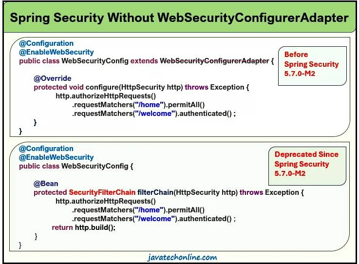

在 Spring Security 模块的上下文中，WebSecurityConfigurerAdapter 是一个抽象类，根据 [Spring 官方网站](https://spring.io/blog/2022/02/21/spring-security-without-the-websecurityconfigureradapter) 2022 年 2 月 21 日发布的公告，该类已从 Spring Security 5.7.0-M2 中弃用。它通常用于扩展 configure() 方法由自定义配置子类实现。因此，它鼓励用户转向基于组件的安全配置。为了支持对这种新配置设计的更改，我们将讨论常见用例列表和未来建议的替代方案。因此，我们将讨论没有 WebSecurityConfigurerAdapter 的 Spring Security 用例的实现。

了解这一变化很重要，因为迟早我们将使用最新版本的 Spring Security 来开发安全功能。让我们讨论“没有 WebSecurityConfigurerAdapter 的 Spring Security”主题及其相关概念。

## 什么是 WebSecurityConfigurerAdapter？

WebSecurityConfigurerAdapter 是 Spring Security 模块提供的一个抽象类。一般来说，我们使用它来重写它的 configure()方法来定义我们的安全配置类。通常，我们在应用程序中实现 Spring Security 时使用两个具有不同参数的 configure() 方法。一种用于声明与身份验证相关的配置，另一种用于声明与授权相关的配置。该代码类似于下面的代码片段。

```java
@Configuration
@EnableWebSecurity
public class SecurityConfiguration extends WebSecurityConfigurerAdapter {

    @Override
    protected void configure(AuthenticationManagerBuilder auth) throws Exception {

         // configure Authentication ......
    }
    @Override
    protected void configure(HttpSecurity http) throws Exception {

        // configure Authorization ......
    }
}
```

## 为什么我们需要学习这个改变？

如果您使用 Spring Boot 2.7.0 和 maven，它将自动下载 Spring Security 5.7.0 或更高版本。在这种情况下，您会发现 WebSecurityConfigurerAdapter 已被弃用。如果您仍然想使用此类而不弃用，您可以在 pom.xml 中将 Spring Boot 版本更改为较低版本（例如 2.6.6 ），如下所示。它将自动下载低于 5.7.0 的 Spring Security 版本，并且弃用警告将消失。

但是，如果您不使用 Spring Boot，而是使用简单的 Spring Security 模块，您甚至可以降低 Spring Security 的版本。

```xml
<parent>
	<groupId>org.springframework.boot</groupId>
	<artifactId>spring-boot-starter-parent</artifactId>
	<version>2.6.6</version>
</parent>
```

这样，我们就可以在没有 WebSecurityConfigurerAdapter 的情况下实现 Spring Security。

## 我们需要在哪里实施这一改变？

以下是一些可能实施此更改的情况。

1. 如果您使用的是 Spring Boot 2.7.0 或更高版本
2. 如果您正在使用 Spring Security 5.7.0 或更高版本
3. 如果你的项目得到如上所述升级或迁移到更高版本

4. 如果您想使用最新版本的 Spring Boot 自定义 Spring Security 配置
5. 如果您想删除 WebSecurityConfigurerAdapter Deprecated 的烦人警告
6. 如果你想在没有 WebSecurityConfigurerAdapter 的情况下实现 Spring Security。

## 如何删除已弃用的警告？

下面就让我们一步一步来学习吧：

1. 如果您使用 STS 作为 IDE 来开发项目，则需要降低 Spring Boot 的版本。如果您使用的是 Spring Boot 2.7.0 或更高版本，请将其设为 2.6.x（例如 2.6.6）。您可以通过更新 pom.xml 来做到这一点。完成后，它将自动下载 Spring Security 模块的兼容版本。

2. 检查您的配置类是否扩展了 WebSecurityConfigurerAdapter 类。已弃用的警告应该消失。现在您可以在没有 WebSecurityConfigurerAdapter 的情况下实现 Spring Security。

## 如何在没有 WebSecurityConfigurerAdapter 的情况下使用 Spring Security？

如上所述，通常我们会在自定义配置类中继承 WebSecurityConfigurerAdapter 的 configure() 方法。因此，我们需要找到这些方法的替代方案，因为自 Spring Security 5.7.0-M2 发布以来，WebSecurityConfigurerAdapter 已被弃用。

让我们讨论一些例子

### 示例#1：使用 WebSecurityConfigurerAdapter

此示例演示了 HttpSecurity 配置。通常，我们编写它来声明授权工件。

```java
@Configuration
@EnableWebSecurity
public class WebSecurityConfig extends WebSecurityConfigurerAdapter {

   @Override
   protected void configure(HttpSecurity http) throws Exception {
     http.cors().and().csrf().disable()
         .and().sessionManagement().sessionCreationPolicy(SessionCreationPolicy.STATELESS)
         .and().authorizeRequests()
         .antMatchers("/home").permitAll()
         .antMatchers("/welcome").authenticated()
         .antMatchers("/admin").hasAuthority("ADMIN")
         .antMatchers("/emp").hasAuthority("EMPLOYEE")
         .antMatchers("/mgr").hasAuthority("MANAGER")
         .anyRequest().authenticated()
     ;
   }
}
```

### 示例#1：没有 WebSecurityConfigurerAdapter

下面的代码演示了在没有 WebSecurityConfigurerAdapter 的情况下实现 Spring Security 的可能解决方案。

```java
@Configuration
@EnableWebSecurity
public class WebSecurityConfig {

   @Bean
   public SecurityFilterChain filterChain(HttpSecurity http) throws Exception {
      http.cors().and().csrf().disable()
        .and().sessionManagement().sessionCreationPolicy(SessionCreationPolicy.STATELESS)
        .and().authorizeRequests()
        .antMatchers("/home").permitAll()
        .antMatchers("/welcome").authenticated()
        .antMatchers("/admin").hasAuthority("ADMIN")
        .antMatchers("/emp").hasAuthority("EMPLOYEE")
        .antMatchers("/mgr").hasAuthority("MANAGER")
        .anyRequest().authenticated();
      return http.build();
   }
}
```

在这里，我们需要执行以下步骤：

- 步骤#1：删除@override，因为我们不会从任何类中扩展和覆盖它。
- 步骤＃2：在此方法上应用@Bean 注解
- 步骤#3：现在将方法返回类型声明为 SecurityFilterChain，而不是 void
- 步骤#4：根据需要更新方法名称。比如说 filterChain。
- 步骤#5：方法结束时，主体返回 http.build()。这里 http 是 HttpSecurity 类型的变量。

### 示例#2：使用 WebSecurityConfigurerAdapter

在下面的示例中，我们使用了这两种方法。

```java
import org.springframework.context.annotation.Configuration;
import org.springframework.security.config.annotation.authentication.builders.AuthenticationManagerBuilder;
import org.springframework.security.config.annotation.web.builders.HttpSecurity;
import org.springframework.security.config.annotation.web.configuration.EnableWebSecurity;
import org.springframework.security.config.annotation.web.configuration.WebSecurityConfigurerAdapter;
import org.springframework.security.web.util.matcher.AntPathRequestMatcher;

@Configuration
@EnableWebSecurity
public class SecurityConfig extends WebSecurityConfigurerAdapter {

   @Override
   protected void configure(AuthenticationManagerBuilder auth) throws Exception {

      // {noop} => No operation for password encoder (no password encoding needed)
      auth.inMemoryAuthentication()
          .withUser("devs")
          .password ("{noop} devs") /no password encoding needed
          .authorities("ADMIN");

      auth.inMemoryAuthentication().withUser("ns").password("{noop}ns").authorities("EMPLOYEE");
      auth.inMemoryAuthentication().withUser("vs").password("{noop}vs").authorities("MANAGER");
   }

   @Override
   protected void configure(HttpSecurity http) throws Exception {

      //declares which Page(URL) will have What access type
      http.authorizeRequests()
          .antMatchers("/home").permitAll()
          .antMatchers("/welcome").authenticated()
          .antMatchers("/admin").hasAuthority("ADMIN")
          .antMatchers("/emp").hasAuthority("EMPLOYEE")
          .antMatchers("/mgr").hasAuthority("MANAGER")
          .antMatchers("/common").hasAnyAuthority("EMPLOYEE","MANAGER")

      //  .anyRequest().authenticated()

      // Login Form Details
         .and()
         .formLogin()
         .defaultSuccessUrl("/welcome", true)

      // Logout Form Details
        .and()
        .logout()
        .logoutRequestMatcher(new AntPathRequestMatcher("/logout"))

      // Exception Details
        .and()
        .exceptionHandling()
        .accessDeniedPage("/accessDenied")
      ;
   }
}
```

### 示例#2：没有 WebSecurityConfigurerAdapter

下面的代码演示了在没有 WebSecurityConfigurerAdapter 的情况下实现 Spring Security 的可能解决方案。

```java
import java.util.ArrayList;
import java.util.List;
import org.springframework.context.annotation.Bean;
import org.springframework.context.annotation.Configuration;
import org.springframework.security.config.annotation.web.builders.HttpSecurity;
import org.springframework.security.config.annotation.web.configuration.EnableWebSecurity;
import org.springframework.security.core.GrantedAuthority;
import org.springframework.security.core.authority.SimpleGrantedAuthority;
import org.springframework.security.core.userdetails.User;
import org.springframework.security.core.userdetails.UserDetails;
import org.springframework.security.provisioning.InMemoryUserDetailsManager;
import org.springframework.security.web.SecurityFilterChain;
import org.springframework.security.web.util.matcher.AntPathRequestMatcher;

@Configuration
@EnableWebSecurity
public class SecurityConfigNew {

    @Bean
    protected InMemoryUserDetailsManager configAuthentication() {

       List<UserDetails> users = new ArrayList<>();
       List<GrantedAuthority> adminAuthority = new ArrayList<>();
       adminAuthority.add(new SimpleGrantedAuthority("ADMIN"));
       UserDetails admin= new User("devs", "{noop}devs", adminAuthority);
       users.add(admin);

       List<GrantedAuthority> employeeAuthority = new ArrayList<>();
       adminAuthority.add(new SimpleGrantedAuthority("EMPLOYEE"));
       UserDetails employee= new User("ns", "{noop}ns", employeeAuthority);
       users.add(employee);

       List<GrantedAuthority> managerAuthority = new ArrayList<>();
       adminAuthority.add(new SimpleGrantedAuthority("MANAGER"));
       UserDetails manager= new User("vs", "{noop}vs", managerAuthority);
       users.add(manager);

       return new InMemoryUserDetailsManager(users);
    }

    @Bean
    protected SecurityFilterChain filterChain(HttpSecurity http) throws Exception {

        //declares which Page(URL) will have What access type
        http.authorizeRequests()
            .antMatchers("/home").permitAll()
            .antMatchers("/welcome").authenticated()
            .antMatchers("/admin").hasAuthority("ADMIN")
            .antMatchers("/emp").hasAuthority("EMPLOYEE")
            .antMatchers("/mgr").hasAuthority("MANAGER")
            .antMatchers("/common").hasAnyAuthority("EMPLOYEE","MANAGER")

        // Any other URLs which are not configured in above antMatchers
        // generally declared aunthenticated() in real time
           .anyRequest().authenticated()

        // Login Form Details
           .and()
           .formLogin()
           .defaultSuccessUrl("/welcome", true)

        // Logout Form Details
          .and()
          .logout()
         .logoutRequestMatcher(new AntPathRequestMatcher("/logout"))

        // Exception Details
         .and()
         .exceptionHandling()
        .accessDeniedPage("/accessDenied")
        ;
    return http.build();
    }
}
```

上面的代码片段是使用 Spring Security 的内存中身份验证的示例。

### 示例#3：使用 WebSecurityConfigurerAdapter

```java
@Configuration
@EnableWebSecurity
public class WebSecurityConfig extends WebSecurityConfigurerAdapter {

    @Autowire
    UserDetailsService userDetailsService;

    @Override
    public void configure(AuthenticationManagerBuilder authenticationManagerBuilder) throws Exception {
        authenticationManagerBuilder.userDetailsService(userDetailsService).passwordEncoder(passwordEncoder());
    }

    @Bean
    public PasswordEncoder passwordEncoder() {
        return new BCryptPasswordEncoder();
    }
}
```

### 示例#3：没有 WebSecurityConfigurerAdapter

下面的代码演示了在没有 WebSecurityConfigurerAdapter 的情况下实现 Spring Security 的可能解决方案。

```java
@Configuration
@EnableWebSecurity
public class WebSecurityConfig {

    @Bean
    AuthenticationManager authenticationManager(AuthenticationConfiguration authenticationConfiguration) throws Exception {
        return authenticationConfiguration.getAuthenticationManager();
    }
}
```

在这里，在旧版本中我们注入 AuthenticationManagerBuilder，设置 userDetailsS​​ervice、passwordEncoder 并构建它。但是 AuthenticationManager 已经在这一步中创建了。它是按照我们想要的方式创建的（使用 userDetailsS​​ervice 和 passwordEncoder）。

### 示例#4：使用 WebSecurityConfigurerAdapter

在实现网络安全配置时，WebSecurityCustomizer 是一个回调接口，可用于自定义 WebSecurity。

```java
@Configuration
@EnableWebSecurity
public class SecurityConfiguration extends WebSecurityConfigurerAdapter {

    @Override
    public void configure(WebSecurity web) {
        web.ignoring().antMatchers("/ignore1", "/ignore2");
    }
}
```

### 示例#4：没有 WebSecurityConfigurerAdapter

从 Spring Security 5.7.0-M2 开始，推荐的方法是注册 WebSecurityCustomizer bean。下面的代码演示了在没有 WebSecurityConfigurerAdapter 的情况下实现 Spring Security 的可能解决方案：

```java
@Configuration
@EnableWebSecurity
public class SecurityConfiguration {

    @Bean
    public WebSecurityCustomizer webSecurityCustomizer() {
        return (web) -> web.ignoring().antMatchers("/ignore1", "/ignore2");
    }
}
```

### 示例#5：使用 WebSecurityConfigurerAdapter

下面的代码演示了 Spring Security 上下文中 JDBC 身份验证的变化。

```java
ong>@Configuration
@EnableWebSecurity
public class SecurityConfig extends WebSecurityConfigurerAdapter {

    @Autowired
    private DataSource dataSource;

    @Autowired
    private BCryptPasswordEncoder passwordEncoder;

    @Override
    protected void configure(AuthenticationManagerBuilder auth) throws Exception {

       auth.jdbcAuthentication()
           .dataSource(dataSource) /creates database connection
           .usersByUsernameQuery("select user_name,user_pwd,user_enabled from user where user_name=?")
           .authoritiesByUsernameQuery("select user_name,user_role from user where user_name=?")
           .passwordEncoder(passwordEncoder);

    }
}
```

### 示例#5：没有 WebSecurityConfigurerAdapter

展望未来，如果我们想在没有 WebSecurityConfigurerAdapter 的情况下实现 Spring Security，新代码将如下所示。

```java
@Configuration
@EnableWebSecurity
public class SecurityConfig {

   @Autowired
   private DataSource dataSource;

   @Bean
   public UserDetailsManager authenticateUsers() {

      UserDetails user = User.withUsername("username")
        .password(PasswordEncoderFactories.createDelegatingPasswordEncoder().encode("password")).build();
      JdbcUserDetailsManager users = new JdbcUserDetailsManager(dataSource);
      users.setAuthoritiesByUsernameQuery("select user_name,user_pwd,user_enabled from user where user_name=?");
      users.setUsersByUsernameQuery("select user_name,user_role from user where user_name=?");
      users.createUser(user);
      return users;
   }
}
```

新的实现将如上所示。这可能不是确切的解决方案。

## Spring Security 6.0.0 或更高版本中有哪些弃用更新？

如果您使用 Spring Security 6.0.0 或更高版本（以及 Spring Boot 3.0 或更高版本），您还会看到其他 API 弃用。例如，以下是需要进行的一些更改：

- authorizeRequests() ->authorizeHttpRequests()

- antMatchers() -> requestMatchers()

- regexMatchers() -> RegexRequestMatchers()

## FAQ

### 在哪里可以找到“没有 WebSecurityConfigurerAdapter 的 Spring Security 的完整示例？”

以下是查找“没有 WebSecurityConfigurerAdapter 的 Spring Security”完整示例的链接：

1. [How To Implement Security In Spring Boot Project?](https://javatechonline.com/how-to-implement-security-in-spring-boot-project/)

2. [How to implement Role Based Spring Security Without WebSecurityConfigurerAdapter in Spring Boot using UserDetailsService?](https://javatechonline.com/how-to-implement-security-in-spring-boot-using-userdetailsservice/)

3. [How to implement JWT Authentication in Spring Boot Project?](https://javatechonline.com/how-to-implement-jwt-authentication-in-spring-boot-project/)

## 结论

在完成了“没有 WebSecurityConfigurerAdapter 的 Spring Security”的所有理论和示例部分之后，最后，我们应该准备好在实时项目中处理警告“WebSecurityConfigurerAdapter Deprecated”。此外，我们希望您扩展“没有 WebSecurityConfigurerAdapter 的 Spring Security”一文中提供的知识，并在您的项目中相应地实现该概念。如需进一步学习 Spring Security，您可以访问 Spring Security 使用 Spring Boot 系列教程。另外，如果后续有任何更新，我们也会对文章进行相应的更新。此外，请随时在下面的评论部分提供您的意见。

原文链接：[https://javatechonline.com/spring-security-without-websecurityconfigureradapter/](https://javatechonline.com/spring-security-without-websecurityconfigureradapter/)
