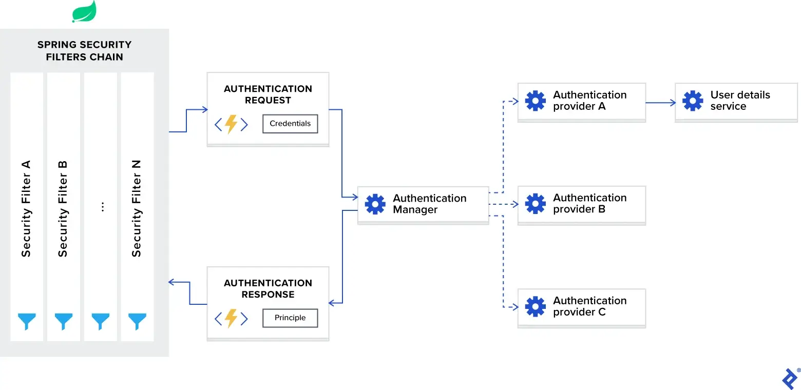

**免责声明：Spring Security 5+ 已发布 OAuth JWT 支持。建议使用最新版本的 OAuth 来支持 JWT，而不是使用自定义安全性或过滤器。**

[Spring](https://spring.io/) 被认为是 Java 生态系统中值得信赖的框架，并且被广泛使用。将 Spring 称为框架不再有效，因为它更多的是涵盖各种框架的总括术语。其中一个框架是 [Spring Security](https://spring.io/projects/spring-security)，它是一个功能强大且可定制的身份验证和授权框架。它被认为是保护基于 Spring 的应用程序的事实标准，因此，如果您希望实现 Spring JWT 令牌解决方案，那么将其基于 Spring Security 是有意义的。

尽管它很受欢迎，但我必须承认，当涉及到单页应用程序时，Spring 的配置并不简单和直接。我怀疑原因是它更多地是作为一个面向应用程序的 MVC 框架开始的，其中网页渲染发生在服务器端，并且通信是基于会话的。

如果后端基于 Java 和 Spring，那么使用 Spring Security 和 JWT 进行身份验证/授权并将其配置为无状态通信是有意义的。虽然有很多文章解释了这是如何完成的，但对我来说，第一次设置它仍然令人沮丧，我必须阅读并总结来自多个来源的信息。这就是我决定编写这个 Spring Security 教程的原因，我将在其中尝试总结并涵盖您在配置过程中可能遇到的所有必需的微妙细节和缺陷。

## 术语定义

在深入探讨技术细节之前，我想明确定义 Spring Security 上下文中使用的术语，以确保我们都使用相同的语言。
这些是我们需要解决的术语：

- **Authentication** 验证是指根据提供的凭据验证用户身份的过程。一个常见的示例是在登录网站时输入用户名和密码。您可以将其视为对“您是谁？”这个问题的答案。
- **Authorization** 授权是指假设用户已成功通过身份验证，则确定用户是否具有执行特定操作或读取特定数据的适当权限的过程。您可以将其视为“用户可以执行/阅读此操作吗？”问题的答案。
- **Principle** 原则是指当前经过身份验证的用户。
- **Granted authority** 授予权限是指经过认证的用户的权限。
- **Role** 角色是指经过身份验证的用户的一组权限。

## 创建基本的 Spring 应用程序

在开始配置 Spring Security 框架之前，让我们创建一个基本的 Spring Web 应用程序。为此，我们可以使用 Spring Initializr 并生成一个模板项目。对于一个简单的 Web 应用程序，只需要 Spring Web 框架依赖就足够了：

```xml
<dependencies>
    <dependency>
        <groupId>org.springframework.boot</groupId>
        <artifactId>spring-boot-starter-web</artifactId>
    </dependency>
</dependencies>
```

创建项目后，我们可以向其中添加一个简单的 REST 控制器，如下所示：

```java
@RestController @RequestMapping("hello")
public class HelloRestController {

    @GetMapping("user")
    public String helloUser() {
        return "Hello User";
    }

    @GetMapping("admin")
    public String helloAdmin() {
        return "Hello Admin";
    }

}
```

之后，如果我们构建并运行该项目，我们可以在 Web 浏览器中访问以下 URL：

- `http://localhost:8080/hello/user` 将返回字符串 `Hello User` 。
- `http://localhost:8080/hello/admin` 将返回字符串 `Hello Admin` 。

现在，我们可以将 Spring Security 框架添加到我们的项目中，我们可以通过将以下依赖项添加到 `pom.xml` 文件中来完成此操作：

```xml
<dependencies>
    <dependency>
      <groupId>org.springframework.boot</groupId>
      <artifactId>spring-boot-starter-security</artifactId>
    </dependency>
</dependencies>
```

在我们提供相应的配置之前，添加其他 Spring 框架依赖项通常不会立即对应用程序产生影响，但 Spring Security 的不同之处在于它确实会立即产生影响，这通常会让新用户感到困惑。添加后，如果我们重建并运行项目，然后尝试访问上述 URL 之一而不是查看结果，我们将被重定向到 `http://localhost:8080/login` 。这是默认行为，因为 Spring Security 框架要求对所有 URL 进行开箱即用的身份验证。

为了通过身份验证，我们可以使用默认用户名 `user` 并在控制台中找到自动生成的密码：

```shell
Using generated security password: 1fc15145-dfee-4bec-a009-e32ca21c77ce
```

请记住，每次重新运行应用程序时密码都会更改。如果我们想改变这种行为并使密码静态，我们可以将以下配置添加到我们的 `application.properties` 文件中：

```properties
spring.security.user.password=Test12345_
```

现在，如果我们在登录表单中输入凭据，我们将被重定向回我们的 URL，我们将看到正确的结果。请注意，开箱即用的身份验证过程是基于会话的，如果我们想注销，可以访问以下 URL： `http://localhost:8080/logout`

这种开箱即用的行为对于具有基于会话身份验证的经典 MVC Web 应用程序可能很有用，但对于单页应用程序来说，它通常没有用，因为在大多数用例中，我们有客户端渲染和基于 JWT 的无状态身份验证。在这种情况下，我们将不得不大量定制 Spring Security 框架，我们将在本文的其余部分中进行此操作。

例如，我们将实现一个经典的[书店 Web 应用程序](https://github.com/Yoh0xFF/java-spring-security-example)，并创建一个后端，该后端将提供用于创建作者和书籍的 CRUD API 以及用于用户管理和身份验证的 API。

## Spring Security 架构概述

在开始自定义配置之前，我们首先讨论一下 Spring Security 身份验证在幕后是如何工作的。

下图展示了流程并显示了如何处理身份验证请求：



现在，让我们将此图分解为多个组件并分别讨论每个组件。

### Spring Security 过滤器链

当您将 Spring Security 框架添加到应用程序时，它会自动注册一个过滤器链来拦截所有传入请求。该链由各种过滤器组成，每个过滤器处理一个特定的用例。

例如：

- 根据配置检查请求的 URL 是否可公开访问。
- 如果是基于会话的身份验证，请检查用户是否已在当前会话中通过身份验证。
- 检查用户是否有权执行请求的操作，等等。

我想提到的一个重要细节是 Spring Security 过滤器以最低顺序注册，并且是第一个被调用的过滤器。对于某些用例，如果您想将自定义过滤器放在它们前面，则需要在它们的顺序中添加填充。这可以通过以下配置来完成：

```properties
spring.security.filter.order=10
```

一旦我们将此配置添加到 `application.properties` 文件中，我们将在 Spring Security 过滤器前面留有 10 个自定义过滤器的空间。

### 认证管理器

您可以将 `AuthenticationManager` 视为一个协调器，您可以在其中注册多个提供程序，并且根据请求类型，它将向正确的提供程序发送身份验证请求。

### 认证提供者

`AuthenticationProvider` 处理特定类型的身份验证。它的接口只公开两个函数：

- `authenticate` 对请求执行身份验证。
- `supports` 检查此提供程序是否支持指定的身份验证类型。

我们在示例项目中使用的接口的一个重要实现是 `DaoAuthenticationProvider` ，它从 `UserDetailsService` 检索用户详细信息。

### UserDetailsService 用户详情服务

`UserDetailsService` 在 Spring 文档中被描述为加载用户特定数据的核心接口。

在大多数用例中，身份验证提供程序根据数据库中的凭据提取用户身份信息，然后执行验证。由于这个用例非常常见，Spring 开发人员决定将其提取为一个单独的接口，公开单个函数：

- `loadUserByUsername` 接受用户名作为参数并返回用户身份对象。

## 使用 JWT 和 Spring Security 进行身份验证

在讨论了 Spring Security 框架的内部结构之后，让我们将其配置为使用 JWT 令牌进行无状态身份验证。

要自定义 Spring Security 以供 JWT 使用，我们需要在类路径中使用 `@EnableWebSecurity` 注释来注释的配置类。此外，为了简化定制过程，框架公开了一个 `WebSecurityConfigurerAdapter` 类。我们将扩展此适配器并覆盖其两个功能，以便：

1. 使用正确的提供程序配置身份验证管理器
2. 配置网络安全（公共 URL、私有 URL、授权等）

```java
@EnableWebSecurity
public class SecurityConfig extends WebSecurityConfigurerAdapter {

    @Override
    protected void configure(AuthenticationManagerBuilder auth) throws Exception {
        // TODO configure authentication manager
    }

    @Override
    protected void configure(HttpSecurity http) throws Exception {
        // TODO configure web security
    }

}
```

在我们的示例应用程序中，我们将用户身份存储在 MongoDB 数据库的 `users` 集合中。这些身份由 `User` 实体映射，它们的 CRUD 操作由 `UserRepo` Spring Data 存储库定义。

现在，当我们接受身份验证请求时，我们需要使用提供的凭据从数据库中检索正确的身份，然后进行验证。为此，我们需要实现 `UserDetailsService` 接口，其定义如下：

```java
public interface UserDetailsService {

    UserDetails loadUserByUsername(String username)
            throws UsernameNotFoundException;

}
```

在这里，我们可以看到需要返回实现 `UserDetails` 接口的对象，并且我们的 `User` 实体实现了它（有关实现的详细信息，请参阅示例项目的存储库）。考虑到它仅公开单函数原型，我们可以将其视为函数式接口，并以 lambda 表达式的形式提供实现。

```java
@EnableWebSecurity
public class SecurityConfig extends WebSecurityConfigurerAdapter {

    private final UserRepo userRepo;

    public SecurityConfig(UserRepo userRepo) {
        this.userRepo = userRepo;
    }

    @Override
    protected void configure(AuthenticationManagerBuilder auth) throws Exception {
        auth.userDetailsService(username -> userRepo
            .findByUsername(username)
            .orElseThrow(
                () -> new UsernameNotFoundException(
                    format("User: %s, not found", username)
                )
            ));
    }

    // Details omitted for brevity

}
```

在这里， `auth.userDetailsService` 函数调用将使用我们的 `UserDetailsService` 接口实现来启动 `DaoAuthenticationProvider` 实例，并将其注册到身份验证管理器中。

除了身份验证提供程序之外，我们还需要使用正确的密码编码架构来配置身份验证管理器，该架构将用于凭据验证。为此，我们需要将 `PasswordEncoder` 接口的首选实现公开为 bean。

在我们的示例项目中，我们将使用 bcrypt 密码哈希算法。

```java
@EnableWebSecurity
public class SecurityConfig extends WebSecurityConfigurerAdapter {

    private final UserRepo userRepo;

    public SecurityConfig(UserRepo userRepo) {
        this.userRepo = userRepo;
    }

    @Override
    protected void configure(AuthenticationManagerBuilder auth) throws Exception {
        auth.userDetailsService(username -> userRepo
            .findByUsername(username)
            .orElseThrow(
                () -> new UsernameNotFoundException(
                    format("User: %s, not found", username)
                )
            ));
    }

    @Bean
    public PasswordEncoder passwordEncoder() {
        return new BCryptPasswordEncoder();
    }

    // Details omitted for brevity

}
```

配置身份验证管理器后，我们现在需要配置 Web 安全性。我们正在实现 REST API，需要使用 JWT 令牌进行无状态身份验证；因此，我们需要设置以下选项：

- 启用 CORS 并禁用 CSRF。
- 将会话管理设置为无状态。
- 设置未授权请求异常处理程序。
- 设置端点的权限。
- 添加 JWT 令牌过滤器。

该配置的实现方式如下：

```java
@EnableWebSecurity
public class SecurityConfig extends WebSecurityConfigurerAdapter {

    private final UserRepo userRepo;
    private final JwtTokenFilter jwtTokenFilter;

    public SecurityConfig(UserRepo userRepo,
                          JwtTokenFilter jwtTokenFilter) {
        this.userRepo = userRepo;
        this.jwtTokenFilter = jwtTokenFilter;
    }

    // Details omitted for brevity

    @Override
    protected void configure(HttpSecurity http) throws Exception {
        // Enable CORS and disable CSRF
        http = http.cors().and().csrf().disable();

        // Set session management to stateless
        http = http
            .sessionManagement()
            .sessionCreationPolicy(SessionCreationPolicy.STATELESS)
            .and();

        // Set unauthorized requests exception handler
        http = http
            .exceptionHandling()
            .authenticationEntryPoint(
                (request, response, ex) -> {
                    response.sendError(
                        HttpServletResponse.SC_UNAUTHORIZED,
                        ex.getMessage()
                    );
                }
            )
            .and();

        // Set permissions on endpoints
        http.authorizeRequests()
            / Our public endpoints
            .antMatchers("/api/public/**").permitAll()
            .antMatchers(HttpMethod.GET, "/api/author/**").permitAll()
            .antMatchers(HttpMethod.POST, "/api/author/search").permitAll()
            .antMatchers(HttpMethod.GET, "/api/book/**").permitAll()
            .antMatchers(HttpMethod.POST, "/api/book/search").permitAll()
            / Our private endpoints
            .anyRequest().authenticated();

        // Add JWT token filter
        http.addFilterBefore(
            jwtTokenFilter,
            UsernamePasswordAuthenticationFilter.class
        );
    }

    // Used by Spring Security if CORS is enabled.
    @Bean
    public CorsFilter corsFilter() {
        UrlBasedCorsConfigurationSource source =
            new UrlBasedCorsConfigurationSource();
        CorsConfiguration config = new CorsConfiguration();
        config.setAllowCredentials(true);
        config.addAllowedOrigin("*");
        config.addAllowedHeader("*");
        config.addAllowedMethod("*");
        source.registerCorsConfiguration("/**", config);
        return new CorsFilter(source);
    }

}
```

请注意，我们在 Spring Security 内部 `UsernamePasswordAuthenticationFilter` 之前添加了 `JwtTokenFilter` 。我们这样做是因为此时我们需要访问用户身份来执行身份验证/授权，并且其提取发生在基于提供的 JWT 令牌的 JWT 令牌过滤器内。其实现方式如下：

```java
@Component
public class JwtTokenFilter extends OncePerRequestFilter {

    private final JwtTokenUtil jwtTokenUtil;
    private final UserRepo userRepo;

    public JwtTokenFilter(JwtTokenUtil jwtTokenUtil,
                          UserRepo userRepo) {
        this.jwtTokenUtil = jwtTokenUtil;
        this.userRepo = userRepo;
    }

    @Override
    protected void doFilterInternal(HttpServletRequest request,
                                    HttpServletResponse response,
                                    FilterChain chain)
            throws ServletException, IOException {
        // Get authorization header and validate
        final String header = request.getHeader(HttpHeaders.AUTHORIZATION);
        if (isEmpty(header) || !header.startsWith("Bearer ")) {
            chain.doFilter(request, response);
            return;
        }

        // Get jwt token and validate
        final String token = header.split(" ")[1].trim();
        if (!jwtTokenUtil.validate(token)) {
            chain.doFilter(request, response);
            return;
        }

        // Get user identity and set it on the spring security context
        UserDetails userDetails = userRepo
            .findByUsername(jwtTokenUtil.getUsername(token))
            .orElse(null);

        UsernamePasswordAuthenticationToken
            authentication = new UsernamePasswordAuthenticationToken(
                userDetails, null,
                userDetails == null ?
                    List.of() : userDetails.getAuthorities()
            );

        authentication.setDetails(
            new WebAuthenticationDetailsSource().buildDetails(request)
        );

        SecurityContextHolder.getContext().setAuthentication(authentication);
        chain.doFilter(request, response);
    }

}
```

在实现我们的登录 API 功能之前，我们还需要执行一步 - 我们需要访问身份验证管理器。默认情况下，它不可公开访问，我们需要在配置类中将其显式公开为 bean。
这可以按如下方式完成：

```java
@EnableWebSecurity
public class SecurityConfig extends WebSecurityConfigurerAdapter {

    // Details omitted for brevity

    @Override @Bean
    public AuthenticationManager authenticationManagerBean() throws Exception {
        return super.authenticationManagerBean();
    }

}
```

现在，我们准备好实现我们的登录 API 函数：

```java
@Api(tags = "Authentication")
@RestController @RequestMapping(path = "api/public")
public class AuthApi {

    private final AuthenticationManager authenticationManager;
    private final JwtTokenUtil jwtTokenUtil;
    private final UserViewMapper userViewMapper;

    public AuthApi(AuthenticationManager authenticationManager,
                   JwtTokenUtil jwtTokenUtil,
                   UserViewMapper userViewMapper) {
        this.authenticationManager = authenticationManager;
        this.jwtTokenUtil = jwtTokenUtil;
        this.userViewMapper = userViewMapper;
    }

    @PostMapping("login")
    public ResponseEntity<UserView> login(@RequestBody @Valid AuthRequest request) {
        try {
            Authentication authenticate = authenticationManager
                .authenticate(
                    new UsernamePasswordAuthenticationToken(
                        request.getUsername(), request.getPassword()
                    )
                );

            User user = (User) authenticate.getPrincipal();

            return ResponseEntity.ok()
                .header(
                    HttpHeaders.AUTHORIZATION,
                    jwtTokenUtil.generateAccessToken(user)
                )
                .body(userViewMapper.toUserView(user));
        } catch (BadCredentialsException ex) {
            return ResponseEntity.status(HttpStatus.UNAUTHORIZED).build();
        }
    }

}
```

在这里，我们使用身份验证管理器验证提供的凭据，如果成功，我们将生成 JWT 令牌并将其作为响应标头与响应正文中的用户身份信息一起返回。

## 使用 Spring Security 进行 JWT 授权

在上一节中，我们设置了 Spring JWT 身份验证过程并配置了公共/私有 URL。对于简单的应用程序来说，这可能已经足够了，但对于大多数实际用例，我们始终需要为用户提供基于角色的访问策略。在本章中，我们将解决这个问题并使用 Spring Security 框架建立基于角色的授权模式。

在我们的示例应用程序中，我们定义了以下三个角色：

- `USER_ADMIN` 允许我们管理应用程序用户。
- `AUTHOR_ADMIN` 允许我们管理作者。
- `BOOK_ADMIN` 允许我们管理书籍。

现在，我们需要将它们应用到相应的 URL：

- `api/public` 可公开访问。
- `api/admin/user` 可以访问具有 `USER_ADMIN` 角色的用户。
- `api/author` 可以访问具有 `AUTHOR_ADMIN` 角色的用户。
- `api/book` 可以访问具有 `BOOK_ADMIN` 角色的用户。

Spring Security 框架为我们提供了两种设置授权模式的选项：

- 基于 URL 的配置
- 基于注释的配置

首先，让我们看看基于 URL 的配置是如何工作的。它可以应用到 Web 安全配置中，如下所示：

```java
@EnableWebSecurity
public class SecurityConfig extends WebSecurityConfigurerAdapter {

    // Details omitted for brevity

    @Override
    protected void configure(HttpSecurity http) throws Exception {
        // Enable CORS and disable CSRF
        http = http.cors().and().csrf().disable();

        // Set session management to stateless
        http = http
            .sessionManagement()
            .sessionCreationPolicy(SessionCreationPolicy.STATELESS)
            .and();

       // Set unauthorized requests exception handler
        http = http
            .exceptionHandling()
            .authenticationEntryPoint(
                (request, response, ex) -> {
                    response.sendError(
                        HttpServletResponse.SC_UNAUTHORIZED,
                        ex.getMessage()
                    );
                }
            )
            .and();

        // Set permissions on endpoints
        http.authorizeRequests()
            // Our public endpoints
            .antMatchers("/api/public/**").permitAll()
            .antMatchers(HttpMethod.GET, "/api/author/**").permitAll()
            .antMatchers(HttpMethod.POST, "/api/author/search").permitAll()
            .antMatchers(HttpMethod.GET, "/api/book/**").permitAll()
            .antMatchers(HttpMethod.POST, "/api/book/search").permitAll()
            // Our private endpoints
            .antMatchers("/api/admin/user/**").hasRole(Role.USER_ADMIN)
            .antMatchers("/api/author/**").hasRole(Role.AUTHOR_ADMIN)
            .antMatchers("/api/book/**").hasRole(Role.BOOK_ADMIN)
            .anyRequest().authenticated();

        // Add JWT token filter
        http.addFilterBefore(
            jwtTokenFilter,
            UsernamePasswordAuthenticationFilter.class
        );
    }

    // Details omitted for brevity

}
```

正如您所看到的，这种方法简单明了，但有一个缺点。我们的应用程序中的授权模式可能很复杂，如果我们在一个地方定义所有规则，它将变得非常大、复杂且难以阅读。因此，我通常更喜欢使用基于注释的配置。

Spring Security 框架为 Web 安全定义了以下注释：

- `@PreAuthorize` 支持 Spring 表达式语言，用于在执行方法之前提供基于表达式的访问控制。
- `@PostAuthorize` 支持 Spring 表达式语言，用于在执行方法后提供基于表达式的访问控制（提供访问方法结果的能力）。
- `@PreFilter` 支持 Spring 表达式语言，用于在根据我们定义的自定义安全规则执行方法之前过滤集合或数组。
- `@PostFilter` 支持 Spring 表达式语言，用于根据我们定义的自定义安全规则过滤执行方法后返回的集合或数组（提供访问方法结果的能力）。
- `@Secured` 不支持 Spring 表达式语言，用于指定方法上的角色列表。
- `@RolesAllowed` 不支持 Spring 表达式语言，是 JSR 250 中 `@Secured` 注释的等效注释。

这些注释默认情况下处于禁用状态，可以在我们的应用程序中启用，如下所示：

```java
@EnableWebSecurity
@EnableGlobalMethodSecurity(
    securedEnabled = true,
    jsr250Enabled = true,
    prePostEnabled = true
)
public class SecurityConfig extends WebSecurityConfigurerAdapter {

    // Details omitted for brevity

}
```

`securedEnabled = true` 启用 `@Secured` 注释。
`jsr250Enabled = true` 启用 `@RolesAllowed` 注释。
`prePostEnabled = true` 启用 `@PreAuthorize` 、 `@PostAuthorize` 、 `@PreFilter` 、 `@PostFilter` 注释。

启用它们后，我们可以在 API 端点上强制执行基于角色的访问策略，如下所示：

```java
@Api(tags = "UserAdmin")
@RestController @RequestMapping(path = "api/admin/user")
@RolesAllowed(Role.USER_ADMIN)
public class UserAdminApi {

	// Details omitted for brevity

}

@Api(tags = "Author")
@RestController @RequestMapping(path = "api/author")
public class AuthorApi {

	// Details omitted for brevity

	@RolesAllowed(Role.AUTHOR_ADMIN)
	@PostMapping
	public void create() { }

	@RolesAllowed(Role.AUTHOR_ADMIN)
	@PutMapping("{id}")
	public void edit() { }

	@RolesAllowed(Role.AUTHOR_ADMIN)
	@DeleteMapping("{id}")
	public void delete() { }

	@GetMapping("{id}")
	public void get() { }

	@GetMapping("{id}/book")
	public void getBooks() { }

	@PostMapping("search")
	public void search() { }

}

@Api(tags = "Book")
@RestController @RequestMapping(path = "api/book")
public class BookApi {

	// Details omitted for brevity

	@RolesAllowed(Role.BOOK_ADMIN)
	@PostMapping
	public BookView create() { }

	@RolesAllowed(Role.BOOK_ADMIN)
	@PutMapping("{id}")
	public void edit() { }

	@RolesAllowed(Role.BOOK_ADMIN)
	@DeleteMapping("{id}")
	public void delete() { }

	@GetMapping("{id}")
	public void get() { }

	@GetMapping("{id}/author")
	public void getAuthors() { }

	@PostMapping("search")
	public void search() { }

}
```

请注意，安全注释可以在类级别和方法级别上提供。

演示的示例很简单，并不代表真实场景，但 Spring Security 提供了一组丰富的注释，如果您选择使用它们，您可以处理复杂的授权模式。

### 角色名称默认前缀

在这个单独的小节中，我想强调一个让很多新用户感到困惑的更微妙的细节。

Spring Security 框架区分两个术语：

- `Authority` 代表个人权限。
- `Role` 代表一组权限。

两者都可以用一个名为 `GrantedAuthority` 的接口来表示，然后使用 Spring Security 注释中的 Spring 表达式语言进行检查，如下所示：

- `Authority`: @PreAuthorize(“hasAuthority(‘EDIT_BOOK’)”)
- `Role`: @PreAuthorize(“hasRole(‘BOOK_ADMIN’)”)

为了使这两个术语之间的区别更加明确，Spring Security 框架默认在角色名称中添加 `ROLE_` 前缀。因此，它不会检查名为 `BOOK_ADMIN` 的角色，而是检查 `ROLE_BOOK_ADMIN` 。

就我个人而言，我发现这种行为令人困惑，并且更喜欢在我的应用程序中禁用它。可以在 Spring Security 配置中禁用它，如下所示：

```java
@EnableWebSecurity
public class SecurityConfig extends WebSecurityConfigurerAdapter {

    // Details omitted for brevity

    @Bean
    GrantedAuthorityDefaults grantedAuthorityDefaults() {
        return new GrantedAuthorityDefaults(""); / Remove the ROLE_ prefix
    }

}
```

## 测试我们的 Spring Security JWT 解决方案

要在使用 Spring Security 框架时通过单元测试或集成测试来测试端点，我们需要添加 `spring-security-test` 依赖项以及 `spring-boot-starter-test` 。我们的 `pom.xml` 构建文件将如下所示：

```xml
<dependency>
    <groupId>org.springframework.boot</groupId>
    <artifactId>spring-boot-starter-test</artifactId>
    <scope>test</scope>
    <exclusions>
        <exclusion>
            <groupId>org.junit.vintage</groupId>
            <artifactId>junit-vintage-engine</artifactId>
        </exclusion>
    </exclusions>
</dependency>

<dependency>
    <groupId>org.springframework.security</groupId>
    <artifactId>spring-security-test</artifactId>
    <scope>test</scope>
</dependency>
```

这种依赖关系使我们能够访问一些注释，这些注释可用于向我们的测试函数添加安全上下文。

These annotations are: 这些注释是：

- `@WithMockUser` 可以添加到测试方法中以模拟使用模拟用户运行。
- `@WithUserDetails` 可以添加到测试方法中，以模拟使用从 `UserDetailsService` 返回的 `UserDetails` 运行。
- `@WithAnonymousUser` 可以添加到测试方法中以模拟匿名用户的运行。当用户想要以特定用户身份运行大部分测试并覆盖一些匿名方法时，这非常有用。
- `@WithSecurityContext` 决定使用什么 `SecurityContext` ，上面描述的所有三个注释都基于它。如果我们有特定的用例，我们可以创建自己的注释，使用 `@WithSecurityContext` 来创建我们想要的任何 `SecurityContext` 。它的讨论超出了我们的 Spring Security 教程的范围，请参阅 Spring Security 文档以获取更多详细信息。

对特定用户运行测试的最简单方法是使用 `@WithMockUser` 注释。我们可以用它创建一个模拟用户并运行测试，如下所示：

```java
@Test @WithMockUser(username="customUsername@example.io", roles={"USER_ADMIN"})
public void test() {
	// Details omitted for brevity
}
```

不过，这种方法有一些缺点。首先，模拟用户不存在，如果运行集成测试，稍后从数据库查询用户信息，测试将失败。其次，mock user 是 `org.springframework.security.core.userdetails.User` 类的实例，它是 Spring 框架对 `UserDetails` 接口的内部实现，如果我们有自己的实现，这可能会导致后面的冲突，在测试执行期间。

如果前面的缺点阻碍了我们的应用程序，那么 `@WithUserDetails` 注释就是正确的选择。当我们有自定义 `UserDetails` 和 `UserDetailsService` 实现时使用它。它假设用户存在，因此我们必须在数据库中创建实际行或在运行测试之前提供 `UserDetailsService` 模拟实例。

我们可以这样使用这个注解：

```java
@Test @WithUserDetails("customUsername@example.io")
public void test() {
	// Details omitted for brevity
}
```

这是我们示例项目集成测试中的首选注释，因为我们有上述接口的自定义实现。

使用 `@WithAnonymousUser` 允许以匿名用户身份运行。当您希望使用特定用户运行大多数测试但以匿名用户身份运行一些测试时，这尤其方便。例如，以下将使用模拟用户运行 test1 和 test2 测试用例，并使用匿名用户运行 test3：

```java
@SpringBootTest
@AutoConfigureMockMvc
@WithMockUser
public class WithUserClassLevelAuthenticationTests {

    @Test
    public void test1() {
        // Details omitted for brevity
    }

    @Test
    public void test2() {
        // Details omitted for brevity
    }

    @Test @WithAnonymousUser
    public void test3() throws Exception {
        // Details omitted for brevity
    }
}
```

## 征服 Spring Security JWT 学习曲线

最后，我想提一下，Spring Security 框架可能不会赢得任何选美比赛，而且它的学习曲线肯定很陡峭。我遇到过很多情况，由于其初始配置的复杂性，它被一些自行开发的解决方案所取代。但是，一旦开发人员了解其内部结构并设法设置初始配置，它的使用就会变得相对简单。

在本 Spring Security 教程中，我尝试演示配置的所有微妙细节，希望您会发现这些示例很有用。有关完整的代码示例，请参阅我的示例 [Spring Security 项目](https://github.com/Yoh0xFF/java-spring-security-example)的 Git 存储库。

原文链接：[https://www.toptal.com/spring/spring-security-tutorial](https://www.toptal.com/spring/spring-security-tutorial)
