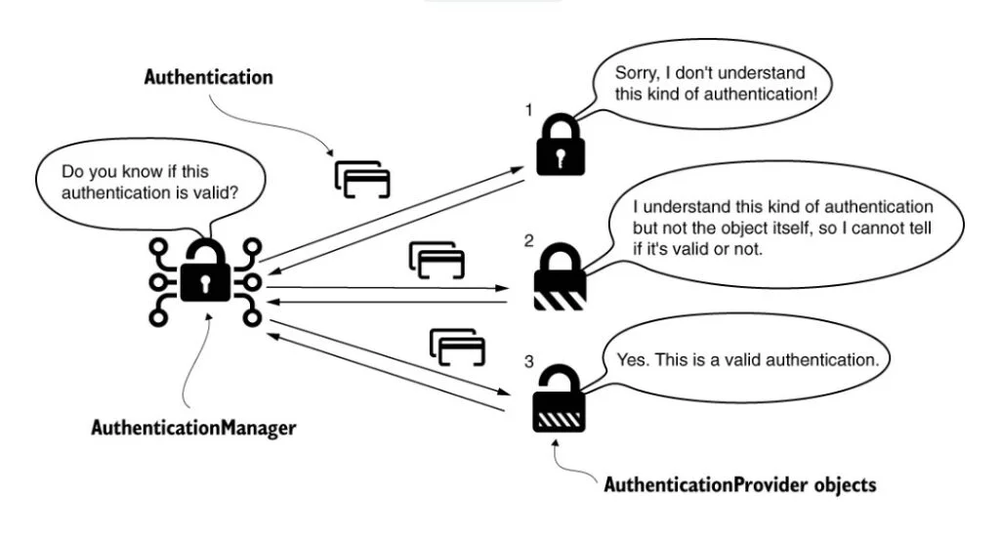

本面试准备指南将讨论一些常见的 Spring Security 面试问题。无论您是准备面试还是只是想增强对 Spring Security 的了解，这些问题都将帮助您理解关键概念并指导您设计常见安全问题的解决方案。

## 1. Spring Security 的核心特性是什么？

Spring Security 提供的两个最突出的功能是身份验证和授权。这些功能在确保应用程序的安全性方面发挥着至关重要的作用。然而，Spring Security 超越了身份验证和授权，还提供了额外的功能来防止漏洞利用并与其他框架集成。

### 1.1.验证

身份验证是验证尝试访问应用程序的用户身份的过程。 Spring Security 提供多种身份验证方法（基于表单的身份验证、HTTP 基本身份验证、OAuth2、Siteminder、OpenID Connect、LDAP、JDBC 等），允许应用程序使用各种方法对用户进行身份验证。

它还支持自定义，当默认选项不满足要求时，可以实现自定义的身份验证机制。

### 1.2.授权

授权是向经过身份验证的用户或实体授予许可或权利的过程。用户或实体成功通过身份验证后，授权将决定他们可以在应用程序中访问哪些操作或资源。 Spring Security 为开发人员提供了多种方法来实现授权并控制用户对应用程序不同部分的访问。以下是一些常见的方法：

- **基于 Web URL 的授权**：可以根据特定的 URL 或 URL 模式实施访问控制，规范哪些用户可以访问某些资源。
- **方法级授权**：如果需要，甚至可以对 Java Bean 中的方法进行访问控制，从而在方法级提供细粒度的授权。
- **域实例级授权**：Spring Security 提供了控制对特定域实例的访问的能力，允许基于某些实体的所有权或关联进行授权。

### 1.3.防止漏洞利用

Spring Security 提供了多种功能来防范常见的 Web 应用程序安全漏洞。一些显着的功能包括：

- **跨站请求伪造 (CSRF) 保护**：Spring Security 会自动将 CSRF 令牌添加到表单和 AJAX 请求中，从而防止 CSRF 攻击。
- **跨站脚本 (XSS) 保护**：Spring Security 支持输出编码，并提供实用程序通过清理用户输入来防止 XSS 攻击。
- **点击劫持保护**：Spring Security 包括 X-Frame-Options 支持，以防止点击劫持攻击。

### 1.4.集成

Spring Security 与其他框架和库无缝集成，以增强应用程序的安全性。一些关键的集成是：

- **Spring MVC**：Spring Security 与 Spring MVC 集成，为 Web 应用程序提供无缝的安全功能。它可以安全地处理请求、身份验证、授权并防止常见的 Web 漏洞。
- **Spring Data**：Spring Security 与 Spring Data 集成，以便在查询中引用当前用户。这种集成确保可以根据身份验证和授权规则轻松访问和过滤用户特定的数据。
- **Jackson**：Jackson 的支持可以实现 Spring Security 相关类的高效序列化和反序列化，特别是在使用分布式会话或 Spring Session 等框架时，从而提高效率和可扩展性。
- **密码学**：Spring Security 与各种密码库和算法集成，以提供敏感信息的安全存储和传输。这种集成包括密码散列、加密和安全通信协议等功能，以保护数据的机密性和完整性。

有关 Spring Security 功能的更详细信息，请参阅[官方文档](https:/docs.spring.io/spring-security/reference/features/index.html)。

## 2.解释一下 Spring Security 的核心组件？

当谈到 Spring Security 时，几个核心组件在为 Java 应用程序提供安全功能方面发挥着至关重要的作用。这些组件协同工作以确保强大的身份验证、授权和其他安全功能。


### 2.1.委托过滤代理

`DelegatingFilterProxy`是 Spring 框架提供的一个特殊的 Servlet Filter。它充当处理安全相关请求的入口点。当收到请求时，`DelegatingFilterProxy` 将请求委托给 Spring FilterChainProxy bean 进行进一步处理（`springSecurityFilterChain` bean）。 `FilterChainProxy` 利用`SecurityFilterChain` 来确定为当前请求调用的适当的过滤器集。

### 2.2.过滤器链代理

`FilterChainProxy` 根据传入请求的 URL 模式和定义的安全配置确定要应用哪些过滤器。它根据配置的安全规则评估请求并选择适当的过滤器链（使用`@EnableWebSecurity`， `FilterChainProxy` 自动创建为 bean。它包装实际的安全过滤器链并充当处理请求的委托）。

### 2.3.安全过滤链

当收到请求时，`FilterChainProxy` 会找到相应的 `SecurityFilterChain` 并执行该链中的过滤器列表。每个过滤器根据应用程序的安全配置执行其指定的任务。过滤器可以修改请求、执行身份验证检查、验证权限或处理与会话相关的操作。

Spring Security 中的一些重要安全过滤器包括：

- `UsernamePasswordAuthenticationFilter`：此过滤器通过拦截登录请求并根据用户提供的凭据对用户进行身份验证来处理基于表单的身份验证。
- `BasicAuthenticationFilter`：此过滤器处理基本身份验证，用户在 HTTP 标头中以用户名和密码的形式提供凭据。
- `RememberMeAuthenticationFilter`：此过滤器启用 `Remember-Me` 功能，允许用户使用存储在 cookie 中的持久令牌自动登录。
- `LogoutFilter`：此过滤器处理注销过程、使用户会话无效、清除身份验证详细信息以及执行其他操作（例如重定向到特定注销页面）。
- `ExceptionTranslationFilter`：此过滤器捕获请求处理期间引发的任何身份验证或访问相关的异常，并将其转换为有意义的响应，例如重定向到登录页面或返回禁止的响应。

一旦请求到达`SecurityFilterChain`内注册的过滤器，相应的过滤器就会将请求委托给其他 bean 来执行相应的任务。例如，`AuthenticationProcessingFilter` 准备 `Authentication` 实例并将其委托给 `AuthenticationManager` 进行身份验证流程。



### 2.4.认证管理器

`AuthenticationManager` 负责对用户进行身份验证。它有一个名为 `authenticate` () 的方法，该方法将 `Authentication` 实例作为参数。 `authenticate` () 方法负责验证所提供的凭据（在 `AuthenticationProvider` 的适当实现的帮助下），并在身份验证成功时返回经过身份验证的 `Authentication` 对象。

默认情况下，Spring Security 提供了一个名为 `ProviderManager` 的 `AuthenticationManager` 接口的实现。 `ProviderManager` 将身份验证过程委托给 `AuthenticationProvider` 实例列表。

### 2.5.认证提供者

`AuthenticationProvider` 负责验证特定类型的凭证或身份验证机制。它定义了针对特定源（例如用户数据库、外部身份验证服务或任何其他自定义身份验证机制）执行身份验证的合同。

当应用程序中使用多种身份验证机制时，可以配置多个 `AuthenticationProvider` 实例来单独处理每种机制。

更多信息请参考[官方文档](https:/docs.spring.io/spring-security/reference/servlet/architecture.html)。

## 3. Spring Security 如何处理用户认证？

在较高级别上，Spring Security 通过一系列步骤处理用户身份验证。大多数步骤对于各种身份验证都是通用的，但很少有身份验证流程需要特定步骤。

以下步骤演示了基于表单登录的身份验证，其中用户在请求中输入用户名/密码组合。


- 用户尝试访问受保护的资源或发起登录请求，该请求被 Spring Security 拦截，并将我们重定向到登录页面。
- 身份验证过滤器 `UsernamePasswordAuthenticationFilter` 负责从请求中捕获用户的凭据（通常为每个对 /login 发出的请求调用 `UsernamePasswordAuthenticationFilter` ）。
- `UsernamePasswordAuthenticationFilter` 提取用户名和密码并创建一个 Authentication 对象（来自 `UsernamePasswordAuthenticationToken` 的实例）。
- 然后将 `Authentication` 对象传递给 `AuthenticationManager`。
- `AuthenticationManager` 将身份验证过程委托给一个或多个 `AuthenticationProvider`。
- `AuthenticationProvider` 使用具有方法 `loadUserByUsername(username)` 的 `UserDetailsS`​​ervice bean 验证凭据。它返回包含用户数据的 `UserDetails` 对象。如果没有找到具有给定用户名的用户，则抛出 `UsernameNotFoundException` 。
- 如果身份验证成功，则将包含经过身份验证的用户信息的 `Authentication` 对象返回到 `AuthenticationManager`。
- `AuthenticationManager` 将经过身份验证的 `Authentication` 对象存储在 `SecurityContext` 中。
- 安全上下文通常存储在线程局部变量中，使其可以在整个应用程序中访问。
- 用户经过身份验证后，Spring Security 允许用户访问请求的资源或继续执行请求的操作。

## 4. AuthenticationManager 如何确定合适的 AuthenticationProvider？

在身份验证过程中，`AuthenticationManager` 接收代表用户凭据的 `Authentication` 对象。 `AuthenticationManager` 循环访问每个 `AuthenticationProvider` 并调用它们的 `supports(Class<?> authentication)` 方法来确定提供程序是否支持特定类型的 `Authentication` 对象。每个 `AuthenticationProvider` 都实现此方法，并且通常检查提供程序是否可以根据身份验证对象的类处理身份验证请求。

这是 `ProviderManager` 源代码中的代码片段，它是 `AuthenticationManager` 的默认实现：

```java
public Authentication authenticate(Authentication authentication) throws AuthenticationException {
		Class<? extends Authentication> toTest = authentication.getClass();
		/ .......
		for (AuthenticationProvider provider : getProviders()) {
			if (!provider.supports(toTest)) {
				continue;
			}
               / ......
}
```

一旦找到支持给定身份验证对象的 `AuthenticationProvider`，`AuthenticationManager` 就会调用提供程序的 `authenticate(Authentication authentication)` 方法。此方法执行特定于该提供程序的身份验证逻辑，例如根据用户数据库或外部身份验证服务验证凭据。

## 5. Spring Security 如何处理用户授权？

在较高的层面上，Spring Security 通过一个涉及多个组件协同工作的过程来处理用户授权。


以下是该过程的概述。

- 一旦请求通过身份验证，就会进入授权阶段。 `FilterChainProxy` 调用过滤器链中适当的授权过滤器。
- `AuthorizationFilter` 从 `SecurityContextHolder` 检索 `Authentication` 对象。然后，它将授权过程委托给 `AuthorizationManager`，后者负责根据配置的访问控制规则和权限做出最终的授权决策。 `AuthorizationManager` 取代 `AccessDecisionManager` 和 `AccessDecisionVoter`。
- `AuthorizationFilter` 使用 `Authentication` 对象和 HTTP 请求构造`Supplier` 对象。然后将此供应商传递给`RequestMatcherDelegatingAuthorizationManager` 的 `check` () 方法，这是 Spring Security 使用的默认`AuthorizationManager`。
- `RequestMatcherDelegatingAuthorizationManager` 根据配置的 `RequestMatcher` 实例评估提供的 `Supplier` ，以确定请求的资源是否与任何指定的访问控制规则匹配。
- `RequestMatcherDelegatingAuthorizationManager` 的 `check` 方法返回一个 `AuthorizationDecision` 对象。如果授权决策是 `false` ，表示访问被拒绝，则会抛出异常（通常是 `403 Access Denied` 异常）。
- 另一方面，如果授权决策是 `true` ，表示授予访问权限，则过滤器链将继续执行，直到到达 `DispatcherServlet`。链中的每个过滤器执行其指定的任务，例如请求预处理、安全检查或任何其他自定义功能。

## 6.什么是密码编码器？默认编码器是什么？

`PasswordEncoder` 是一个用于使用 `encode()` 和 `matches() `方法对密码进行编码和验证的接口。它负责获取用户的密码，应用单向哈希算法，并安全地存储哈希密码。当用户尝试登录时，输入的密码会使用相同的算法再次进行哈希处理，并将生成的哈希值与存储的哈希密码进行比较以进行身份 ​​ 验证。

默认密码编码器是 `BCryptPasswordEncoder`。 BCrypt 是一种广泛使用的安全哈希算法，它结合了加盐和成本因素，以防止各种类型的攻击，包括暴力攻击。 `BCryptPasswordEncoder` 是密码存储的不错选择，因为它提供了高级别的安全性。

```java
@Bean
public PasswordEncoder passwordEncoder() {
  return new BCryptPasswordEncoder();
}
```

对于自定义要求，我们还可以配置自定义密码编码器。

### 实现 PasswordEncoder 接口

创建一个实现 `PasswordEncoder` 接口的类。此类将提供编码和验证密码的实现。

```java
public class CustomPasswordEncoder implements PasswordEncoder {
    @Override
    public String encode(CharSequence rawPassword)
        / Implement your password encoding logic here
        / Return the encoded password as a String
    }
    @Override
    public boolean matches(CharSequence rawPassword, String encodedPassword) {
        / Implement your password verification logic here
        / Compare the rawPassword with the encodedPassword and return true or false
    }
}
```

### 配置自定义密码编码器

在 Spring Security 配置中，我们可以通过定义 `PasswordEncoder` bean 来指定自定义密码编码器的使用。 Spring Security 将使用这个 bean 进行密码编码和验证。

```java
@Configuration
@EnableWebSecurity
public class SecurityConfig {
    @Bean
    public PasswordEncoder passwordEncoder() {
        return new CustomPasswordEncoder();
    }
    / Other security configuration code
}
```

## 7. 如何在非 Spring boot 应用程序中启用 Spring 安全性？

当谈到在非 Spring Boot 应用程序中启用 Spring Security 时，我们可以采取几种方法。让我们探讨两种标准方法：

- 基于 Java 的配置
- 基于 XML 的配置

### 使用 AbstractSecurityWebApplicationInitializer 进行基于 Java 的配置

在 Java 配置中，我们可以通过扩展 `AbstractSecurityWebApplicationInitializer` 类并选择性地重写其方法来配置 `DelegatingFilterProxy` 并将其与 `springSecurityFilterChain` bean 关联来启用 Spring Security。它避免在 `web.xml` 文件中写入 servlet-filter 配置。

我们可以在 SecurityConfig.java 中定义自定义安全 bean。

```java
public class SpringSecurityInitializer extends AbstractSecurityWebApplicationInitializer {
   public SpringSecurityInitializer() {
       super(SecurityConfig.class);
   }
}
```

### 基于 XML 的配置

在 XML 配置中，我们需要显式定义 `DelegatingFilterProxy` bean 并使用过滤器名称将其映射到 `springSecurityFilterChain` bean。此链接通常在 web.xml 文件中完成：

```xml
<filter>
  <filter-name>springSecurityFilterChain</filter-name>
  <filter-class>org.springframework.web.filter.DelegatingFilterProxy</filter-class>
</filter>
<filter-mapping>
  <filter-name>springSecurityFilterChain</filter-name>
  <url-pattern>/*</url-pattern>
  <dispatcher>ERROR</dispatcher>
  <dispatcher>REQUEST</dispatcher>
</filter-mapping>
```

## 8. 如何在 Spring boot 应用程序中启用 Spring 安全性？

如果我们使用 Spring Boot，启用 Spring Security 就非常简单。我们需要做的就是将 Spring Security starter 添加到项目的依赖项中，默认情况下自动配置将可用。这是因为当 Spring Security 位于类路径中时，`WebSecurityEnablerConfiguration` 会自动为我们激活 @EnableWebSecurity 注解。

```xml
<dependency>
    <groupId>org.springframework.boot</groupId>
    <artifactId>spring-boot-starter-security</artifactId>
</dependency>
```

## 9. Spring Security 中@EnableWebSecurity 的用途是什么？

`@EnableWebSecurity` 注解用于启用应用程序的 Web 安全性。当此注释添加到配置类时，表示该类将提供必要的配置和设置来保护 Web 应用程序。

在非 Spring boot 应用程序中，@EnableWebSecurity 注释除了提供开发人员编写的自定义配置 bean 之外，还会隐式执行以下任务。

- 创建 Spring Security 过滤器链：它初始化并配置负责处理传入请求和应用安全措施的过滤器链。
- 配置安全上下文：它设置用于处理身份验证和授权的安全上下文。安全上下文保存有关当前经过身份验证的用户及其授予的权限的信息。

在 Spring boot 应用程序中，使用 @EnableWebSecurity 注释是可选的。 Spring boot 安全自动配置提供了与使用@EnableWebSecurity 注释几乎相同的功能。

当在 Spring boot 应用程序中使用 @EnableWebSecurity 时，默认的自动配置会后退，并提供的配置优先。

```java
@Configuration
@EnableWebSecurity
public class SecurityConfig {
    @Bean
    public WebSecurityCustomizer webSecurityCustomizer() {
        return (web) -> web.ignoring()
            .requestMatchers("/resources/**");
    }
    @Bean
    public SecurityFilterChain securityFilterChain(HttpSecurity http) throws Exception {
        http.authorizeHttpRequests()
            .requestMatchers("/public/**").permitAll()
            .anyRequest().hasRole("USER")
        .and()
            .formLogin().permitAll();
        return http.build();
    }
    / Possibly more bean methods ...
}
```

## 10. Spring Security 中的角色和权限有什么区别？

在 Spring Security 中，角色和权限都用于定义和管理用户权限。然而，两者之间有一个微妙的区别：

- **角色**：角色代表广泛的权限类别或权限组。它通常用于将相关权限分组在一起。可以将角色分配给用户，并且用户可以拥有多个角色。例如，角色可以是“管理员”、“用户”或“管理员”。角色通常用于高级访问控制决策。
- **权限**：权限也称为权限或特权，表示用户可以拥有的特定权限。它定义了细粒度的访问控制级别。权限直接或通过角色授予用户。例如，权限可以是“READ_DATA”、“WRITE_DATA”或“DELETE_DATA”。权威机构用于精确的访问控制决策。

## 11.如何使用注解实现方法安全？

除了 URL 级别的安全性之外，Spring Security 还支持方法级别的安全性。要在 Spring Security 中使用注解实现方法级安全性，我们可以使用@EnableMethodSecurity 注解任何@Configuration 类。

```java
@Configuration
@EnableWebSecurity
@EnableMethodSecurity
public class SecurityConfig {
    /..
}
```

现在我们可以通过@Secured、@PreAuthorize、@PostAuthorize、@PreFilter 和@PostFilter 注解来授权方法调用，包括输入参数和返回值。

在以下示例中， `deleteProduct` 方法使用 @PreAuthorize 注释进行保护，表达式 `hasRole('ADMIN')` 确保只有具有“ADMIN”角色的用户才能调用此方法。

```java
@PreAuthorize("hasRole('ADMIN')")
public void deleteProduct(Long productId) {
    / Method logic for deleting a product
}
```

默认情况下，Spring boot 中方法安全性是禁用的。

## 12.什么是基本身份验证？如何实施？

基本身份验证是一种简单的身份验证机制，其中客户端在每个请求的 HTTP 标头中包含用户名和密码（凭据以“ `username:password` ”格式发送，然后在包含之前进行 Base64 编码在 `Authorization` 标头中）。然后，服务器验证凭据，如果正确，则授予对所请求资源的访问权限。

为了在 Spring Security 中启用基本身份验证，我们使用 `*httpBasic*()` 方法。

```java
@Bean
public SecurityFilterChain securityFilterChain (HttpSecurity http) throws Exception {
    http.authorizeHttpRequests()
        .anyRequest().authenticated()
        .and()
    .httpBasic();
    return http.build();
}
```

## 13.什么是 JWT 认证？如何实施？

JWT（JSON Web Token）身份验证是一种流行的身份验证机制，它使用基于 JSON 的令牌在各方之间安全地传输身份验证和授权信息。它支持无状态身份验证，并且无需在服务器端存储会话。


要在 Spring Security 中实现 JWT 身份验证，我们可以按照以下步骤操作：

- **包含必要的依赖项**： `spring-security-jwt` 和用于 JWT 处理的库（例如 `jjwt` ）。
- **实现 JWT 令牌提供程序**：创建一个负责生成 JWT 令牌的类。此类应包含用于创建和签署 JWT、设置声明以及指定过期时间的方法。
- **实现 JWT 身份验证过滤器**：创建自定义过滤器来拦截传入请求，从请求标头中提取 JWT 令牌并对其进行验证。此过滤器应使用 JWT 令牌提供程序来验证令牌的签名并提取必要的用户详细信息。
- **使用 Spring Security 配置 JWT 身份验证过滤器**：我们应该配置 JWT 身份验证过滤器以用于处理身份验证请求
- **实现用户详细信息服务**：创建一个用户详细信息服务，根据 JWT 令牌中存储的信息检索用户的详细信息。该服务负责从用户存储库或任何其他数据源获取用户详细信息。

有关实现细节的更多信息，请阅读 [Spring Security 中的 JWT 身份验证](https:/howtodoinjava.com/spring-security/jwt-auth-vuejs-spring-boot-security/)一文。

## 14. 如何实现 OAuth2 安全性？

OAuth2 是一个授权框架，允许应用程序获得对用户帐户的有限访问权限。它涉及多个组件，包括授权服务器和资源服务器。授权服务器处理身份验证并颁发访问令牌，而资源服务器托管受保护的资源并验证访问令牌。

要[实现 OAuth2 安全性](https:/howtodoinjava.com/spring-security/oauth2-login-with-spring-boot-security/)，您需要[配置授权服务器和资源服务器](https:/howtodoinjava.com/spring-boot2/oauth2-auth-server/)。

### 授权服务器

授权服务器负责对用户进行身份验证并颁发访问令牌。在 Spring Security 中，我们可以使用 AuthorizationServerConfigurerAdapter 类来配置授权服务器。

以下类设置授权服务器，定义安全约束，并配置可以访问服务器的客户端以获取访问令牌以进行身份 ​​ 验证和授权。

```java
@Configuration
@EnableAuthorizationServer
public class OAuth2AuthorizationServer extends AuthorizationServerConfigurerAdapter {
    @Autowired
    private BCryptPasswordEncoder passwordEncoder;
    @Override
    public void configure(AuthorizationServerSecurityConfigurer security) throws Exception {
        security
            .tokenKeyAccess("permitAll()")
            .checkTokenAccess("isAuthenticated()");
            .allowFormAuthenticationForClients();
    }
    @Override
    public void configure(ClientDetailsServiceConfigurer clients) throws Exception {
         clients.inMemory()
            .withClient("client-id")
            .secret("client-secret")
            .authorizedGrantTypes("authorization_code", "password", "refresh_token")
            .scopes("read", "write")
            .accessTokenValiditySeconds(3600)
            .refreshTokenValiditySeconds(86400);
    }
}
```

### 资源服务器

资源服务器托管受保护的资源并验证访问令牌。在 Spring Security 中，我们可以使用 ResourceServerConfigurerAdapter 类来配置资源服务器。

在以下示例中，OAuth2ResourceServerConfig 通过指定不同 API 端点的访问规则来配置资源服务器。它允许不受限制地访问公共资源，同时要求对私人访问进行身份验证。

```java
@Configuration
@EnableResourceServer
public class OAuth2ResourceServerConfig extends ResourceServerConfigurerAdapter {
    @Override
    public void configure(HttpSecurity http) throws Exception {
        http.authorizeRequests()
            .antMatchers("/api/public/**").permitAll()
            .antMatchers("/api/private/**").authenticated();
    }
}
```

资源服务器需要验证访问令牌，以确保它是由受信任的授权服务器颁发的，并且没有过期或被篡改。

一种常见的方法是使用 Spring Security 提供的 `RemoteTokenServices` 类。资源服务器向授权服务器的 `/oauth/check_token` 端点发出请求，并将访问令牌作为参数传递。

```java
@Bean
public ResourceServerTokenServices tokenService() {
   RemoteTokenServices tokenServices = new RemoteTokenServices();
   tokenServices.setClientId("client-id");
   tokenServices.setClientSecret("client-secret");
   tokenServices.setCheckTokenEndpointUrl("http:/localhost:8080/oauth/check_token");
   return tokenServices;
}
```

## 15. Spring Security 中的 CSRF 保护是什么？如何实施？

CSRF（跨站点请求伪造）保护是一种安全机制，可防止攻击者利用用户和网站之间的信任。它可以防范 CSRF 攻击，即攻击者在用户不知情或未同意的情况下诱骗用户的浏览器在网站上执行不需要的操作。

要在 Spring Security 中实现 CSRF 保护，我们可以按照以下步骤操作：

- 在客户端代码（通常采用 HTML 表单）中，向应用程序端点发出请求时，将 CSRF 令牌作为隐藏字段或请求标头包含在内。
- 在服务器端，配置 Spring Security 以期望并验证传入请求中的 CSRF 令牌。

默认情况下，Spring Security 自动启用 CSRF 保护。它将 CSRF 令牌添加到表单中并将其包含在后续请求中。

我们可以使用 `csrf()` 方法在 Spring Security 中配置/自定义 CSRF 保护。

```java
@Configuration
public class SecurityWithCsrfCookieConfig {
    @Bean
    public SecurityFilterChain filterChain(HttpSecurity http) throws Exception {
        http
          .csrf()
          .csrfTokenRepository(CookieCsrfTokenRepository.withHttpOnlyFalse());
        return http.build();
    }
}
```

在上面的示例中，我们将 CSRF 保护配置为使用 CookieCsrfTokenRepository 并通过设置 `withHttpOnlyFalse()` 确保 JavaScript 可以访问 CSRF 令牌。我们可以根据我们的需求选择不同的 `CsrfTokenRepository` 实现。

## 16. 什么是 CORS 以及 Spring Security 中如何处理它？

CORS（跨源资源共享）是 Web 浏览器强制执行的一种安全机制，用于限制跨源 HTTP 请求。它允许服务器指定允许哪些源（域）访问其资源。

在 Spring Security 中，有两种方法可以在我们的应用程序中配置 CORS：

### 全局配置

我们可以通过创建 CorsConfigurationSource 类的 bean 来全局配置 CORS 支持。在此示例中，我们将 CORS 策略配置为允许来自指定源（本例中为 `http:/localhost:8081` ）的跨源请求。

```java
@Bean
public CorsConfigurationSource corsConfigurationSource() {
    CorsConfiguration config = new CorsConfiguration();
    config.setAllowCredentials(true);
    config.addAllowedHeader("*");
    config.addAllowedMethod("*");
    config.addAllowedOrigin("http:/localhost:8081");
    UrlBasedCorsConfigurationSource source = new UrlBasedCorsConfigurationSource();
    source.registerCorsConfiguration("/**", config);
    return source;
}
```

### 处理程序方法特定的配置

如果我们只需要特定端点的 CORS，我们可以在方法级别使用 `@CrossOrigin` 注释。这允许我们指定允许的源、HTTP 方法和其他配置。

在此示例中， `/api/resource` 端点仅允许使用指定 HTTP 方法来自 `http:/example.com` 的跨源请求。

```java
@RestController
public class MyController {
    @GetMapping("/api/resource")
    @CrossOrigin(origins = "http:/example.com", methods = {RequestMethod.GET, RequestMethod.POST})
    public String getResource() {
        /...
    }
}
```

## 17.解释一下基于会话的身份验证？

基于会话的身份验证是 Web 应用程序中管理用户身份验证的常用方法。它涉及使用会话和 cookie 来维护身份验证状态并识别经过身份验证的用户。


基于会话的身份验证的工作原理如下：

- **用户身份验证**：当用户使用有效凭据登录应用程序时，服务器会验证凭据并为用户创建新会话。会话通常由唯一的会话 ID 组成。
- **会话创建**：服务器将用户的会话 ID 存储在会话存储（例如内存或数据库）中，并将其与用户的身份验证详细信息和任何相关会话数据（例如用户角色、权限）相关联。
- **会话 ID 存储**：服务器将会话 ID 作为 cookie 或响应负载的一部分发送回客户端。客户端的 Web 浏览器存储此会话 ID。
- **后续请求**：客户端的 Web 浏览器自动将会话 ID 包含在后续请求的请求标头（通常作为 cookie）中。这允许服务器识别用户的会话并检索相关的身份验证详细信息。
- **会话验证**：服务器收到请求后，会验证会话 ID，以确保其真实性和完整性。它检查会话是否存在并且仍然有效（例如，未过期或无效）。如果会话有效，服务器将认为用户已通过身份验证并继续处理请求。
- **会话过期**：会话通常有一个过期时间，以确保安全性和管理服务器资源。一旦会话过期，用户需要通过重新登录来重新进行身份验证。
- **注销**：当用户注销时，服务器会通过将会话从会话存储中删除来使其无效。客户端的 Web 浏览器还会删除会话 ID cookie。

## 18. 如何防止暴力破解？

防止暴力攻击涉及实施一些措施，使攻击者难以通过重复登录尝试猜测有效凭据。

以下是我们可以用来降低暴力攻击风险的一些策略：

- **帐户锁定**：实施帐户锁定机制，在一定次数的登录尝试失败后临时锁定用户帐户。这可以阻止攻击者不断猜测密码。帐户被锁定后，用户可以收到通知或获得安全解锁帐户的方法，例如通过密码重置过程或联系客户支持。
- **速率限制**：应用速率限制技术来限制特定时间范围内的登录尝试次数。这可以防止攻击者快速连续发出多个登录请求。实施速率限制可以减慢攻击过程并降低其效率，从而帮助减轻暴力攻击。
- **CAPTCHA 或 reCAPTCHA**：将 CAPTCHA（区分计算机和人类的完全自动化公共图灵测试）或 reCAPTCHA 挑战集成到您的登录表单中。这些挑战要求用户解决谜题或输入扭曲图像中显示的字符，这有助于确保登录尝试是由人类用户而不是自动脚本进行的。
- **双因素身份验证 (2FA)**：实施双因素身份验证以添加额外的安全层。使用 2FA，除了用户名和密码之外，用户还需要提供第二种形式的身份验证，例如发送到其移动设备的唯一代码。即使攻击者设法获得有效凭据，这也大大降低了暴力攻击成功的风险。

## 19. Spring Security 中如何处理注销？

在基于会话的身份验证中，注销涉及销毁会话对象并删除用户浏览器中的会话 cookie。这可以通过配置 `HttpSecurity` 来实现，如下所示：

```java
http
    / Other security configurations...
    .logout()
        .invalidateHttpSession(true) / Invalidate the user's HttpSession
        .deleteCookies("JSESSIONID") / Remove the session cookie
        .logoutSuccessUrl("/login?logout") / Redirect to the logout success URL
        .permitAll(); / Allow anyone to access the logout URL
```

## 20. 迁移过程中如何支持多个密码编码器？

要在 Spring Security 迁移期间支持多个密码编码器，您可以使用 Spring Security 提供的 DelegatingPasswordEncoder。 DelegatingPasswordEncoder 允许您配置多个密码编码器，并将每个编码器与标识符或“id”相关联。

```java
@Bean
public PasswordEncoder passwordEncoder() {
    Map<String, PasswordEncoder> encoders = new HashMap<>();
    encoders.put("bcrypt", new BCryptPasswordEncoder());
    encoders.put("custom", new CustomPasswordEncoder()); / Replace with your custom encoder
    return new DelegatingPasswordEncoder("bcrypt", encoders);
}
```

在上面的例子中，我们配置了两个密码编码器：

- `BCryptPasswordEncoder`
- `CustomPasswordEncoder`

`DelegatingPasswordEncoder` 使用默认编码器 ID（“bcrypt”）和编码器映射进行初始化。在身份验证过程中，Spring Security 将根据编码密码的前缀或提供的编码器 ID 确定适当的编码器。

## 21.保护 REST-API 的最佳实践？

实施 REST API 安全性涉及多种注意事项，以保护 API 免受未经授权的访问并确保数据完整性。

- `身份验证`：实施安全的身份验证机制来验证发出 API 请求的客户端的身份。常见方法包括基于令牌的身份验证（例如 JWT）、OAuth 2.0 或 API 密钥。选择适合应用程序要求的身份验证方法并将其集成到 API 端点中。
- `授权`：定义访问控制规则以确定每个经过身份验证的客户端可以访问哪些操作或资源。使用基于角色或基于权限的授权机制对 API 端点实施限制。 Spring Security 提供了诸如 `@PreAuthorize` 或 `@RolesAllowed` 之类的注释来在方法或端点级别配置授权规则。
- `安全传输层`：通过强制执行 HTTPS 确保客户端和 API 服务器之间的安全通信。这对客户端和服务器之间交换的数据进行加密，防止其被窃听和篡改。配置您的服务器以使用 SSL/TLS 证书并为所有 API 端点启用 HTTPS。
- `输入验证`：验证和清理用户输入，以防止常见的安全漏洞，例如 SQL 注入、跨站点脚本 (XSS) 或其他注入攻击。应用输入验证技术和框架来清理和验证用户提供的数据，以降低安全漏洞的风险。
- `速率限制`：实施速率限制机制以防止滥用并确保 API 资源的公平使用。定义特定时间段内每个客户端或每个 API 端点允许的请求数量的限制。这有助于防止 DoS（拒绝服务）攻击并确保 API 的可用性和性能。
- `日志记录和监控`：当我们必须解决不明显且难以重现的问题时，日志记录和监控有助于在雨天进行调试。

## 22. Spring Security 如何与 Mobile App Security 配合使用？

Spring Security 能够与移动应用程序安全性无缝集成，提供强大的身份验证和授权功能。

一种流行的方法是基于令牌的安全性，其中移动应用程序向服务器发送身份验证请求并获取令牌（例如 JWT）作为响应。随后，该令牌将包含在所有后续 API 请求中，以用作授权机制。

## 结论

这本常见 Spring Security 面试问题和答案的综合指南探讨了身份验证、授权和 Spring Security 的各种组件等关键概念。我们深入研究了密码编码、请求匹配、方法安全注释以及与其他框架的集成等主题。通过熟悉这些面试问题及其答案，您可以在面试期间自信地处理 Spring Security 相关的讨论。

快乐学习！

原文链接：[Spring Security Interview Questions](https:/howtodoinjava.com/interview-questions/spring-security-interview-questions/)
