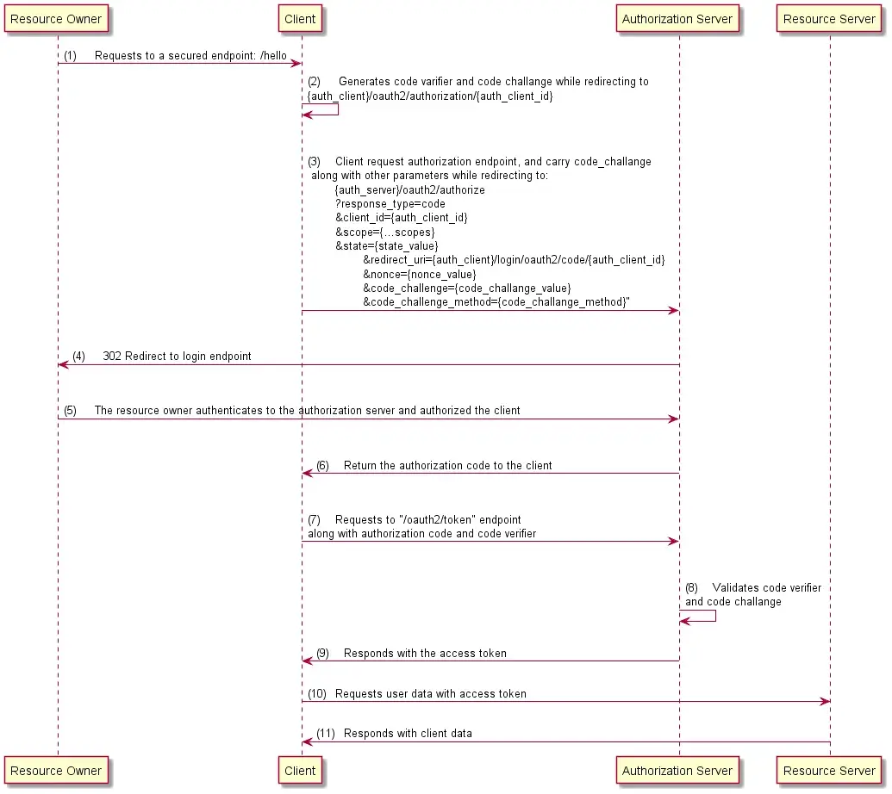
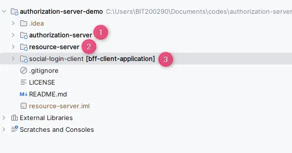
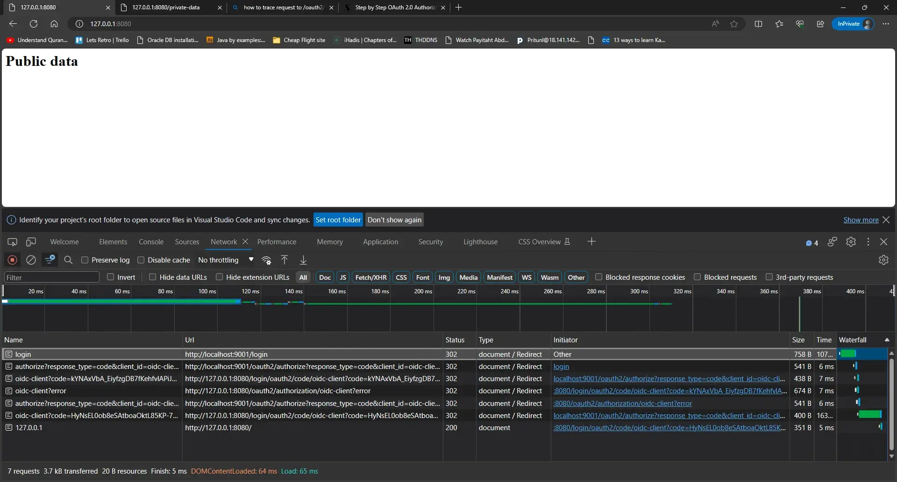
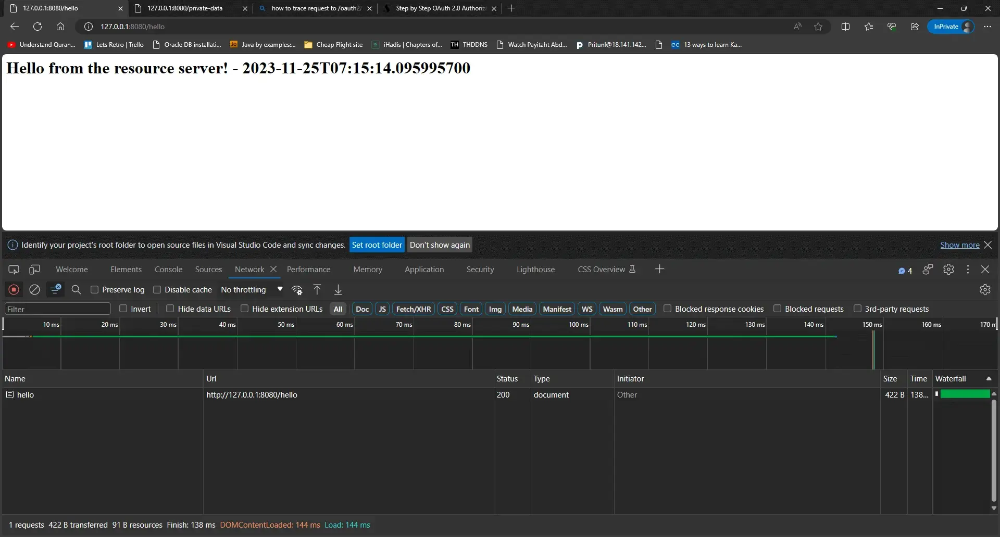

原文地址：<https://mainul35.medium.com/oauth2-with-spring-part-5-securing-your-spring-boot-application-with-pkce-for-enhanced-security-d8025cd08769>


> 免责声明：本文技术性很强，需要清楚了解本系列前几篇文章，特别是第 1 部分和第 3 部分。

带有代码交换证明密钥 (PKCE) 的授权代码流用于无法存储客户端机密的应用程序。此类应用程序包括：

- 原生应用程序——可以反编译并检索客户端凭证的移动应用程序。
- 单页应用 — 整个源代码可在浏览器中使用。因此，无法安全地存储客户端机密。

## 怎么运行的



Spring Boot OAuth2 与 PKCE


希望这张图已经足够清晰易懂了。因此，我将直接进入演示。

对于此演示，我们有 3 台服务器。



1. 授权服务器：在端口 9001 上运行。
2. 资源服务器：在端口8090上运行。
3. 社交登录客户端（BFF）：在端口 8080 上运行。

让我们看一下代码。

## 授权服务器

**一、pom.xml**

授权服务器的 pom.xml 中没有太多需要解释的变化

**application.yml.yml**

*application.yml*文件有很多更改，特别是删除了客户端注册。当前版本的*application.yml*非常简短，如下所示。

```yml
server:
  port: 9001

logging:
  level:
    org:
      springframework:
        security: trace
```

三. **SecurityConfig 类**

所有的安全配置以及客户端和用户详细信息注册、JWT token 解码都放在此类中

```java
@Configuration
public class SecurityConfig {

    / This first SecurityFilterChain Bean is only specific to authorization server specific configurations
    / More on this can be found in this stackoverflow question answers:
    / https://stackoverflow.com/questions/69126874/why-two-formlogin-configured-in-spring-authorization-server-sample-code
    @Bean
    @Order(1)
    public SecurityFilterChain authorizationServerSecurityFilterChain(HttpSecurity http) throws Exception {

        OAuth2AuthorizationServerConfiguration.applyDefaultSecurity(http);
        http.getConfigurer(OAuth2AuthorizationServerConfigurer.class).oidc(withDefaults());

        return http
                .exceptionHandling(e -> e
                        .authenticationEntryPoint(new LoginUrlAuthenticationEntryPoint("/login")))
                .oauth2ResourceServer(httpSecurityOAuth2ResourceServerConfigurer ->
                                              httpSecurityOAuth2ResourceServerConfigurer.jwt(withDefaults())
                )
                .build();

    }

    / This second SecurityFilterChain bean is responsible for any other security configurations
    @Bean
    @Order(2)
    public SecurityFilterChain clientAppSecurityFilterChain(HttpSecurity http) throws Exception {
        return http
                .formLogin(withDefaults())
                .authorizeHttpRequests(authorize ->authorize.anyRequest().authenticated())
                .build();

    }

    / In-memory user registration
    @Bean
    public UserDetailsService userDetailsService() {
        var user1 = User.withUsername("user")
                .password("{noop}secret")
                .authorities("read")
                .build();
        return new InMemoryUserDetailsManager(user1);
    }

    / In-memory authorization server client registration
    @Bean
    public RegisteredClientRepository registeredClientRepository() {
        RegisteredClient registeredClient = RegisteredClient.withId("oidc-client")
                .clientId("oidc-client")
                .clientSecret("{noop}secret")
                .scope("read")
                .scope(OidcScopes.OPENID)
                .scope(OidcScopes.PROFILE)
                .scope("write")
                .redirectUri("http://127.0.0.1:8080/login/oauth2/code/oidc-client")
                .clientAuthenticationMethod(ClientAuthenticationMethod.CLIENT_SECRET_BASIC)
                .authorizationGrantType(AuthorizationGrantType.AUTHORIZATION_CODE)
                .authorizationGrantType(AuthorizationGrantType.REFRESH_TOKEN)
                .clientSettings(clientSettings())
                .build();

        return new InMemoryRegisteredClientRepository(registeredClient);
    }

    /**
     * Creating this bean initialized the following endpoints:
     * /oauth2/authorize
     * /oauth2/device_authorization
     * /oauth2/token
     * /oauth2/jwks
     * /oauth2/revoke
     * /oauth2/introspect
     * /connect/register
     * /userinfo
     * /connect/logout
     *
     * For java based client registration configuration, it is very important to initialize this bean
    */
    @Bean
    public AuthorizationServerSettings authorizationServerSettings() {
        return AuthorizationServerSettings.builder().build();
    }

    @Bean
    ClientSettings clientSettings() {
        return ClientSettings.builder()
                .requireAuthorizationConsent(true)  / Display post-login authorization consent screen
                .requireProofKey(true)              / flag to enable Proof Key for Code Exchange (PKCE)
                .build();
    }

    @Bean
    public JwtDecoder jwtDecoder(JWKSource<SecurityContext> jwkSource) {
        return OAuth2AuthorizationServerConfiguration.jwtDecoder(jwkSource);
    }

    @Bean
    public JWKSource<SecurityContext> jwkSource() {
        RSAKey rsaKey = generateRsa();
        JWKSet jwkSet = new JWKSet(rsaKey);
        return (jwkSelector, securityContext) -> jwkSelector.select(jwkSet);
    }

    public static RSAKey generateRsa() {
        KeyPair keyPair = generateRsaKey();
        RSAPublicKey publicKey = (RSAPublicKey) keyPair.getPublic();
        RSAPrivateKey privateKey = (RSAPrivateKey) keyPair.getPrivate();
        return new RSAKey.Builder(publicKey).privateKey(privateKey).keyID(UUID.randomUUID().toString()).build();
    }

    static KeyPair generateRsaKey() {
        KeyPair keyPair;
        try {
            KeyPairGenerator keyPairGenerator = KeyPairGenerator.getInstance("RSA");
            keyPairGenerator.initialize(2048);
            keyPair = keyPairGenerator.generateKeyPair();
        } catch (Exception ex) {
            throw new IllegalStateException(ex);
        }
        return keyPair;
    }
}
```

现在启动授权服务器。

## 资源服务器

一、**pom.xml**

pom.xml 必须包含*spring-boot-starter-oauth2-resource-server*依赖项以及其他依赖项。

```xml
<dependency>
    <groupId>org.springframework.boot</groupId>
    <artifactId>spring-boot-starter-oauth2-resource-server</artifactId>
</dependency>
```

从配置角度来看，资源服务器仅包含application.yml

**application.yml**

我们需要在*application.yml*文件中提及令牌发行者 uri。

```
server:
  port: 8090

spring:
  security:
    oauth2:
      resourceserver:
        jwt:
          issuer-uri: http://localhost:9001
```

三.****SecurityConfig****

SecurityConfig 类的目的是验证来自授权服务器的访问令牌，并根据需要为资源服务器本身定义的端点添加额外的安全配置。

## social-login-client

一、**pom.xml**

pom.xml 必须包含*spring-boot-starter-oauth2-client*依赖项以及其他依赖项。此外，由于我们使用了 webClient，因此我们添加了*spring-boot-starter-webflux*依赖项。

```xml
<dependency>
     <groupId>org.springframework.boot</groupId>
     <artifactId>spring-boot-starter-oauth2-client</artifactId>
  </dependency>

  <dependency>
     <groupId>org.springframework.boot</groupId>
     <artifactId>spring-boot-starter-webflux</artifactId>
  </dependency>
```

**application.yml**

application.yml*文件*包含客户端本身的配置以及授权过程中要通信的 URL。下面给出了我的*oidc-client*注册的完整代码。

```yml
spring:
  security:
    oauth2:
      client:
        registration:

          # Client registration starts here
          oidc-client:

            # Our oidc-client needs a provider. The provider information has been registered
            # at the bottom of this configuration
            provider: spring

            # The following client-id and client-secret will be sent to the authorization server
            # We don't need to mention the client_credentials in the grant type here.
            # Note that, here the client-secret must not contain {noop} or any other encoding type mentioned.
            client-id: oidc-client
            client-secret: secret

            # Our authorization grant type is authorization_code
            authorization-grant-type: authorization_code

            # The following redirect URL is the redirect URL definition of our client Server application.
            # It is generally the current application host address. The authorization server's redirect URL
            # definition means that this URL will be triggered when auth server redirects data to here.
            redirect-uri: http://127.0.0.1:8080/login/oauth2/code/oidc-client

            # Scopes that will be displayed for requesting in the consent page.
            # Authorization server must have equal or more scopes than these in number
            scope:
              - openid
              - profile
              - read
              - write

            # This client name will display in the login screen as social login type
            client-name: oidc-client

        # As mentioned above about provider, here we register the provider details
        # for any unknown provider with their issuer URI
        provider:
          spring:
            issuer-uri: http://localhost:9001
```

三.**SecurityConfig**

我们需要编写 SecurityConfig 类以使 PKCE 能够生成代码解析器和代码质询，放置 OAuth2Login 端点的逻辑并保护客户端应用程序中定义的端点。

完整的代码如下所示。

```java
@Configuration
public class SecurityConfig {

    @Bean
    SecurityFilterChain securityFilterChain(HttpSecurity http, ClientRegistrationRepository clientRegistrationRepository) throws Exception {

        String base_uri = OAuth2AuthorizationRequestRedirectFilter.DEFAULT_AUTHORIZATION_REQUEST_BASE_URI;
        DefaultOAuth2AuthorizationRequestResolver resolver = new DefaultOAuth2AuthorizationRequestResolver(clientRegistrationRepository, base_uri);

        / Responsible for enabling PKCE, to generate code verifier, code challenge
        resolver.setAuthorizationRequestCustomizer(OAuth2AuthorizationRequestCustomizers.withPkce());

        http
            .authorizeHttpRequests(authorize -> authorize
                    .requestMatchers("/").permitAll()
                    .anyRequest().authenticated())
            .oauth2Login(oauth2Login -> {
                oauth2Login.loginPage("/oauth2/authorization/oidc-client");
                oauth2Login.authorizationEndpoint(authorizationEndpointConfig ->
                  authorizationEndpointConfig.authorizationRequestResolver(resolver)
                );
            })
            .oauth2Client(withDefaults());
        return http.build();
    }
}
```

iv. **WebClientConfig**

为了让 webClient 无缝地与 OAuth2 协同工作，我们需要定义*WebClientConfig*并添加更多 bean。

```java
@Configuration
public class WebClientConfig {
    @Bean
    public HelloClient helloClient(OAuth2AuthorizedClientManager authorizedClientManager) throws Exception {
        return httpServiceProxyFactory(authorizedClientManager).createClient(HelloClient.class);
    }

    private HttpServiceProxyFactory httpServiceProxyFactory(OAuth2AuthorizedClientManager authorizedClientManager) {
        ServletOAuth2AuthorizedClientExchangeFilterFunction oauth2Client =
                new ServletOAuth2AuthorizedClientExchangeFilterFunction(authorizedClientManager);

        oauth2Client.setDefaultOAuth2AuthorizedClient(true);
        WebClient webClient = WebClient.builder()
                .apply(oauth2Client.oauth2Configuration())
                .build();
        WebClientAdapter client = WebClientAdapter.forClient(webClient);
        return HttpServiceProxyFactory.builder(client).build();
    }

    @Bean
    public OAuth2AuthorizedClientManager authorizedClientManager(
            ClientRegistrationRepository clientRegistrationRepository,
            OAuth2AuthorizedClientRepository authorizedClientRepository) {

        OAuth2AuthorizedClientProvider authorizedClientProvider =
                OAuth2AuthorizedClientProviderBuilder.builder()
                        .authorizationCode()
                        .refreshToken()
                        .build();

        DefaultOAuth2AuthorizedClientManager authorizedClientManager =
                new DefaultOAuth2AuthorizedClientManager(
                        clientRegistrationRepository, authorizedClientRepository);

        authorizedClientManager.setAuthorizedClientProvider(authorizedClientProvider);

        return authorizedClientManager;
    }

}
```

*如果您注意到HelloClient*的 bean ，这样我们就可以定义更多的客户端，使业务服务（资源服务器）调用过程更容易。

v.**调用资源服务器**

我们需要定义一个

```java
@HttpExchange("http://localhost:8090")
public interface HelloClient {

    @GetExchange("/")
    String getHello();
}
```

现在让我们从控制器调用*getHello()*方法。

```java
@RestController
@RequestMapping("/")
public class AppController {

    @Autowired
    private AppService appService;

    private final HelloClient helloClient;

    public AppController(HelloClient helloClient) {
        this.helloClient = helloClient;
    }

    @GetMapping("/")
    public ResponseEntity<String> getPublicData() {
        return ResponseEntity.ok("Public data");
    }

    @GetMapping("/private-data")
    public ResponseEntity<String> getPrivateData() {
        return ResponseEntity.ok(appService.getJwtToken());
    }

    @GetMapping("/hello")
    public ResponseEntity<String> sayHello () {
        return ResponseEntity.ok(helloClient.getHello());
    }
}
```

## 在浏览器中测试的时间

在开始之前，让我们更改 application.yml 中的日志配置以查看所有 3 个服务器的调试日志。

```yml
logging:
  level:
    org.springframework.boot: error
    org.springframework.security: debug
    org.springframework.security.web: debug
    org.apache.catalina: error
    com.mainul35:
      - info
      - trace
      - debug
      - error
      - warn
```

现在，我们在浏览器中输入**(1)** [http://localhost:8080/hello 。它将带我们到授权服务器的登录端点，在我们的例子中是](http://localhost:8080/hello)http://localhost:9001/login。但在此之前，它会进行几次重定向。让我们先通过浏览器的网络选项卡查看它。


网络响应

如果我们注意到上述网络响应，我们可以看到，当我们请求 /hello 端点时，它首先将我们重定向到**(2)** http://localhost:8080/oauth2/authorization/oidc-client端点。

然后，从客户端授权端点，我们再次被重定向到授权服务器的以下端点。**（3）**

[http://localhost:9001/oauth2/authorize?response_type=code&client_id=oidc-client&scope=openid%20profile%20read%20write&state=vyMkXghiz-H25RLcNWijBsduVpmam2sAA4_OMWmTysw%3D&redirect_uri=http://127.0.0.1:8080/login/oauth2/code/oidc-client&nonce=yBuntyu9zBQ_HnSpi4iB1npHn4FvbUffNwzAA6st-wc&code_challenge=rSsAc3XOlEWf3GpDfPMVM7OhQX6RLXN-_X7ozWvJyrM&code_challenge_method=S256](http://localhost:9001/oauth2/authorize?response_type=code&client_id=oidc-client&scope=openid+profile+read+write&state=vyMkXghiz-H25RLcNWijBsduVpmam2sAA4_OMWmTysw%3D&redirect_uri=http%3A%2F%2F127.0.0.1%3A8080%2Flogin%2Foauth2%2Fcode%2Foidc-client&nonce=yBuntyu9zBQ_HnSpi4iB1npHn4FvbUffNwzAA6st-wc&code_challenge=rSsAc3XOlEWf3GpDfPMVM7OhQX6RLXN-_X7ozWvJyrM&code_challenge_method=S256)

当授权服务器发现该请求尚未获得授权时，它会再次重定向到授权服务器的登录端点。（4）

[http://localhost:9001/登录](http://localhost:9001/login)

现在，让我们提供正确的用户凭证并观察。


提供登录凭证后

它首先使用 POST 方法将表单提交到登录端点。我们可以在浏览器网络选项卡中看到另一个重定向。

接下来，如果身份验证成功，我们将进入授权同意屏幕。网址如下。**（5）**

[http://localhost:9001/oauth2/authorize?response_type=code&client_id=oidc-client&scope=openid%20profile%20read%20write&state=hD5CGxSzNt_PZrzbUBKDqjszrouPKsfk027pRTzaPFY%3D&redirect_uri=http://127.0.0.1:8080/login/oauth2/code/oidc-client&nonce=azp457lnXYfTag62hBwuThxMQ66NeVmdlMQSnzI4lfQ&code_challenge=8ZfGPgaJ96i14R39t7IM_540GdxFIo0XAlmmfnelgIE&code_challenge_method=S256&continue](http://localhost:9001/oauth2/authorize?response_type=code&client_id=oidc-client&scope=openid+profile+read+write&state=hD5CGxSzNt_PZrzbUBKDqjszrouPKsfk027pRTzaPFY%3D&redirect_uri=http%3A%2F%2F127.0.0.1%3A8080%2Flogin%2Foauth2%2Fcode%2Foidc-client&nonce=azp457lnXYfTag62hBwuThxMQ66NeVmdlMQSnzI4lfQ&code_challenge=8ZfGPgaJ96i14R39t7IM_540GdxFIo0XAlmmfnelgIE&code_challenge_method=S256&continue=)

> 注意，如果我们授权应用程序但未获得所有同意，则可能会将我们重定向到相同的同意屏幕。因此，在提供一些同意后，我们可以点击取消，或提供所有同意。

现在，让我们提供一些同意并继续。就我的情况而言，我将提供所有同意并提交。



长话短说，成功登录后，它会将我们重定向到客户端应用程序的 /login/oauth2/code/oidc-client 端点，并附带授权码参数。使用此代码，我们可以请求 /oauth2/token 端点来获取访问令牌。

现在我们可以再次向 /hello 端点发出请求并查看其是否正常工作。



来自 /hello 端点的响应

## 为什么收到代码后没有对 /oauth/token 端点发出任何请求？

**从IETF网站提供的以下OAuth2 for Browser based Apps**草案中我们可以看到，对于PKCE，它不必在授权服务器中颁发访问令牌。


以下是草案的链接：[draft-ietf-oauth-browser-based-apps-10](https://datatracker.ietf.org/doc/html/draft-ietf-oauth-browser-based-apps-10#name-notational-conventions)

如果我们仍然想获取令牌，在我的客户端应用程序中，我提供了一个端点[127.0.0.1:8080/private-data](http://127.0.0.1:8080/private-data)，我们可以通过它获取令牌。


完整的源代码可以在[这里](https://github.com/mainul35/authorization-server-demo/tree/authorization-server-demo/social-login-with-oidc-pkce)找到


## 参考：

1. [draft-ietf-oauth-基于浏览器的应用程序-10](https://datatracker.ietf.org/doc/html/draft-ietf-oauth-browser-based-apps-10#name-notational-conventions)
2. [基于浏览器的应用程序 (SPA) 的实施指南 · 问题 #297 · spring-projects/spring-authorization-server (github.com)](https://github.com/spring-projects/spring-authorization-server/issues/297)
3. [Spring Boot 3 教程：使用 PKCE 实现安全 Oauth2 — Spring 授权服务器 — 和 OAuth2 客户端 — YouTube](https://www.youtube.com/watch?v=mKvi9RWGn3M)
