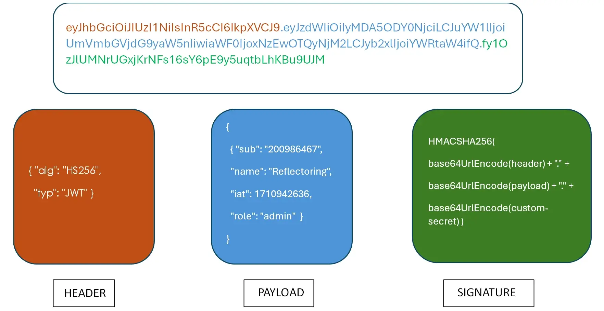
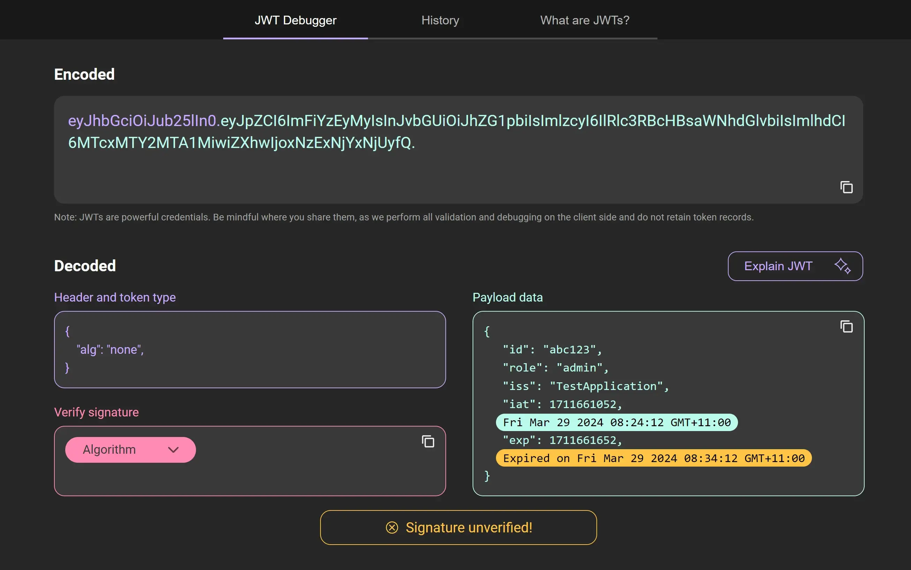
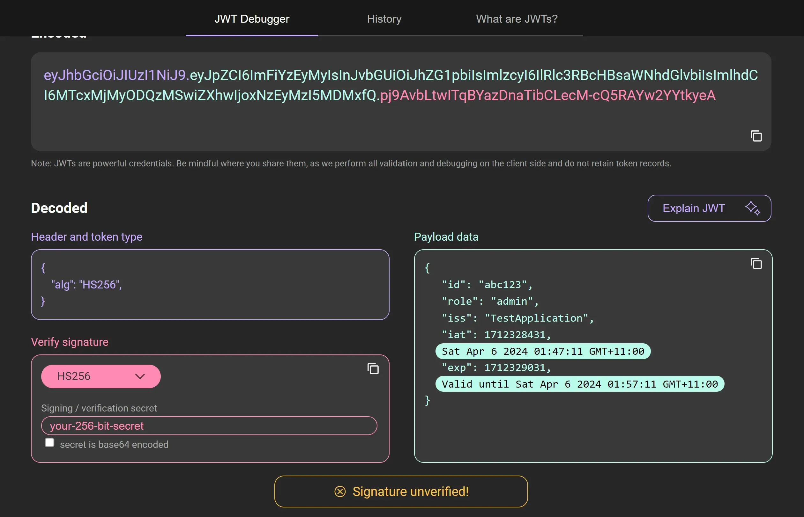
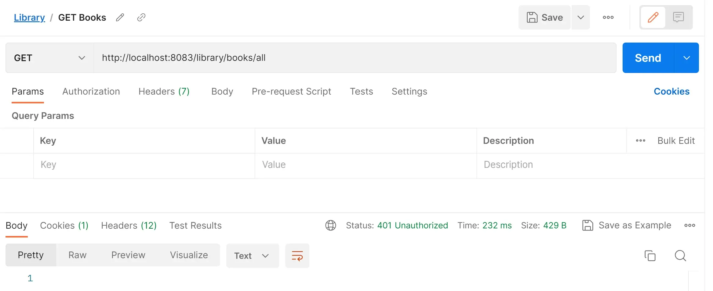
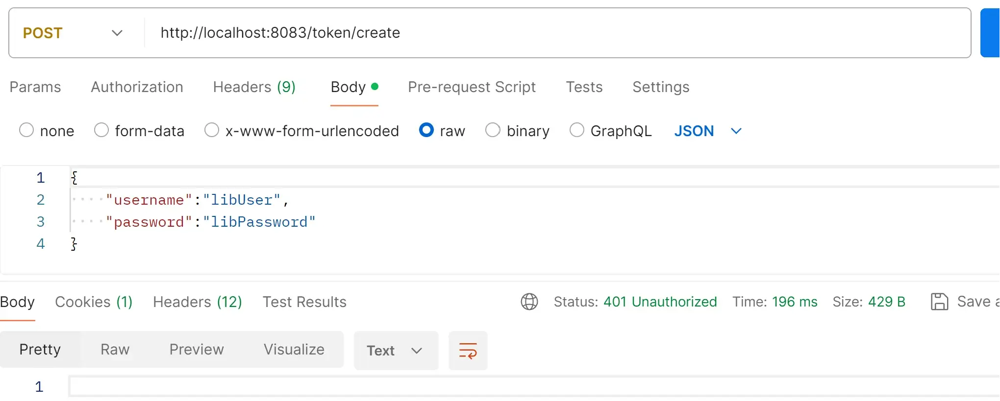
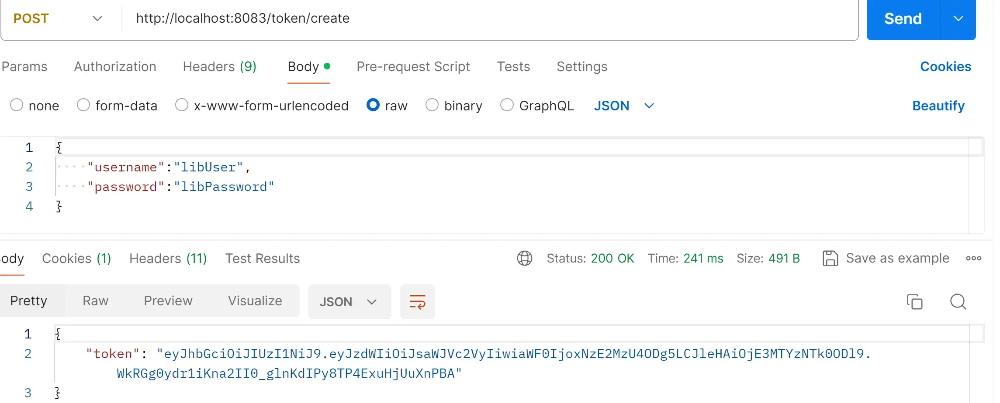
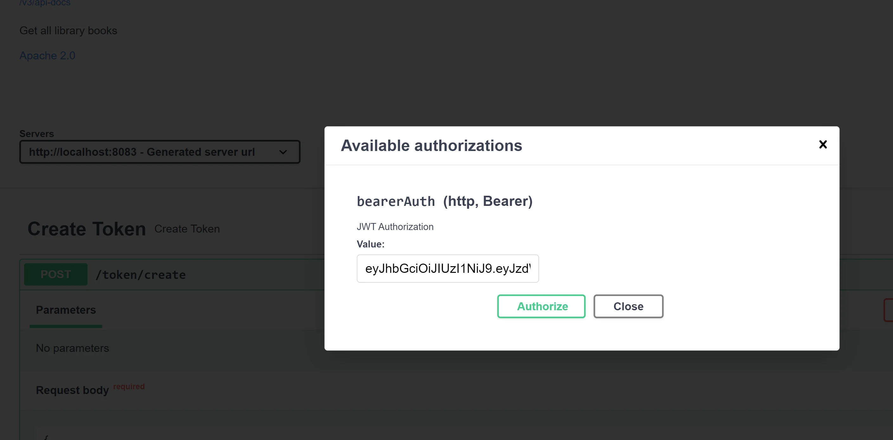
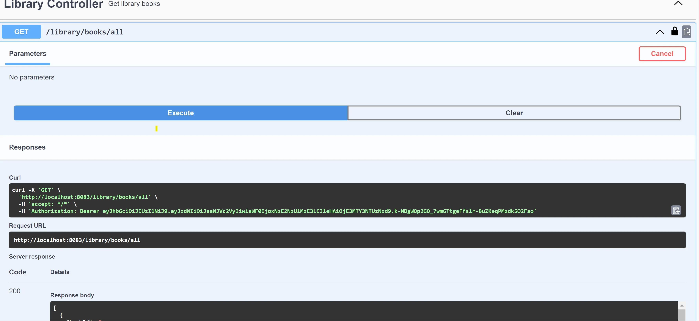

[Spring Security](https://docs.spring.io/spring-security/reference/index.html) 为 Java 应用程序提供了一套全面的安全功能，涵盖身份验证、授权、会话管理以及针对[CSRF（跨站点请求伪造）](https://reflectoring.io/spring-csrf/)等常见安全威胁的防护。Spring Security 框架具有高度可定制性，允许开发人员根据其应用程序需求来管理安全配置。它提供了一个灵活的架构，支持各种身份验证机制，如基本身份验证、JWT 和 OAuth。

Spring Security 提供了开箱即用的基本身份验证。要了解其工作原理，请参阅[本文](https://reflectoring.io/spring-security/)。在本文中，我们将深入探讨 JWT 的工作原理以及如何使用 Spring Security 对其进行配置。

## 示例代码

本文附带了[GitHub ](https://github.com/thombergs/code-examples/tree/master/spring-security-jwt/getting-started)可用的代码示例。

## 什么是 JWT

JWT（JSON Web Token）是一种在双方之间传递 JSON 消息的安全方式。它是[RFC 7519](https://www.rfc-editor.org/rfc/rfc7519)中定义的标准。JWT 令牌中包含的信息可以验证和信任，因为它是经过数字签名的。可以使用密钥（使用 HMAC 算法）或使用 RSA 或 ECDSA 的公钥/私钥对对 JWT 进行签名。

对于本文，我们将使用密钥创建一个 JWT 令牌，并使用它来保护我们的 REST 端点。

## JWT 结构

在本节中，我们将了解一个示例 JWT 结构。JSON Web Token 由三部分组成：

- **标头**
- **有效载荷**
- **签名**

### JWT 标头

标头由两部分组成：令牌的类型（即 JWT）和正在使用的签名算法（如 HMAC SHA 256 或 RSA）。示例 JSON 标头：

```json
{
  "alg": "HS256",
  "typ": "JWT"
}
```

然后对此 JSON 进行 Base64 编码，从而形成 JWT 令牌的第一部分。

### JWT 有效负载

有效载荷是包含实际数据的主体。数据可以是用户数据或任何需要安全传输的信息。这些数据也称为`claims`。声明有三种类型：**注册声明、公共声明和私有声明**。

#### 已登记的索赔

它们是一组预定义的三个字符声明，定义在[RFC7519](https://datatracker.ietf.org/doc/html/rfc7519#section-4.1)中。一些常用的声明包括**iss (Issuer Claim)**、**sub (Subject Claim)**、**aud (Audience Claim)**、**exp (Expiration Time Claim)**、**iat (Issued At Time)**、**nbf (Not Before)**。让我们详细了解一下它们：

- **iss**：此声明用于指定 JWT 的颁发者。它用于标识颁发令牌的实体，例如身份验证服务器或身份提供者。
- **sub**：此声明用于识别 JWT 的主题，即颁发令牌的用户或实体。
- **aud**：此声明用于指定 JWT 的目标受众。这通常用于限制令牌仅供某些服务或应用程序使用。
- **exp**：此声明用于指定 JWT 的过期时间，超过此时间后，令牌将不再有效。以自 Unix 纪元以来的秒数表示。
- **iat**：签发 JWT 的时间。可用于确定 JWT 的年龄。以自 Unix 纪元以来的秒数表示。
- **nbf**：标识在此之前 JWT 不能被接受处理的时间。

[在此处](https://www.iana.org/assignments/jwt/jwt.xhtml#claims)查看已注册声明的完整列表。在后续章节中，我们将介绍几个如何使用它们的示例。

#### 公开声明

与已注册的、具有预定义含义的声明不同，这些声明可以根据应用程序的要求进行定制。大多数公开声明属于以下类别：

- **用户/客户端数据**：包括用户名、客户端 ID、电子邮件、地址、角色、权限、范围、特权以及用于身份验证或授权的任何用户/客户端相关信息。
- **应用程序数据**：包括会话详细信息、用户偏好（例如语言偏好）、应用程序设置或任何应用程序特定的数据。
- **安全信息**：包括其他安全相关信息，如密钥、证书、令牌等。

#### 私人索赔

私有声明是特定于特定组织的自定义声明。它们不是由官方 JWT 规范标准化的，而是由参与 JWT 交换的各方定义的。

#### JWT 声明推荐最佳实践

- 尽可能使用 JWT 规范中定义的标准声明。它们被广泛认可并且具有明确的含义。
- 为了获得更好的可维护性，JWT 有效负载应该仅具有所需的最少声明，并限制令牌大小。
- 公共声明应该具有清晰且描述性的名称。
- 遵循一致的命名约定以保持一致性和可读性。
- 避免包含 PII 信息以最大限度地降低数据泄露的风险。
- 确保使用注册声明中指定[的推荐算法](https://www.iana.org/assignments/jose/jose.xhtml#web-signature-encryption-algorithms)对 JWT 进行加密`alg`。声明`none`中的值`alg`表示 JWT 未签名且不推荐使用。

### JWT 签名

为了创建签名，我们对标头进行编码，对有效负载进行编码，并使用密钥通过标头中指定的算法对元素进行签名。 **生成的令牌将具有三个以点分隔的 Base64 URL 字符串。JWT** 的图示如下所示：



签名的目的是验证消息在传输过程中没有被更改。由于它们也使用密钥签名，因此可以验证 JWT 的发送者是否是其声称的那个人。

## JWT 的常见用例

JWT 用途广泛，可用于如下所述的各种场景：

- **单点登录**：JWT 允许跨多个服务或应用程序进行用户身份验证，从而实现单点登录 (SSO)。用户登录到一个应用程序后，会收到一个 JWT，该 JWT 可用于登录其他服务（用户有权访问），而无需输入/维护单独的登录凭据。
- **API 身份验证**：JWT 通常用于对 API 的访问进行身份验证和授权。客户端将 JWT 令牌包含在API 请求的**授权**标头中，以验证其对 API 的访问权限。然后，API 将解码 JWT 以授予或拒绝访问权限。
- **无状态会话**：JWT 有助于提供无状态会话管理，因为会话信息存储在令牌本身中。
- **信息交换**：由于 JWT 安全可靠，因此它们不仅可用于交换用户信息，还可用于交换任何需要在双方之间安全传输的信息。
- **微服务**：JWT 是微服务生态系统中最受欢迎的 API 通信方式之一，因为微服务可以独立验证令牌，而无需依赖外部身份验证服务器，从而更易于扩展。

## 使用 JWT 的注意事项

现在我们了解了 JWT 提供的好处，让我们看看使用 JWT 的缺点。这里的想法是让开发人员权衡手头的选项，并做出在应用程序中使用基于令牌的架构的明智决定。

- 在 JWT 取代会话的情况下，如果我们最终使用较大的有效负载，JWT 令牌可能会膨胀。最重要的是，如果我们添加加密签名，则会导致整体性能开销。对于存储简单的用户会话来说，这最终会变得过度。
- JWT 会以一定的时间间隔过期，过期后需要刷新令牌并生成新的令牌。从安全角度来看，这很好，但过期时间需要仔细考虑。例如，24 小时的过期时间是一个糟糕的设计考虑。

现在，我们已经了解了重点，我们将能够就如何以及何时使用 JWT 做出明智的决定。在下一节中，我们将用 Java 创建一个简单的 JWT 令牌。

## 使用 Java 创建 JWT 令牌

[JJWT](https://github.com/jwtk/jjwt)是在 Java 和 Android 中创建 JWT 令牌最常用的 Java 库。我们将首先将其依赖项添加到我们的应用程序中。

### 配置 JWT 依赖项

*Maven 依赖项：*

```xml
<dependency>
    <groupId>io.jsonwebtoken</groupId>
    <artifactId>jjwt-api</artifactId>
    <version>0.11.1</version>
</dependency>
<dependency>
    <groupId>io.jsonwebtoken</groupId>
    <artifactId>jjwt-impl</artifactId>
    <version>0.11.1</version>
    <scope>runtime</scope>
</dependency>
<dependency>
    <groupId>io.jsonwebtoken</groupId>
    <artifactId>jjwt-jackson</artifactId>
    <version>0.11.1</version>
    <scope>runtime</scope>
</dependency>
```

*Gradle 依赖性*：

```groovy
compile 'io.jsonwebtoken:jjwt-api:0.11.1'
runtime 'io.jsonwebtoken:jjwt-impl:0.11.1'
runtime 'io.jsonwebtoken:jjwt-jackson:0.11.1'
```

我们的 Java 应用程序基于 Maven，因此我们将上述 Maven 依赖项添加到我们的*pom.xml*中。

### 创建 JWT 令牌

我们将使用包`Jwts`中的类`io.jsonwebtoken`。我们可以指定声明（已注册和公开）和其他 JWT 属性，并创建一个令牌，如下所示：

```java
public static String createJwt() {
        return Jwts.builder()
                .claim("id", "abc123")
                .claim("role", "admin")
                /*.addClaims(Map.of("id", "abc123",
                        "role", "admin"))*/
                .setIssuer("TestApplication")
                .setIssuedAt(java.util.Date.from(Instant.now()))
                .setExpiration(Date.from(Instant.now().plus(10, ChronoUnit.MINUTES)))
                .compact();
    }
    
```

此方法创建一个 JWT 令牌，如下所示：

```text
eyJhbGciOiJub25lIn0.eyJpZCI6ImFiYzEyMyIsInJvbGUiOiJhZG1pbiIsImlzcyI6IlR
lc3RBcHBsaWNhdGlvbiIsImlhdCI6MTcxMTY2MTA1MiwiZXhwIjoxNzExNjYxNjUyfQ.
```

接下来我们看一下用于生成令牌的构建器方法：

- `claim`：允许我们指定任意数量的自定义名称值对声明。我们还可以使用`addClaims`方法添加声明映射作为替代方案。
- `setIssuer`：此方法与已注册的权利要求相对应`iss`。
- `setIssuedAt`：此方法对应于已注册的声明`iat`。此方法以`java.util.Date`作为参数。这里我们将此值设置为当前时刻。
- `setExpiration`：此方法对应于已注册的声明`exp`。此方法以`java.util.Date`作为参数。这里我们将此值设置为从当前时刻开始的 10 分钟。

让我们尝试使用在线[JWT 解码器](https://jwt.is/)解码该 JWT ：



如果我们仔细查看标头，我们会看到`alg:none`。这是因为我们没有指定要使用的任何算法。正如我们之前看到的，建议我们使用算法来生成签名。

因此，让我们在我们的方法中使用**HMAC SHA256 算法**：

```java
public static String createJwt() {
        / Recommended to be stored in Secret
        String secret = "5JzoMbk6E5qIqHSuBTgeQCARtUsxAkBiHwdjXOSW8kWdXzYmP3X51C0";
        Key hmacKey = new SecretKeySpec(Base64.getDecoder().decode(secret),
                SignatureAlgorithm.HS256.getJcaName());
        return Jwts.builder()
                .claim("id", "abc123")
                .claim("role", "admin")
                .setIssuer("TestApplication")
                .setIssuedAt(java.util.Date.from(Instant.now()))
                .setExpiration(Date.from(Instant.now().plus(10, ChronoUnit.MINUTES)))
                .signWith(hmacKey)
                .compact();
    }
```

生成的令牌结果如下：

```text
eyJthbGciOiJIUzI1NiJ9.eyJpZCI6ImFiYzEyMyIsInJvbGUiOiJhZG1pbiIsImlz
cyI6IlRlc3RBcHBsaWNhdGlvbiIsImlhdCI6MTcxMjMyODQzMSwiZXhwIjoxNzEyMzI5MDMxfQ.
pj9AvbLtwITqBYazDnaTibCLecM-cQ5RAYw2YYtkyeA
```

解码此 JWT 可得到：



### 解析 JWT 令牌

现在我们已经创建了 JWT，让我们看看如何解析令牌以提取声明。只有当我们知道最初用于创建 JWT 的密钥时，我们才能解析令牌。以下代码可用于实现此目的：

```java
public static Jws<Claims> parseJwt(String jwtString) {
        / Recommended to be stored in Secret
        String secret = "5JzoMbk6E5qIqHSuBTgeQCARtUsxAkBiHwdjXOSW8kWdXzYmP3X51C0";
        Key hmacKey = new SecretKeySpec(Base64.getDecoder().decode(secret),
                SignatureAlgorithm.HS256.getJcaName());

        Jws<Claims> jwt = Jwts.parserBuilder()
                .setSigningKey(hmacKey)
                .build()
                .parseClaimsJws(jwtString);

        return jwt;
    }
```

这里，该方法`parseJwt`将 JWT 令牌作为字符串参数。使用相同的密钥（用于创建令牌），可以解析此令牌以检索声明。可以使用以下测试来验证这一点：

```java
@Test
    public void testParseJwtClaims() {
        String jwtToken = JWTCreator.createJwt();
        assertNotNull(jwtToken);
        Jws<Claims> claims = JWTCreator.parseJwt(jwtToken);
        assertNotNull(claims);
        Assertions.assertAll(
                () -> assertNotNull(claims.getSignature()),
                () -> assertNotNull(claims.getHeader()),
                () -> assertNotNull(claims.getBody()),
                () -> assertEquals(claims.getHeader().getAlgorithm(), "HS256"),
                () -> assertEquals(claims.getBody().get("id"), "abc123"),
                () -> assertEquals(claims.getBody().get("role"), "admin"),
                () -> assertEquals(claims.getBody().getIssuer(), "TestApplication")
        );
    }
```

有关可用解析方法的完整列表，请参阅[文档](https://javadoc.io/doc/io.jsonwebtoken/jjwt-api/0.11.2/io/jsonwebtoken/JwtParser.html)。

### Spring Security 中基本身份验证和 JWT 的比较

在深入研究示例 Spring Boot 应用程序中 JWT 的实现之前，让我们先看看 BasicAuth 和 JWT 之间的几个比较点。

| 比较依据           | 基本身份验证                                                 | 智威汤逊                                                     |
| ------------------ | ------------------------------------------------------------ | ------------------------------------------------------------ |
| **授权标头**       | 示例基本身份验证标头：**Authorization：Basic xxx**。         | 示例 JWT 标头：**Authorization：Bearer xxx**。               |
| **有效期和到期日** | 基本身份验证凭据只需配置一次，每次请求都需要传递相同的凭据。它永不过期。 | 使用 JWT 令牌，我们可以使用`exp`已注册的声明来设置有效性/到期时间，之后令牌将抛出一个`io.jsonwebtoken.ExpiredJwtException`。由于令牌有效期较短，这使得 JWT 更加安全。用户必须重新发送请求才能生成新令牌。 |
| **数据**           | 基本身份验证仅用于处理凭证（通常是用户名-密码）。            | JWT 可以包含其他信息，例如 id、角色等。一旦签名被验证，服务器就可以信任客户端发送的数据，从而避免可能需要的任何额外查找。 |

## 在 Spring Boot 应用程序中实现 JWT

现在我们更好地了解了 JWT，让我们在一个简单的 Spring Boot 应用程序中实现它。在我们的*pom.xml*中，让我们添加以下依赖项：

```xml
<dependency>
  <groupId>org.springframework.boot</groupId>
  <artifactId>spring-boot-starter-web</artifactId>
</dependency>
<dependency>
  <groupId>org.springframework.boot</groupId>
  <artifactId>spring-boot-starter-security</artifactId>
</dependency>
<dependency>
  <groupId>io.jsonwebtoken</groupId>
  <artifactId>jjwt-api</artifactId>
  <version>0.11.1</version>
</dependency>
<dependency>
  <groupId>io.jsonwebtoken</groupId>
  <artifactId>jjwt-impl</artifactId>
  <version>0.11.1</version>
  <scope>runtime</scope>
</dependency>
<dependency>
  <groupId>io.jsonwebtoken</groupId>
  <artifactId>jjwt-jackson</artifactId>
  <version>0.11.1</version>
  <scope>runtime</scope>
</dependency>
```

我们创建了一个简单的 Spring Boot Library 应用程序，该应用程序使用内存中的 H2 数据库来存储数据。该应用程序配置为在端口 8083 上运行。要运行该应用程序：

```text
mvnw clean verify spring-boot:run (for Windows)
./mvnw clean verify spring-boot:run (for Linux)
```

### 拦截 JWT 的 Spring Security 过滤器链

该应用程序有一个 REST 端点`/library/books/all`，用于获取数据库中存储的所有书籍。如果我们通过 Postman 进行此 GET 调用，则会收到`401 UnAuthorized`错误：



这是因为，我们在pom.xml中添加的依赖项会自动为所有创建的端点引入基本身份验证。spring-boot-starter-security 由于我们没有在 Postman 中指定任何凭据，因此我们收到`UnAuthorized`错误。就本文而言，我们需要用基于 JWT 的身份验证替换基本身份验证。我们知道 Spring 通过触发处理每个请求的身份验证和授权的过滤器链来为我们的端点提供安全性。[`UsernamePasswordAuthenticationFilter`](https://docs.spring.io/spring-security/site/docs/current/api/org/springframework/security/web/authentication/UsernamePasswordAuthenticationFilter.html)负责验证每个请求的凭据。为了覆盖此过滤器，让我们创建一个`Filter`名为的新过滤器`JwtFilter`。此过滤器将扩展`OncePerRequestFilter`类，因为我们希望每个请求仅调用一次过滤器：

```java
@Component
@Slf4j
public class JwtFilter extends OncePerRequestFilter {

    private final AuthUserDetailsService userDetailsService;

    private final JwtHelper jwtHelper;

    public JwtFilter(AuthUserDetailsService userDetailsService, JwtHelper jwtHelper) {
        this.userDetailsService = userDetailsService;
        this.jwtHelper = jwtHelper;
    }


    @Override
    protected void doFilterInternal(HttpServletRequest request, 
                                    HttpServletResponse response, 
                                    FilterChain filterChain) 
            throws ServletException, IOException {
        log.info("Inside JWT filter");
        / Code to validate the Authorization header
    }
}
```

该类`JwtHelper`负责创建和验证 token。我们先看看如何创建 token：

```java
public String createToken(Map<String, Object> claims, String subject) {
    Date expiryDate = 
        Date.from(Instant.ofEpochMilli(System.currentTimeMillis() + 
        jwtProperties.getValidity()));
    Key hmacKey = new SecretKeySpec(Base64.getDecoder()
        .decode(jwtProperties.getSecretKey()),
            SignatureAlgorithm.HS256.getJcaName());
    return Jwts.builder()
            .setClaims(claims)
            .setSubject(subject)
            .setIssuedAt(new Date(System.currentTimeMillis()))
            .setExpiration(expiryDate)
            .signWith(hmacKey)
            .compact();
}
```

以下参数负责创建令牌：

- `claims`指的是空映射。此示例尚未定义任何用户特定的声明。
- `subject`指的是用户在调用 API 创建 token 时传递的用户名。
- `expiryDate`指的是在当前日期上添加“x”毫秒后的日期。“x”的值在属性中定义`jwt.validity`。
- `hmacKey`指的是`jva.security.Key`用于签署 JWT 请求的对象。对于此示例，使用的密钥在属性中定义`jwt.secretKey`，并`HS256`使用算法。

此方法返回一个字符串 token，每次请求时都需要传递给它`Authorization header`。现在我们已经创建了一个 token，让我们看看类`doFilterInternal`中的方法`JwtFilter`，并了解这个类的职责`Filter`：

```java
@Override
protected void doFilterInternal(
    HttpServletRequest request, 
    HttpServletResponse response, 
    FilterChain filterChain
) throws ServletException, IOException {
    
      final String authorizationHeader = request.getHeader(AUTHORIZATION);
      String jwt = null;
      String username = null;
      if (Objects.nonNull(authorizationHeader) && 
              authorizationHeader.startsWith("Bearer ")) {
          jwt = authorizationHeader.substring(7);
          username = jwtHelper.extractUsername(jwt);
      }

      if (Objects.nonNull(username) && 
              SecurityContextHolder.getContext().getAuthentication() == null) {
          UserDetails userDetails = 
              this.userDetailsService.loadUserByUsername(username);
          boolean isTokenValidated = 
              jwtHelper.validateToken(jwt, userDetails);
          if (isTokenValidated) {
              UsernamePasswordAuthenticationToken usernamePasswordAuthenticationToken =
                      new UsernamePasswordAuthenticationToken(
                                  userDetails, null, userDetails.getAuthorities());
              usernamePasswordAuthenticationToken.setDetails(
                      new WebAuthenticationDetailsSource().buildDetails(request));
              SecurityContextHolder.getContext().setAuthentication(
                      usernamePasswordAuthenticationToken);
          }
      }
  
  filterChain.doFilter(request, response);
}
```

步骤1。读取`Authorization`标头并提取 JWT 字符串。

步骤2。解析 JWT 字符串并提取用户名。我们为此使用该`io.jsonwebtoken`库。如下所示：`Jwts.parseBuilder()、jwtHelper.extractUsername()`

```java
public String extractUsername(String bearerToken) {
        return extractClaimBody(bearerToken, Claims::getSubject);
    }
public <T> T extractClaimBody(String bearerToken, 
            Function<Claims, T> claimsResolver) {
        Jws<Claims> jwsClaims = extractClaims(bearerToken);
        return claimsResolver.apply(jwsClaims.getBody());
        }
private Jws<Claims> extractClaims(String bearerToken) {
        return Jwts.parserBuilder().setSigningKey(jwtProperties.getSecretKey())
        .build().parseClaimsJws(bearerToken);
        }
```

步骤 3。提取用户名后，我们将使用 验证`Authentication`对象是否有效，即是否有登录用户`SecurityContextHolder.getContext().getAuthentication()`。如果没有，我们将使用 Spring Security`UserDetailsService`加载`UserDetails`对象。对于此示例，我们创建了`AuthUserDetailsService`返回对象的类`UserDetails`。

```java
public class AuthUserDetailsService implements UserDetailsService {

    private final UserProperties userProperties;

    @Autowired
    public AuthUserDetailsService(UserProperties userProperties) {
        this.userProperties = userProperties;
    }


    @Override
    public UserDetails loadUserByUsername(String username) 
            throws UsernameNotFoundException {

        if (StringUtils.isEmpty(username) || 
                !username.equals(userProperties.getName())) {
            throw new UsernameNotFoundException(
                    String.format("User not found, or unauthorized %s", username));
        }

        return new User(userProperties.getName(), 
                userProperties.getPassword(), new ArrayList<>());
    }
}
```

下面的用户名和密码`UserProperties`是从`application.yml`以下位置加载的：

```yaml
spring:
  security:
    user:
      name: libUser
      password: libPassword
```

步骤4。接下来，`JwtFilter`调用`jwtHelper.validateToken()`来验证提取的用户名并确保jwt令牌尚未过期。

```java
public boolean validateToken(String token, UserDetails userDetails) {
  final String userName = extractUsername(token);
	return userName.equals(userDetails.getUsername()) && !isTokenExpired(token);
}
private Boolean isTokenExpired(String bearerToken) {
	return extractExpiry(bearerToken).before(new Date());
}
public Date extractExpiry(String bearerToken) {
	return extractClaimBody(bearerToken, Claims::getExpiration);
}
```

步骤 5。一旦令牌被验证，我们就创建一个对象实例。在这里，创建`Authentication`对象对象（它是接口的一个实现）并将其设置为。这表明用户现在已通过身份验证。`SecurityContextHolder.getContext().setAuthentication(usernamePasswordAuthenticationToken)`

步骤6。最后，我们调用`filterChain.doFilter(request, response)`以便在中调用下一个过滤器`FilterChain`。

这样，我们就成功创建了一个过滤器类来验证令牌。我们将在后续章节中讨论异常处理。

### JWT 令牌创建端点

`Authorization`在本节中，我们将创建一个 Controller 类来创建一个端点，这将允许我们创建一个 JWT 令牌字符串。当我们调用 Library 应用程序时，此令牌将在标头中设置。让我们创建一个`TokenController`类：

```java
@RestController
public class TokenController {

    private final TokenService tokenService;

    public TokenController(TokenService tokenService) {
        this.tokenService = tokenService;
    }

    @PostMapping("/token/create")
    public TokenResponse createToken(@RequestBody TokenRequest tokenRequest) {
        return tokenService.generateToken(tokenRequest);
    }
}
```

请求主体`TokenRequest`类将接受用户名和密码：

```java
@Data
@NoArgsConstructor
@AllArgsConstructor
@Builder
public class TokenRequest {
    private String username;
    private String password;
}
```

该类`TokenService`负责验证请求主体中传递的凭据并`jwtHelper.createToken()`按照上一节中的定义进行调用。为了验证凭据，我们需要实现一个`AuthenticationManager`。让我们创建一个`SecurityConfiguration`类来定义所有与 Spring 安全相关的配置。

```java
@Configuration
@EnableWebSecurity
public class SecurityConfiguration {

    private final JwtFilter jwtFilter;

    private final AuthUserDetailsService authUserDetailsService;

    private final JwtAuthenticationEntryPoint jwtAuthenticationEntryPoint;

    @Autowired
    public SecurityConfiguration(JwtFilter jwtFilter,
                                 AuthUserDetailsService authUserDetailsService,
                                 JwtAuthenticationEntryPoint 
                                             jwtAuthenticationEntryPoint) {

        this.jwtFilter = jwtFilter;
        this.authUserDetailsService = authUserDetailsService;
        this.jwtAuthenticationEntryPoint = jwtAuthenticationEntryPoint;
    }

    @Bean
    public DaoAuthenticationProvider authenticationProvider() {
        final DaoAuthenticationProvider daoAuthenticationProvider = 
                new DaoAuthenticationProvider();
        daoAuthenticationProvider.setUserDetailsService(authUserDetailsService);
        daoAuthenticationProvider.setPasswordEncoder(
                PlainTextPasswordEncoder.getInstance());
        return daoAuthenticationProvider;
    }

    @Bean
    public AuthenticationManager authenticationManager(HttpSecurity httpSecurity) 
            throws Exception {
        return httpSecurity.getSharedObject(AuthenticationManagerBuilder.class)
                .authenticationProvider(authenticationProvider())
                .build();
    }
}
```

使用`AuthenticationManager`，`AuthUserDetailsService`它使用`spring.security.user`属性。现在我们已经有了`AuthenticationManager`，让我们看看 是如何`TokenService`定义的：

```java
@Service
public class TokenService {

    private final AuthenticationManager authenticationManager;

    private final AuthUserDetailsService userDetailsService;

    private final JwtHelper jwtHelper;

    public TokenService(AuthenticationManager authenticationManager,
                        AuthUserDetailsService userDetailsService,
                        JwtHelper jwtHelper) {
        this.authenticationManager = authenticationManager;
        this.userDetailsService = userDetailsService;
        this.jwtHelper = jwtHelper;
    }


    public TokenResponse generateToken(TokenRequest tokenRequest) {
        this.authenticationManager.authenticate(
                new UsernamePasswordAuthenticationToken(
                        tokenRequest.getUsername(), tokenRequest.getPassword()));
        final UserDetails userDetails = 
                userDetailsService.loadUserByUsername(tokenRequest.getUsername());
        String token = jwtHelper.createToken(
                Collections.emptyMap(), userDetails.getUsername());
        return TokenResponse.builder()
                .token(token)
                .build();
    }
}
```

`TokenResponse`是包含标记字符串的 Response 对象：

```java
@Data
@NoArgsConstructor
@AllArgsConstructor
@Builder
public class TokenResponse {

    private String token;

}
```

现在创建了 API，让我们启动应用程序并尝试使用 Postman 访问端点。我们看到`401 Unauthorized`以下错误：



原因和我们之前遇到的一样。Spring Security 默认保护所有端点。我们需要一种方法来仅排除令牌端点的保护。此外，在启动日志中我们可以看到，虽然我们已经定义`JwtFilter`并且我们期望此过滤器覆盖`UsernamePasswordAuthenticationFilter`，但我们没有看到此过滤器连接到安全链中，如下所示：

```text
2024-05-22 15:41:09.441  INFO 20432 --- [           main] 
o.s.s.web.DefaultSecurityFilterChain     : 
Will secure any request with 
    [org.springframework.security.web.session.DisableEncodeUrlFilter@14d36bb2, 
org.springframework.security.web.context.request.async.
    WebAsyncManagerIntegrationFilter@432448, 
org.springframework.security.web.context.SecurityContextPersistenceFilter@54d46c8, 
org.springframework.security.web.header.HeaderWriterFilter@c7cf8c4, 
org.springframework.security.web.csrf.CsrfFilter@17fb5184, 
org.springframework.security.web.authentication.logout.LogoutFilter@42fa5cb, 
org.springframework.security.web.authentication.
    UsernamePasswordAuthenticationFilter@70d7a49b, 
org.springframework.security.web.authentication.ui.
    DefaultLoginPageGeneratingFilter@67cd84f9, 
org.springframework.security.web.authentication.ui.
    DefaultLogoutPageGeneratingFilter@4452e13c, 
org.springframework.security.web.authentication.www.
    BasicAuthenticationFilter@788d9139, 
org.springframework.security.web.savedrequest.RequestCacheAwareFilter@5c34b0f2, 
org.springframework.security.web.servletapi.
    SecurityContextHolderAwareRequestFilter@7dfec0bc, 
org.springframework.security.web.authentication.
    AnonymousAuthenticationFilter@4d964c9e, 
org.springframework.security.web.session.SessionManagementFilter@731fae, 
org.springframework.security.web.access.ExceptionTranslationFilter@66d61298, 
org.springframework.security.web.access.intercept.FilterSecurityInterceptor@55c20a91]
```

为了链接`JwtFilter`到另一组过滤器并排除保护令牌端点，让我们在类`SecurityFilterChain`中创建一个 bean `SecurityConfiguration`：

```java
@Bean
    public SecurityFilterChain configure (HttpSecurity http) throws Exception {
        return http.csrf().disable()
                .authorizeRequests()
                .antMatchers("/token/*").permitAll()
                .anyRequest().authenticated().and()
                .sessionManagement(session -> 
                    session.sessionCreationPolicy(SessionCreationPolicy.STATELESS))
                .addFilterBefore(jwtFilter, 
                    UsernamePasswordAuthenticationFilter.class)
                .exceptionHandling(exception -> 
                    exception.authenticationEntryPoint(jwtAuthenticationEntryPoint))
                .build();
    }
```

在此配置中，我们关注以下内容：

- **antMatchers("/token/\*").permitAll()** - 这将允许与模式匹配的 API 端点`/token/*`并将其从安全性中排除。
- **anyRequest().authenticated()** - Spring Security 将保护所有其他 API 请求。
- **addFilterBefore(jwtFilter, UsernamePasswordAuthenticationFilter.class)** - 这将在 FilterChain`JwtFilter`中将其连接起来。`UsernamePasswordAuthenticationFilter`
- **exceptionHandling(exception -> exception.authenticationEntryPoint(jwtAuthenticationEntryPoint)** - 如果发生身份验证异常，`JwtAuthenticationEntryPoint`将调用类。在这里，我们创建了一个`JwtAuthenticationEntryPoint`实现的类，`org.springframework.security.web.AuthenticationEntryPoint`以便优雅地处理未经授权的错误。我们将在后面的部分中详细介绍如何处理异常。

完成这些更改后，让我们重新启动应用程序并检查日志：

```text
2024-05-22 16:13:07.803  INFO 16188 --- [           main] 
o.s.s.web.DefaultSecurityFilterChain     : Will secure any request with 
[org.springframework.security.web.session.DisableEncodeUrlFilter@73e25780, 
org.springframework.security.web.context.request.async.
    WebAsyncManagerIntegrationFilter@1f4cb17b, 
org.springframework.security.web.context.SecurityContextPersistenceFilter@b548f51, 
org.springframework.security.web.header.HeaderWriterFilter@4f9980e1, 
org.springframework.security.web.authentication.logout.LogoutFilter@6b92a0d1, 
com.reflectoring.security.filter.JwtFilter@5961e92d, 
org.springframework.security.web.savedrequest.RequestCacheAwareFilter@56976b8b, 
org.springframework.security.web.servletapi.
    SecurityContextHolderAwareRequestFilter@74844216, 
org.springframework.security.web.authentication.
    AnonymousAuthenticationFilter@280099a0, 
org.springframework.security.web.session.SessionManagementFilter@144dc2f7, 
org.springframework.security.web.access.ExceptionTranslationFilter@7a0f43dc, 
org.springframework.security.web.access.intercept.
    FilterSecurityInterceptor@735167e1]
```

我们看到`JwtFilter`被链接起来，这表明基本身份验证现在已被基于令牌的身份验证所覆盖。现在，让我们再次尝试访问端点`/token/create`。我们看到端点现在能够成功返回生成的令牌：



### 保护图书馆应用程序端点

现在，我们能够成功创建令牌，我们需要将此令牌传递给我们的库应用程序以成功调用`/library/books/all`。让我们添加一个带有生成的令牌值`Authorization`的类型的标头`Bearer Token`并触发请求。我们现在可以看到 200 OK 响应，如下所示：


### 使用 JWT 处理异常

在本节中，我们将了解`io.jsonwebtoken`包中一些常见的异常：

1. [ExpiredJwtException](https://javadoc.io/doc/io.jsonwebtoken/jjwt/0.9.1/io/jsonwebtoken/ExpiredJwtException.html) - JWT token 包含过期时间，解析 token 时，如果已经超过过期时间，则会抛出 ExpiredJwtException。
2. [UnsupportedJwtException](https://javadoc.io/doc/io.jsonwebtoken/jjwt/0.9.1/io/jsonwebtoken/UnsupportedJwtException.html) - 当收到的 JWT 格式不符合预期时，会抛出此异常。此错误最常见的用例是当我们尝试使用方法`Jwts.parserBuilder().setSigningKey(jwtProperties.getSecretKey()) .build().parseClaimsJwt`而不是`Jwts.parserBuilder().setSigningKey(jwtProperties.getSecretKey()) .build().parseClaimsJws`
3. [MalformedJwtException](https://javadoc.io/doc/io.jsonwebtoken/jjwt/0.9.1/io/jsonwebtoken/MalformedJwtException.html) - 此异常表示 JWT 构造不正确。
4. [IncorrectClaimException](https://javadoc.io/doc/io.jsonwebtoken/jjwt-api/latest/io/jsonwebtoken/IncorrectClaimException.html) - 表示所需声明没有预期值。因此，JWT 无效。
5. [MissingClaimException](https://javadoc.io/doc/io.jsonwebtoken/jjwt-api/latest/io/jsonwebtoken/MissingClaimException.html) - 此异常表示 JWT 中缺少所需声明，因此无效。

通常，妥善处理与身份验证相关的异常被认为是一种很好的做法。在基本身份验证的情况下，Spring Security**默认将添加`BasicAuthenticationEntryPoint`到安全过滤器链中，该过滤器链将基本身份验证相关错误包装为 401 Unauthorized。** 同样，在我们的示例中，我们明确创建了`JwtAuthenticationEntryPoint`处理可能的身份验证错误，例如 Spring Security`BadCredentialsException`或 JJwt 的`MalformedJwtException`：

```java
@Component
@Slf4j
public class JwtAuthenticationEntryPoint implements AuthenticationEntryPoint {
    @Override
    public void commence(HttpServletRequest request, 
                         HttpServletResponse response, 
                         AuthenticationException authException) 
            throws IOException, ServletException {
        Exception exception = (Exception) request.getAttribute("exception");
        response.setStatus(HttpServletResponse.SC_UNAUTHORIZED);
        response.setContentType(APPLICATION_JSON_VALUE);
        log.error("Authentication Exception: {} ", exception, exception);
        Map<String, Object> data = new HashMap<>();
        data.put("message", exception != null ? 
                exception.getMessage() : authException.getCause().toString());
        OutputStream out = response.getOutputStream();
        ObjectMapper mapper = new ObjectMapper();
        mapper.writeValue(out, data);
        out.flush();
    }
}
```

在我们的`JwtFilter`类中，我们将异常消息添加到`HttpServletRequest` `exception`属性中。这使我们能够使用`request.getAttribute("exception")`它并将其写入输出流。

```java
public class JwtFilter extends OncePerRequestFilter {
   @Override
   protected void doFilterInternal(HttpServletRequest request, 
                                   HttpServletResponse response, 
                                   FilterChain filterChain) 
           throws ServletException, IOException {
      try {
         /validate token here
      } catch (ExpiredJwtException jwtException) {
         request.setAttribute("exception", jwtException);
      } catch (BadCredentialsException | 
               UnsupportedJwtException | 
               MalformedJwtException e) {
         log.error("Filter exception: {}", e.getMessage());
         request.setAttribute("exception", e);
      }
      filterChain.doFilter(request, response);
   }
}
```

`401 Unauthorized`通过这些更改，我们现在可以看到包含以下异常的异常消息：


但是，需要注意的是，`JwtFilter`只有通过 Spring Security 过滤器链保护的端点才会调用 。在我们的例子中，端点是`/library/books/all`。由于我们已经从 Spring Security 中排除了令牌端点`/token/create`，因此下面的异常处理`JwtAuthenticationEntryPoint`将不适用于此处。对于这种情况，我们将使用 Spring 的全局异常处理程序来处理异常。

```java
@ControllerAdvice
public class GlobalExceptionHandler {
    @ExceptionHandler({BadCredentialsException.class})
    public ResponseEntity<Object> handleBadCredentialsException(BadCredentialsException exception) {
        return ResponseEntity
                .status(HttpStatus.UNAUTHORIZED)
                .body(exception.getMessage());
    }
}
```

`401 Unauthorized`通过此异常处理，由于凭证不良而导致的异常现在将通过错误处理：


## Swagger 文档

在本节中，我们将了解如何为 JWT 配置 Open API。我们将添加以下 Maven 依赖项：

```xml
<dependency>
   <groupId>org.springdoc</groupId>
   <artifactId>springdoc-openapi-ui</artifactId>
   <version>1.7.0</version>
</dependency>
```

接下来，让我们添加以下配置：

```java
@OpenAPIDefinition(
        info = @Info(
                title = "Library application",
                description = "Get all library books",
                version = "1.0.0",
                license = @License(
                        name = "Apache 2.0",
                        url = "http://www.apache.org/licenses/LICENSE-2.0"
                )),
        security = {
                @SecurityRequirement(
                        name = "bearerAuth"
                )
        }
        )
@SecurityScheme(
        name = "bearerAuth",
        description = "JWT Authorization",
        scheme = "bearer",
        type = SecuritySchemeType.HTTP,
        bearerFormat = "JWT",
        in = SecuritySchemeIn.HEADER
)
public class OpenApiConfig {
}
```

这里，使用一个或多个 来描述安全性`@SecurityScheme`。`type`此处定义的`SecuritySchemeType.HTTP`适用于基本身份验证和 JWT。其他属性（如 和`scheme`）`bearerFormat`依赖于此`type`属性。定义安全方案后，我们可以通过 `security`在根级别或操作级别添加 部分将它们应用于整个应用程序或单个操作。在我们的示例中，所有 API 操作都将使用 bearer token 身份验证方案。有关配置多个安全方案以及在 API 级别应用不同方案的更多信息，请参阅其[文档](https://swagger.io/docs/specification/authentication/)。

接下来，让我们向控制器类添加一些基本的 swagger 注释，以便为 API 操作添加描述。

```java
@RestController
@Tag(name = "Library Controller", description = "Get library books")
public class BookController {
}

@RestController
@Tag(name = "Create Token", description = "Create Token")
public class TokenController {
}
```

此外，我们将使用以下属性来覆盖 Springdoc 的 Swagger-UI 加载的 URL。

```yaml
springdoc:
  swagger-ui:
    path: /swagger-ui
```

通过此配置，Swagger UI 现在可在`http://localhost:8083/swagger-ui/index.html`

让我们尝试运行该应用程序并在上述 URL 处加载 Swagger 页面。当我们尝试访问端点时，我们会看到以下内容：


**这是因为应用程序中的所有端点都自动受到保护。我们需要一种方法来明确排除 swagger 端点不受保护。** 我们可以通过在类中添加`WebSecurityCustomizer`bean 并排除 swagger 端点来实现这一点`SecurityConfiguration`。

```java
@Bean
    public WebSecurityCustomizer webSecurityCustomizer() {
        return web -> web.ignoring().antMatchers(
                ArrayUtils.addAll(buildExemptedRoutes()));
    }

    private String[] buildExemptedRoutes() {
        return new String[] {"/swagger-ui/**","/v3/api-docs/**"};
    }
```

现在，当我们运行应用程序时，swagger 页面将按如下方式加载：


由于我们只有一个安全方案，因此我们将 JWT 令牌添加到`Authorize`swagger 页面顶部的按钮中：



设置了承载令牌后，让我们尝试访问`/library/books/all`端点：



这样，我们就成功地为我们的应用程序配置了 swagger 端点。

## 添加 Spring Security 测试

在我们的示例中，我们需要编写测试来测试我们的令牌端点，并为我们的库应用程序编写另一个测试。

让我们为测试添加一些必需的属性以及内存数据库来处理真实数据。测试`application.yml`：

```yaml
spring:
  security:
    user:
      name: libUser
      password: libPassword
  datasource:
    driver-class-name: org.hsqldb.jdbc.JDBCDriver
    url: jdbc:hsqldb:mem:testdb;DB_CLOSE_DELAY=-1
    username: sa
    password:

jwt:
  secretKey: 5JzoMbk6E5qIqHSuBTgeQCARtUsxAkBiHwdjXOSW8kWdXzYmP3X51C0
  validity: 600000
```

接下来，让我们编写测试来验证我们的令牌端点：

```java
@SpringBootTest
@AutoConfigureMockMvc
public class TokenControllerTest {
    @Autowired
    private MockMvc mvc;

    @Test
    public void shouldNotAllowAccessToUnauthenticatedUsers() throws Exception {
        TokenRequest request = TokenRequest.builder()
                .username("testUser")
                .password("testPassword")
                .build();
        mvc.perform(MockMvcRequestBuilders.post("/token/create")
                        .contentType(MediaType.APPLICATION_JSON)
                        .content(new ObjectMapper().writeValueAsString(request)))
                .andExpect(status().isUnauthorized());
    }

    @Test
    public void shouldGenerateAuthToken() throws Exception {
        TokenRequest request = TokenRequest.builder()
                .username("libUser")
                .password("libPassword")
                .build();
        mvc.perform(MockMvcRequestBuilders.post("/token/create")
                        .contentType(MediaType.APPLICATION_JSON)
                        .content(new ObjectMapper().writeValueAsString(request)))
                .andExpect(status().isOk());
    }
}
```

在这里，我们将用来`@MockMvc`验证我们的`TokenController`类端点在正面和负面场景中是否按预期工作。

类似地，我们的`BookControllerTest`意愿是这样的：

```java
@SpringBootTest
@AutoConfigureMockMvc
@SqlGroup({
        @Sql(value = "classpath:init/first.sql", 
                executionPhase = BEFORE_TEST_METHOD),
        @Sql(value = "classpath:init/second.sql", 
                executionPhase = BEFORE_TEST_METHOD)
})

public class BookControllerTest {

    @Autowired
    private MockMvc mockMvc;

    @Test
    void failsAsBearerTokenNotSet() throws Exception {
        mockMvc.perform(get("/library/books/all"))
                .andDo(print())
                .andExpect(status().isUnauthorized());
    }

    @Test
    void testWithValidBearerToken() throws Exception {
        TokenRequest request = TokenRequest.builder()
                .username("libUser")
                .password("libPassword")
                .build();
        MvcResult mvcResult = mockMvc.perform(
                MockMvcRequestBuilders.post("/token/create")
                        .contentType(MediaType.APPLICATION_JSON)
                        .content(new ObjectMapper().writeValueAsString(request)))
                .andExpect(status().isOk()).andReturn();
        String resultStr = mvcResult.getResponse().getContentAsString();
        TokenResponse token = new ObjectMapper().readValue(
                resultStr, TokenResponse.class);
        mockMvc.perform(get("/library/books/all")
                        .header("Authorization", "Bearer " + token.getToken()))
                .andDo(print())
                .andExpect(status().isOk())
                .andExpect(jsonPath("$", hasSize(5)));
    }

    @Test
    void testWithInvalidBearerToken() throws Exception {
        mockMvc.perform(get("/library/books/all")
                        .header("Authorization", "Bearer 123"))
                .andDo(print())
                .andExpect(status().isUnauthorized());
    }

}
```

为了测试应用程序端点，我们将使用 Spring`MockMvc`类并使用示例 SQL 脚本将数据加载到内存数据库中。为此，我们将使用注释`@SqlGroup`并将`@Sql`插入脚本放在`/resources/init`文件夹中。

为了验证端点是否成功运行`testWithValidBearerToken()`，我们将首先`/token/create` 使用 调用端点`MockMvc`，从响应中提取令牌，并将令牌设置在下`Authorization`一次调用的标头中`/library/books/all`。

## 结论

总而言之，在安全性方面，JWT 身份验证比 Spring 的基本身份验证领先一步。它是最受欢迎的身份验证和授权方式之一。在本文中，我们探讨了一些最佳实践、使用 JWT 的优势，并研究了如何配置一个简单的 Spring Boot 应用程序以使用 JWT 来确保安全性。


原文链接：[https://reflectoring.io/spring-security-jwt/](https://reflectoring.io/spring-security-jwt/)
