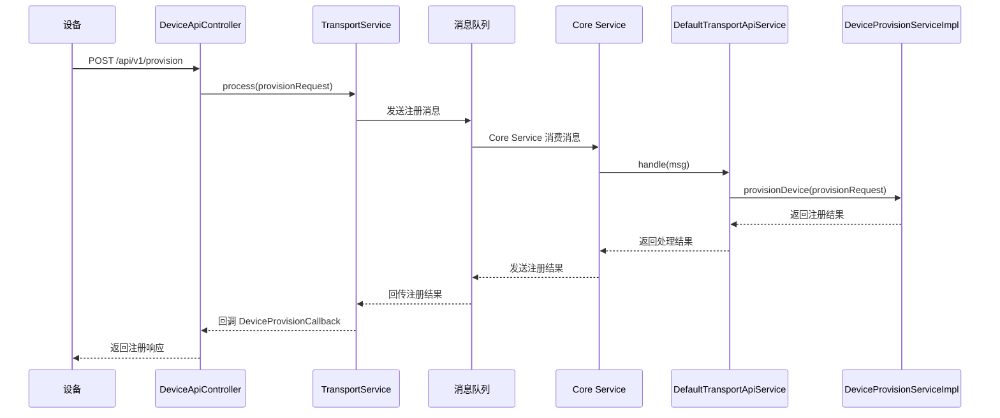
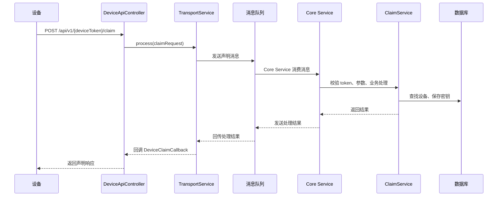
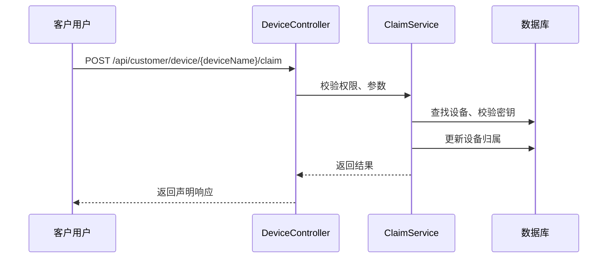
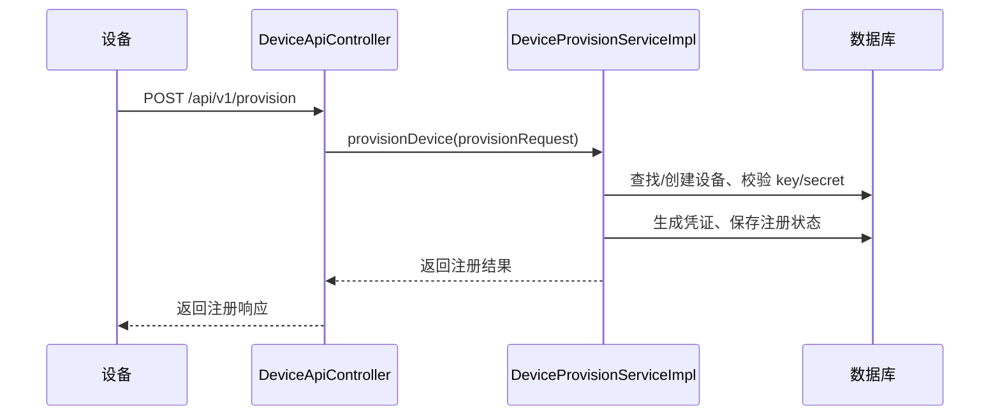

本篇文档系统梳理 ThingsBoard 平台 HTTP 设备接入的整体实现方式，重点详解 HTTP
自动注册（provision）机制的完整调用链、核心模块及消息流转机制，并补充核心注册逻辑代码说明，帮助理解其分层解耦与分布式架构设计。

<!--more-->

## 一、测试 HTTP Transport 

1、本地启动 thingsboard 服务，然后打开 [http://localhost:8080/](http://localhost:8080/) 并使用系统管理员： sysadmin@thingsboard.org / sysadmin 进行登陆

2、在 [http://localhost:8080/tenants](http://localhost:8080/tenants) 页面创建测试租户 test，并添加租户管理员：tenant@thingsboard.org / tenant

3、以租户管理员身份登陆，在 [http://localhost:8080/entities/devices](http://localhost:8080/entities/devices) 页面创建测试设备 test

4、使用下面命令检查连通性（我使用的是 macos 系统）：

```bash
curl -v -X POST http://localhost:8080/api/v1/p4qGvJp3443cotHE0JfY/telemetry \
	--header Content-Type:application/json --data "{temperature:25}"
```

输出日志如下：

```bash
Note: Unnecessary use of -X or --request, POST is already inferred.
* Uses proxy env variable http_proxy == 'http://127.0.0.1:7890'
*   Trying 127.0.0.1:7890...
* Connected to 127.0.0.1 (127.0.0.1) port 7890
> POST http://localhost:8080/api/v1/p4qGvJp3443cotHE0JfY/telemetry HTTP/1.1
> Host: localhost:8080
> User-Agent: curl/8.7.1
> Accept: */*
> Proxy-Connection: Keep-Alive
> Content-Type:application/json
> Content-Length: 16
> 
* upload completely sent off: 16 bytes
< HTTP/1.1 200 
< Content-Length: 0
< Cache-Control: no-cache, no-store, max-age=0, must-revalidate
< Connection: keep-alive
< Date: Wed, 02 Jul 2025 02:09:04 GMT
< Expires: 0
< Keep-Alive: timeout=4
< Pragma: no-cache
< Proxy-Connection: keep-alive
< Vary: Origin
< Vary: Access-Control-Request-Method
< Vary: Access-Control-Request-Headers
< X-Content-Type-Options: nosniff
< X-Frame-Options: DENY
< X-Xss-Protection: 0
< 
* Connection #0 to host 127.0.0.1 left intact
```

说明调用成功

5、新设备自注册

现在 [http://localhost:8080/profiles/deviceProfiles](http://localhost:8080/profiles/deviceProfiles) 编辑 设备预配置，设置 预配置策略 为允许创建新设备，保存后可以看到 provisionDeviceKey 和 provisionDeviceSecret。

然后，运行下面命令注册一个新设备，名称为 test-device-001

```bash
curl -X POST http://localhost:8080/api/v1/provision \
  -H "Content-Type: application/json" \
  -d '{
    "deviceName": "test-device-001",
    "provisionDeviceKey": "a22x2lalyyvc65v3vtib",
    "provisionDeviceSecret": "8km4t2qotcg3thmqyvb8"
  }'
```

返回结果如下：

```bash
{"credentialsValue":"K7KW5LFwRD4IBTUJ734L","credentialsType":"ACCESS_TOKEN","status":"SUCCESS"}
```

表明注册成功。在 [http://localhost:8080/entities/devices](http://localhost:8080/entities/devices) 可以看到新注册的设备。

6、设备声明

a、设备声明（设备端/现场激活）

```bash
curl -X POST http://localhost:8080/api/v1/K7KW5LFwRD4IBTUJ734L/claim \
 -H "Content-Type: application/json" \
 -d '{
  "secretKey": "mySecret",
  "durationMs": 60000
 }'
```

- 设备用自己的 token（如 K7KW5LFwRD4IBTUJ734L）主动向平台发起声明请求。

- 适用于设备现场激活、自动归属等场景。


b、创建客户用户并用其认领设备（平台/客户侧）

获取客户用户 Token

```bash
TOKEN=`curl -s -X POST --header 'Content-Type: application/json' --header 'Accept: application/json' -d '{"username":"customer@thingsboard.org", "password":"customer"}' 'http://localhost:8080/api/auth/login'|jq -r .token`
```

- 先用客户用户账号登录，获取 JWT Token。

客户用户认领设备

```bash
curl -X POST "http://localhost:8080/api/customer/device/test-device-001/claim" \
 -H "Content-Type: application/json" \
 -H "X-Authorization: Bearer $TOKEN" \
 -d '{
  "secretKey": "mySecret"
 }'
```

- 用客户用户的 Token，通过平台管理接口认领设备。

- 适用于客户/租户在后台批量认领设备的场景。

c、回收设备（取消认领）

```bash
curl -X DELETE http://localhost:8080/api/customer/device/test-device-001/claim \
 -H "Content-Type: application/json" \
 -H "X-Authorization: Bearer $TOKEN" 
```

- 客户用户可通过此接口回收（取消认领）设备，设备将不再归属于该客户。

---

## 二、HTTP Transport 实现方式

### 1. 架构与入口

- **HTTP Transport** 是 ThingsBoard 支持的多种设备接入协议之一，主要用于设备通过 HTTP 协议与平台交互。
- 相关代码主要分布在 `common/transport/http/` 和 `transport/http/` 目录。
- 典型部署方式为独立微服务进程，通常通过 Spring Boot 启动。

### 2. 核心模块与类

- **DeviceApiController**：HTTP 设备接入的主要控制器，负责处理设备侧的 HTTP 请求，典型路径为 `/api/v1`。
- **会话管理与设备状态**：HTTP 设备的“在线/离线”状态通过会话和超时机制（如 inactivity timeout）间接判断。

### 3. 典型接口说明

1. 设备自动注册（Provision）

- **接口**：`POST /api/v1/provision`

- **作用**：设备通过预配置的 key/secret 自动注册到平台，获取访问凭证。

- **请求体**：

  ```json
  {
    "deviceName": "test-device-001",
    "provisionDeviceKey": "your_provision_key",
    "provisionDeviceSecret": "your_provision_secret"
  }
  ```

---

2. 设备声明（Claim）

- **接口**：`POST /api/v1/{deviceToken}/claim`

- **作用**：将设备归属到最终用户或客户名下，实现动态绑定。

- **请求体**：

  ```json
  {
    "secretKey": "your_secret_key",
    "durationMs": 60000
  }
  ```

  > 设备声明，参考 https://thingsboard.io/docs/user-guide/claiming-devices/
  >
  > **1、主要作用与场景**
  >
  > - 动态归属
  >
  > 设备在工厂或渠道出厂时，只需预注册到平台，不绑定具体用户。最终用户拿到设备后，通过“声明”接口，将设备归属到自己的账号或客户名下。
  >
  > - 批量部署与灵活分配
  >
  > 厂商可批量生产和注册设备，分发到各地或不同客户，客户收到设备后自主激活，无需平台管理员手动分配。
  >
  > - 安全激活
  >
  > 通过 secretKey（声明密钥）和有效期等机制，确保只有合法用户才能声明设备，防止被恶意抢占。
  >
  > - 支持租户/多客户场景
  >
  > 支持多租户、多客户环境下的设备灵活分配和管理。
  >
  > 
  >
  > **典型流程**
  >
  > - 设备出厂时仅注册到平台，未归属任何客户。
  >
  > - 设备到达最终用户手中，用户通过 App/前端/接口输入声明密钥（secretKey）等信息，调用 /api/v1/{deviceToken}/claim。
  >
  > - 平台校验密钥和有效期，声明成功后，将设备归属到当前用户或客户名下。
  >
  > - 后续该用户/客户可管理、监控该设备。

---

3. 属性上报

- **接口**：`POST /api/v1/{deviceToken}/attributes`

- **作用**：设备上报静态属性（如固件版本、序列号等）。

- **请求体**：

  ```json
  {
    "firmwareVersion": "1.0.0",
    "serialNumber": "SN123456"
  }
  ```

---

4. 属性获取

- **接口**：`GET /api/v1/{deviceToken}/attributes`
- **作用**：设备获取平台下发的属性。
- **参数**：可选 `clientKeys`、`sharedKeys` 查询指定属性。

---

5. 遥测数据上报

- **接口**：`POST /api/v1/{deviceToken}/telemetry`

- **作用**：设备上报时序数据（如温度、湿度等）。

- **请求体**：

  ```json
  {
    "temperature": 23.5,
    "humidity": 60
  }
  ```

---

6. 设备固件下载

- **接口**：`GET /api/v1/{deviceToken}/firmware?title=xxx&version=yyy`
- **作用**：设备分片或整体下载平台分配的固件包。
- **参数**：`title`（固件名）、`version`（固件版本）、`size`（分片大小，可选）、`chunk`（分片序号，可选）

---

7. 设备软件包下载

- **接口**：`GET /api/v1/{deviceToken}/software?title=xxx&version=yyy`
- **作用**：设备分片或整体下载平台分配的软件包。
- **参数**：同上

---

8. 订阅属性/命令（长轮询，已不推荐）

- **接口**：
  - 订阅属性：`GET /api/v1/{deviceToken}/attributes/updates`
  - 订阅命令：`GET /api/v1/{deviceToken}/rpc`
- **作用**：设备通过 HTTP 长轮询方式订阅平台下发的属性或命令（建议用 MQTT/CoAP 替代）。

---

9. 回复命令

- **接口**：`POST /api/v1/{deviceToken}/rpc/{requestId}`

- **作用**：设备回复平台下发的 RPC 命令。

- **请求体**：

  ```json
  {
    "status": "success"
  }
  ```

---

10. 发送命令到平台

- **接口**：`POST /api/v1/{deviceToken}/rpc`

- **作用**：设备主动向平台发送 RPC 请求。

- **请求体**：

  ```json
  {
    "method": "reboot",
    "params": {}
  }
  ```

---

### 4. 请求认证与安全

- 设备通过 `deviceToken` 进行身份认证，token 由平台分配。
- 所有接口均需在 URL 中携带 token，平台校验 token 有效性。

### 5. 典型流程举例

1. 设备首次上线，调用 `/api/v1/provision`，获取 token。
2. 设备定期调用 `/api/v1/{deviceToken}/telemetry` 上报数据。
3. 设备定期调用任意接口（如上报属性、数据），保持“在线”状态。
4. 长时间未请求，平台自动判定设备下线。

### 6. 测试与调试建议

- 可用 Postman/curl 模拟设备请求，测试各接口功能。
- 通过 ThingsBoard 前端或 API 查询设备状态，验证上线/下线逻辑。
- 检查 HTTP Transport 服务日志，排查认证、数据处理等问题。

### 7. 设计启示

- HTTP 设备接入适合低频、无长连接需求的场景。
- 设备状态管理需结合业务场景合理设置超时时间。
- 认证机制建议采用 token 或签名，确保安全。

---

## 三、设备自动注册

### 1. 整体流程概述

1. 设备通过 HTTP POST `/api/v1/provision` 发起注册请求。
2. HTTP 控制器解析请求并转发到 Transport Service。
3. Transport Service 将注册请求通过消息队列发送到 Core Service。
4. Core Service 消费注册消息，分发到注册业务实现。
5. 注册业务处理（校验、查找/创建设备、生成凭证）。
6. 处理结果通过消息队列回传，最终响应给设备。

### 2. 详细调用链

- **设备侧请求**：`POST /api/v1/provision`，请求体包含 deviceName、provisionDeviceKey、provisionDeviceSecret。
- **HTTP 控制器入口**：`DeviceApiController.provisionDevice(String json)`，解析 JSON，调用
  `transportContext.getTransportService().process(...)`。
- **Transport Service 层**：如 `DefaultTransportApiService`，将注册请求消息通过消息队列（如 Kafka/RabbitMQ）发送到 Core
  Service。
- **消息队列与 Core Service**：`TbQueueResponseTemplate`（实现类：`DefaultTbQueueResponseTemplate`）持续监听注册等消息，收到消息后调用
  `DefaultTransportApiService.handle()`。
- **消息类型判断与业务分发**：`DefaultTransportApiService.handle(Message msg)` 判断消息类型，若为注册请求，则调用
  `deviceProvisionService.provisionDevice(provisionRequest)`。
- **设备注册业务实现**：`DeviceProvisionServiceImpl.provisionDevice(ProvisionRequest provisionRequest)`，校验
  key/secret，查找/创建设备，生成凭证，返回注册结果。
- **结果回传**：Core Service 处理完成后，将注册结果通过消息队列回传给 Transport Service，最终通过回调响应给设备。

### 3. 调用链时序图



### 4. 核心设计要点

- **分层解耦**：HTTP 控制器与业务实现完全解耦，便于扩展和维护。
- **消息驱动**：通过消息队列实现服务间通信，支持分布式和高可用。
- **异步回调**：结果通过回调异步返回，提升并发能力。
- **注册策略灵活**：支持多种注册策略（如自动创建设备、仅允许预注册等）。

### 5. 相关核心类

- `DeviceApiController`：HTTP 控制器，接收注册请求
- `TransportService` / `DefaultTransportApiService`：传输层服务，消息转发
- `TbQueueResponseTemplate` / `DefaultTbQueueResponseTemplate`：消息队列消费模板
- `TbQueueHandler` / `DefaultTransportApiService`：队列消息分发与处理
- `DeviceProvisionService` / `DeviceProvisionServiceImpl`：注册业务实现

### 6. DeviceProvisionServiceImpl 逻辑

`DeviceProvisionServiceImpl` 是 ThingsBoard 设备自动注册的核心业务实现类，主要负责校验 key/secret、查找/创建设备、生成凭证、推送事件等。

1. 主要方法

- `provisionDevice(ProvisionRequest provisionRequest)`
  - 校验请求参数（deviceName、key、secret）
  - 查找目标设备配置（DeviceProfile）
  - 根据注册策略分支处理：
    - **ALLOW_CREATE_NEW_DEVICES**：允许自动创建设备，若设备已存在则注册失败，否则创建新设备并生成凭证
    - **CHECK_PRE_PROVISIONED_DEVICES**：仅允许已预注册设备，校验通过后返回凭证，否则注册失败
    - **X509_CERTIFICATE_CHAIN**：不支持该策略，直接抛出异常
  - 处理完成后返回注册结果（凭证、状态）

- `createDevice(ProvisionRequest, DeviceProfile)`
  - 创建新设备，保存注册状态属性，推送设备创建事件和注册成功事件
  - 返回新设备凭证

- `processProvision(Device, ProvisionRequest)`
  - 校验设备注册状态，未注册则更新状态并推送注册成功事件，已注册则注册失败
  - 返回设备凭证

- `notify(Device, ProvisionRequest, TbMsgType, boolean)`
  - 推送注册事件到规则引擎，记录审计日志

2. 关键点说明

- 支持多种注册策略，灵活适配不同业务场景
- 设备注册事件会推送到规则引擎，便于后续扩展
- 注册过程有详细的审计日志，便于追踪和排查

## 四、设备声明

- 设备声明（Claim）用于将平台中已存在的设备动态归属到某个客户或最终用户名下，实现“先注册、后归属”的灵活设备管理。
- 适用于设备出厂后未绑定用户、现场激活、渠道分发等物联网场景。

### 1. 典型业务流程

1. **设备注册/自动注册**
   - 设备通过 `/api/v1/provision` 或平台后台预注册，成为平台已知设备。
2. **设备声明（Claim）**
   - 设备端或客户用户通过声明接口，将设备归属到指定客户名下。
3. **设备回收（Unclaim）**
   - 客户用户可主动回收设备，设备归属权解除。

### 2. 接口与调用链

#### 1. 设备端声明（现场激活）
- **接口**：`POST /api/v1/{deviceToken}/claim`
- **调用链**：
  1. 设备用自身 token 调用接口，提交 secretKey/durationMs
  2. HTTP 控制器（DeviceApiController）校验 token、参数
  3. 调用后端 Claim 业务逻辑，校验密钥、有效期
  4. 设备归属权转移到当前客户/用户
  5. 返回声明结果

#### 2. 客户用户认领设备（平台/客户侧）
- **接口**：`POST /api/customer/device/{deviceName}/claim`
- **调用链**：
  1. 客户用户登录获取 JWT Token
  2. 用 Token 调用接口，提交 secretKey
  3. HTTP 控制器（DeviceController）校验权限、参数
  4. 调用后端 Claim 业务逻辑，校验密钥、归属权转移
  5. 返回声明结果

#### 3. 设备回收（Unclaim）
- **接口**：`DELETE /api/customer/device/{deviceName}/claim`
- **调用链**：
  1. 客户用户用 Token 调用接口
  2. HTTP 控制器校验权限、参数
  3. 后端业务解除设备归属
  4. 返回回收结果

### 3. 时序图（平台侧认领）

a、设备端声明（现场激活）



b、平台侧认领（客户用户认领设备）



### 4. 核心实现要点

- 支持设备端和平台端两种声明方式，适配多种业务场景
- 声明过程需校验密钥、有效期，确保安全
- 设备归属权变更后，平台自动更新设备与客户/用户的关联关系
- 支持设备回收，便于设备流转和二次分配

## 五、总结

### 1. 设备注册同步调用时序图

- 当前 ThingsBoard 采用消息队列和异步回调，实现前后端解耦和高并发。
- 若去掉消息队列，HTTP 控制器将直接同步调用后端注册服务，整个流程为同步阻塞式。

设备注册（同步调用）时序图如下：



核心变化说明

- 所有处理均在同一进程/线程内同步完成，HTTP 请求需等待全部业务处理结束后才响应。

- 无消息队列、无异步回调，前后端强耦合。

- 适合小型系统或低并发场景，但不利于横向扩展和高可用。

### 2. ThingsBoard 和阿里设备注册校验过程对比

#### 1. ThingsBoard 设备注册校验过程

**注册方式**

- 自动注册（Provision）：设备通过 /api/v1/provision，提交 deviceName、provisionDeviceKey、provisionDeviceSecret。

- 校验流程：

1. 平台根据 provisionDeviceKey 查找设备配置（Device Profile）。

1. 校验 provisionDeviceSecret 是否与 profile 中配置一致。

1. 校验通过后，允许注册/创建设备，生成访问凭证（如 access token）。

1. 支持多种注册策略（如仅允许预注册、允许自动创建设备等）。

**密钥管理**

- 一型一密（类似）：同一 Device Profile 下所有设备共用一组 key/secret。

- 一机一密（可选）：可通过预注册每台设备，分配独立的 secret 供客户用户认领设备（但主流用法是 profile 级别）。

**认证机制**

- 注册后，设备凭 access token 进行后续通信认证。

#### 2. 阿里云设备注册校验过程

- 一型一密（动态注册/动态创建设备）

  - 前提：产品（Product）已开启“动态注册”功能，并配置了 ProductKey 和 ProductSecret。

  - 流程：

    - 设备端只需知道 ProductKey、ProductSecret 和唯一的 DeviceName。

    - 设备首次上线时，调用阿里云的“动态注册”API（如 /auth/register），提交 ProductKey、ProductSecret、DeviceName。

    - 平台会自动为该 DeviceName 创建设备，并分配唯一的 DeviceSecret。

    - 设备拿到 DeviceSecret 后，后续上线用三元组（ProductKey、DeviceName、DeviceSecret）认证。

  - 典型场景：大批量出厂、现场自动激活、无需人工在平台预注册。

- 一机一密（静态注册）

  - 前提：设备需在平台预先注册，分配 DeviceSecret。

  - 流程：设备上线时直接用三元组认证，不走动态注册流程。

  - 典型场景：适合安全要求高、设备出厂前已知身份的场景。

#### 3. 主要区别对比

| 对比项       | ThingsBoard                                    | 阿里云 IoT（物联网平台）                                     |
| :----------- | :--------------------------------------------- | :----------------------------------------------------------- |
| 注册接口     | /api/v1/provision                              | 动态注册 API（/auth/register）                               |
| 密钥管理     | 主要为一型一密（profile 级别）                 | 支持一型一密和一机一密                                       |
| 动态注册     | 支持，注册后生成 access token                  | 支持，注册后生成 DeviceSecret                                |
| 认证方式     | URL token                                      | 三元组（ProductKey/DeviceName/DeviceSecret）+ [签名](https://help.aliyun.com/zh/iot/user-guide/establish-connections-over-http) |
| 密钥传递位置 | URL 路径参数                                   | header/body（签名）                                          |
| 安全性       | 依赖 HTTPS，token 易被日志等记录，泄露风险较高 | 密钥不直接传输，签名防重放，安全性更高                       |
| 预注册       | 可选，支持预注册和自动创建设备                 | 一机一密必须预注册                                           |
| 典型场景     | 通用物联网平台                                 | 大规模设备自动化、工业/消费物联网                            |

thingsboard 设备 HTTP 相关接口：

1. 设备自动注册（Provision）：`POST /api/v1/provision`
2. 设备声明（Claim）：`POST /api/v1/{deviceToken}/claim`
3. 属性上报：`POST /api/v1/{deviceToken}/attributes`
4. 属性获取：`GET /api/v1/{deviceToken}/attributes`
5. 遥测数据上报：`POST /api/v1/{deviceToken}/telemetry`
6. 设备固件下载：`GET /api/v1/{deviceToken}/firmware?title=xxx&version=yyy`
7. 设备软件包下载：`GET /api/v1/{deviceToken}/software?title=xxx&version=yyy`
8. 订阅属性/命令（长轮询，已不推荐）：`GET /api/v1/{deviceToken}/attributes/updates`、`GET /api/v1/{deviceToken}/rpc`
9. 回复命令：`POST /api/v1/{deviceToken}/rpc/{requestId}`
10. 发送命令到平台：`POST /api/v1/{deviceToken}/rpc`

阿里云设备 http 相关接口：

- 获取设备的token：/auth

- 设备注册：/auth/register

- 属性上报：/thing/property/post

- 事件上报：/thing/event/post

- 服务响应：/thing/service/xxxx

- 属性获取/设置：/thing/property/get、/thing/property/set

- 设备上线/下线：通过 HTTP2 长连接自动管理


#### 4. 总结

- 阿里云 IoT 支持两种密钥模式，一型一密适合大批量自动注册，一机一密适合高安全场景。

- ThingsBoard 主要采用一型一密（profile 级别），也可通过预注册实现一机一密，但不是默认主流用法。

- 阿里云的三元组认证机制更细粒度，每台设备有独立 DeviceSecret，安全性更高，适合大规模和高安全需求。

- ThingsBoard 注册流程更灵活，支持多种注册策略和认证方式，适合自定义和二次开发。

