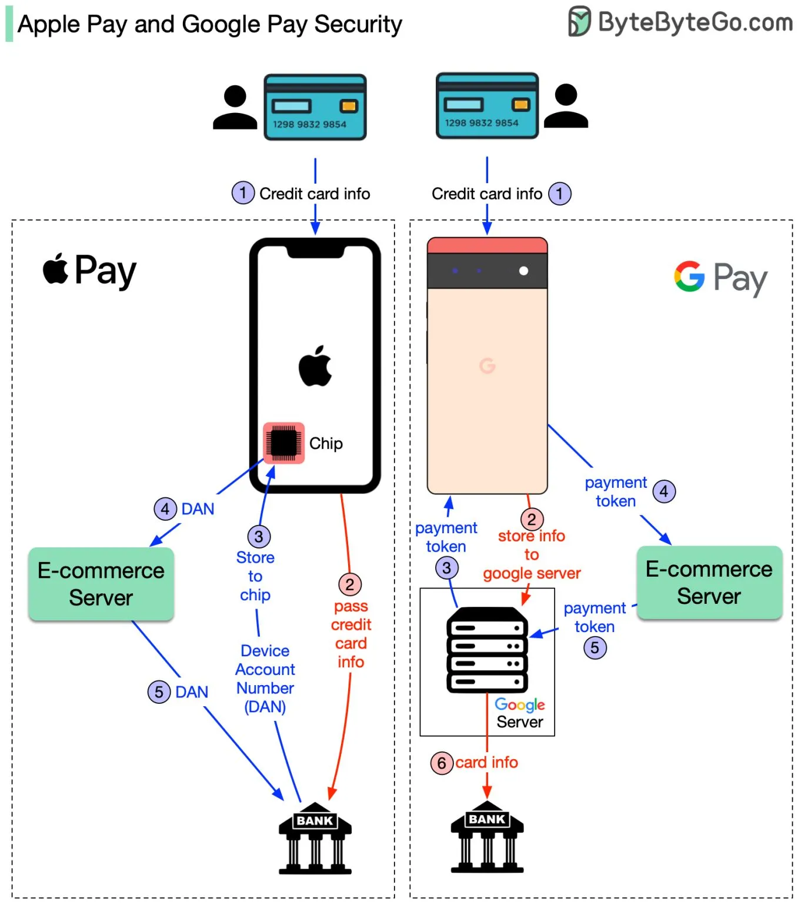
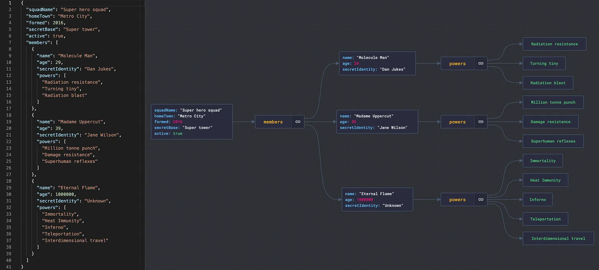
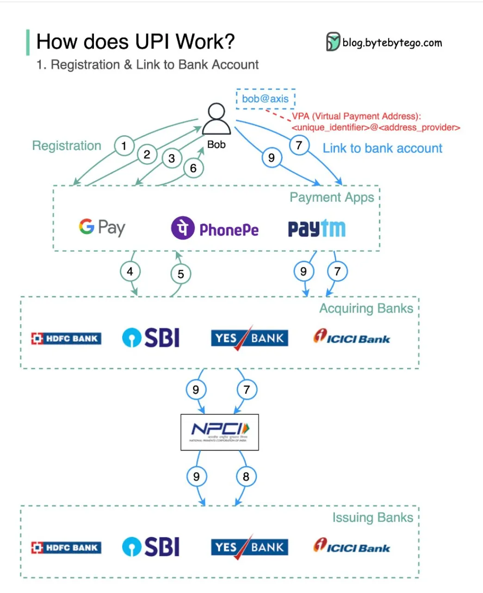
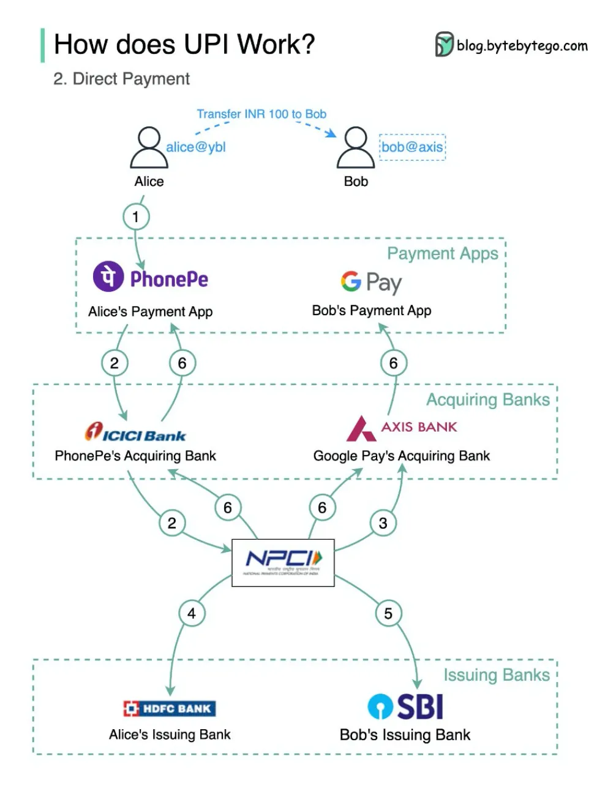
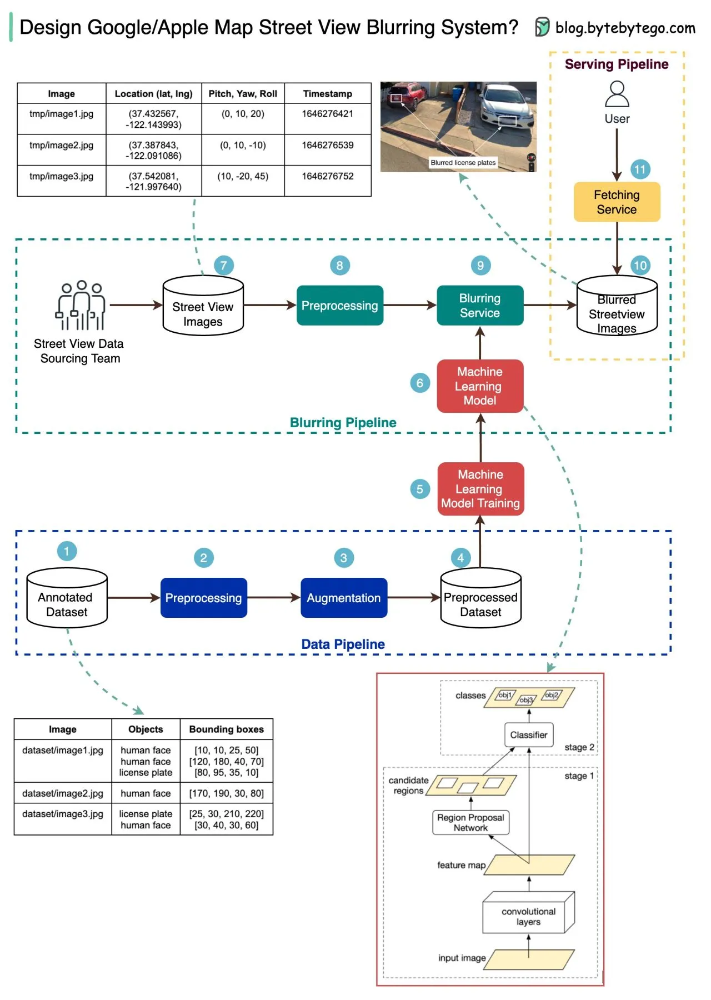

> 本文为学习目的的个人翻译，译文及后文「译者总结」仅供参考。
>
> 原文链接：[EP25: How Apple/Google Pay handle card info. Also...](https://blog.bytebytego.com/p/ep25-how-applegoogle-pay-handle-card)。
>
> 版权归原作者或原刊登方所有。本文为非官方译本；如有不妥，请联系删除。

在这篇文章中，我们将讨论以下话题：
- Apple Pay 和 Google Pay 如何处理卡信息
- JSON 可视化工具
- 印度统一支付接口（UPI）
- 如何选择合适的数据库
- Google/Apple 地图如何模糊街景中的车牌和人脸

## Apple Pay vs. Google Pay

下图显示了差异。两种方法都非常安全，但实现不同。我们将流程分解为两个流程来理解差异：
1. 注册信用卡流程
2. 基本支付流程

### 1. 注册流程

**Apple Pay**：
- Apple 不存储任何卡信息
- 它将卡信息传递给银行
- 银行返回一个称为 DAN（设备账号）的令牌到 iPhone
- iPhone 将 DAN 存储到特殊硬件芯片中

**Google Pay**：
- 当你向 Google Pay 注册信用卡时，卡信息存储在 Google 服务器上
- Google 返回支付令牌到手机

### 2. 支付流程

**Apple Pay**：
- 对于 iPhone，电商服务器将 DAN 传递给银行

**Google Pay**：
- 在 Google Pay 情况下，电商服务器将支付令牌传递给 Google 服务器
- Google 服务器查找卡信息并将其传递给银行

在图中，红色箭头表示卡信息在公共网络上可用（尽管已加密）。

**参考**：
- [Apple Pay 安全和隐私概述](https://support.apple.com/en-us/HT203027)
- [Google Pay for Payments](https://developers.google.com/pay/api/android/overview)
- [Apple Pay vs. Google Pay: How They Work](https://www.investopedia.com/articles/personal-finance/010215/apple-pay-vs-google-wallet-how-they-work.asp)

## JSON 可视化工具

如果你使用 JSON 文件，你可能会喜欢这个工具。

嵌套 JSON 文件难以阅读。[JsonCrack](https://github.com/AykutSarac/jsoncrack.com) 从 JSON 文件生成图表并使它们易于阅读。

此外，生成的图表可以下载为图像。

## 印度 UPI（统一支付接口）

什么是 UPI？UPI 是由印度国家支付公司开发的即时实时支付系统。

它占当今印度 60% 的数字零售交易。

**UPI = 支付标记语言 + 可互操作支付标准**

流程包括：
- 注册并链接银行账户

- 直接支付

## 谷歌/苹果地图如何在街景视图中模糊车牌和人脸

下图展示了一种可能适用于面试环境的解决方案。

高级架构分为三个阶段：

### 数据管道
- **步骤 1**：获取用于训练的标注数据集。对象用边界框标记
- **步骤 2-4**：数据集经过预处理和增强以进行归一化和缩放
- **步骤 5-6**：标注数据集用于训练机器学习模型，这是一个两阶段网络

### 模糊管道
- **步骤 7-10**：街景图像经过预处理，检测图像中的对象边界。然后模糊敏感对象，图像存储在对象存储中

### 服务管道
- **步骤 11**：模糊图像现在可以被用户检索

## 译者总结

这篇文章涵盖了多个支付和系统设计话题：

**Apple Pay vs. Google Pay**：
| 特性 | Apple Pay | Google Pay |
|------|-----------|------------|
| 卡信息存储 | 不存储，银行返回 DAN 令牌 | 存储在 Google 服务器 |
| 支付流程 | 电商服务器直接传 DAN 给银行 | 电商服务器传令牌给 Google，Google 再传卡信息给银行 |
| 安全性 | 卡信息不在公网传输 | 卡信息在公网传输（加密） |

**UPI（印度）**：
- 占印度 60% 数字零售交易
- 即时实时支付系统
- 支持注册链接账户和直接支付

**街景模糊架构**：
- 数据管道：准备训练数据
- 模糊管道：检测并模糊敏感对象（车牌、人脸）
- 服务管道：提供模糊图像给用户

这些是支付安全和大规模图像处理系统的核心设计知识。
